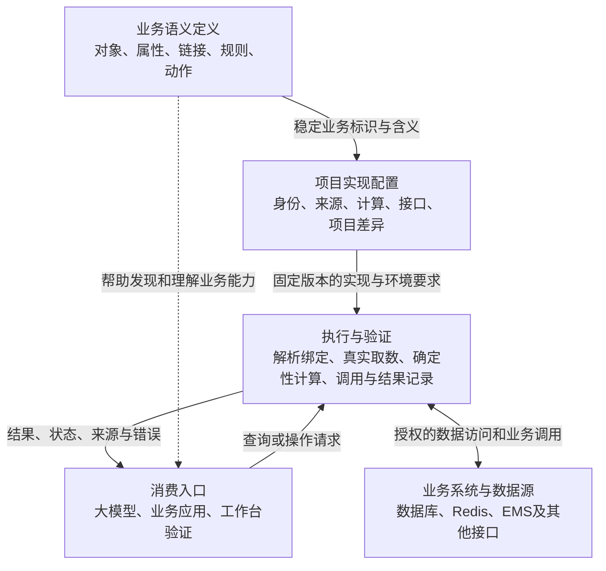

# 本体工作台：顶层产品定位与领域架构评审

日期：2026-09-20  
性质：顶层分析与讨论，不是实施需求或开发计划。  
归档范围：本次整理的是“产品定位、领域架构和整体业务闭环”那一轮完整评审，不包含随后关于智能问数 MCP 方向确认、“生成计划”和“项目说明”的问答。文中的待确认项保留该轮讨论时的状态。

## 1. 整体判断

**本体与项目分开的方向是合理的，但目前“建模和配置怎样成为下游可使用的业务能力”还没有统一的顶层定义。**

现在已经有对象、属性、规则、动作和编排，但这些内容最终交付给谁、通过什么方式使用、谁负责保证执行结果，仍不够明确。这会让产品不断围绕具体场景增加配置，整体边界却越来越模糊。

本轮重新核对了共享上下文、接口文档、说明消费与配置迁移需求，以及项目发布、编排和映射上下文实现。以下区分现状和建议，不代表已确认的新需求；未修改业务代码，也未生成需求文档或开发计划。

## 2. 建议的核心定位：业务语义与能力配置工作台

可以用一句话描述：

> 将业务概念及其在具体项目中的实现，整理成大模型和业务应用能够理解、验证和调用的业务能力。

这意味着几个方向的主次应明确：

| 产品方向 | 建议定位 | 原因 |
|---|---|---|
| 本体编辑器 | 核心基础 | 提供统一业务含义 |
| 业务能力配置平台 | 核心目标 | 让业务含义落到可用的数据和操作 |
| 数据接入平台 | 必要配套 | 支持取数即可，暂不承担全面的数据同步、清洗和仓库建设 |
| 通用函数编排平台 | 实现工具 | 服务属性计算和动作实现，不无限扩张成独立自动化平台 |
| 大模型应用平台 | 下游消费方之一 | 不必为了使用本体，再建设完整聊天、Agent 和应用搭建平台 |

当前最合理的设计有三点：

- **本体和项目实现分离**，支持同一业务概念对应不同数据库、接口和算法。
- **采用稳定身份与版本引用**，具备跨项目复用的基础。
- **允许简单映射与复杂编排并存**，不会要求每个字段都搭一条流程。

主要结构性问题是：**语义定义、实现配置和执行能力已经混合存在，但它们之间的交付约定尚未完整。**

例如，说明可以发布、编排可以运行、项目可以引用本体，但这三件事还不能共同保证“下游能够可靠查询一个项目对象”。

## 3. 保留两个工作区，明确四种职责

“本体建模＋项目映射”足以作为用户界面的组织方式。架构上需要进一步区分职责，但不必增加四个菜单，更不要求拆成四个服务。

| 职责 | 输入 | 输出 | 责任边界 |
|---|---|---|---|
| 业务语义定义 | 业务知识 | 稳定的业务概念与行为含义 | 不包含某个项目的表名、Key 或接口地址 |
| 项目实现配置 | 本体、项目系统情况 | 实例识别、取值与操作实现 | 必须保持本体含义，不能暗中重新解释 |
| 执行与验证 | 固定实现、调用上下文 | 真实结果及执行状态 | 负责执行约束、结果检查和可追溯性 |
| 消费入口 | 用户意图、应用请求 | 业务查询或操作请求 | 不能绕过执行边界自行猜值或调用任意实现 |

**执行与验证可以先是当前程序中的一个明确模块。** 将来是否独立部署，由真实使用场景决定。

执行边界有三种选择：

| 选择 | 优点 | 代价 | 我的判断 |
|---|---|---|---|
| 工作台只输出配置 | 产品较轻 | 必须另有消费者实现，否则配置没有出口 | 已有明确接收系统时适合 |
| 工作台配置并提供本地验证，正式运行由明确的执行入口承接 | 能验证交付内容，同时保持边界 | 需要统一配置消费约定 | **推荐** |
| 工作台承担正式查询、调度、设备控制和运行管理 | 使用入口统一 | 运维、权限、任务恢复和业务责任明显增加 | 暂不建议全面承担 |

推荐第二种，不代表必须立即建设一个新执行服务。关键是**本地验证与下游运行应使用一致的解释规则**，不能各自理解同一份配置。

## 4. 核心概念需要补充的是边界，而不是更多种类

| 概念 | 应回答的问题 | 不应承担的职责 |
|---|---|---|
| 对象类型 | 业务中有哪些可识别的事物？ | 直接等同数据库表 |
| 属性 | 这个事物有哪些可查询的事实？ | 保存所有临时计算变量 |
| 链接 | 两类事物存在什么业务关系？ | 直接等同数据库 JOIN |
| 业务规则 | 什么条件、口径或约束成立？ | 默认都必须是可执行函数 |
| 动作 | 希望对业务完成什么操作？ | 直接等同一个 HTTP 请求 |
| 函数 | 某个输入如何得到输出或产生效果？ | 决定业务概念本身的含义 |
| 编排 | 多个实现步骤如何协作？ | 成为新的本体概念 |

另外，需要明确三个容易混淆的层次：

- **对象类型**：储能系统。
- **对象实例**：创智园一期储能系统。
- **对象集合**：本项目满足某些条件的全部储能设备。

有稳定名称、身份、属性和操作的“储能系统”，适合建对象；一次临时筛选出来的设备集合，不必自动建成新对象类型。

类似地，**图谱只是这些定义和关系的一种展示与编辑方式**。画布上的节点、连线和布局不应反过来决定领域模型。

通用性的边界也应明确：

> 同一本体跨项目复用的是稳定的业务含义，不是相同的数据结构和实现方式。

例如：

- 项目 A 使用 kW、项目 B 使用 W，可以通过转换保持同一业务含义。
- 项目 A 的“可用容量”扣除了保底 SOC，项目 B 没扣，这可能已经是定义差异，不能只靠映射说明悄悄兼容。
- 项目特有概念可以扩展；无需为了“通用”把所有业务差异压进一个越来越模糊的属性。

## 5. 顶层缺口与优化方向

| 顶层问题 | 当前设计 | 为什么影响整体目标 | 建议调整 | 必要性与取舍 |
|---|---|---|---|---|
| 对外交付物没有统一定义 | 本体、项目、编排分别保存，已有配置迁移包 | 能继续编辑，不等于下游能运行 | 明确运行消费需要哪些语义、实现、固定依赖和环境条件 | 必须明确；不一定新增文件格式 |
| 消费者约定不足 | 现有接口主要服务工作台编辑和测试 | 下游需理解内部字段和所有历史来源格式 | 定义面向业务的发现、查询、计算和动作调用约定 | 必须补齐；不必立即选 SDK、MCP 或其他协议 |
| 实例身份与事实来源边界不够突出 | 主要围绕表、登记实例和属性来源配置 | 容易把表记录和业务对象混为一谈 | 明确实例身份、项目范围、有效记录、成员归属与事实来源 | 必须有统一原则；无需先做复杂主数据系统 |
| 通用本体与项目差异缺少一致处理原则 | 可以通过映射与说明表达差异 | 项目可能改变属性含义，却仍声称共用本体 | 区分表示差异、实现差异、业务含义差异 | 必须明确，否则复用只是名字相同 |
| 描述和可执行实现的关系未闭合 | 说明可与结构化配置共同保存 | 无法判断消费者何时能直接执行、何时必须澄清 | 明确解释、校验、冲突和执行的责任 | 必须明确；不要求每次重新让 LLM 推理 |
| 函数与编排的资产归属不清晰 | 编排独立保存，项目引用并提供环境 | 跨项目复用容易携带具体连接和默认设置 | 区分可复用算法与项目绑定；同一界面也可以表达这两层 | 先澄清归属，不急于建设函数市场 |
| 版本的业务含义不完整 | 本体和项目有版本，编排仍以草稿为主 | 同一发布项目不足以固定所有实现 | 运行交付固定依赖；环境与凭据分别绑定 | 必须补齐；确定性也不意味着未来业务数据不变 |
| 查询、试算、保存、下发、执行边界不足 | 多种行为可以用相似编排节点表达 | 技术上都是调用，业务后果却不同 | 明确读操作、候选结果生成、持久化和业务命令 | 涉及真实操作前必须明确 |
| 迁移与协作的目标容易混淆 | 每次导入都创建新副本，符合此前决定 | 新副本后续无法自然回传合并为同一资产 | 当前明确支持交接和派生；保留来源信息，合并另议 | 当前机制可保留，不必立即做多人协作 |
| 缺少端到端的业务验收单位 | 主要按配置项和编排节点检查 | 局部通过不代表业务问题得到正确回答 | 以业务场景及其证据作为验收单位 | 必须形成方法，不要求新增测试平台 |

当前迁移需求已经明确说明：包携带的是导出时的编排配置，不能声称重现历史运行环境。这正好说明**编辑交接与运行交付需要区分**。

依据：[配置迁移需求](../../需求/20260919_本体与项目配置迁移/需求说明.md)。

## 6. 下游最终应该获得什么

建议对外交付的内容至少能回答五个问题：

1. **有哪些业务概念与能力？** 对象、属性、关系、动作的名称、稳定身份、含义和适用范围。
2. **这些能力在当前项目如何实现？** 数据来源、输入绑定、算法、接口，以及必须参与解释的说明。
3. **本次使用的是哪份实现？** 本体版本、项目版本、计算依赖及所需环境能力。
4. **怎样调用，结果怎样理解？** 实例、时间范围、输入、输出、空值、质量状态、失败与异步状态的约定。
5. **怎样证明结果可信？** 来源、时间、所用实现版本以及验证依据。

这不是要求新建一套庞大的能力库，可以从现有对象、属性、动作和编排中形成统一的消费视图。

对于大模型，建议明确分工：

| 大模型适合负责 | 必须由实际执行或业务系统提供 |
|---|---|
| 理解问题中的业务概念 | 当前真实数据 |
| 消除用户表达与模型名称的差异 | 精确计算结果 |
| 发现候选能力、规划调用步骤 | 权限判断和读写限制 |
| 缺少对象、日期或条件时提问 | 命令是否被受理、是否真正完成 |
| 解释结果和依据 | 可追溯的状态与错误 |

自然语言说明可以作为实现意图，但不能直接等于“已经可执行”。如果未来允许运行时解释说明，仍需经过能力检查和真实工具执行；遇到冲突不能静默选一边。

对于已经验证并固定的实现，也不应每次重新让大模型自由解释计算规则。

## 7. 用两条业务链路检验

### 7.1 查询“储能系统当前 SOC 是多少”

1. **确定语境**：明确项目和储能系统实例。“所有系统中的哪一个”有歧义时，由消费入口澄清。
2. **解析业务含义**：读取系统 SOC 的定义，确认采用什么统计口径；不能仅凭名称猜成设备 SOC 的算术平均。
3. **确定实际实现**：项目 A 可能直接提供系统 SOC 接口；项目 B 可能需要查询成员设备或储能簇后计算。两者对外应保持相同业务含义。
4. **真实取数和确定性计算**：执行层按照项目绑定解析成员与属性，处理时间、新鲜度、缺失值和容量口径。
5. **返回可解释结果**：消费者得到数值、时间、质量状态及计算依据，再回答用户。例如数据不完整时，应说明缺失成员，而不是输出一个没有说明的精确百分比。

这条链路证明：**下游应面向“系统 SOC”调用，数据库、Redis 和具体编排是项目实现细节。**

不一定要在工作台存储全部设备和采样数据；可以按需访问业务系统。

### 7.2 “生成明天的充放电计划”

首先需要澄清“生成”意味着什么。它至少可能包含四种不同业务效果：

| 行为 | 结果 | 主要责任 |
|---|---|---|
| 试算 | 返回候选计划，不改变业务状态 | 计算实现 |
| 保存计划 | 形成可再次查询的计划记录与版本 | 计划的权威业务系统 |
| 下发计划 | 向执行系统提交业务指令 | 业务接口与执行边界 |
| 实际执行 | 按计划控制设备并反馈状态 | EMS 或实际控制系统 |

完整链路应该是：

1. 明确系统、计划日期与项目时区，将“明天”转换为确定日期。
2. 获取业务规则要求的输入，例如容量、SOC、约束和必要的预测数据；具体输入由业务规则决定，不默认全部需要。
3. 调用确定算法或业务系统生成候选计划。
4. 检查结果是否满足业务约束，返回候选计划和依据。
5. 根据用户意图及项目授权，单独决定是否保存、下发。
6. 下发后跟踪业务受理和实际执行状态，不能把 HTTP 成功当作设备已执行。

如果 EMS 已经负责生成与保存计划，工作台应调用并映射其能力，不必再复制一套计划算法和存储。

如果计划需要长期查询、比较版本、关联设备和跟踪状态，建“充放电计划”对象是合理的；如果只是一次试算，中间结果可以暂时作为计算输出。**是否建对象，取决于业务身份与生命周期，而不是结果是否来自 SQL。**

## 8. 跨项目复用与用户分工

建议明确以下归属：

| 资产 | 主要维护者 | 复用原则 |
|---|---|---|
| 本体与业务规则 | 业务专家，开发人员协助 | 复用稳定业务含义 |
| 项目映射 | 项目实施人员或开发人员 | 解决当前环境与系统差异 |
| 通用函数或编排 | 开发人员 | 复用算法与输入输出，避免写死项目资源 |
| 项目专用编排 | 项目实施人员 | 可以包含本项目处理逻辑，不必强行通用 |
| 运行与业务记录 | 业务系统或明确的执行组件 | 明确谁是权威来源 |

业务专家的主要工作路径应是：

> 定义概念 → 描述规则与动作 → 用业务样例确认含义。

开发人员的主要路径应是：

> 接入数据与接口 → 实现绑定 → 验证业务样例 → 交付可消费版本。

这是两种工作路径，不需要两套相互复制的模型。

## 9. 最需要先确定的五个架构决策

| 决策 | 推荐答案 | 不确定会造成什么 |
|---|---|---|
| 产品核心定位是什么？ | 业务语义与能力配置工作台 | 每个新场景都可能把产品推向另一个平台方向 |
| 工作台承担多少执行？ | 本地验证；正式执行有明确边界，可先共用程序内模块 | 调试能力逐渐被当成生产执行能力 |
| 第一批消费者是谁？ | 先选一个实际业务应用或大模型调用方，打通完整场景 | 形成大量配置，却没有可验证的交付对象 |
| 跨项目复用什么？ | 稳定业务含义与可复用算法，项目资源在映射绑定 | 同名概念在不同项目中实际含义不同 |
| 谁保存计划、谁负责设备状态？ | 优先由现有业务系统作为权威来源 | 工作台与业务系统出现两份不一致的业务事实 |

### 9.1 必须补齐的统一原则与能力

- 对外业务能力发现与调用约定。
- 从定义到实现的依赖和交付完整性。
- 对象身份、业务范围和结果语义。
- 查询、计算、写操作的责任边界。
- 以完整业务场景为单位的验证与追溯。

### 9.2 可以暂缓或明确不做

- 全量数据仓库、实时数据同步平台。
- 独立通用自动化平台或函数市场。
- 完整聊天应用和 Agent 搭建平台。
- 多人实时编辑、跨副本自动合并。
- 通用规则推理引擎、高级对象继承体系。
- 接管 EMS 的设备调度和控制职责。

### 9.3 该轮讨论提出的三个待确认问题

1. **第一个真正使用这些配置的是谁？** 是现有问答服务、某个业务应用，还是工作台本身？  
   **推荐：选择一个已有消费方，用“查询系统 SOC”建立第一条完整交付链路。**
2. **“生成计划”是否包含保存和下发？**  
   **推荐：默认生成候选结果，保存与下发作为明确的后续业务操作。**
3. **项目说明是否必须直接参与运行？**  
   **推荐：保留这一目标，但让解释结果经过校验；稳定场景优先形成可验证、可固定的实现，避免每次自由推理。**
