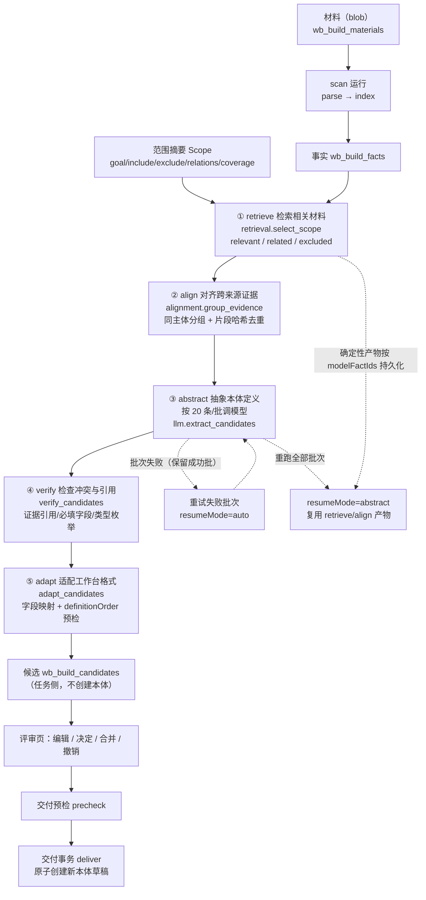

# 从物料生成本体：五阶段完整方案

- 文档性质：**供用户评审的方案说明**，事实依据为代码本身（当前分支 `codex/auto_build`，工作目录 `/Users/gukepeng/Desktop/ZHDL/code/wiz_ai/wiz_kq_builder_v2/worktree/auto_build`）。
- 引用约定：所有事实性陈述后附 `文件:行号`；行号对应本工作树当前提交的文件内容，代码演进后需重新核对。
- 需求文档（`需求说明_v2.md`、`开发计划.md`）只用于补充设计意图，**未在代码中实现的内容不写成已实施**；无法从代码核实的一律标注「未核实」。

---

## 1. 概览

### 1.1 一句话定位

「从物料生成本体」把用户上传的代码、表结构、文档等材料，经**五个阶段**转成一份**任务侧候选初稿**，供人工在评审页逐条确认后，才创建一个**未发布的新本体草稿**；生成过程本身不创建、不修改、不发布任何本体（`workbench/ontology_build/pipeline.py:25-27`、`pipeline.py:1382`、`workbench/ontology_build/delivery.py:5-9`）。

五阶段是后端的运行阶段枚举，与界面展示同源：

| 阶段键 | 中文标签 | 代码来源 |
|---|---|---|
| `retrieve` | 检索相关材料 | `workbench/ontology_build/protocol.py:98-105`、`frontend/src/ontology/build/types.ts:348-354` |
| `align` | 对齐跨来源证据 | 同上 |
| `abstract` | 抽象本体定义 | 同上 |
| `verify` | 检查冲突与引用 | 同上 |
| `adapt` | 适配工作台格式 | 同上 |

> 说明：`protocol.py:99-105` 中的标签是「筛选材料片段 / 跨来源对齐证据 / 抽象候选定义 / 校验证据与引用 / 适配本体协议」，前端 `types.ts:349-353` 使用「检索相关材料 / 对齐跨来源证据 / 抽象本体定义 / 检查冲突与引用 / 适配工作台格式」。两处文案不同但键相同；界面取前端文案（`BuildProgressPage.vue:31` 固定五阶段顺序）。

### 1.2 五阶段流水线总览



关键结构性事实：

- 五阶段只在 **generate 运行**中执行；scan 运行只有 `parse` / `index` 两阶段（`protocol.py:106-107`）。
- 阶段 ① ② 是**纯本地确定性计算**，不调用模型（`workbench/ontology_build/retrieval.py:1-11`、`workbench/ontology_build/alignment.py:1`）。
- 阶段 ③ 是**唯一调用模型**的生成阶段（`pipeline.py:1233-1347`）。
- 阶段 ④ ⑤ 是**确定性校验与映射**，同样不调用模型（`pipeline.py:776`、`pipeline.py:923`）。

### 1.3 五阶段总表

| 阶段 | 目标 | 输入 | 输出 | 关键文件（函数） | 能否断点续跑 |
|---|---|---|---|---|---|
| ① retrieve | 按范围文本裁决哪些事实进入本次建模 | 任务全部事实 + 范围摘要（`goal/include/exclude/relations`） | `selection{relevant, related, excluded, reasons}` → `pool` | `workbench/ontology_build/retrieval.py:211` `select_scope`；调用点 `pipeline.py:1174-1185` | 能。产物 `modelFactIds` 有序清单随检查点持久化（`pipeline.py:1212-1218`、`pipeline.py:1220-1231`），重试直接复用（`pipeline.py:1146-1148`） |
| ② align | 同主体证据分组 + 同一片段哈希去重，确定发给模型的事实集 | `pool` | `model_facts`（去重后，截断上限 500 条）+ `groups/duplicates` 统计 | `alignment.py:252` `group_evidence`；去重与截断 `pipeline.py:1190-1210` | 能。并入同一份 `plan` 检查点；重试复用不重算（`pipeline.py:1163-1172`） |
| ③ abstract | 分批调用模型抽取候选定义 | `model_facts`（每批 20 条）+ 范围摘要 | 候选列表（批内临时键）逐批写入 `wb_build_candidates` | `pipeline.py:1233-1347`；模型封装 `llm.py:434` `extract_candidates`；调度 `pipeline.py:120-204`；**单批实测：输出 5352 token 是输入 2362 token 的 2.3 倍，输出才是瓶颈，见 §4.4** | 能（粒度最细）。批级 `done/failed` 检查点（`pipeline.py:1226-1228`）；`auto` 只补失败批，`abstract` 重跑全部（`pipeline.py:1239-1253`） |
| ④ verify | 剔除幻造证据引用、校验必填字段与类型枚举，重算证据状态 | 合并后的候选 + 事实 id 集合 + 弱证据 id 集合 | 校验后的候选 + 报告 `{issues, droppedRefs, structural}` | `pipeline.py:782` `verify_candidates`；调用点 `pipeline.py:1373-1380` | 不单独续跑。无独立检查点，重试时随流程整体重算（确定性纯函数，`pipeline.py:1373-1380`） |
| ⑤ adapt | 协议字段白名单映射 + `definitionOrder` 预检（**不创建本体、不分配定义 ID**） | 校验后的候选 | `{candidates, definitionOrder, issues, notes}`，上限 500 条 | `pipeline.py:923` `adapt_candidates`；调用点 `pipeline.py:1383-1392` | 不单独续跑。同 ④ |

「能否断点续跑」的判定口径见本文 §7.5。

---

## 2. 阶段一：检索相关材料（retrieve）

### 2.1 目标与边界

**做什么**：只用范围文本里的关键词，对已解析的**事实**做命中判定，产出「哪些事实属于本次范围」的裁决与中文理由；再做有限的依赖扩展，避免一次命中之外的同源证据被丢掉（`retrieval.py:211-227`）。

**明确不做什么**（代码层面的边界，非推测）：

- 不做语义理解、不做候选抽象、不猜单位/关系（`retrieval.py:4-6`）。
- **不按文件名或扩展名过滤材料**：命中不到关键词的事实仍保守保留在 `related`（`retrieval.py:6-7`；实现见 `retrieval.py:311-329`）。
- 不用弱词判 `relevant`，也不用弱词判 `excluded`（`retrieval.py:22-26`）——弱词的唯一用途是把事实标为 `related` 并给出更具体理由（`retrieval.py:315-319`）。
- 不调用模型、不访问数据库：本模块是纯函数（`retrieval.py:1`）。

### 2.2 输入 → 输出（字段级）

**输入**

| 名称 | 来源 | 字段 |
|---|---|---|
| `facts` | `storage.list_facts(conn, task_id, owner_id)`（`pipeline.py:1443`；实现 `workbench/storage/ontology_build.py:474-480`） | `id`、`materialId`、`module`、`locator`、`snippet`、`kind`、`data`、`quality`（`storage/ontology_build.py:440-451`） |
| `scope` | `storage.get_scope`（`storage/ontology_build.py:527-549`） | `goal`、`include`、`exclude`、`relations`、`coverage`、`openQuestions`、`revision`、`confirmed` |

**输出**（`retrieval.py:331-333`）

```
{'relevant': [factId], 'related': [factId], 'excluded': [factId],
 'reasons': {factId: 中文说明},
 'counts': {'relevant': n, 'related': n, 'excluded': n, 'total': n}}
```

管线随后把 `relevant + related` 事实组合为 `pool`（`pipeline.py:1177-1178`）。

### 2.3 处理步骤（按执行顺序）

1. **建索引**：`retrieval.build_index(facts)`（`retrieval.py:129`，调用点 `pipeline.py:1175`）。为每条事实记录 `byKind`、`byModule`、`byFile`、`text`（可检索文本）、`snippetHash`、`material`、`order`（`retrieval.py:149-177`）。
   - 可检索文本 = `snippet + kind + module + locator 的全部标量值 + data 的扁平化字符串`，统一 `casefold`（`retrieval.py:98-108`）；`data` 扁平化限深 2 层、单事实最多 40 项、单字段截断 400 字（`retrieval.py:42-43`、`retrieval.py:75-95`）。
   - **默认不再构建 token 倒排桶**（`with_tokens=False`），`tokens` 键恒存在但为空 dict（`retrieval.py:129-139`、`retrieval.py:169-174`）。
2. **切词表**：`scope_terms` 把范围文本切成强词/弱词（`retrieval.py:180-208`）。
   - 英文/数字标识：≥3 字才作强词（`MIN_ASCII_TERM`，`retrieval.py:36`）。
   - 中文：2–12 字整段作强词（`MIN_CJK_TERM`/`MAX_TERM_LEN`，`retrieval.py:37-38`）；超长中文串整段仍是强词，同时切出 2–3 字弱片段（`WEAK_GRAM_MIN/MAX`，`retrieval.py:39-40`、`retrieval.py:198-207`）。
   - `goal` / `relations` 只作 `related` 的理由来源，不改变 `include`/`exclude` 裁决（`retrieval.py:26`、`retrieval.py:233-235`）。
3. **编译合并探测正则**：四个词表各编译一条 `re.escape` + 交替的正则，用于单趟命中探测（`retrieval.py:47-59`、`retrieval.py:237-241`）。
4. **逐事实定级（顺序即优先级，`retrieval.py:254-280`）**：
   1. 命中 `include` 强词 → `relevant`；若同一 `snippet` 哈希已出现过 → 降为 `related` 并注明重复（`retrieval.py:257-275`）；
   2. 否则命中 `exclude` 强词 → `excluded`（`retrieval.py:276-280`）；
5. **依赖有限扩展**（`retrieval.py:282-307`）：对每个 `relevant` 取同 `module` 或同 `file` 的邻居，每个纳入项最多带出 **5 条**（`DEPENDENT_PER_HIT`，`retrieval.py:41`）标为 `related`；**`excluded` 项绝不因依赖扩展复活**（`retrieval.py:292-293`）。
6. **其余事实保守保留**（`retrieval.py:311-329`）：先探测弱词、再探测 hints（`goal`+`relations`），据此写入不同理由，最终一律进 `related`。

### 2.4 关键参数与阈值

| 参数 | 值 | 来源 |
|---|---|---|
| 英文/数字强词最小长度 | 3 | `retrieval.py:36` |
| 中文强词长度窗口 | 2–12 字 | `retrieval.py:37-38` |
| 弱片段长度窗口 | 2–3 字 | `retrieval.py:39-40` |
| 每个 relevant 的依赖扩展条数 | 5 | `retrieval.py:41` |
| `data` 单字段截断 | 400 字符 | `retrieval.py:42` |
| `data` 扁平化项数上限 | 40 | `retrieval.py:43` |
| 参与检索的嵌套深度 | ≤2 层 | `retrieval.py:78` |
| 单次生成发给模型的事实上限 | 500（= 20 × 25） | `pipeline.py:50`（`MAX_MODEL_FACTS`） |

### 2.5 失败语义与恢复方式

- 若 `relevant + related` 为空 → 抛 `PipelineError('没有可用于生成的事实：请先扫描材料并确认范围')`（`pipeline.py:1179-1180`），运行标记失败、任务阶段回退（`runner.py:242-246`）。**没有「只补跑 retrieve」的入口**——retrieve 失败意味着整个 generate 运行失败，只能整体重试。
- 本阶段本身不会因单条事实异常而中断：非 dict 事实、空 id 事实被直接过滤（`retrieval.py:229`）。
- 内存风险：本阶段需要把任务全部事实读入内存（`pipeline.py:1443`）并为每条事实构造可检索文本（`retrieval.py:165-166`）。27.6 万事实的筛选实测约 40 分钟（`文档/需求/20260920_从物料自动构建本体/开发计划.md` §11 真实实测表）。

### 2.6 可观测性

- 进度：`runner.stage(owner_id, run_id, 'retrieve', label, {'done': len(pool), 'total': len(pool), 'relevant':…, 'related':…, 'excluded':…})`（`pipeline.py:1183-1185`）。
- 复用时的进度带 `resumed: 1` 标记（`pipeline.py:1165-1168`）。
- 界面：进度条百分比取 `done/total`（`BuildProgressPage.vue:223-230`），文案形如「检索相关材料 500 / 500」（`BuildProgressPage.vue:211-222`）。
- `counts.relevant/related/excluded` 同时进入最终运行摘要 `summary['facts']`（`pipeline.py:1405-1406`）。

### 2.7 已知边界或弱点（有代码依据）

1. **纯子串匹配，无同义词与语义**：只有字面命中，`goal`/`relations` 不进裁决（`retrieval.py:26`）。范围词写法不同即召回不同。
2. **相关度排序是「hit 顺序」，不是打分**：`pool` 按 `selection['relevant'] + selection['related']` 拼接（`pipeline.py:1177-1178`），`related` 内部的依赖扩展邻居按 `by_module + by_file` 的索引顺序（`retrieval.py:288`），因此「按相关度优先保留前 500 条」（`pipeline.py:1203-1205`）中的「相关度」实际是「relevant 先于 related」的两段式顺序。
3. **不区分事实的信息量**：命中关键词的低价值叶子值（`"1.0"`、`"true"`、`"zh-CN"`、空串等元数据）与业务事实同等进入 `relevant`/`related`。2026-09-22 实测：一份 8 KB JSON 产出 110 条事实，其中 31%（34/110）属此类低价值叶子值（详见 §9.1 ④）。本阶段没有任何按取值形态过滤的机制（`retrieval.py:211-333`）。
4. **全量事实驻留内存**：`list_facts` 无分页（`storage/ontology_build.py:474-480`），事实规模决定本阶段的内存与耗时上界。
5. `build_index` 里的 `text` 与 `snippetHash` 对全部事实一次性构造（`retrieval.py:165-167`），即便最终只用 500 条发给模型。

---

## 3. 阶段二：对齐跨来源证据（align）

### 3.1 目标与边界

**做什么**：两件事（`alignment.py:1-16`）：

1. `group_evidence`：把检索到的事实按「像候选的同一主体」分组（DDL 表 / 代码符号 / 文档章节），同一 `snippet` 哈希只计一次佐证；
2. `align`：在**同一批候选内**合并同名同类型候选（该函数在阶段 ③ 之后被调用，见 §5.2）。

**明确不做什么**：

- 不同名绝不合并、仅同名但类型不同绝不合并（`alignment.py:7-8`）；
- 属性额外要求 `dataType` 一致且宿主对象（`ownerKey` 解析到的规范名）一致（`alignment.py:9-10`、`alignment.py:62-67`）；
- 字段取值不同（含一侧缺失）**一律写入 `conflicts` 保留两侧，绝不自动取舍**（`alignment.py:11-12`、`alignment.py:111-131`）；
- 纯函数，不访问数据库、不调用模型（`alignment.py:1`）。

### 3.2 输入 → 输出（字段级）

**输入**：`facts`（全部事实）+ `selection['relevant'] + selection['related']`（`pipeline.py:1190`）。

**`group_evidence` 输出**（`alignment.py:308-309`）：

```
{'groups': [{'key','kind','factIds','items','duplicates','modules','materialIds'}],
 'duplicates': {factId: 首个副本 factId},
 'notes': [...],
 'stats': {'facts': n, 'groups': n, 'duplicates': n}}
```

其中 `items[]` 元素字段为 `{factId, locator, snippet, kind, quality, materialId, module}`（`alignment.py:296-299`）。主体键规则见 `alignment.py:230-249`（`ddl:<表名>`、`code:<符号>`、`md|docx|pdf|xlsx:<文件>#<章节前 80 字>`、`other:<文件>`）。

**管线产出的 `model_facts`**：`pool` 中去掉重复片段哈希后的事实列表（`pipeline.py:1191-1197`）。

### 3.3 处理步骤

1. `alignment.group_evidence(facts, relevant+related)`（`pipeline.py:1190`）：按 id 去重 → 计算主体键 → 同主体归组 → 组内同 `snippet` 哈希只保留首个、其余记入 `duplicates`（`alignment.py:265-299`）。
2. **整池按片段哈希去重**（`pipeline.py:1191-1197`）：按 `pool` 的「相关优先」顺序遍历，`retrieval.snippet_digest` 命中的重复片段只保留首个——**重复副本不算独立佐证**。
3. **截断到单次生成上限**（`pipeline.py:1200-1205`）：超过 `MAX_MODEL_FACTS`（500）时按前述顺序保留前 500 条，并写入一条明确注记（注明总数与未发送数量，不做静默截断）。
4. 写入两条阶段进度（`pipeline.py:1189`、`pipeline.py:1208-1210`），并把统计写进 `plan_snapshot`（`pipeline.py:1212-1218`）。

### 3.4 关键参数与阈值

| 参数 | 值 | 来源 |
|---|---|---|
| 证据分组主体键章节截断 | 80 字 | `alignment.py:246` |
| 候选合并的冲突数上限 | 20 | `alignment.py:23`（`MAX_CONFLICTS`）、`alignment.py:193` |
| 冲突条目单侧引用展示上限 | 4 侧 | `llm.py:324` |
| 候选内 `conflicts` 条数上限（模型侧） | 40 | `llm.py:326-327` |
| 一致性字段比对顺序 | `definition, dataType, valueType, sourceRef, targetRef, cardinality, content, effect` | `alignment.py:21-22` |

### 3.5 失败语义与恢复方式

- 本阶段是纯函数，正常路径不抛业务异常；异常会向上冒泡为运行失败（`runner.py:149-151`）。
- 产物（`modelFactIds` 清单 + `relevant/related/excluded/duplicates/groups` 计数）随检查点持久化（`pipeline.py:1212-1231`），**重试时复用、不重算**（`pipeline.py:1146-1172`）。
- 复用有前置条件（`pipeline.py:1146-1148`）：清单非空、`scopeRevision` 与当前一致、且清单里每个 factId 仍存在于当前事实集；任一不满足则重算（`pipeline.py:1173` 起）。

### 3.6 可观测性

- 阶段进度：`align {done: len(model_facts), total: len(model_facts), groups, duplicates}`（`pipeline.py:1208-1210`）；复用分支额外带 `resumed: 1`（`pipeline.py:1169-1172`）。
- 检查点可视：`planPersisted`、`modelFacts`、`relevant`、`related`、`excluded`（`storage/ontology_build.py:645-653`），前端在进度页显示「筛选/对齐产物已持久化，重试不重算确定性阶段」（`BuildProgressPage.vue:465-473`）。
- 说明文案进入 `notes`：「证据分组 N 组，重复片段 M 条只计一次佐证。」（`pipeline.py:1206-1207`）。

### 3.7 已知边界或弱点（有代码依据）

1. **主体键粒度粗**：非 `ddl/code/md/docx/pdf/xlsx/other` 的 kind 退化为 `<kind>:<文件>`（`alignment.py:249`）；文档类若取不到章节名，会退化成 `文件#` 前缀（`alignment.py:244-246`），同一文件不同章节可能落到不同组。
2. **跨批合并只认精确同名**：`align_key` 用 `casefold + 空白折叠`（`alignment.py:30-31`），中文近义名（如「储能设备」与「储能装置」）不会合并，会各自成为候选并在交付阶段由人工处理。
3. **属性宿主解析不到的合并键为 `@unknown`**（`alignment.py:66-67`、`alignment.py:149-155`）：此时不同对象上的同名同类型属性会被归入同一组并合并——这是代码明确选择的保守口径（`D08`），但会掩盖宿主差异，需要人工核对。

---

## 4. 阶段三：抽象本体定义（abstract）

### 4.1 目标与边界

**做什么**：把 `model_facts` 按 **20 条一批**分批发给模型，抽取对象/属性/链接/规则/动作五类候选；批内并发、**按批次序号串行落库**，逐批持久化检查点（`pipeline.py:1233-1347`）。

**明确不做什么**：

- 不创建、不修改任何本体/项目/发布（`pipeline.py:25-27`）；
- 模型给出的证据引用**必须落在本批给定 factId 集合内**，越界一律剔除并把候选降级（`llm.py:9-10`、`llm.py:349-370`）；
- 不发送原始文件：载荷只含 `id/locator/snippet(截断 500 字)/kind/data`（`llm.py:198-214`）；
- 不把模型输出原文写库或回传：只落安全摘要 `provider/model/durationMs/requestBytes/responseBytes`（`llm.py:6-8`、`llm.py:145-160`）；
- 不猜单位/精度/数量关系/默认值（`llm.py:78`、`llm.py:289-299`）。

### 4.2 输入 → 输出（字段级）

**输入**：`provider`（含 `endpoint/model/timeout` 等，`pipeline.py:1117-1118` 校验）、`scope`、每批 `model_facts[start:start+20]`（`pipeline.py:1235-1236`）。

**模型返回的候选结构**（`llm.py:331-386` 清洗后）：

```
{key, type, name, definition, fields{dataType,valueType,sourceRef,targetRef,cardinality,content,effect},
 ownerKey, evidence{字段名:[factId]}, evidenceStatus, conflicts[], rejectedRefs}
```

字段白名单见 `llm.py:39-40`；`key`≤60、`name`≤200、`definition`≤2000 字（`llm.py:372-375`）。

**落库载荷**：`pipeline._candidate_payload`（`pipeline.py:979-1009`）→ `store.create_candidate`（`storage/ontology_build.py:834-853`）。`origin` 里记录 `batch`、批内 `key`、`mergedFrom`、`mergedInto`，并保留模型/上游给的未知键（`pipeline.py:1001-1008`）。

### 4.3 处理步骤（按执行顺序）

1. **环境与基线校验**（`pipeline.py:1117-1137`）：无可用 provider、范围/材料修订与冻结基线不一致 → 直接抛 `PipelineError`（"修改范围属于重新生成，不能沿用旧批次重试"）。
2. **弱证据集合**：把 `module == 'llm-fallback'` 的事实 id 标为弱证据（`pipeline.py:1124-1126`），供阶段 ④ 降级使用。
3. **复用判定**（`pipeline.py:1140-1172`）：`plan_reusable` 为真则从检查点还原 `model_facts` 与统计，`retrieve`/`align` 只写 `resumed` 进度。
4. **切批**：`batches = [model_facts[i:i+20]]`（`pipeline.py:1235-1236`）。
5. **检查点/清空判定**（`pipeline.py:1239-1253`）：批次计划与上次不一致（或 `resumeMode=abstract`）→ 先在同一写事务内删除本批全部候选（`pipeline.py:1251-1253`），整批重来；一致则载入 `done_positions`/`failed_batches`（`pipeline.py:1243-1247`），并把库中已有候选载入为合并种子（`pipeline.py:1255-1261`）。
6. **日志与首次检查点**：续跑先承接上次持久化的日志（上限 500 行，`pipeline.py:1270-1271`）；抽取开跑前先落一次检查点，使轮询立刻可看到本批开始行（`pipeline.py:1276-1284`）。
7. **自适应并发调度** `_run_batches_adaptive`（`pipeline.py:120-204`）：
   - 线程池上限 `cap = max(1, min(8, LLM_CONCURRENCY))`（`pipeline.py:141`）；
   - 初始在跑批数为 `min(cap, 待跑批数)`（`pipeline.py:147`）；
   - **连续成功 2 次升一路**、**撞 429 降一路并冷却 20 秒**（`pipeline.py:177-185`、`pipeline.py:116`）；
   - 等待期间每 **15 秒**写一次心跳（`pipeline.py:188-200`）；
   - 结果按**前缀顺序**回调落库，保证落库顺序与串行版一致（`pipeline.py:166-176`、`pipeline.py:134-137`）。
8. **单批执行** `_extract_batch_with_split`（`pipeline.py:207-253`）：
   - 计算调用超时（见 §4.4）；
   - 连接类错误重试 **1 次**（共 2 次尝试），第二次**超时减半**（下限 60 秒）（`pipeline.py:217-231`）；
   - 429 → **立即返回**，不在批内重试，交给调度器降挡重排（`pipeline.py:225-228`）；
   - 错误文本含「截断」且深度 <2 且批大小 >1 → **对半拆批重试**（`pipeline.py:235-252`），并在批次日志记「已自动拆批重试」。
9. **逐批落库** `_flush_batch`（`pipeline.py:1295-1343`）：先校验（`verify_candidates`，`pipeline.py:1322-1323`），再把**候选写入与检查点更新放在同一个写事务**（`pipeline.py:1328-1340`）；注释明确说明若拆成两个事务，中途被杀会导致该批重跑并产生重复候选。
10. **跨批合并**：全部批次完成后调用 `alignment.align(accumulated)`（`pipeline.py:1368`），注释说明「同名同类型（属性还要求 dataType 一致）才合并，差异字段保留两侧」。
11. **批次失败处理**（`pipeline.py:1348-1365`）：任一批失败 → 记入 `errors` 与 `notes`；若无任何候选 → 抛「全部批次抽取失败」；**若有失败批但有成功批 → 抛「第 N/M 批抽取失败…请在生成页『重试失败批次』只补跑失败批次」**。全部成功才继续 ④ ⑤。

### 4.4 关键参数与阈值

| 参数 | 值 | 来源 |
|---|---|---|
| 批大小 | 20 条事实/批 | `protocol.py:27`（`LLM_BATCH_FACTS`），2026-09-22 因 40 条/批输出超 `max_tokens` 被截断而下调（同处注释） |
| 单次发送上限 | 500 条事实 | `pipeline.py:50` |
| `max_tokens` | 32000 | `llm.py:30`（`MAX_TOKENS`） |
| 候选数上限（模型侧单次返回） | 500 | `llm.py:36`、`protocol.py:23` |
| 批次并发默认值 | 3 | `protocol.py:69`（`LLM_CONCURRENCY`，env `WIZ_BUILD_LLM_CONCURRENCY`） |
| 并发档位上下限 | 1–8 | `pipeline.py:114-115`（`ADAPTIVE_MIN_WORKERS`/`ADAPTIVE_MAX_WORKERS`） |
| 429 冷却 | 20 秒 | `pipeline.py:116`（`_ADAPTIVE_429_COOLDOWN_SECONDS`） |
| 心跳间隔 | 15 秒 | `pipeline.py:117`（`_HEARTBEAT_SECONDS`） |
| 单次抽取调用超时 | `min(900, max(provider 配置超时, 60 + 10×批内条数))` | `pipeline.py:64-66`、`pipeline.py:70-77` |
| 20 条/批时的实际超时下限 | 260 秒 | 按上式：60 + 10×20 = 260（`pipeline.py:65-66`、`pipeline.py:76-77`） |
| 批内重试次数 | 2 次尝试（连接类错误） | `pipeline.py:220`（`max_attempts = 2`） |
| 重试时超时 | 减半，下限 60 秒 | `pipeline.py:230` |
| 拆批最大深度 | 2 层 | `pipeline.py:235`（`depth >= 2` 时不再拆） |
| 生成日志上限 | 500 行 | `pipeline.py:54`（`GENERATE_LOG_LIMIT`），前端 `types.ts:185-186` |
| 人工排除回放的批次窗口 | 1000 批 | `pipeline.py:258`（`_DECISION_HISTORY_BATCH_LIMIT`） |
| provider 配置超时上限（配置面） | 1–300 秒 | `workbench/llm_providers.py:27`、`llm_providers.py:156-157` |

> 注：抽取调用把显式 `timeout` 直接传给 `urlopen`（`llm_client.py:53`），因此**实际 socket 超时可超过 provider 配置面的 300 秒上限**，最高 900 秒。

#### 单批实测：输出才是瓶颈（2026-09-22 实测）

**方法**：直接调用 provider 端点（线上真实的模型配置与密钥），请求规格与线上单批完全一致——同一批 20 条事实、请求体 8.7 KB，`max_tokens` 按 `llm.py:30` 为 32000。

| 指标 | 实测值 |
|---|---|
| 输入 token | 2362（占 1M 上下文的约 0.24%） |
| 输出 token | 5352（**输出是输入的 2.3 倍**） |
| 输出字符数 | 8356（约 9.8 KB） |
| `finish_reason` | `stop`（正常结束，未截断） |
| 耗时 | 89.0 秒 |
| 生成速度 | 60.2 token/秒 |

由这组数据可得的结论（数值可按代码公式复核）：

1. **输入完全不是瓶颈**：8.7 KB 请求体 / 2362 输入 token 距 1M 上下文极远。**分批的原因不是上下文放不下**。
2. **输出才是瓶颈**：抽取任务要求模型为每条事实写出结构完整的候选 JSON（含 `name/definition/fields/evidence`，结构见 `llm.py:63-83` 的 `SYSTEM_EXTRACT` 与 `llm.py:331-386` 的清洗），输出量是输入的 2.3 倍；而生成速度基本固定（实测 60.2 token/秒），耗时几乎全部来自生成输出：5352 ÷ 60.2 ≈ 89 秒。
3. **线性外推到不分批**：110 条事实一次全给，输出约 29436 token（5352 × 110 ÷ 20），耗时约 489 秒（8.1 分钟）——且已达 `max_tokens = 32000` 的 **92%**，余量仅 8%（`llm.py:30`）。
4. 由此，分批（`protocol.py:27` 的 20 条/批）的**真实目的**是三条：① 把单次请求的**输出规模**压到安全区，避免撞 `max_tokens` 导致整批失败；② 让失败可局部恢复（只重跑失败批，而不是全部重来，见 §4.5）；③ 让批次可并发（默认并发 3，`protocol.py:69`），把总墙钟时间从约 8 分钟压到约 3 分钟。代码注释中「40 条/批输出超 `max_tokens` 而被截断」的修正记录（`protocol.py:25-27`）与第 ① 条一致。

**模型侧不稳定的实测反例**：同一规格请求健康时 89 秒，但线上批 1 实际耗时 232 秒；批 2 挂住后吃满单批超时 260 秒（`60 + 10×20`，`pipeline.py:65-66`、`:76-77`）再加重试减半超时 130 秒（`pipeline.py:230`），合计 390 秒才判失败——实测批 3 落库于 392 秒，与公式吻合。

### 4.5 失败语义与恢复方式

| 失败形态 | 后果 | 恢复方式 |
|---|---|---|
| 单批失败（超时/429/JSON 不可解析） | 记入 `failed_batches`；**整个运行失败**（`pipeline.py:1357-1365`），成功批次候选保留 | 进度页「重试失败批次」（`resumeMode=auto`，`BuildProgressPage.vue:509-514`、`routes:557-559`）→ 只重跑失败批（`pipeline.py:1241-1247`、`pipeline.py:1272-1273`） |
| 全部批次失败 | 抛「全部批次抽取失败…」（`pipeline.py:1352-1355`） | 同样可重试；或换模型/缩小范围 |
| 模型未产出任何候选 | 抛「模型未产出任何候选定义，请检查范围与材料后重试或更换模型」（`pipeline.py:1356`） | 调整范围或换模型后重新生成 |
| 输出被 `max_tokens` 截断 | 自动对半拆批（≤2 层，`pipeline.py:235-252`） | 无需人工；仍失败则按批次失败处理 |
| 范围/材料已变 | 直接失败（基线不一致，`pipeline.py:1129-1137`） | 重新确认范围生成新批次（不支持沿用旧批次） |
| 取消 | `Cancelled` 在阶段边界/内容事务内抛出（`runner.py:253-262`），已完成批次候选保留 | 可重试（`auto` 补缺口） |

**只补跑失败部分**：可以，且这是本设计的核心承诺之一。三重保障：

1. 成功批次候选逐批落库（`pipeline.py:1332-1340`）；
2. `done`/`failed` 逐批写入检查点（`pipeline.py:1335-1338`）；
3. resume 时只把 `pending_batches` 入池（`pipeline.py:1272-1273`），已成功批不再调用模型。

### 4.6 可观测性

**写入 checkpoint**（`pipeline.py:1220-1231`）：

```
generate: {batchId, scopeRevision, materialRevision,
           plan: {modelFactIds[], relevant, related, excluded, duplicates, groups,
                  scopeRevision, materialRevision},
           batches: {size: 20, total, done:[批号], failed:[{position, error}]},
           log: [中文行], notes: [中文行], facts, counts, issues, droppedRefs,
           definitionOrder[:100], truncatedOrder}
```

**界面能看到**（`BuildProgressPage.vue`）：

- 五阶段列表与逐阶段状态（已完成/处理中/失败/待处理，`BuildProgressPage.vue:163`、`:436-450`）；
- 真实进度「阶段 done / total」与进度条（`:211-230`）；
- 批次状态 chips：逐批 `✓ 批 N` / `✗ 批 N：原因`（`:476-485`）；
- 生成日志区：逐行渲染 `checkpoint.generate.log` + `notes`，默认展开、可折叠（折叠显示最新一条）、新行自动滚底（`:487-503`、`:112-141`）；
- 批次检查点摘要行（共 N 批 / 已完成 / 失败批号 / 是否持久化确定性产物）（`:465-473`）；
- 等待心跳文案「等待第 N 批返回（还有 X 批未完成，已等待 Y）」（`:194-201`）——**其中「已等待 Y」依赖的 `waitedSeconds` 后端未下发**，见 §9；
- 用量（调用次数/耗时/输入输出字节）作为次要信息（`:246-255`、`:549-554`）。

**批次日志的实际行**（`pipeline.py:1275`、`:1310-1311`、`:1319-1320`、`:1326-1327`）：
`批 N/M 开始抽取（K 条事实）` / `批 N/M 完成：候选 X 个` / `批 N/M 失败：原因` / `批 N 输出截断，已自动拆批重试（20→10+10）`。

### 4.7 已知边界或弱点（有代码依据）

1. **瓶颈在模型输出而不在输入**（2026-09-22 实测）：单批输出 5352 token 是输入 2362 token 的 2.3 倍，生成速度固定约 60.2 token/秒，因此单批耗时几乎等于输出量 ÷ 速度（见 §4.4）。这决定了两件事：批大小不可能显著调大（110 条一次给会让输出达到 `max_tokens` 的 92%），总时长下界由候选产出量决定。参见 §9.1 ③。
2. **单批失败即整轮失败**：即便只有一批失败（例如一次超时），运行状态也是 `failed`（`pipeline.py:1357-1365`）。设计上可续跑，但用户体感是「整轮失败」——对应本轮实测反馈第 ③ 项，详见 §9.1。
3. **模型调用失败只重试连接类错误**：5xx 与业务错误被刻意排除在瞬态判定之外（`pipeline.py:95-106`），因此服务端 5xx 不重试，直接使该批失败。
4. **「接口响应过大」不走拆批**：`llm_client` 对超过 1MB 的响应抛 `LLM 接口响应过大（超过 1MB 上限）`（`llm_client.py:17`、`llm_client.py:59`），该文案不含「截断」，因此不会触发 `pipeline.py:235` 的拆批条件，只能按批次失败重试。
5. **续跑丢失历史 notes**：`notes` 每轮从空列表开始（`pipeline.py:1123`），只有 `log` 从检查点恢复（`pipeline.py:1270-1271`），上一轮累积的说明（例如截断注记、上轮失败原因）在重试后不再显示。
6. **成本与时长不可预估**：单批实测 27.7 秒（健康）～185 秒（高负载），注释记录了该波动（`pipeline.py:60-63`）；真实模型单批 10 秒–14 分钟不等（`开发计划.md` §11 实测结论 ④）；2026-09-22 直接调用实测为 89 秒（健康）与 232 秒（同规格线上批 1）。代码没有任何基于历史耗时的时长预估或 ETA 提示。
7. **逐批校验的中间候选会二次校验**：`_flush_batch` 与合并后各调用一次 `verify_candidates`（`pipeline.py:1322-1323`、`pipeline.py:1375-1376`），代码用「完全相同的 issue 只保留一条」来避免重复项（`pipeline.py:803-807`）。
8. **输入事实的粒度不受本阶段控制**：本阶段只消费 `model_facts`，不判断某条事实是否具备业务价值。当上游解析产出大量元数据叶子值（如 `"1.0"`、`"true"`、`"zh-CN"`、空串）时，这些值同样占用输出预算并稀释抽取质量（2026-09-22 实测：110 条事实中 31% 属此类，详见 §9.2）。

---

## 5. 阶段四：检查冲突与引用（verify）

### 5.1 目标与边界

**做什么**：对候选做三项确定性校验（`pipeline.py:782-790`）：

1. **证据引用**：剔除不在本次材料事实内的引用（模型幻造位置）；
2. **必填字段**：名称、业务定义；
3. **类型枚举**：`type`、`dataType`、时间序列的 `valueType`、链接端点、属性宿主。

并据此**重算证据状态与默认人工决定**（`pipeline.py:884-907`）。

**明确不做什么**：不调用模型、不猜单位、不默认数量关系（`pipeline.py:776` 注释「候选校验与协议适配（确定性，不调用模型）」）。

### 5.2 输入 → 输出（字段级）

**输入**：`candidates`（阶段 ③ 合并后的列表，`pipeline.py:1368-1376`）、`fact_ids`（当前任务全部事实 id）、`weak_fact_ids`（`module='llm-fallback'` 的事实 id）。

**输出**：`(候选列表, 报告)`，报告字段 `{issues, droppedRefs, structural, fallbackDowngraded, notes}`（`pipeline.py:794-795`）。

**证据状态重算规则**（`pipeline.py:884-899`，**只降不升**）：

| 条件 | 结果 |
|---|---|
| 模型给的状态不在枚举内 | `inferred`（`pipeline.py:884-886`） |
| 证据命中弱证据事实（LLM 兜底产物）且状态为 `supported` | 降为 `inferred`（`pipeline.py:890-892`），并追加 issue `LLM_FALLBACK_EVIDENCE`，计入 `fallbackDowngraded`（`pipeline.py:900-904`） |
| 无证据且状态非 `conflict` | `insufficient`（`pipeline.py:893-894`） |
| 发生了引用剔除且状态非 `conflict` | `inferred`（`pipeline.py:895-896`） |
| 有结构性问题且状态为 `supported` | `inferred`（`pipeline.py:897-898`） |

默认人工决定（`protocol.py:257-261`）：`supported` 且无结构问题 → `include`；其余 → `defer`（`pipeline.py:906-907`）。

**结构性问题码**（`pipeline.py:262-267`）：`TYPE_INVALID`、`NAME_REQUIRED`、`DEFINITION_REQUIRED`、`DATA_TYPE_INVALID`、`OBSERVATION_VALUE_TYPE_MISSING`、`OBSERVATION_VALUE_TYPE_INVALID`、`PROPERTY_OWNER_MISSING`、`LINK_ENDPOINT_MISSING`、`CARDINALITY_INVALID`、`KEY_DUPLICATE`（最后一项在阶段 ⑤ 追加）。

### 5.3 处理步骤

1. 建立已知 factId 集合与弱证据集合（`pipeline.py:792-793`）。
2. 逐候选：
   - 接收模型侧 `rejectedRefs` 计数并固化为 `EVIDENCE_REF_UNKNOWN` issue（`pipeline.py:812-821`）；
   - 逐字段过滤证据引用，剔除不在集合内者并计数（`pipeline.py:822-840`）；
   - 名称/定义/类型存在性校验；属性校验 `dataType`、`timeSeries → valueType`、`ownerKey` 非空；链接校验 `sourceRef`/`targetRef`（`pipeline.py:842-882`）；
   - 状态重算 + 默认决定（见 §5.2）。
3. 枚举大小写规范化：`timeseries → timeSeries` 等，**只做大小写规范化，不新增取值**（`pipeline.py:917-920`、`pipeline.py:277-278`）。
4. 追加报告说明：剔除幻造引用 N 处（`pipeline.py:911-913`）。
5. 调用点在合并后执行一次（`pipeline.py:1373-1380`），写法是：

```python
verified, report = verify_candidates(aligned['candidates'], by_id.keys(),
                                     weak_fact_ids=weak_fact_ids)   # pipeline.py:1375-1376
```

### 5.4 关键参数与阈值

| 参数 | 值 | 来源 |
|---|---|---|
| 单候选保留的 issues 条数 | ≤40 | `pipeline.py:905` |
| 支持的数据类型 | `text/number/boolean/dateTime/array/struct/timeSeries` | `protocol.py:121` |
| 时间序列观测值类型 | `string/double/decimal/integer/boolean/date/dateTime` | `protocol.py:125` |
| 候选类型枚举 | `object/property/link/rule/action` | `protocol.py:117` |
| 证据状态枚举 | `supported/inferred/conflict/insufficient` | `protocol.py:108` |

### 5.5 失败语义与恢复方式

- 本阶段不抛业务异常（纯函数，输入异常以 issue 形式记录）。**失败语义为「降级」而非「中断」**：结构问题不会阻止候选进入评审页，而是以 issue 呈现并要求人工处理（`pipeline.py:897-898`、`review.py:319-370`）。
- 下游影响：`include`（拟纳入）的候选若有结构问题，会在交付预检被阻断（`delivery.py:99-134`、`delivery.py:137-184`）。
- **无独立检查点**：重试时本阶段整体重算（`pipeline.py:1373-1380` 只写阶段进度）。因其为确定性纯函数，重算成本可接受。

### 5.6 可观测性

- 进度：`verify {done: len(verified), total: len(verified), issues: report['issues']}`（`pipeline.py:1379-1380`）。
- 汇总进运行摘要：`summary['issues']`、`summary['droppedRefs'] = report['droppedRefs'] + rejected_total`、`summary['conflicts']`（`pipeline.py:1409-1414`），并写入检查点（`pipeline.py:1419-1423`）。
- 界面：候选列表按证据状态筛选（`BuildReviewPage.vue:141`、`:529`）；候选详情按字段分组展示证据（`review.py:60-87`；前端 `BuildReviewPage.vue:609-638`）；证据缺失时显示「引用位置不存在（服务端已剔除）」而不是伪造位置（`BuildReviewPage.vue:225-233`；后端 `review.py:80-85` 注释「证据位置已删除：宁缺勿造」）。

### 5.7 已知边界或弱点（有代码依据）

1. **本阶段校验的是候选自身，不校验「本阶段未抽出」的引用**：`PROPERTY_OWNER_MISSING` 只判断 `ownerKey` 是否为空（`pipeline.py:874-876`），宿主是否存在要到评审页的 `validate_candidate`（`review.py:352-357`，码 `PROPERTY_OWNER_UNRESOLVED`）与交付预检（`review.py:373-428`）才判定。因此可能出现「生成阶段无 issue、评审阶段才报宿主问题」的体感落差。
2. **弱证据一律降级、不可在生成侧豁免**：命中 LLM 兜底产物的候选不可能为 `supported`（`pipeline.py:890-892`），这是硬规则而非阈值。
3. **`KEY_DUPLICATE` 在阶段 ⑤ 才追加**（`pipeline.py:962-969`），因此阶段 ④ 报告里的 `structural` 计数不含重复定义键。

---

## 6. 阶段五：适配工作台格式（adapt）

### 6.1 目标与边界

**做什么**：把校验后的候选映射到工作台本体协议的**字段白名单**，并生成 `definitionOrder` 预检顺序（`pipeline.py:923-976`）。

**明确不做什么**（`pipeline.py:924` 注释）：**不创建本体、不分配定义 ID**。真正的 ID 分配与 JSON-LD 装配发生在交付事务（`workbench/ontology_build/ontology_adapter.py:140-183`、`delivery.py:187-215`）。

### 6.2 输入 → 输出（字段级）

**输入**：`verified`（阶段 ④ 输出）。

**输出**（`pipeline.py:976`）：

```
{'candidates': [...], 'definitionOrder': [definitionKey...], 'issues': [...], 'notes': [...]}
```

- 字段白名单（`pipeline.py:268-273`）：`property → (dataType, valueType)`、`link → (sourceRef, targetRef, cardinality)`、`rule → (content,)`、`action → (effect,)`；未知类型保留原字段（`pipeline.py:937-939`）。
- 空值（`None`/`''`）字段被剔除（`pipeline.py:941-942`）。
- `definitionKey = alignedKey 或 '<type>:<casefold 折叠的 name>'`（`pipeline.py:949-950`）。

**`definitionOrder` 生成顺序**（`pipeline.py:953-971`）：按 `object → property → link → rule → action` 的类型顺序，同类型内按 (`definitionKey`, `name`) 排序；重复键在原候选上追加 `KEY_DUPLICATE` 并把 `supported` 降为 `inferred`、决定改为 `defer`（`pipeline.py:961-969`）。

### 6.3 处理步骤

1. 逐候选做字段白名单映射（`pipeline.py:929-951`）；未知类型不进入定义顺序（`pipeline.py:945-948`）。
2. 按类型分组排序生成 `order` 与重复键检测（`pipeline.py:953-971`）。
3. 追加固定说明 `DEFINITION_ORDER_NOTE`（`pipeline.py:259-260`、`pipeline.py:972`）：

   > `definitionOrder 为候选层预检（对象→属性→链接→规则→动作，再按对齐键排序）；正式定义 ID 与最终顺序由交付事务分配。`

4. 截断到单批候选上限 `protocol.MAX_CANDIDATES_PER_BATCH = 500`（`pipeline.py:1388-1391`），超限写明确注记。
5. 最终写入（`_final_write`，`pipeline.py:1394-1402`）：**同一内容事务内**先执行人工排除继承，再整批替换本批次候选（先删后写）。

### 6.4 关键参数与阈值

| 参数 | 值 | 来源 |
|---|---|---|
| 单批候选上限 | 500 | `protocol.py:23`、`pipeline.py:1388` |
| `definitionOrder` 写入检查点的条数 | 100 | `pipeline.py:1422-1423`（超出部分只记计数 `truncatedOrder`） |
| 类型顺序 | object → property → link → rule → action | `pipeline.py:274`（`_TYPE_ORDER`） |
| 批内 key 去重 | 空键/重复键自动编号 `cN` | `pipeline.py:326-339`（`_dedupe_keys`） |

### 6.5 失败语义与恢复方式

- 无独立检查点与独立入口；本阶段完成后候选即整批落库（`pipeline.py:1402`）。
- **人工排除继承**（`pipeline.py:1072-1095`）：新批次同 `alignedKey` 命中历史任一旧批次 `decision=exclude` 的候选 → 强制 `defer` 并在 `origin.revived=true` 标记，需人工重新纳入（`pipeline.py:1084-1094`）。保护只在用户显式 `include` 且 `reviewed=true` 时解除（`pipeline.py:1065-1066`）。
- 历史回放窗口为 1000 批（`pipeline.py:258`），按 `createdAt` + `id` 从旧到新回放、后发生的批次覆盖先前的（`pipeline.py:1051-1068`）。

### 6.6 可观测性

- 进度：`adapt {done: len(final), total: len(final)}`（`pipeline.py:1392`）。
- 检查点：`definitionOrder` 前 100 项 + `truncatedOrder` 计数（`pipeline.py:1422-1423`）。
- 运行摘要 `summary`（`pipeline.py:1403-1418`）关键字段：

```
{runId, kind:'generate', state:'succeeded', batchId,
 facts:{total, pool, sent, batches, truncated},
 stages:[retrieve, align, abstract, verify, adapt], resumedPlan,
 candidates:N, counts:{byType, byStatus, byDecision},
 issues, conflicts, droppedRefs, alignment:stats, definitionOrder, notes, errors,
 provider:{id,name,model}, usage:{calls,promptBytes,completionBytes,durationMs}}
```

### 6.7 已知边界或弱点（有代码依据）

1. **`definitionOrder` 只是候选层预检**：与最终本体草稿的 `definitionOrder` 不是同一份数据，正式顺序由交付事务分配（`pipeline.py:259-260`、`ontology_adapter.py:150-183`）。界面上不应把它当成最终定义顺序。
2. **500 条候选上限会静默改变结果集**（有注记但不阻断）：超限只记前 500 条，其余需「缩小范围后重跑」（`pipeline.py:1389-1391`）。
3. **`KEY_DUPLICATE` 只做降级不做自动合并**：重复定义键降为待确认并要求人工处理（`pipeline.py:962-964`），不做自动改名。

---

## 7. 横切机制

### 7.1 超时预算

| 场景 | 预算 | 来源 |
|---|---|---|
| 单文件解析（阶段 parse） | 120 秒；主线程按 0.5 秒短片轮询，累计不超过该值 | `protocol.py:20`、`pipeline.py:690-701` |
| 单次模型抽取调用 | `min(900, max(provider 配置超时, 60 + 10×批内条数))` | `pipeline.py:70-77` |
| 重试时的调用超时 | 上次的一半，下限 60 秒 | `pipeline.py:230` |
| provider 配置面超时 | 1–300 秒（`llm_providers.py:27`、`:156-157`） | — |
| 上传会话有效期 | 30 分钟（过期须重新 init） | `protocol.py:22`、`materials.py:172-174`、`materials.py:246-250` |
| 批次等待预算函数 | `2×单次超时 + 180` 秒 | `pipeline.py:80-82` —— **已失效的死代码，无任何调用点；批次等待实际没有墙钟上限**，见 §9.1 ③ |
| 服务端 HTTP 层 | 未在本方案范围内核实（`workbench/server.py` 的请求超时未逐行核对） | 未核实 |

**实测对照（2026-09-22）**：健康单批 89.0 秒（输出 5352 token ÷ 60.2 token/秒）；同规格线上批 1 耗时 232 秒；批 2 吃满 260 + 130 = **390 秒**才判失败（实测批 3 落库于 392 秒，与公式吻合）。即单一超时预算覆盖不了模型侧 2.6 倍以上的时间波动，详见 §9.1 ③。

### 7.2 并发与限流

| 维度 | 机制 | 来源 |
|---|---|---|
| 扫描解析并发 | 线程池 `max_workers = max(1, PARSE_CONCURRENCY)`，默认 `min(8, CPU 核数)`，env `WIZ_BUILD_PARSE_CONCURRENCY` 覆盖 | `protocol.py:57-60`、`pipeline.py:400-401` |
| 解析并发原则 | worker 只解析**不写库**；主线程按物料登记顺序逐个收集并逐个短事务落库 → facts 内容与顺序同串行版一致 | `pipeline.py:369-372`、`pipeline.py:393-399` |
| 抽取批次并发 | 池上限 `max(1, min(8, LLM_CONCURRENCY))`，默认 3，env `WIZ_BUILD_LLM_CONCURRENCY` 覆盖（设 1 = 纯串行） | `pipeline.py:141`、`protocol.py:62-69` |
| 自适应调档 | 连续成功 ≥2 升一路；撞 429 降一路 + 冷却 20 秒 | `pipeline.py:177-185` |
| 429 处理 | 不在批内重试（避免继续撞窗口），立即返回交由调度器降挡重排 | `pipeline.py:225-228` |
| 批次落库顺序 | 按前缀顺序回调（1,2,3…连续完成才推进），落库顺序 = 串行版 | `pipeline.py:166-176` |
| 后台运行并发 | 声明 `RUN_WORKERS = 2`；但 `_semaphore` 定义后从未 acquire，`worker_slots()` 无生产调用点 | `protocol.py:28`、`runner.py:43`、`runner.py:408-410`（见 §9.2） |
| 全局写锁 | 管线**绝不持** `workbench.locking.LOCK`，全部走短写事务 | `pipeline.py:2-8`、`runner.py:5-7` |

### 7.3 重试策略

| 层 | 策略 | 来源 |
|---|---|---|
| 模型调用（连接类/429/超时） | 批内最多 2 次尝试；429 立即返回不重试；重试超时减半 | `pipeline.py:217-231` |
| 模型输出非 JSON | `llm.py` 内追加一轮「请只输出 JSON」再试 1 次（`scope_turn`/`extract_candidates`/`fallback_parse` 三处同一模式） | `llm.py:412-421`、`llm.py:459-466`、`llm.py:560-566` |
| 输出截断 | 对半拆批重试，深度 ≤2 | `pipeline.py:235-252` |
| 瞬时错误判定 | 只含「无法连接接口」、`HTTP 429`、`timed out`；**刻意不含 HTTP 5xx** | `pipeline.py:95-106` |
| 批次/运行级 | 由人触发 `build-run-resume`：`auto` 只补失败批、`abstract` 重跑全部抽象批 | `routes:550-597`、`pipeline.py:1108-1111` |
| 交付 | 同 `requestId` 且 payload 指纹一致 → 返回原结果（网络重试安全）；不一致 → 409 | `delivery.py:256-264`、`delivery.py:311-332` |

### 7.4 持久化时机（哪些操作在同一事务）

| 写点 | 事务边界 | 来源 |
|---|---|---|
| 解析材料事实 + `parseState`/`coverage` | 单个材料一个 `content_tx`（同事务内先核对取消/执行权） | `pipeline.py:662-672`、`pipeline.py:439-443` |
| 批次候选写入 + 检查点更新 | **同一写事务**（注释明确：拆分会导致重跑时候选双写） | `pipeline.py:1328-1340` |
| 最终候选整批替换 + 人工排除继承 | **同一内容事务**（先删后写） | `pipeline.py:1394-1402` |
| 扫描兜底消耗 + 检查点 | 一次 `_tx` | `pipeline.py:466-469` |
| 助手消息写入 | `content_tx`（晚到回答不得排进新 attempt 的消息流） | `pipeline.py:1466-1469` |
| 交付创建本体 | 调用方单事务内完成：幂等回执检查 → 重验基线与选定集合 → 名称查重 → 分配 ID → 写草稿 → 记映射与来源 → 写回执与任务已交付 | `delivery.py:2-9`、`delivery.py:231-308` |
| 任务状态推进 | 与内容写入同一 `BEGIN IMMEDIATE` 事务（成功收尾时同事务推进任务到「评审初稿」） | `runner.py:301-355` |

内容写点的统一口径是 `runner.content_tx`：**同一写事务内先核对取消与执行权，再写内容**（`runner.py:265-278`）。理由（代码注释）：SQLite `BEGIN IMMEDIATE` 串行化所有写事务，核对通过后到提交前，取消标记与 lease 轮换无法并发插入。

### 7.5 取消与迟到结果丢弃

- **取消请求**：只置标记，不保证立即终止已发出的外部请求（`runner.py:371-375`）；同事务内若任务处于 `generating` 则回退为 `scope`（`runner.py:385-388`）。
- **阶段边界检查**：`runner.stage()` 内部调用 `check_cancelled`（`pipeline.py:7-8`、`runner.py:281-298`）。
- **执行权 fencing**：执行令牌绑定到具体 worker（每次 `submit` 轮换 lease，`runner.py:122-141`）；`lease_of()` 只按调用线程自己的 token 解析，旧 worker 永远读不到新 worker 的 lease（`runner.py:91-114`）。不匹配时 `update_run` 带 `lease_token` 条件返回 `False`，晚结果被丢弃（`storage/ontology_build.py:691-732`）。
- **终态审计**：行已是终态（`succeeded/failed/cancelled/interrupted`）时 `_finish` 一律不改写（`runner.py:220-241`）；`finish_success` 只在 `running` 时允许成功收尾，取消先行提交则保留 `cancelled`（`runner.py:313-337`）。
- **解析迟到结果**：单文件超时后不再读取该 future，结果随 executor 丢弃，只标 `failed` 并清空既有事实（`pipeline.py:675-721`、`pipeline.py:755-773`）；run 结束一律 `shutdown(wait=False, cancel_futures=True)`（`pipeline.py:479-481`）。
- **抽取迟到结果**：取消/异常时 `_run_batches_adaptive` 以同样方式关闭池（`pipeline.py:202-203`），未回调的结果不落库。
- **服务重启**：启动时把所有 `queued/running` 标为 `interrupted`，并把仍停在 `generating` 且无活跃运行的任务回退为 `scope`（`storage/ontology_build.py:777-794`）。

### 7.6 断点续跑与幂等

**generate 运行的三层检查点**：

1. **阶段检查点（确定性产物）**：`plan.modelFactIds` 有序清单 + `relevant/related/excluded/duplicates/groups` + 基线的 `scopeRevision/materialRevision`（`pipeline.py:1212-1218`）。复用条件见 `pipeline.py:1146-1148`。
2. **批次检查点**：`batches.size/total/done/failed`（`pipeline.py:1226-1228`）。`auto` 只补失败批，`abstract` 重跑全部（`pipeline.py:1239-1253`）。
3. **日志检查点**：`log`（≤500 行）随每批落库、续跑承接（`pipeline.py:1270-1271`、`pipeline.py:1337-1338`）。

**scan 运行的复用**：只有 `parseState == 'success'` 且已有事实的材料才复用（`pipeline.py:650`），并在计划里按**实际内容**重新检测 kind（后缀 + 头 8 字节魔数），使升级前上传的材料也能受益于新解析器（`pipeline.py:630-643`）。

**幂等点**：

- 材料事实按材料整体替换（先删后插），重试不产生重复（`storage/ontology_build.py:424-437`）；
- 分片上传：同 index 同 hash 幂等返回（`materials.py:406-410`）；写入按偏移截断再写，事务重试自我纠正（`materials.py:420-428`）；
- 候选最终写入：先删本批次旧行再写（`pipeline.py:1012-1019`）；
- 交付：`requestId` + payload 指纹（名称 + 选定集合内容指纹，ID 不入指纹）（`delivery.py:311-332`）；
- 兜底解析限额是**单任务累计**：预算从该任务此前全部 scan 运行的检查点求和起步（`storage/ontology_build.py:745-766`、`pipeline.py:387-391`）。
- 候选人任务的 `touch_task` 全部走 CAS（revision 不匹配抛 `RevisionConflict`）（`storage/ontology_build.py:179-213`）。

### 7.7 账号隔离

- 所有存储函数显式带 `owner_user_id`：任务行查询带 `owner_user_id` 条件，跨账号与不存在同样处理（`storage/ontology_build.py:52-57`、`:161-163`）。
- 域层统一取当前用户：`auth.require_user_id()`（`review.py:54-55`、`delivery.py:44-45`、`tasks.py:18-19`）。
- 后台线程不继承请求 contextvars：每个作业用**服务端已鉴权的 task owner** 显式 `auth.bind_request`，结束时解绑（`runner.py:4-6`、`runner.py:142-158`）。
- 材料 blob 的读取一律经 owner 过滤的查询（`materials.py:561-573`、`storage/ontology_build.py:245-259`）。

---

## 8. 交付与下游

### 8.1 五阶段产物如何进入评审初稿

1. 阶段 ⑤ 完成后，候选整批写入 `wb_build_candidates`（`pipeline.py:1402`）；
2. 任务推进到「评审初稿」：`finish_success` 在同一事务内把 `generating` 推进为 `review`（`runner.py:339-346`）；若上轮曾回退为 `scope` 且基线仍未过期，也恢复到 `review`（`runner.py:348-353`、`runner.py:358-368`）；
3. 评审页读取候选列表与详情（`routes:266-296`、`review.py:60-87`），提供：

| 能力 | 实现 | 来源 |
|---|---|---|
| 编辑（名称/定义/类型字段/宿主） | `review.update_candidate`，字段白名单 `EDITABLE_FIELDS` | `review.py:24-26`、`review.py:92-166` |
| 决定 include/defer/exclude | `review.decide`；**非 `supported` 转 `include` 必须填理由**，否则 422 `INVALID_STATE` | `review.py:169-187`、`review.py:38-51` |
| 合并（预览/执行/撤销） | 同类型才可合并；属性要求 `dataType` 一致、链接基数角色不冲突；撤销受「合并后有新编辑」保护 | `review.py:192-217`、`review.py:220-260`、`review.py:263-314`、`review.py:556-610` |
| 再生成差异比较 | 按 `alignedKey` 分桶：新增/变动/消失/保留/已排除保护；旧批次只读不改 | `review.py:664-703`、`review.py:731-780` |
| 候选级 CAS | 每个写操作携带**候选自己的** `revision` token，不匹配 409 | `routes:745-780`、`storage/ontology_build.py:948-985` |

### 8.2 如何保存为新本体

1. **交付预检** `POST /api/build-deliver-precheck`（只读）：校验已交付/无批次/结果过期，计算阻断 issues、计数、覆盖缺口与 `checkToken`（`delivery.py:137-184`、`routes:817-830`）。
2. **阻断口径**（`delivery.py:99-134`、`review.py:373-428`）：拟纳入的属性/链接/规则/动作，其宿主或端点必须也在拟纳入集合内，否则报可定位 issue（`DEPENDENCY_NOT_INCLUDED` / `PROPERTY_OWNER_UNRESOLVED` / `LINK_ENDPOINT_UNRESOLVED`）。
3. **创建** `POST /api/build-deliver`（`delivery.py:231-308`），在**一个事务**内：
   - 幂等回执检查（同 `requestId` + 同 payload 指纹 → 返回原结果）；
   - 重算阻断 issues（有则 422）；
   - `prepare_payload`：按本批次全部候选（含已合并）构造合并别名表 → `adapter.assemble` 装配 JSON-LD 图与 workflow → `verify_structure` 自检（`delivery.py:187-215`、`ontology_adapter.py:114-183`、`ontology_adapter.py:299-350`）；
   - 名称查重（同账号下已有同名本体 → 409，不覆盖）（`delivery.py:218-222`）；
   - 分配新本体 UUID 与定义 ID、`build_state` 复用 `model_routes.blank_state` 保证草稿结构同构（`delivery.py:286-302`、`ontology_adapter.py:391-416`）；
   - 写入资产快照（`storage/ontology_build.create_ontology_asset`，`storage/ontology_build.py:1093-1112`）、交付回执、任务状态 `delivered`。
4. **规则/动作的落位**：不进本体图，装配到 `state.workflow.businessRules` / `actions` + 关联集合（`ontology_adapter.py:9-14`、`ontology_adapter.py:186-219`）。
5. **下游去向**：交付得到的是一份**未发布草稿**，进入现有对象建模页可继续编辑；`checkToken` 绑定批次 + 选定集合 + 范围修订 + 材料修订，任一变化即失效（`ontology_adapter.py:287-291`、`delivery.py:335-341`）。

---

## 9. 已知问题与改进建议

分级口径：**P1 = 影响用户完成主流程或造成明显体感落差；P2 = 正确性问题但影响面有限；P3 = 工程/维护性问题**。每条均给出代码依据；未核实项单独标注。

### 9.1 用户实测反馈与真实数据发现（P1）

> ① ② ③ 为用户本轮实测反馈；④ ⑤ 为 2026-09-22 直接调用模型的实测发现（方法见 §10.3）。所有条目均已核对代码路径。

**① 生成进度感知弱（只显示「处理中」）**

- 事实：抽取阶段等待期间，服务端心跳只写 `done/total/facts/candidates/waitingPosition/waitingCount`（`pipeline.py:191-196`），**没有写 `waitedSeconds`**；而前端「已等待 X」与「超过 60 秒的安心提示」都以 `waitedSeconds` 为前提（`BuildProgressPage.vue:185-207`，类型声明见 `types.ts:129-132`）。因此长批等待时用户只能看到「等待第 N 批返回（还有 X 批未完成）」与阶段文案「处理中」（`BuildProgressPage.vue:163`、`:194-201`）。
- 与之相关的注释与实现不一致：`pipeline.py:1293` 与 `BuildProgressPage.vue:7` 均声称心跳含 `waitedSeconds`。
- 建议（有代码依据的落点）：在心跳里补 `waitedSeconds`（该处已有 `last_heartbeat` 与 `time.monotonic()` 可用，`pipeline.py:148`、`:188-196`）；或在前端改为不依赖该字段的本地计时。前者更符合「秒数一律用服务端心跳值，不做本地倒计时」的既有纪律（`BuildProgressPage.vue:193`）。
- 未核实：本轮实测反馈中「只显示处理中」的具体复现时间点与批次数，未从代码或证据文件核实，仅按代码现状推断其成因。

**② 返回任务列表没有直接入口**

- 事实：任务列表行只有四个操作——「继续/查看任务」（进物料页）、「停止」（仅 `generating`）、「查看已创建本体」（仅已交付）、「删除」（`BuildTasksPage.vue:335-340`）；**没有「查看进度」按钮**。步骤条只在已选定任务时渲染（`App.vue:1134-1136`），其中第 3 步「生成」是进度页入口（`App.vue:501-504`、`App.vue:1140`）；进度页自身只有「← 返回范围」（`BuildProgressPage.vue:389`）。
- 后果：用户从任务列表回到列表后，想再看一次运行进度必须「继续 → 物料 → 确定范围」再跳转，或依赖步骤条（步骤条仅在已选任务时可见）。
- 建议：任务列表行对 `generating` / `review` 状态增加直达入口，`openBuildTask` 之后按任务状态选择 `progress` 或 `review` 阶段（`App.vue:525`、`:552-553` 已具备阶段跳转能力，仅缺映射）。

**③ 单批模型调用超时导致整轮失败**

- 事实链：
  1. 单批超时（含重试）→ 记入 `failed_batches`（`pipeline.py:1307-1312`）；
  2. **任一批失败即抛 `PipelineError`，整个运行标记 failed**（`pipeline.py:1357-1365`；终态写入见 `runner.py:149-151`）；
  3. 超时预算为 `max(provider 配置超时, 60+10×批内条数)`、上限 900 秒（`pipeline.py:70-77`）；20 条/批时为 260 秒；
  4. 连接类错误只有 2 次尝试且第二次超时减半（`pipeline.py:220-231`）——延长预算只对「首次调用」有效，重试反而更短；
  5. 真实波动：同一批 20 条事实实测 27.7 秒（健康）到 185 秒（高负载）（`pipeline.py:60-63` 注释）；真实模型单批 10 秒–14 分钟不等（`开发计划.md` §11 实测结论 ④）。
- **2026-09-22 实测补充**（方法：直接调用 provider 端点，请求规格与线上单批一致，20 条事实 / 请求体 8.7 KB，详见 §4.4）：健康调用 89.0 秒（输出 5352 token ÷ 60.2 token/秒）；同规格的线上批 1 实际耗时 **232 秒**；批 2 挂住后吃满单批超时 **260 秒**再加重试减半超时 **130 秒**，合计 **390 秒**才判失败——实测批 3 落库于 392 秒，与公式吻合。可见耗时的主要来源是模型输出量而非输入，且同一规格的请求本身存在 2.6 倍以上的时间波动。
- 结论：一个批次的偶发超时会让整轮显示失败（成功批候选保留并可「重试失败批次」），这与用户「既然大部分批次成功，为什么整轮算失败」的体感一致。
- **批次等待没有墙钟上限**：`_batch_wait_timeout()`（`2×单次超时 + 180` 秒）是**死代码，全仓无调用点**（`pipeline.py:80-82`），其 slack 常量 `_BATCH_WAIT_SLACK_SECONDS` 也只被该函数引用（`pipeline.py:67`）。调度器只在 `future.done()` 的批次上取结果（`pipeline.py:157-161`），池不与任何墙钟预算挂钩，因此单批的最坏墙钟只能由「动态超时 + 减半重试 + ≤2 层拆批」逐次叠加决定（`pipeline.py:216-253`）：一个 20 条的原始批次在「首次尝试吃满 260 秒 → 第一次重试 130 秒 → 对半拆批，每半各 160 秒 + 重试 80 秒」的路径上合计约 **740 秒**（`260 + (160+80) + (160+80)`；拆到第二层还会再加 4 个 5 条子批）。该数字是**按代码公式推导的上界，非实测**（审计方也未取到拆批样本，见 §10.5）。批次总数 = `ceil(发送事实数 ÷ 20)`（`pipeline.py:1235-1236`），全局没有任何累计上限常量。
- 建议（三选一或组合，均不改动正确性保证）：
  1. 把「部分批次失败」表达为**部分成功**状态而非 `failed`（需同步接口文档 08 与运行状态枚举 `protocol.py:97`，改动面较大）；
  2. 提高重试预算：把第 4 点里的「重试减半」改为对慢模型不缩减，或允许重试次数配置化（`pipeline.py:220`、`:230`）；
  3. 在失败文案中明确「已完成 X 批候选保留、可直接重试失败批次」，弱化主观失败感（现文案已含该信息：`pipeline.py:1361-1365`）。

**④ 输入事实里混入大量低价值叶子值（2026-09-22 实测）**

- 实测数字（方法：直接调用 provider 端点，请求规格与线上单批一致；样本为一份约 8 KB 的 JSON 材料）：该材料产出 **110 条事实**，其中 **31%（34/110）是低价值叶子值**——样本含 `"1.0"`、`"true"`、`"zh-CN"`、空字符串，属 JSON 元数据（版本号、语言标签、布尔标记），被当作业务事实送入模型。
- 影响（有代码依据的传导路径）：这些事实同样占用 `model_facts` 的 500 条名额（`pipeline.py:50`、`pipeline.py:1200-1205`）与批内 20 条的位置（`pipeline.py:27`），因其要求模型逐条产出候选 JSON，直接抬高输出 token 与耗时（§4.4）；同时它们没有业务语义，会被抽取成无意义的候选或干扰同批的抽取质量。
- 代码现状：过滤只发生在检索层面（关键词命中与依赖扩展，`retrieval.py:211-333`），**没有任何按取值形态/信息量过滤事实的机制**；检索的「保守保留、不丢材料」原则（`retrieval.py:6-7`、`retrieval.py:311-329`）与此处的输出成本诉求直接冲突。
- 建议：在解析层（`parsers/`）或检索层增加**弱信息量叶子值过滤/降权**（例如长度极短的标量、布尔字面量、语言标签、空串），并在过滤后如实注记数量（沿用既有 `notes` / `failedSegments` 可见性纪律，`pipeline.py:600-606`），避免静默丢材料。此项涉及「不丢材料」原则的边界，需要用户确认后实施。

**⑤ 候选产出的实际密度（2026-09-22 实测）**

- 实测数字（同一方法与样本）：**110 条事实 → 55 个候选**（object 27 / link 21 / property 7）；**单批 20 条事实产出 25–30 个候选**，即每条事实约 **1.25–1.5 个候选**。
- 与代码口径的关系：单批候选数上限为 500（`llm.py:36`、`protocol.py:23`），20 条/批时远未触及；但按 1.25–1.5 的密度外推，500 条事实（`pipeline.py:50` 的单次上限）理论上可产出 600–750 个候选，**会超过 `MAX_CANDIDATES_PER_BATCH = 500` 的截断线**（`pipeline.py:1388-1391`），超限部分只记注记、需缩小范围后重跑。
- 建议：把「事实数 × 实测候选密度」作为候选上限的估算口径在界面上提示；或在阶段 ⑤ 截断时给出更强的可见反馈（当前只有一条 notes 注记，`pipeline.py:1390-1391`）。

### 9.2 P2（正确性/机制性问题，有代码依据）

> 本轮由独立审计 agent 交叉核对同一套代码，新增 P2-7 ～ P2-11 五条（均已被本文档作者复核属实，含真实数据案例核对）。审计方法：只读源码 + 只读 SQLite（`file:data/workbench.sqlite3?mode=ro`），未写入、未启停服务。

| # | 问题 | 依据 | 影响 | 建议 |
|---|---|---|---|---|
| P2-1 | `RUN_WORKERS = 2` 未真正限流：`_semaphore` 定义后从未 acquire，`worker_slots()` 无生产调用点 | `protocol.py:28`、`runner.py:43`、`runner.py:408-410` | 同一账号/多账号可同时发起任意数量的后台运行（每个运行自带解析线程池与抽取线程池），实际并发只受进程与外部限流约束 | 要么在 `submit` 中真正获取信号量，要么把该常量与 `worker_slots()` 从对外能力口径中移除，避免「有界池」的失效承诺 |
| P2-2 | `_batch_wait_timeout` 定义后无任何调用点（死代码） | `pipeline.py:80-82`（全仓仅此一处定义） | 注释声称的「批次等待预算 = 2×单次超时 + 180 秒」并未生效，且**批次等待实际没有墙钟上限**（详见 §9.1 ③） | 删除或接线；若接线需明确它替代哪个超时 |
| P2-3 | 续跑丢失历史 `notes` | `pipeline.py:1123`（`notes = []`）、`pipeline.py:1270-1271`（只恢复 `log`） | 重试后上一轮的说明行（截断注记、上轮批失败原因）不再显示，用户难以对照 | 与 `log` 同口径从检查点承接 `notes`（`pipeline.py:1271` 已有现成写法） |
| P2-4 | 超 1MB 响应不走拆批 | `llm_client.py:17`、`:59`；拆批条件 `pipeline.py:235`（要求错误含「截断」） | 极端冗长输出会按批次失败，只能人工重试 | 把「响应过大」也纳入拆批条件，或降低单批输出上限 |
| P2-5 | 交付/评审两侧的宿主校验时机不一致 | 生成侧只判空 `pipeline.py:874-876`；评审与交付侧才解析宿主 `review.py:352-357`、`delivery.py:99-134` | 用户可能觉得「生成时说没问题、保存时被拦」 | 在生成阶段就把 `ownerKey` 解析结果写进 issue（数据已在同一任务内，成本低） |
| P2-6 | 事实全量驻留内存 | `pipeline.py:1443`、`storage/ontology_build.py:474-480`（无分页）、`retrieval.py:149-177` | 27.6 万事实实测检索约 40 分钟（`开发计划.md` §11） | 分页/流式构建索引；或先按 `materialId` 粗筛再全文检索 |
| P2-7 | **失败运行的 `usage` 与最终检查点都不写**：`usage` 只在成功收尾那一次事务写入（`pipeline.py:1427-1428`），而失败分支在它之前提前 `raise`（`pipeline.py:1352-1365`）；`runner._finish` 以 `usage=None` 调用，`update_run` 在此情形下不动 `usage_json` 列（`runner.py:149-151`、`storage/ontology_build.py:716-717`）。真实案例：run `58df79f4-94d7-4a0f-a3b7-58fa9e8c374e` 实际调用 3 个批次，但 `usage_json` 仍为 `{}`；连带的 `counts`/`droppedRefs`/`definitionOrder` 最终检查点也未写（`pipeline.py:1419-1426`） | `pipeline.py:1352-1365` 对照 `pipeline.py:1419-1428`；`runner.py:149-151`；`storage/ontology_build.py:716-717`；实测见 §10.4 | **用户可见**：已消耗的模型调用次数/字节量/耗时全部丢失；进度页「任务用量」区块对失败运行整块不渲染（`BuildProgressPage.vue:246-254`、`:549-554`），用户无法判断这次失败花了多少额度 | 在抛 `PipelineError` 之前补一次 `usage` + 收尾检查点的写入（改法约束与取舍见 §9.4 第 4 项） |
| P2-8 | **失败运行留下的候选 `aligned_key` 恒为空，使「人工排除不得复活」（D04）在该场景静默失效**：逐批落库写的是**未经 `alignment.align()`** 的候选（`pipeline.py:1322-1325`、`:1333-1334`），`alignedKey` 的唯一写入点 `align()` 在批次循环之后才调用（`pipeline.py:1367-1368`、`alignment.py:187`/`:194`），`verify_candidates` 不改写该键（`pipeline.py:782-916`），落库取的就是 `candidate.get('alignedKey')`（`pipeline.py:999`）。成功路径靠最终整批替换补上该键（`pipeline.py:1394-1402`、`:1012-1019`），**失败/取消/中断路径走不到最终替换**。实测：库中批次 `5caaecbe-…`（55 条，所属 run 失败）`aligned_key` 空值 **55/55** | `pipeline.py:1322-1325`、`:1367-1368`、`:1394-1402`、`:999`、`:1059-1061`、`:1087`；`alignment.py:187`、`:194`；实测见 §10.4 | **间接用户可见**：`_manual_exclusion_keys` 对空 `alignedKey` 直接 `continue`（`pipeline.py:1059-1061`），因此用户在失败运行留下的候选上做的「排除」决定不会被后续批次继承——保护看起来生效了、实际没有通道（`pipeline.py:1087`） | 逐批落库前先对本批候选做一次分组键计算（`alignment.align_key` 是纯函数，`alignment.py:48-68`），或在续跑时回补 `aligned_key` |
| P2-9 | **`retryable` 的前端判读路径不可达**：后端把 `error` 输出为**字符串**、`retryable` 输出为**同级布尔**（`storage/ontology_build.py:611-612`，接口文档同口径），前端却声明 `error: RunError \| string \| null` 且从嵌套 `error.retryable` 取值（`types.ts:134`、`:437-441`）。因真实响应里 `error` 是字符串，`runErrorRetryable()` 恒走 `typeof e === 'string' ? true` 分支 | `storage/ontology_build.py:611-612`、`types.ts:134`/`437-441`、`BuildProgressPage.vue:457-463`；后端 `retryable` 实际恒为 True（`runner.py:148`、`:151`、`:383-384`、`:333-334`） | 用户不直接可见（该分支永不触发，等于提示缺失）：`BuildProgressPage.vue:460` 的「服务端标记为不可重试的结构性失败」提示永远不显示 | 前端改读顶层 `retryable`；或从响应里移除该字段（当前写了没人读） |
| P2-10 | **三个 LLM 调用点的超时不对称**：只有抽取显式传动态超时（`pipeline.py:216-222`）；**范围对话（`pipeline.py:1461`）与扫描期 LLM 兜底（`pipeline.py:564`）都不传 `timeout`**，回落到 provider 配置（本机实测 GLM-5.3-Flash 60 秒 / MiniMax-M3 120 秒，见 `data/workbench.sqlite3` → `wb_model_configs.timeout_seconds`）。但三者共用同一 `max_tokens = 32000`（`llm.py:30`、`:168-173`），都是输出型调用 | `pipeline.py:1461`、`pipeline.py:564`、`llm.py:391`、`llm.py:533`、`llm_client.py:53`、`llm.py:30` | **用户可见**：同一模型下「范围对话 / 兜底解析」比「抽取」更容易被 60 秒误杀，且失败提示同样是「无法连接接口」（`llm_client.py:57-58`），用户无法区分是网络问题还是预算不够 | 让这三个调用点共用同一套按输出规模的超时下限（或至少给对话/兜底一个显式下限） |
| P2-11 | **任务行 `wb_build_tasks.scope_revision` 在范围确认后不更新**：该列的唯一写点是 `post_scope_save`（`ontology_build_routes.py:680`，保存范围摘要时同步）；`confirm_scope` 会先把范围「确认」写回并让 scope 表 `revision +1`（`tasks.py:201-213`，注释明确「revision 会 +1」），但**不同步任务行的该列**。实测差异：`wb_build_scopes.revision = 2`，`wb_build_tasks.scope_revision = 1` | `tasks.py:201-213`（无对应 `touch_task(scope_revision=...)`）对照 `ontology_build_routes.py:680`；该列经 `task_view` 出现在列表与详情响应（`storage/ontology_build.py:69`、`ontology_build_routes.py:190-191`）；实测见 §10.4 | **用户可见（条件性）**：任何直接读 `task.scopeRevision` 的视图会显示比真实范围修订少 1 的值；当前进度页读的是 `baseline.scopeRevision`（`BuildProgressPage.vue:240`）不受影响，任务列表页已改为逐行取详情的 `scope.revision` 规避（`BuildTasksPage.vue:90-95`）。另注：该页注释称「该列从未写入」（`BuildTasksPage.vue:32`）与实现不符——实际是「保存范围时写、确认范围时不写」 | 在 `confirm_scope` 内一并同步该列；或前端统一不再消费该列 |

### 9.3 P3（工程与体验细节，有代码依据）

1. **进度百分比在阶段切换时回退**：`progressPercent = done/total` 直接取自当前阶段（`BuildProgressPage.vue:223-230`），阶段从 retrieve（done=total=pool）切到 abstract（done=0/total=批数）时百分比会回落。
2. **阶段文案两处不同源**：`protocol.py:99-105` 与 `types.ts:349-353` 对同一阶段键给了不同中文（例如 `retrieve`：后端「筛选材料片段」/前端「检索相关材料」）。界面取前端（`BuildProgressPage.vue:31` 与 `types.ts`），因此后端文案只在 `runner.stage` 的 `stage_label` 落库，二者可能同时出现在不同位置。
3. **候选列表排序是 `ctype, name, candidate_id`**（`storage/ontology_build.py:919-921`），与 `definitionOrder` 的类型顺序一致但排序键不同（后者按 `definitionKey`，`pipeline.py:956-957`），同一批数据在评审页与预检清单中的顺序可能不同。
4. **`_scan_write_pool_failure` 与超时路径都会清空该材料既有事实**（`pipeline.py:733-752`、`pipeline.py:755-773`）：这是「失败不当空内容继续」的一致口径，但意味着一旦超时，之前成功解析的该材料事实也会被清掉，需重新解析。
5. **`chunkBytes` 等限额以「工程保守默认」标注且不得宣称更大容量**（`protocol.py:9` 注释）；本工作树实例曾按用户指令临时放宽到 256MB/512MB（`protocol.py:14-16` 注释），**该取值不代表产品默认**。
6. **`checkpoint.generate` 与 `progress` 有大量字段无人读（接口冗余，用户不可见）**：`checkpoint.generate` 的 `modelFacts` / `relevant` / `related` / `excluded` / `batches.size`，以及子字段 `batchId` / `scopeRevision` / `materialRevision` 均无任何前端读取（前端改读顶层 `run.batchId` 与 `baseline`，`BuildProgressPage.vue:82-101`、`:238-243`、`:538-541`）；`progress` 的 `facts` / `candidates` / `relevant` / `related` / `excluded` / `groups` / `duplicates` / `resumed` / `issues` 同样无人读（前端只读 `done/total/waitingPosition/waitingCount`，`BuildProgressPage.vue:186-230`）；`cancelRequested` 由 `run_view` 输出但全仓无人读、前端类型也未声明（`storage/ontology_build.py:615`）；`checkpoint.scan.fallbackFiles/fallbackBytes` 只声明类型不读取（`types.ts:194-195`）。这些字段仍在每次阶段推进时整体写入 `progress_json`（写点见 `pipeline.py:1167-1185`、`:1210`、`:1237`、`:1287`、`:1343`、`:1379-1380`）。属「多写少读」，不影响正确性，但使契约面大于实际消费面。
7. **`LLM_CONCURRENCY` 的注释自相矛盾**：同一段注释先写「并发默认 4，env 可覆盖」（`protocol.py:62-64`），随后又写「默认 3」（`protocol.py:65-67`），实现取 **3**（`protocol.py:69`）。易误导后续维护者与文档（本文档 §4.4、§7.2 已按实现值 3 记录）。
8. **抽取重试的 docstring 与实现不符**：docstring 称「瞬态错误（连接失败/5xx/429/超时）退避重试 2 次」（`pipeline.py:208-213`），实际实现是——**不含 5xx**（`_is_transient_llm_error` 刻意排除，`pipeline.py:95-106`）、**429 立即返回不做批内重试**（`pipeline.py:227-228`）、**最多 2 次尝试即仅 1 次重试**（`max_attempts = 2`，`pipeline.py:220`）、退避为固定 1 秒而非指数（`pipeline.py:231`）。

### 9.4 需用户决策的四项

1. 交付产物目前只有「未发布草稿」一种形态，是否需要在同一次交付中支持「直接发布」或「选择目标命名空间」——当前代码不含这些能力（`ontology_adapter.py:5`、`delivery.py:294-302`）。
2. 是否需要把「部分批次失败」表达为部分成功（影响接口文档 08 与运行状态枚举，见 §9.1 ③ 建议 1）。
3. 是否需要把抽取并发默认值从 3 调整为更高（受 provider 账号级 RPM 限流约束，见 `protocol.py:62-68` 注释；实测 GLM 并发 2 稳定、4 路零星 429）。
4. **失败运行要不要写 `usage` 与最终检查点**（对应 P2-7，本轮新增）。取舍：
   - 写入的价值：失败时也能看到已消耗的模型调用次数、输入/输出字节量与累计耗时（当前 `usage_json` 停在 `{}`，因为 `pipeline.py:1352-1365` 的失败 `raise` 早于 `pipeline.py:1427-1428` 的用法写入），并可拿到 `counts` / `droppedRefs` / `definitionOrder` 抽取统计，用于判断「这次失败是白跑了还是已完成大半」。
   - 改法的约束：`runner._finish` 刻意用 `usage=None` 以保证不把已累计值覆盖回零（`runner.py:330-332` 注释、`storage/ontology_build.py:716-717`），因此应在**管线侧**（抛错前）补写一次，而不是改 `_finish` 的 usage 语义，否则与「终态补写不得覆盖回零」的既有约束冲突。
   - 关联影响：进度页「任务用量」区块的显示条件只取决于 `usage` 是否有值（`BuildProgressPage.vue:246-254`、`:549-554`），补写后失败运行也会出现该区块；是否需要区分「未完成运行的用量」措辞由用户决定。
   - 未核实：补写 usage 后是否会影响既有回归断言（未查测试对失败运行 `usage_json` 的断言），需实施前核对。

---

## 10. 附录

### 10.1 术语表

| 术语 | 含义 | 依据 |
|---|---|---|
| 材料 / Material | 任务内登记的一份文件（`bm-` 前缀 id），有 `relPath/kind/size/contentHash/parseState/coverage/sourceGroup/excluded` | `protocol.py:129`、`types.ts:70-92` |
| 事实 / Fact | 解析材料得到的可定位证据片段（`bf-` 前缀），字段 `module/locator/snippet/kind/data/quality` | `storage/ontology_build.py:440-451` |
| 任务 / Task | 组织材料、范围、运行与候选的账号级资源（`bk-` 前缀），状态机 `draft→materials→scope→generating→review→delivered` | `protocol.py:82`、`protocol.py:128` |
| 范围 / Scope | 建模目标的文本摘要：`goal/include/exclude/relations/coverage/openQuestions`，有独立 revision | `storage/ontology_build.py:527-549` |
| 运行 / Run | 一次后台作业（`br-` 前缀），`kind ∈ {scan, dialog, generate}`，终态 `succeeded/failed/cancelled/interrupted` | `protocol.py:96-97`、`protocol.py:132` |
| 批次 / Batch | 一次 generate 的产物容器（`bb-` 前缀），记录冻结基线与 `stale` 标记 | `storage/ontology_build.py:797-810` |
| 候选 / Candidate | 模型抽取并经校验的一条待评审定义（任务侧 `bc-` 前缀），不进入本体直到交付 | `protocol.py:134`、`pipeline.py:25-27` |
| 决定 / Decision | 人工对候选的处置：`include/defer/exclude` | `protocol.py:115` |
| 证据状态 | `supported/inferred/conflict/insufficient`，规则是**只降不升** | `protocol.py:108`、`pipeline.py:784-785` |
| 对齐键 alignedKey | 候选的跨批次分组键：`<type>:<折叠名>`，属性追加 `#<dataType>@<宿主规范名>` | `alignment.py:48-68` |
| 弱证据 | `module=llm-fallback` 的 LLM 兜底解析产物；命中它的候选不得为 `supported` | `pipeline.py:1124-1126`、`pipeline.py:890-892` |
| lease / 执行权 | 每次 `submit` 轮换的 fencing token；不匹配的写入被丢弃 | `runner.py:70-114`、`storage/ontology_build.py:699-732` |
| content_tx | 同一写事务内先核对取消与执行权再写内容的事务包装 | `runner.py:265-278` |
| checkToken | 交付预检令牌，绑定批次 + 选定集合 + 范围修订 + 材料修订 | `ontology_adapter.py:287-291` |
| 交付 / Delivery | 原子创建新本体草稿并写入回执（`bd-` 前缀） | `protocol.py:137`、`delivery.py:231-308` |

### 10.2 关键常量表

| 常量 | 值 | 定义处 | 可配置 |
|---|---|---|---|
| `CHUNK_BYTES` | 512 KiB | `protocol.py:10` | 否 |
| `CHUNK_BASE64_CHARS` | `4*ceil(chunk/3)` 推导值 | `protocol.py:13` | 否 |
| `FILE_BYTES` | 256 MiB（本实例临时放宽值） | `protocol.py:16` | 否（注释说明待定稿） |
| `TASK_BYTES` | 512 MiB | `protocol.py:17` | 否 |
| `ZIP_EXPANDED_BYTES` | 512 MiB | `protocol.py:18` | 否 |
| `ZIP_MAX_ENTRIES` | 20000 | `protocol.py:19` | 否 |
| `PARSE_TIMEOUT_SECONDS` | 120 | `protocol.py:20` | 否 |
| `UPLOAD_TTL_SECONDS` | 1800（30 分钟） | `protocol.py:22` | 否 |
| `MAX_CANDIDATES_PER_BATCH` | 500 | `protocol.py:23` | 否 |
| `MAX_FACTS_PER_MATERIAL` | 20000 | `protocol.py:24` | 否 |
| `LLM_BATCH_FACTS` | 20 | `protocol.py:27` | 否 |
| `RUN_WORKERS` | 2 | `protocol.py:28` | 否（且未真正生效，见 §9.2） |
| `SNIPPET_LIMIT` | 500 | `protocol.py:29` | 否 |
| `PROMPT_VERSION` | `v1` | `protocol.py:30` | 否 |
| `PARSER_VERSION` | `v2` | `protocol.py:33` | 否 |
| `LLM_FALLBACK_SLICE_CHARS` | 6000 | `protocol.py:39` | 否 |
| `LLM_FALLBACK_MAX_SLICES` | 16 | `protocol.py:40` | 否 |
| `LLM_FALLBACK_MAX_FILES` | 200 | `protocol.py:55` | 是，`WIZ_BUILD_LLM_FALLBACK_MAX_FILES` |
| `LLM_FALLBACK_MAX_BYTES` | 50 MiB | `protocol.py:56` | 是，`WIZ_BUILD_LLM_FALLBACK_MAX_BYTES` |
| `PARSE_CONCURRENCY` | `min(8, CPU)` | `protocol.py:60` | 是，`WIZ_BUILD_PARSE_CONCURRENCY` |
| `LLM_CONCURRENCY` | 3 | `protocol.py:69` | 是，`WIZ_BUILD_LLM_CONCURRENCY` |
| `MAX_MODEL_FACTS` | 500（= 20×25） | `pipeline.py:50` | 否（随批大小联动） |
| `GENERATE_LOG_LIMIT` | 500 | `pipeline.py:54` | 否 |
| `_EXTRACT_TIMEOUT_BASE_SECONDS` | 60 | `pipeline.py:64` | 否 |
| `_EXTRACT_TIMEOUT_PER_FACT_SECONDS` | 10 | `pipeline.py:65` | 否 |
| `_EXTRACT_TIMEOUT_CAP_SECONDS` | 900 | `pipeline.py:66` | 否 |
| `_BATCH_WAIT_SLACK_SECONDS` | 180 | `pipeline.py:67`（**仅被已失效的死代码 `_batch_wait_timeout` 引用，实际不生效**，见 §9.1 ③ 与 §9.2 P2-2） | 否 |
| `_ADAPTIVE_429_COOLDOWN_SECONDS` | 20 | `pipeline.py:116` | 否 |
| `_HEARTBEAT_SECONDS` | 15 | `pipeline.py:117` | 否 |
| `ADAPTIVE_MIN_WORKERS` / `MAX` | 1 / 8 | `pipeline.py:114-115` | 否 |
| `_DECISION_HISTORY_BATCH_LIMIT` | 1000 | `pipeline.py:258` | 否 |
| `MAX_TOKENS`（模型输出） | 32000 | `llm.py:30` | 否 |
| `HISTORY_LIMIT` / `HISTORY_CHARS` | 20 / 1200 | `llm.py:31-32` | 否 |
| `QUESTION_LIMIT` / `PATCH_CHARS` / `RAW_LIMIT` | 6 / 4000 / 500 | `llm.py:33-35` | 否 |
| `MAX_FALLBACK_ITEMS` / `FALLBACK_QUOTE_CHARS` | 40 / 400 | `llm.py:510-511` | 否 |
| `MAX_CONFLICTS` | 20 | `alignment.py:23` | 否 |
| `DEPENDENT_PER_HIT` | 5 | `retrieval.py:41` | 否 |
| 前端轮询间隔 | 1500 ms | `BuildProgressPage.vue:43` | 否 |
| 候选列表页大小 | 100 | `BuildReviewPage.vue:276` | 否 |
| 交付幂等 `requestId` 长度上限 | 80 | `delivery.py:248-249` | 否 |

### 10.3 实测性能基线（2026-09-22）

**方法**：直接调用 provider 端点（线上真实的模型配置与密钥），请求规格与线上单批完全一致（20 条事实、请求体 8.7 KB、`max_tokens` 按 `llm.py:30` 为 32000）；模型侧数字取自该次调用返回，代码侧数字按 `pipeline.py` 的公式复核。

| 指标 | 实测/推导值 |
|---|---|
| 输入 token | 2362（占 1M 上下文约 0.24%） |
| 输出 token | 5352（输入的 2.3 倍） |
| 输出字符数 | 8356（约 9.8 KB） |
| `finish_reason` | `stop` |
| 健康调用耗时 | 89.0 秒 |
| 生成速度 | 60.2 token/秒 |
| 推导：110 条事实不分批 | 输出约 29436 token（`max_tokens` 的 92%），约 489 秒（8.1 分钟） |
| 线上同规格批 1 耗时 | 232 秒 |
| 批失败判定耗时（260 + 130） | 390 秒（实测批 3 落库于 392 秒） |
| 事实输入质量（8 KB JSON 材料） | 110 条事实中 34 条（31%）为低价值叶子值 |
| 候选产出密度 | 110 条事实 → 55 个候选（object 27 / link 21 / property 7）；单批 20 条 → 25–30 个候选 |

### 10.4 独立审计的真实数据核对（2026-09-22）

**方法**：独立审计 agent 只读源码 + 只读 SQLite（`sqlite3.connect('file:data/workbench.sqlite3?mode=ro', uri=True)`，仅执行 SELECT；未写入、未做 WAL checkpoint、未启停服务、未改动仓库文件）。下表数字均取自该次只读查询，本文档作者已逐条复核对应代码路径。

| 项 | 实测值 | 对应问题 |
|---|---|---|
| 最近一次 generate 运行 | run `58df79f4-94d7-4a0f-a3b7-58fa9e8c374e`，task `e977f24d-5622-4ced-9caf-75700701d52f`，state `failed`，stage `abstract`，attempt 1，retryable 1，cancel_requested 0 | §9.1 ③、§10.3 |
| 墙钟耗时 | created 2026-09-22T05:27:51.654306+00:00 → updated 05:34:23.232180+00:00，约 **392 秒** | §9.1 ③（与 260+130 公式吻合） |
| `run.error` 原文 | 「第 2/3 批抽取失败（LLM 调用失败：无法连接接口（超时或网络不可达））：其余 2 批候选已保留，请在生成页「重试失败批次」只补跑失败批次。」 | §4.5、§9.1 ③ |
| `usage_json` | `{}` —— 3 个批次都真实调用了模型，用量未落库 | **P2-7** |
| `progress_json` | `{"done": 2, "total": 3, "facts": 60, "candidates": 55}`——**无 `waitingPosition`/`waitingCount`/`waitedSeconds`**（最后一次写入是批次落库时的 stage 进度，心跳中间态未捕获） | §9.1 ①（另注：库中无心跳样本，见 §10.5） |
| checkpoint 实际内容 | `generate.batchId`、`scopeRevision=2`、`materialRevision=1`、`plan.modelFactIds`（60 个 `bf-…`）、`plan.relevant=60`、`related=50`、`excluded=0`、`duplicates=50`、`groups=1`、`batches.{size:20,total:3,done:[1,3],failed:[{position:2,…}]}`、`log`（6 行）、`notes`（1 行） | §4.6、§9.2 P2-3 |
| `log` 6 行实际内容 | 批 1/3 开始抽取、批 2/3 开始抽取、批 3/3 开始抽取、批 1/3 完成：候选 25 个、批 2/3 失败：无法连接接口…、批 3/3 完成：候选 30 个（顺序与前缀刷写一致） | §4.3 第 7 步、§4.6 |
| 候选落库结果 | 该批次 55 条（object 27 / link 21 / property 7；supported 28 / inferred 26 / conflict 1；include 28 / defer 27），与日志 25+30 相加一致 → 逐批落库确实生效 | §4.3 第 9 步、§4.5 |
| 候选 `aligned_key` | **空值 55/55** —— 逐批落库写入的是未经 `alignment.align()` 的候选，最终整批替换未执行（run 失败） | **P2-8** |
| `scope_revision` 不同源 | `wb_build_scopes.revision = 2`，`wb_build_tasks.scope_revision = 1`（任务行未随范围确认同步） | **P2-11** |
| 任务侧状态 | `status='scope'`（生成失败后由 `_finish` 从 `generating` 回退）、`material_revision=1`、`current_batch=5caaecbe-…` | §7.5、§9.1 ③ |
| provider 生效超时 | baseline 冻结指纹 `{"id":"llm-5021bee500","name":"GLM-5.3-Flash","model":"glm-5.3-flash"}`；`wb_model_configs.timeout_seconds`：GLM-5.3-Flash **60**、MiniMax-M3 **120** → 20 条/批时生效超时 `max(60, 60+10×20) = 260` 秒 | §4.4、**P2-10** |
| 上游 scan | 同任务 scan run `94825c10…` 于 05:27:35 成功（`checkpoint.scan = {materials:1, parsed:1, facts:110, modules:["json"], fallbackFiles:0, fallbackBytes:0}`），generate 于 05:27:51 启动 | §4.4（110 条事实）、P2-10 |

### 10.5 本文档的核实边界

- 除 §10.3、§10.4 的实测数据外，全部事实依据为仓库当前代码；**运行时长、模型语义质量、真实限流表现**等其他实测数据引用自 `开发计划.md` 的既有实测记录，本文未重新实测。
- 未核实项已在正文标注。汇总如下（含本次审计明确列为未核实、本文档沿用其口径的点）：
  1. §7.1：服务端 HTTP 层请求超时（`workbench/server.py` 未逐行核对）；
  2. §9.1 ①：实测反馈「只显示处理中」的具体复现时间点与批次数；
  3. §9.4 第 4 项：补写失败运行 `usage` 对既有回归断言的影响；
  4. **拆批路径的最坏墙钟（约 740 秒）是按代码公式推导的上界，非实测**——库中该 run 未触发拆批（`log` 无「已自动拆批重试」行），无实测样本（§9.1 ③）；
  5. **心跳中间态未采样**——库中 `progress_json` 是批次落库时的最终值，`waitingPosition`/`waitingCount` 的实际轮询表现仅从代码路径推断（§9.1 ①、§10.4）；
  6. **P2-8 的完整业务链路未做端到端复现**——「人工排除继承在失败运行上失效」由代码路径判定（`pipeline.py:1059-1061` 对空键 `continue`）；库中只有 1 个批次且属失败运行，没有成功运行的样本可比对（§9.2 P2-8）；
  7. **P2-11 的消费面未穷举**——只核对了进度页与任务列表页，未穷举全部读取 `task.scopeRevision` 的页面（§9.2 P2-11）；
  8. 其它已知缺口：`_is_transient_llm_error` 的真实命中率无统计样本；并发升挡节奏无足够样本（该 run 仅 3 批、无 429）；扫描期 LLM 兜底的真实预算消耗无样本（该任务 `fallbackFiles=0`）。
- §10.3 中的「推导」行是按实测值线性外推，不是实测，已标注为推导以区别于实测项。
- 本文档只描述现状，不包含任何「计划实施」或「已承诺」的能力；需求文档中未在代码落地的部分不作为现状陈述。
