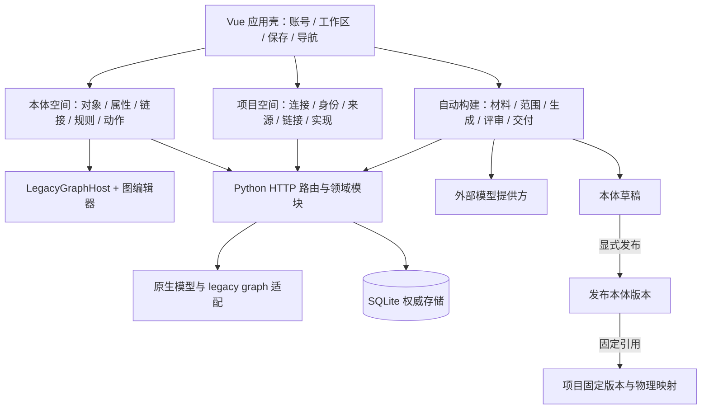

# wiz_ontology_workspace 深度审查与整改路线

> **审查日期：2026-09-24**  
> **对象：本体构建工作台，而不是单独的“自动生成本体”功能。**  
> **主干证据基线：`3f29a226c79fef159539c64dd03a519fd59e9869`。**  
> **交付定位：代码证据审查 + GitHub 开源对标 + 产品/架构/UI/交互整改方案。**

## 阅读导航

- [结论与边界](#summary)：先看总判断、证据分级和不应推倒的基础。
- [现状与对标](#current)：能力地图、架构和九个开源项目。
- [具体问题](#findings)：12 项问题，区分确定缺陷、已在分支修复和待验证风险。
- [目标方案](#target)：本体语义、自动构建、版本治理和可执行语义快照。
- [UI 与交互](#ux)：页面级整改、图谱模式、状态反馈和设计验收。
- [实施与验收](#delivery-plan)：任务依赖、阶段门禁、测试与接入顺序。

配套文件：[02_整改开发任务与验收清单.md](02_整改开发任务与验收清单.md)。本报告可独立用于评审；配套清单用于分配给开发者或 coding harness。

<a id="summary"></a>
## 1. 锐评结论：功能已经不少，可信闭环还不够硬

**这不是一个“只有几个 CRUD 页面”的玩具，也还不是一个可以放心承诺自动完成本体构建的成熟工作台。它已经搭出了有价值的产品骨架，但功能扩张速度快于语义契约、交互状态和验收口径的收敛速度。**

最值得肯定的不是模型调用，而是把“本体定义”和“项目物理映射”分开，把草稿、发布版本、固定引用、保存冲突、人工评审和事务交付都放进了体系。最需要批评的也不是配色：**局部代码把“模型作业结束”“处理完整”“候选可信”“允许交付”混成了相近的成功概念。** 前者决定这个项目值得继续做；后者决定它目前不能靠演示流畅证明结果可靠。[C01] · [C04] · [C15] · [C19] · [C25]

### 1.1 六句直接评价

| 评价 | 含义 |
|---|---|
| **现在最缺的不是更多 AI，而是让 AI 的产物有边界。** | 证据完整性、覆盖报告、候选裁切和交付门禁，比继续扩大 token 或增加 agent 更优先。 |
| **工作台不缺页面，缺的是跨页面一致的“操作承诺”。** | 用户点击取消就必须留在原地；保存成功不能指代校验通过；运行结束不能指代覆盖完成。 |
| **图谱已经能编辑，不必再造一个更炫的图谱。** | 应把当前图谱变成发现问题、追踪引用、查看变更影响的工作视图，而不是另一个独立编辑系统。[C07] · [C08] · [C09] |
| **原生业务本体不是罪，伪装成完整 OWL 兼容才是风险。** | 自有 JSON 很适合对象、属性、动作、规则和项目执行语义；要明确与 RDF/OWL 的可交换子集。[C15] |
| **测试很多是好事，但“测试通过”不等于“产品承诺成立”。** | 错误容量行为被写成正向断言时，测试会把缺陷固化；必须先确定需求不变量，再决定断言。[C19] · [C29] |
| **下一阶段应做“语义工程工作台”，不是泛化成低代码平台。** | 最有价值的闭环是：材料 → 可信定义 → 可审版本 → 项目绑定 → 可解释执行。 |

### 1.2 不建议做的四件事

不要为了“架构升级”同时换 Vue、HTTP 框架和数据库；不要强行将所有模型迁到 RDF/OWL/Neo4j；不要让 MCP 重新解析一遍本体并另写执行逻辑；不要把生成规则/动作的文本直接变成可执行命令。当前的本地部署定位、双工作区和人工确认边界应继续保留。[C01] · [C05] · [C15] · [C25]

## 2. 证据范围：哪些是本轮看到的，哪些不是

### 2.1 本轮实际做了什么

通过 GitHub 网页与 raw 文件读取，审查了应用壳、保存协调器、导航、项目映射、对象工作区、图谱编辑器、设计配置、模型格式、项目校验、存储引擎、HTTP 服务、自动构建链路、交付/评审和测试入口；检索并核对九个相关开源项目及若干官方文档。主干提交由 [GitHub main 提交补丁](https://github.com/gukp1993/wiz_ontology_workspace/commit/3f29a226c79fef159539c64dd03a519fd59e9869.patch) 确认。

**本轮没有成功克隆并运行整个仓库，没有启动工作台，没有连接用户数据库，没有调用真实模型，也没有完成真实浏览器交互验收。** 因此，UI 部分是模板、样式、状态机和事件接线的静态审查，不冒充实机截图或用户可用性测试。性能建议是测量方案，不是已测出的延迟结论。

本轮实际执行了一个抽离的 JavaScript 最小复现：异步布尔函数直接放进 `if` 条件，会按 Promise 对象的真值进入分支。原写法把选择从 A 改到 B；加 `await` 后，确认返回 false 时仍为 A。**这只证明语言层问题，不替代 Vue 页面路径验收。** 结果保存在 `evidence/async_guard_reproduction.txt`。

### 2.2 证据标签

| 标签 | 定义 | 使用方式 |
|---|---|---|
| **A：代码确认** | 本轮读到的主干代码能直接支持 | 如候选净化达到上限后 `break`、异步 guard 未被 await。 |
| **B：历史验收记录** | 用户本轮提供的 Codex 工作记录 | 如 feature 分支解析样本 214 Facts、94/95 测试记录。不是本轮重跑。 |
| **C：风险判断** | 有代码迹象，但尚需完整调用链、浏览器或压测验证 | 如大快照深拷贝成本、某个导航入口触发脏数据丢失的具体路径。 |
| **D：设计建议** | 本报告提出的目标契约、模块、指标和排期 | 不描述成仓库已经具备的能力。 |

<a id="history"></a>
### 2.3 必须区分主干与 auto_build 分支

用户提供的后续验收记录，比早期“110 条事实、数组只存摘要”的讨论更新：

| 项目 | 本轮主干证据 | 用户提供的分支验收记录 H01 | 结论 |
|---|---|---|---|
| 普通数组成员保留 | 主干 `json_parser/structwalk` 仍以摘要为主。[C20] · [C21] | `6419746` 的解析 v3 在原始储能样本上得到 214 Facts，四条已知问题逐项保留。 | **主干有缺口；分支已有修复，不应重写一遍。** |
| 生成统一收尾 | 主干固定路径与自适应路径未共享相同的全局收尾。[C19] | 分支已实现共享 Finalizer 并有受控测试。 | 优先核验并接收现有实现，不能写成“全仓库完全没有”。 |
| 容量门禁 | 主干有输入裁切和响应候选上限。[C19] · [C23] · [C24] | 分支首阶段仍因 520→500 后成功、501→500 裁切及交付门禁不完整而未通过。 | 仍是阻断项，不能因“容量对象已实现”就宣布解决。 |
| Fact 可视化/评测 | 不能仅据旧讨论认定缺失。 | 已有开发与受控验收内容，语义金样和完整浏览器验收未完成。 | 补验收、补真实质量证据，不重复造页面。 |
| 测试结果 | 本轮未跑仓库测试。 | 历史记录 94/95；另一项因固定端口 18941 被占用未能启动。 | 不能记成 95/95，也不能将环境阻塞直接判为业务缺陷。 |

H01 的验收基线是 `6419746bc01c3a7888dd19237db17d0908c5b8a8`，报告提交为 `7ee4cd3`；这些信息来自本轮给定的 Codex 记录。仓库自己的交接文档也明确提醒：执行者的交接声明不等于独立验收。[C02]

<a id="current"></a>
## 3. 现有能力与产品定位

### 3.1 已经形成的骨架

| 领域 | 已有能力与证据 | 评价与下一步 |
|---|---|---|
| 本体定义 | 对象、属性、共享属性、链接，以及业务规则和动作；原生模型与 legacy graph 适配。[C07] · [C15] | 不是空壳。应增加语义一致性与引用治理，而非继续堆同类表单。 |
| 项目映射 | 身份来源、属性来源、链接、计算/编排和动作配置；有依赖与发布校验。[C16] | 是差异化价值中心；要从“配置有效”升级到“运行结果语义明确”。 |
| 版本边界 | 草稿、发布、项目固定引用等独立概念。[C01] · [C16] | 应保留，再补变更影响与升级预览。 |
| 自动构建 | 材料 → Fact → 范围 → 候选 → 评审 → 新本体草稿；有批次/目标计划和恢复设计。[C19] · [C25] · [C28] | 已越过简单提示词演示；缺口在完整性与终态契约。 |
| 人工评审 | 编辑、纳入/排除/暂缓、合并链、撤销后的引用检查及重生成冲突处理。[C26] | 不应另造替代流程，应增强批量效率和证据对照。 |
| 持久化可靠性 | SQLite 权威存储、WAL、事务、CAS、保存队列和显式冲突处理。[C04] · [C17] | 本地场景的合理工程选择。 |
| 图谱编辑 | 主工作区挂接 LegacyGraphHost，内部有编辑、搜索、布局等交互。[C07] · [C08] · [C09] | 图已经存在；问题是统一行为和聚焦任务，不是有没有节点连线。 |
| 工程规范 | 设计规范、lint/typecheck、分组测试和隔离入口已经存在。[C10] · [C11] · [C12] · [C13] · [C14] · [C29] | 需要加强语义门禁与覆盖，不是从零建立工程化。 |

### 3.2 更准确的定位

建议将产品定义为：

> **面向行业语义工程师和项目实施人员，管理“业务概念—证据—版本—物理绑定—执行契约”的本地优先工作台。**

它不是通用知识图谱数据库，不是纯 OWL 专家编辑器，也不只是文档抽三元组工具。用“支持多少图谱算法”评价它容易跑偏；更有用的问题是：同一套储能业务定义能否在多个项目中可靠复用，并且每个项目都能解释某个属性值究竟来自哪里。

### 3.3 三类主要使用者与任务

| 使用者 | 需要完成的任务 | 工作台应该给出的答案 |
|---|---|---|
| 领域专家 | 判断“储能设备”“运行状态”“告警”“功率”等概念是否合理 | 概念解释、证据、反例、引用与争议，不必先理解数据库。 |
| 语义/实施工程师 | 将定义接到真实字段或既有函数编排 | 身份、输入输出、时间粒度、单位、关联路径和验证结果。 |
| 评审/交付负责人 | 批准一个版本并确认影响范围 | 修改了什么、哪些项目受影响、是否覆盖完整、还存在哪些限制。 |

第一类需要引导，第二类需要效率，第三类需要可审计性。一个大图加一堆表单无法同时满足这三类任务。

## 4. 当前架构：模块不少，跨模块契约还需要收口

下图是依据代码抽象出的现状，不表示每个框都是独立服务。[C03] · [C05] · [C15] · [C16] · [C17] · [C19] · [C25]



**应保留的设计**：SQLite 单一真相源、不可变发布版本、项目固定引用、保存并发控制、候选到草稿的原子交付、本地监听边界。

**应调整的设计**：把散落在页面、pipeline、codec、review、delivery 中的“什么叫完成、什么叫可信、什么允许写入”收成少量强类型契约；把导航、确认、保存和回位统一成应用级行为，而不是每页自行实现。

## 5. GitHub 对标：学适合的部分，不照搬整个项目

### 5.1 九个项目的适配矩阵

下表的“借鉴”是本报告的设计判断；不是这些项目保证能解决当前工作台的全部问题。

| 项目 | 真实定位 | 最值得借鉴 | 不应该直接照搬 | 建议优先级 |
|---|---|---|---|---|
| [WebProtégé][R01] | Web 协作本体编辑，支持 OWL、变更历史、权限与讨论 | 概念树—属性表单—讨论/变更的联动；对单个概念进行审阅 | 把 OWL 专家界面和整套 Java 栈强加给行业用户 | 高：语义治理和评审 |
| [LinkML][R02] | 模式驱动的模型定义与多格式生成 | 用单一模式约束输入、输出、校验器和文档；JSON Schema / Pydantic 生成器可作实现参考。[R03] · [R04] | 将当前所有原生文件强制改为 LinkML/YAML | 高：契约工程 |
| [OntoGPT][R05] | LLM 结构化抽取与基于本体的 grounding | 类型化抽取模板、术语对齐和受约束候选 | 把“从既有模式抽取”当作“自动设计任意高质量本体” | 高：候选生成 |
| [OntoGenix][R06] | 从数据集半自动生成本体，含设计描述、OWL 生成和映射步骤 | 先讨论高层设计，再做具体定义；用人工本体作对照评估。[R07] | 直接采用它的自动映射政策，绕过本项目人工确认 | 中：流程设计与金样 |
| [AutoSchemaKG][R08] | 结合实体/事件抽取与概念化的图谱构建 | 将实例事实抽取与类型抽象分开，减少“见一个名词就建一个类” | 用开放文本 KG/RAG 成绩替代项目绑定正确性验收 | 中：语义抽象研究 |
| [WebVOWL][R09] | OWL 本体可视化 | 语义图例、类型区分、筛选与聚焦 | 重写现有 Cytoscape 编辑器，或把业务流程都画成 OWL 图 | 中：图谱视图 |
| [ROBOT][R10] | 面向本体开发的 CLI/库与自动化流程 | 可重复执行的检查、质量报告和发布流水线。[R11] | 为所有本地操作强加 JVM/生物医学本体工具链 | 高：质量门禁 |
| [OpenRefine][R12] | 数据清洗、协调、分面与批量修改 | 将“待处理候选”做成可筛选的评审队列；聚类建议经人工确认才合并。[R13] · [R14] | 按文本相似度自动宣布两个业务概念等价 | 高：评审交互 |
| [Ontology Playground][R15] | 微软的本体教学、目录与可视化设计项目，基础体验可静态部署，另有可选 AI 后端 | 示例模板、渐进教学、分享与可嵌入演示 | 把教学型体验当成当前事务、权限、版本和物理绑定的替代品 | 中：新手体验 |

### 5.2 建议落地成五个可交付能力

**从 WebProtégé 学“概念有讨论与变更”，不是学一个树控件。** 选中“储能设备”后，能同时看到定义、被谁引用、谁改过、哪些问题未解决；讨论绑定稳定概念 ID，不依附会漂移的列表序号。[R01]

**从 LinkML 学“先有契约，再生成外围代码”。** 第一阶段只统一 Candidate、CompletionReport 和执行属性描述，不必立即替换全部模型格式。选 JSON Schema 作为项目内契约源也可以；是否引入 LinkML 本身应由小范围验证决定。[R02] · [R03] · [R04]

**从 OntoGPT/AutoSchemaKG 学“分离事实、候选和概念”。** 某表的一行设备记录不是一个对象类型；某段“电池异常”文本也不自动意味着应建一个类。模型应提出有类型、有来源、有不确定性标记的建议。[R05] · [R08]

**从 OpenRefine 学“评审队列优先”。** 当前最需要的不是一个 Accept All 按钮，而是按问题类别、证据状态、对象归属、冲突和人工状态筛选，并准确知道批量操作影响哪些项。[R13] · [R14]

**从 ROBOT 学“质量要求可执行”。** “本体校验”要能够作为无 UI 的确定性步骤运行，产出机器可读问题清单，并把严重级别映射到发布门禁。[R10] · [R11]

### 5.3 选型纪律

先借鉴交互和工程模式，再决定是否接入依赖。直接复用代码前核对对应版本的许可证和依赖边界；不能因为代码在 GitHub 上就默认可任意复制。对本项目，**原型中证明有收益**比星标数量或新项目名称更重要。没有必要一次引入上述九个项目。

**时效提醒**：WebProtégé 主仓库 README 已说明活跃开发迁往更细粒度的 Next Gen 仓库；调研新实现时应跟随其官方入口，而不是把旧单仓布局当最新架构。[R01] WebVOWL README 也提示旧域名已不归项目所有，应从当前仓库给出的 TIB 服务链接进入，不沿用旧教程中的域名。[R09]


<a id="findings"></a>
## 6. 代码级问题与整改意见

优先级口径：**P0** 阻断“自动构建结果完整、可交付”的发布承诺；**P1** 影响核心可靠性/操作安全，应在近期修复；**P2** 影响效率、维护性和扩展。P0 不表示整个手工建模工作台必须停用。

### F01｜P0：有截断注记，但仍可能给出成功终态

**证据 A。** 固定生成路径对超出 `MAX_MODEL_FACTS` 的事实切片，并记录未发送数量；成功收尾仍返回 `state='succeeded'`。所以不能说它完全静默，但日志注记没有改变业务终态。[C19]

**问题不是容量小，而是承诺不真实。** 限制 500 条可以接受；处理 500 条却让用户将其理解为“本次范围已完成”不可以。容量保护应改变可交付状态，而不是仅在日志里补一句。

**整改**：分离执行终态和完成质量。容量不足时，保留已有候选供评审，但 `completeness=partial`、`deliverable=false`；提供继续剩余目标或显式缩小范围并生成新 scope revision 的入口。两条路径使用同一 CompletionReport 与交付门禁。

**验收**：520 条应处理事实，只有 500 条成功进入处理且 20 条没有受支持的处置时，不得展示完整完成，不得通过默认交付。API、页面、预检、最终写入应一致阻断。

### F02｜P0：候选响应达到上限后直接终止净化

**证据 A。** `llm._sanitize_candidates` 与 `output_codec` 的相应净化函数，在达到单响应候选上限后 `break`。codec 中上限对应 500；不能把已有 `finish_reason=length` 检查当成这种程序侧裁切已经解决。[C23] · [C24]

**整改**：对模型响应数量单独判定。若超过接收上限，返回 `CANDIDATE_LIMIT_EXCEEDED` 与原始计数，驱动分批/收窄目标；或保存完整、受总字节预算约束的中间响应后分页处理。不能拿前 500 条冒充整个响应。被丢弃、净化拒绝、合并去重是三种不同事件，分别记录。

**验收**：501 条合法候选不能无告警变成 500 条成功结果；缺少引用而拒收也必须有候选级原因，不能仅显示一个“引用无效数量”。

### F03｜P0/P1：主干扫描摘要化，分支修复要接上而不是重做

**证据 A+B。** 主干普通数组以长度和类型分布摘要为主；用户提供的后续分支记录表明数组成员问题已在解析 v3 中修复并形成 214 Facts 的样本结果。[C20] · [C21] 详见 [H01](#history)。

**整改**：接收前验证“成员有定位、原始值可追溯、限制显式登记、结构缺口可统计”四个不变量。对本体原生格式优先直接校验/转换，不要先拆成弱线索再让模型重新猜一次结构。对未知 JSON 保留通用事实路径。

**注意**：保留完整材料不等于每个值都必须复制进模型提示词。原始证据、索引摘要和模型工作集是三层不同的东西。

**验收**：同一原始样本用固定文件哈希和 parserVersion 对照；214 只是历史样本结果，不是所有后续版本必须永远固定的数字，更不是质量分数。

### F04｜P0：两条生成路径没有相同的全局语义收尾

**证据 A+B。** 主干固定路径有跨批整理、校验和适配；自适应路径主要以作业执行和结束守卫收尾，不经过同一段全局处理。分支已有共享 Finalizer，尚应以独立验收为准。[C19] [H01](#history)

**整改**：保留不同计划策略，但只保留一套可重复、可幂等的 `normalize → resolve identity → merge → validate evidence → validate references → adapt → summarize` 收尾。现有 branch 实现先核对契约，再复用。

**验收**：同一组模拟候选，按固定批次或目标作业进入系统，最终规范化模型、引用关系与问题集合相同；允许候选顺序不同，但不能出现一个路径有悬空引用而另一个没有。不能将真实模型随机输出差异当成 Finalizer 差异。

### F05｜P1：范围的产品含义与用户直觉不完全一致

**证据 A。** 检索采用显式词项规则，纳入优先于排除，无明确排除者可保守保留；这不等于用户理解的“只做我纳入的对象”。也不能把当前实现描述成已经有完整向量 RAG 召回。[C22]

**整改**：增加明确的 `strict` 与 `conservative` 范围模式；默认选择需产品确认，不偷偷改旧任务。显示“明确纳入 / 依赖补入 / 待确认 / 明确排除”，每项有原因。纳入与排除冲突需要显式策略；依赖闭包不能借机把整个文件都补回。

**验收**：用户看到的预计工作集与实际计划一致；任何范围变更产生新 revision；排除一个对象时，引用它的属性和链接不能悄悄变成自相矛盾的交付结果。

### F06｜P1：异步离开确认被当成同步布尔值使用

**证据 A，页面影响路径部分为 C。** `ProjectBinding.vue` 中 `guardUnsaved()` 返回 `Promise<boolean>`，但 `pick`、`setDetail` 和部分跳转函数直接用 `if(guardUnsaved())` 或 `if(!guardUnsaved())`。控制流不会等待用户确认。[C06]

**需要精确描述影响**：部分按钮在编辑模式下被隐藏，不能仅看函数就断言用户一定能点击它们造成丢稿。函数层缺陷确定；要通过编辑器事件、程序化 focus、页签跳转等可达路径完成浏览器复现。

**整改方向**：所有可达调用点统一等待确认；增加单飞导航/上下文代号，避免迟到确认把另一个项目的状态改掉；业务状态更新只发生在确认通过之后。异步 guard 不能先调用后立即修改 `selected/detail/editorOpen`。

**验收**：确认框选择“继续编辑”后，当前对象、页签、草稿、光标上下文均保持；连续两次导航不会叠两个确认或产生迟到跳转。补能识别误用 Promise 的类型化 lint，而不是只跑构建。

### F07｜P1：进度页按总成功把所有阶段涂成完成

**证据 A。** `BuildProgressPage.vue` 的 `stageStatus` 对 `succeeded` 直接返回 done；页面也用该状态开放评审入口。已有目标进度、作业计数和估算说明是优点，但不足以证明每个阶段真的执行了同等后处理。[C27]

**整改**：服务端提供逐阶段记录，至少含状态、产物摘要、输入版本、完成时间和跳过原因。页面不从单一总状态推断全部阶段成功。允许“结果部分就绪，可评审；尚不可交付”。

**验收**：没有执行的阶段显示 `skipped/notApplicable` 及原因；局部结果和失败结果可回看；进度不通过增加分母或隐藏失败伪造完成。

### F08｜P1/P2：设计规范存在，但行为一致性与验收范围不足

**证据 A。** 已有 DESIGN.md 和设计检查配置；检查中视觉比较和无障碍审计关闭，legacyGraph 被排除。图编辑器又有自身样式、确认框和提示组件。[C09] · [C10] · [C11]

**锐评**：现在更像“有设计规则，但部分关键区域在规则之外”。把非 legacy 区域硬编码颜色清零，并不能证明整个工作台体验统一。

**整改**：先统一危险操作、确认取消、保存反馈、焦点返回、键盘行为，再统一视觉 tokens。将 legacyGraph 豁免拆成登记项和退出标准；增加构建、评审、项目映射等截图/行为场景，不能只看首页和对象页。

**验收**：同一种操作在表单和图谱里使用同一保存/确认语义；视觉差异测试与键盘测试都执行，豁免项不能永久无限扩大。

### F09｜P2：模块已拆，编排仍集中在少数大组件

**证据 A+C。** App 集中导入/编排多个领域；图编辑器与对象工作区职责仍重。App 中存在从 DOM 选中态、标签文字恢复上下文的路径；项目映射也有模块级选择记忆。[C03] · [C06] · [C07] · [C09]

**整改**：以工作区控制器和类型化 Location 为切入点，而不是把大文件机械切成更多小文件。地址/状态至少绑定 account、workspace、project/ontology、version、resource、tab、returnTo。不能把 DOM 当路由状态数据库。

保存协调器已有串行、generation 和冲突处理，不要重写成“所有页面直接 PATCH”。图布局、筛选、视口与业务定义分离；大数据量下再测量快照克隆和图布局成本，测出瓶颈后优化。[C04]

### F10｜P1：类型规范文字与实际严格度不完全一致

**证据 A。** `tsconfig.json` 是 `strict:false`；lint 有意放宽 `any` 和 props 修改等规则，而配置注释多次把 vue-tsc 描述为严格兜底。`npm run build` 包含 typecheck，但没有包含独立 lint。[C12] · [C13] · [C14]

**整改**：不是立刻全仓 strict=true 制造海量改动。先对导航/保存、协议 DTO、候选转换与项目绑定新增代码设严格边界；老模块建立可见债务基线，只减不增。把 typecheck、lint、行为测试分别列为门禁。

**验收**：新增异步布尔 guard 的 Promise 误用能被阻断；新契约入口不接受无结构 `any`；豁免必须含路径、责任人和退出条件。

### F11｜P1：启动恢复失败可能被吞掉

**证据 A。** HTTP 服务启动时将遗留任务标为 interrupted，并清理过期上传；这组关键恢复放在宽泛 `try/except Exception: pass` 中。数据库初始化失败本身已有显式退出，不能混为一谈。[C18]

**整改**：会话维护失败可以降级；任务执行权恢复失败应输出结构化错误，健康状态标记 `degraded`，必要时阻止新的生成运行，保留只读和手工编辑能力。不要继续显示服务正常却让任务状态可能失真。

**验收**：注入恢复异常后，日志、健康状态、界面提示一致；不会继续接受可能与旧执行权冲突的新任务，也不泄露密钥或原始材料。

### F12｜P1/P2：语义与实现已有丰富约束，但仍应明确纯校验和执行契约

**证据 A。** `model_format` 有原生/legacy 双表达和严格字段边界；`project_validation` 已检查来源、依赖环与发布条件，但其入口仍调用会就地改写展示字段的 `derive_display_names`。文件自身已标注这项兼容行为。[C15] · [C16]

**整改**：将“规范化、派生展示、验证、执行预检”拆开；验证函数不得偷偷改变用户草稿。把项目物理来源编译成明确的执行属性描述，而不是让下游根据多个配置 JSON 再自行猜含义。

**验收**：相同输入重复校验，输入内容哈希不变化，输出稳定；冻结的项目版本能产出稳定快照；未实现、不可读依赖和缺少时间语义能明确阻断相应查询能力，而不是一概猜默认值。

## 7. 根因：不是代码写得少，而是“真相”太分散

这里的核心风险有三个层面。

**业务真相分散**：范围、覆盖、净化、合并、人工决定、交付资格分别由不同模块局部理解。每个模块都有合理理由，但合起来未必能回答“这次工作到底完成了什么”。[C19] · [C22] · [C24] · [C25] · [C26]

**交互真相分散**：应用壳、页面 guard、旧图编辑器和设置返回逻辑都有自己的状态恢复方式。一个页面改成异步确认，调用者没有一起改，就会出现 F06。[C03] · [C06] · [C09]

**验收真相分散**：交接记录、接口文档、测试断言、分支实现和正在运行的前端构建未必同时更新。用户给出的“代码已经修了，但服务/验收还没对应”的历史就是提醒。[C02] [H01](#history)

整改应围绕三条统一线展开：**统一契约、统一状态转换、统一可验证门禁。** 不需要建立一个庞大的“平台中台”。

<a id="target"></a>
## 8. 功能方向一：先把本体语义建扎实

以下是建议能力，不是对当前全仓库“完全没有这些字段”的断言。实施前逐项核对已有模型和已验收需求。

### 8.1 定义稳定的行业建模 Profile

保留原生模型，增加可配置的语义约束 Profile。不要硬编码“所有行业必须用这六种类”。对储能首个 Profile 可采用如下分工：

| 业务概念 | 建议建模方式 | 需要避免 |
|---|---|---|
| 储能设备、园区 | 有稳定身份的对象类型 | 把每个数据库表机械变成对象，或把每个实例建成类。 |
| 储能系统 | 依业务边界定义为系统对象/聚合对象 | 仅凭“系统”二字强制建层级。 |
| 运行状态 | 枚举/值类型或状态模型，按需求确定 | 直接与物理设备混在同一实体层级。 |
| 功率、SOC | 属性或观测，明确单位、时间和观测值类型 | 把“最新值”“时序”“窗口统计”视为同一种取值。 |
| 告警 | 有发生时间和生命周期时通常按事件设计 | 把一次告警记录和告警类别混成一个概念。 |
| 执行充电 | 动作定义，执行实现位于项目层 | 模型生成描述就当作可调用控制命令。 |

分类用于提示和校验，不是模型替专家做最终判断。例如“储能设备”参与不同业务过程可以承担不同角色，不能因角色变化自动创建一个新的物理类型。

### 8.2 增加最小“概念契约”

每个可复用概念至少应有稳定 ID、名称/别名、定义、所属 Profile、类型、生命周期状态、来源与引用。属性进一步描述值形状和语义；链接描述端点和方向，是否需要基数约束由业务决定。

将下面这些问题作为建模质量检查：改名是否改变身份？两个同名概念是否确实等价？属性到底属于哪个对象？该链接是否只是数据库 join，还是有业务含义？共享属性的修改会影响哪些对象？

### 8.3 引入“能力问题”，避免只评估节点数量

在建模开始前写 5～10 个业务问题，作为范围与验收依据。例如：

> 哪些储能设备属于园区 A？“最新 SOC”以哪个时间字段为准？系统可用容量由哪些设备汇总？哪些属性没有可信数据源？某条规则引用的属性是否在当前项目可计算？

这些是建议的测试问题，不是当前数据已经能回答的事实。无法支撑能力问题的本体，即使图上有几百个节点，也可能没有业务价值。

### 8.4 标准互操作：做明确子集，不做虚假全兼容

当前原生格式有适配层，不宜把内部出现 `owl:Class` 等符号等同于完整 OWL 语义支持。[C15]

建议先发布兼容矩阵：哪些对象/属性/链接可无损导出，哪些规则/动作/时序语义需要扩展，哪些表达不能回导。每次转换生成 `lossReport`；不能静默丢字段。只有实际需要逻辑推理或外部标准交换时，才引入对应 OWL/SHACL 工具链，并用小样本验证。

## 9. 功能方向二：把自动构建改成证据驱动的语义编译链

### 9.1 三类物料，不能一个提示词包打天下

| 输入类型 | 建议主路径 | LLM 的角色 |
|---|---|---|
| 工作台原生本体、明确支持的结构化本体 | 检测格式 → 校验 → 确定性转换 → 引用/损失报告 → 人工确认 | 解释冲突、提出补充建议；不重造已有 ID 和关系。 |
| 数据目录、DDL、结构化项目配置 | 结构解析 → 元数据/约束 → 建模候选 | 从技术结构提出业务语义假设；不把表列自动当真理。 |
| 文档、说明、弱结构文本 | 原文分段 → 证据单元 → 定向抽取 → 合并审阅 | 提出带逐字段证据的候选；不自动落正式定义。 |

同一文件中可以混合路径。`known_issues_found` 之类内容更可能是质量提示，应保留并分流，不应因为是字符串就默认送去生成新类。

### 9.2 建议目标链路


### 9.3 分清五种实体

`SourceRevision` 是不可变输入；`EvidenceAtom` 是可定位证据；`BuildTarget` 是要完成的语义任务；`Candidate` 是建议定义；`Definition` 是经过显式接受的正式草稿内容。

**五者不能共用一个“处理数量”来说明完成。** 一个定义可能需要十条证据；同一证据可能支撑多个定义；一条已处理证据可能合理地产生零候选。零候选只有附带可验证处置理由，才可以进入已完成统计。

### 9.4 覆盖守恒，但不等于一 Fact 一候选

针对冻结的范围工作集，建议定义互斥状态：

```text
范围内待处理单元数
  = 已有结果且处理完成
  + 已说明不产生定义
  + 经批准不适用
  + 仍待处理
  + 失败/受阻
```

分割后的子作业不能与父作业一起加进分母。排除项在范围审定时登记，不允许生成失败后临时把它移到“范围外”制造完整率。结构扫描不知道总量时显示 unknown，不显示 100%。

**执行覆盖率不是语义召回率。** 前者说明系统给工作集中的每个目标一个处置；后者要靠人工金样判断应有概念是否真的找全。两者必须分别展示。

### 9.5 提议的 CompletionReport

下面是设计示例，不是当前接口响应，也不是本轮运行结果。示例刻意表现“执行结束但结果不完整”：

```json
{
  "schemaVersion": 1,
  "executionState": "succeeded",
  "completeness": "partial",
  "reviewable": true,
  "deliverable": false,
  "scopeRevision": "scope-r7",
  "planRevision": "plan-r2",
  "inputHash": "sha256:example-input",
  "coverage": {
    "inScopeUnits": 520,
    "completedUnits": 500,
    "noDefinitionUnits": 0,
    "notApplicableUnits": 0,
    "pendingUnits": 20,
    "blockedUnits": 0
  },
  "losses": [{"code": "INPUT_NOT_PROCESSED", "count": 20}],
  "finalizer": {"version": "finalizer-v1", "state": "completed"},
  "blockers": ["COVERAGE_INCOMPLETE"]
}
```

为了兼容，旧 `state` 可暂时继续表示执行终态；所有新页面和交付逻辑必须消费报告。报告缺失的历史结果应显示“完整性未评估”，不能兼容性兜底成完整。

### 9.6 交付门禁必须由服务端重验

现有 delivery 已具备检查令牌、幂等和事务基础，应直接扩展，不能另建一套旁路。[C25]

门禁至少绑定输入/范围/计划版本、Finalizer 结果、候选内容与人工决定 revision、覆盖报告哈希。预检通过后有人修改候选、范围或人工选择，原 token 必须失效。事务中的最终校验不能只相信前端按钮曾经变绿。

默认政策：部分结果可以看、改、导出诊断；不能作为完整任务交付。确有业务需要交付一个子集时，先显式形成新的交付范围和限制声明，再走完整门禁，不设置一个危险的“忽略所有缺口”按钮。

### 9.7 模型、预算和安全

保持 JSON 事实/候选契约；Markdown 可用于解释，但不是解决输出膨胀的技术方案。对支持严格结构输出的 provider，建立能力适配和 schema 校验；不支持时保留受限修复。结构合法仍不等于语义正确。[C23] · [C24]

以证据包和语义目标分批，预算同时考虑输入、输出、总费用和运行上限。对错误使用类型化分类，区分认证/配置失败、限流、暂时性网络失败和输出截断；不要依赖异常字符串，也不要为了测试里固定的失败返回而改变真实重试语义。[C19]

提示注入内容只作材料数据；规则、动作和 SQL 文本不在生成阶段执行。外部模型调用前展示外发范围、脱敏策略和提供方，日志默认不保存完整原文与密钥。

## 10. 功能方向三：评审与版本治理，而不是另做一套审批系统

当前评审已经有人工编辑、合并、依赖检查和重生成冲突处理，建议增强它，而不是另起页面替换。[C26]

### 10.1 评审产物应是变更集

建议评审以 `ChangeSet` 表达：基线版本、增加/修改/合并/弃用操作、受影响引用、证据和人工决定。每个操作可定位、可审计，可在交付前重验。

自动建议只写候选与变更建议；用户接受后才形成草稿修改。人工改过的字段在重生成时进行三方比较：旧机器建议、人工修改、新机器建议，不能按候选名相同就覆盖。

### 10.2 变更影响优先于花哨版本树

最先补四类影响：共享属性改类型影响哪些对象；对象/属性弃用影响哪些项目；链接端点改变影响哪些查询路径；函数输入输出变化影响哪些属性取值与动作。

发布时显示“本体本身有效”和“引用项目需要升级/重绑定”是不同结果。项目维持固定版本，禁止本体发布后静默迁移全部项目。[C01] · [C16]

### 10.3 协作先做到可追踪，不急于实时多人编辑

首批只需角色化的创建/评审/发布权限、带稳定对象 ID 的讨论/问题、冲突可见和变更记录。实时光标、CRDT、复杂审批编排并非当前最优先项。对本地工作台，先把已有账号隔离和版本边界验收好。[C18]

## 11. 功能方向四：项目可执行语义快照

这是后续智能问数的建议接入方向，不表示主干已经实现完整编译器。

### 11.1 为什么仅把本体和映射 JSON 交给模型还不够

项目校验已覆盖相当多的来源和依赖规则，但下游若每次都自行解读所有配置，容易产生另一套默认值、join 推导、时间解释与错误处理。[C16]

建议将发布本体 + 发布项目绑定 + 既有函数/编排版本，编译成**只读、版本化、可解释的执行语义快照**。问数与 MCP 只消费快照和既有执行接口，不再发明属性来源。

### 11.2 每个可查询属性必须回答的八个问题

| 问题 | 快照要求 |
|---|---|
| 这个值属于谁？ | 对象稳定 ID 与实例身份策略。 |
| 来源在哪里？ | 已确认的字段绑定，或既有可执行编排/函数及版本。 |
| 输入是什么？ | 实例键、时间窗和必填业务参数。 |
| 输出是什么？ | 标量、集合、时序或结构值，不能混淆。 |
| 单位与精度是什么？ | 显式声明与必要转换，不凭字段名猜测。 |
| 时间是什么意思？ | 时区、事件时间/采集时间、最新值规则、窗口边界。 |
| 多条记录怎么办？ | 去重、聚合、排序和基数策略。 |
| 失败或无值怎么办？ | 缺失、过期、权限不足、依赖失效等明确错误语义。 |

下面是新快照 DTO 的**示意**，不是当前持久化格式；不得直接写入现有 schemaVersion=1 文件：

```json
{
  "snapshotId": "project-a-release-4-semantic-1",
  "ontologyVersion": "ontology-release-3",
  "projectVersion": "project-release-4",
  "propertyId": "energy.storageDevice.soc",
  "valueShape": "scalar",
  "valueType": "double",
  "unit": "%",
  "resolver": {
    "kind": "workflow",
    "workflowId": "existing-soc-reader",
    "workflowVersion": "release-2"
  },
  "requiredInputs": ["deviceId", "asOf"],
  "timeSemantics": {"selection": "latestAtOrBefore", "timezone": "Asia/Singapore"},
  "missingValuePolicy": "returnMissingWithReason"
}
```

### 11.3 一个真正有用的储能验收场景

用户问“园区 A 当前平均 SOC”。系统不能只找到一个 SOC 字段就执行 `AVG`。应先明确：哪些设备属于园区 A；每台设备取哪个时点；过期读数是否排除；是算术平均还是按容量加权；无值设备是否进入分母。

这些不是数据库技巧，而是业务定义。快照不能回答时，应返回“缺少聚合定义/时间规则”等明确缺口，要求补充，而不是让大模型代替用户拍板。

### 11.4 MCP 的边界

建议薄封装以下能力：列出可用语义对象、解析受支持查询意图、解释执行计划、调用现有只读执行链路、返回结果与出处。工具名和接口契约应与已有 MCP 分支对齐，不在这里另设冲突实现。[C02]

动作执行与只读问数分开授权；查询能力不能顺手暴露控制设备的工具。快照只存凭据引用，不含明文口令；快照引用的连接或编排不可读时应阻断相关能力。

<a id="ux"></a>
## 12. UI/UX 总方向：从“模块陈列”改成“当前任务可完成”

### 12.1 保留双工作区，收敛入口

现有导航已经分本体与项目，不应再加一个把所有东西重复一遍的“智能平台”。[C05]

建议在概览里明确三个动作：“继续当前草稿”“查看阻断问题”“从材料开始”。本体列表和任务列表仍是管理入口，不能因为有五步流程就强迫所有任务线性重走。上下文标题始终显示当前本体/项目、草稿或发布版本，以及只读状态。

### 12.2 四组状态必须分开表达

| 状态轴 | 示例 | 不应混用的词 |
|---|---|---|
| 编辑持久化 | 未保存 / 保存中 / 已保存 / 冲突 / 结果未知 | “已保存”不能表示本体合理。 |
| 模型质量 | 未检查 / 有警告 / 有阻断 / 校验通过 | “校验通过”不能表示已发布。 |
| 自动构建 | 运行中 / 执行结束 / 部分结果 / 覆盖完整 | “执行结束”不能一律绿色完成。 |
| 版本生命周期 | 草稿 / 待发布 / 已发布 / 已弃用 | “已生成”不能表示“正式版本”。 |

现有保存协调器已经有相当好的状态基础；关键是各页面和图谱统一使用，不再创造另一组含义近似的 toast。[C04] · [C09]

### 12.3 页面级整改清单

| 页面 | 核心问题/目标 | 建议交互 | 验收重点 |
|---|---|---|---|
| 工作概览 | 用户需要知道下一步，而不只是数量 | 当前上下文、最近任务、阻断问题、继续编辑 | 空状态、错误状态、无权限与无选择不混为一谈。 |
| 对象建模 | 定义、引用与证据需要联动 | 左侧概念目录，中间定义/属性，右侧按需打开问题/引用 | 改名保留 ID；删除先显示影响；共享属性作用范围明确。 |
| 项目映射 | 来源配置应能解释取值 | 每个属性展示来源、返回形状、测试样本和错误路径 | 取消不跳转；测试不偷偷保存；来源变更有影响提示。 |
| 材料与 Fact | 不只显示“扫描成功” | 材料 → 结构树 → 原文定位；并列完整率/限制/异常 | 摘要可回原文；结构缺口有原因；大数组不使页面冻结。 |
| 指定范围 | 让用户预见实际工作量 | 范围模式、纳入/补入/待定/排除分面及计划预览 | 保存范围与实际计划同 revision；冲突有明确提示。 |
| 生成进度 | 可信状态比动画重要 | 当前阶段、已处理目标、剩余与受阻、费用估算和下一步 | 阶段来自服务端；部分结果可看但不能默认交付。 |
| 候选评审 | 降低逐条确认成本 | 候选队列 + 定义差异 + 原始证据；问题优先排序 | 批量操作准确标记集合；人工决定保留；引用闭合。 |
| 校验与发布 | 能解释为什么不能发布 | 按对象/严重度/问题码筛选；点击问题直达字段 | 返回位置稳定；预检过期重新检查；发布后不可隐式改写。 |
| 模型/连接设置 | 外部依赖需要可诊断 | 配置、连通性、能力与预算分开；连接失败给 requestId | 测试连接不泄密；配置保存成功不等于服务可用。 |

### 12.4 评审页建议布局

下列是文字布局规格，不是已生成的高保真图或当前页面截图。

```text
任务：储能设备基础本体   范围 v7   结果：部分就绪 / 不可交付
[类型] [证据状态] [问题] [人工状态] [搜索]       已选 12 项

候选队列                 定义 / 差异                 证据与问题
-------------------      ---------------------      -----------------
储能设备    待评审        当前建议                   文件及版本
SOC         缺时间语义    与既有概念比较             路径与原文片段
包含        端点冲突      字段级编辑                 关联证据 / 冲突
...

[纳入] [暂缓] [排除] [建议合并]         当前范围 66 项；只对已选项操作
```

宽屏使用可调整的三栏；较窄桌面让证据栏成为可固定抽屉。不能把主编辑区挤到不可阅读，也不能同时出现多层内部滚动条而用户不知道滚的是哪里。

### 12.5 图谱不再当“全量全能视图”

建议保留当前引擎，增加按任务切换的视图：

| 视图 | 显示内容 | 默认行为 |
|---|---|---|
| 结构视图 | 对象与业务链接 | 选定对象的一到两跳邻域，按需展开。 |
| 属性视图 | 对象、属性和共享引用 | 隐藏无关定义，突出所有权与共享关系。 |
| 问题视图 | 冲突、悬空引用、缺少定义 | 问题节点优先，点击直达修复字段。 |
| 影响视图 | 某次修改的依赖传播 | 展示改动前后与受影响项目，不混入全部背景图。 |
| 项目来源视图 | 对象/属性到表字段或编排的依赖 | 区分业务关系与物理数据依赖。 |

图布局坐标、缩放和折叠状态属于视图偏好，不应制造本体草稿脏状态。选择与高亮不等于过滤删除。表单、图谱和评审如果修改同一个定义，应走同一命令/保存契约。[C08] · [C09]

### 12.6 视觉和可访问性

不建议凭静态代码宣布“颜色难看”或“某处一定重叠”。当前已有规范，应通过实际场景验证密度和一致性。[C10] · [C11] · [C30]

建议视觉基线覆盖 1280×720、1440×900、1920×1080，以及 200% 缩放；重点检查长中文名称、长文件名、多行定义、错误文案、表格空态和加载态。键盘路径覆盖进入编辑、弹窗焦点、Esc 取消、保存、返回焦点和图谱替代列表。状态不能只靠红绿颜色区分。

首次使用引导采用一份小型、非敏感储能示例，讲清“本体定义和项目映射分开”，而不是一开始给出空白大图。可参考 Ontology Playground 的示例/教学路径，但保留自身工程工作流。[R15]

## 13. 交互技术方案：一处定义，所有页面遵守

### 13.1 统一 NavigationIntent

建议将“切对象、切页签、切项目、打开设置、返回、程序化定位”表示为类型化意图。单个工作区控制器依次完成：读取当前编辑上下文 → 必要时确认 → 按政策保存或放弃 → 校验上下文未变化 → 执行导航 → 记录返回位置。

任何一步取消或失效，业务选择状态不变化。旧请求只允许更新自己的请求 epoch，不能覆盖新任务的页面。

### 13.2 F06 最小修复与后续收口分开

先修全部漏 `await` 的调用点并加单飞保护，不把第一轮修复膨胀成全仓导航重构。后续再迁入统一控制器。调用示意如下，实际接线应适配现有 form guard 与保存协调器：

```typescript
let navigating = false;

async function navigateWithinBinding(apply: () => void): Promise<void> {
  if (navigating) return;
  navigating = true;
  const context = currentContextKey();
  try {
    const allowed = await guardUnsaved();
    if (!allowed || context !== currentContextKey()) return;
    apply();
  } finally {
    navigating = false;
  }
}
```

这里的 `currentContextKey` 是拟新增的上下文快照函数，不是当前仓库现成 API。更完善的实现应将“确认”和“实际放弃草稿”分开，在上下文再次校验后才放弃，避免迟到确认误作用于已经切换的编辑器。

### 13.3 保存不是一句 toast

复用现有 coordinator 的 revision、串行保存和 unknown outcome 语义。[C04] 当请求超时但可能已写成功时，显示“保存结果未知，正在/需要核对版本”，而不是鼓励用户无限重复提交。冲突处理展示差异，覆盖是明确的危险操作；不能刷新页面后直接用旧内存覆盖新状态。

## 14. 架构整改：模块化单体足够，优先纯契约

### 14.1 建议模块边界

| 层 | 职责 | 不应承担 |
|---|---|---|
| `domain` / 原有领域模块 | 稳定 ID、定义、引用、变更集、纯验证 | HTTP、模型请求、DOM 状态。 |
| `application` / 用例服务 | 构建、评审、交付、发布、快照编译 | 另存一份独立真相源。 |
| `adapters` | 原生/legacy/标准格式、provider、数据源与既有执行器 | 静默补造语义默认值。 |
| `storage` | 事务、revision、持久化、索引与迁移 | 在读路径自动修复业务数据。 |
| `ui controllers` | 编辑草稿、请求 epoch、导航和呈现状态 | 判断最终交付资格。 |

不要求马上把物理目录都改成这些名称。先把函数接口、输入输出和副作用边界建立起来，减少多 agent 同时移动大目录的冲突。

### 14.2 统一协议的最小落地范围

优先统一 `Candidate`、`EvidenceRef`、`ScopeSnapshot`、`CompletionReport`、`StageRecord`、`ValidationIssue` 和快照中的 `ExecutableProperty`。选择一份机器可读 schema 为权威源，生成/校验 Python 与 TypeScript 边界类型。

`ValidationIssue` 应有稳定 `code`、严重级别、资源 ID、字段路径、依据和可执行修复建议。文案可以变化，测试不应该主要依赖整句中文字符串。

### 14.3 存储不换，但加强约束

保留 SQLite 的 WAL、短写事务和 CAS；模型调用、文件解析不放进长事务。[C17] 新表/列通过显式迁移增加；旧 run 没有完整性报告时标记 unknown，不能回填伪造 complete。批量运行使用有界队列和可续检查点，按真实负载决定是否将 worker 分进程，不预先拆微服务。

每份构建基线建议记录 sourceHash、parserVersion、scopeRevision、planVersion、prompt/codec/model 配置、finalizerVersion。内容哈希用于复用和防漂移，不把跨账号的相同哈希当成共享读取许可。

### 14.4 校验应纯化

目前项目校验入口含既有派生展示字段改写，已被代码注明。[C16] 迁移步骤应是：固定输入/输出金样 → 将 derive 操作迁至显式 normalize 或视图派生 → 验证输入不变 → 保持既有问题集合兼容。不要通过改校验结果顺手清理用户配置。

## 15. 安全、运行和性能：按本地边界改，不按 SaaS 空想改

### 15.1 已有保护应保留

服务有 loopback 监听、账号会话、Origin/请求形态检查与错误边界；存储失败不应降级为读旧文件。这些都不是零基础。[C01] · [C17] · [C18]

本报告不据此宣称已完成安全审计。没有进行越权测试、真实密钥扫描或全部上传格式攻击面验证。也不将根目录未看到某个文件就断言全仓库没有 CI 或许可证。

### 15.2 优先补的保护

材料与模型外发：明确哪些内容会发给谁；保留提供方和策略版本；默认脱敏字段名单可配置。上传/归档处理应有字节、展开大小、条目数、深度、时间与取消预算。模型输出不能成为未授权工具调用。

任务执行：取消和重启后旧执行者不得写新批次；恢复失败不能吞掉。日志用 task/run/target/requestId 串联，不把密钥和全量原文写进故障日志。[C18] · [C28]

版本健康：运行服务应报告 backend commit、frontend build、schema version 和关键功能开关；不匹配时可见。历史“代码已改但数据库/运行服务未对应”的问题应被健康检查提前发现。[C02]

### 15.3 性能先测，再优化

建议用三档数据量建立基线：小型示例、日常项目规模、压力规模。量测列表首屏、筛选、编辑保存、图布局、材料扫描峰值内存、生成计划时间和恢复时间。

对 App 的大量静态导入、JSON 快照复制和图布局，只能说存在潜在成本；本轮没有测得真实卡顿。[C03] · [C04] · [C09] 可优先试验路由级懒加载、列表虚拟化、邻域图和解析流式落盘。局部优化必须证明不破坏撤销、冲突和恢复。

100 MB 材料不应承诺“全部放进内存再自动分批就行”。应有受控扫描、可续索引、范围计划和可解释容量策略；产品上限与压测硬件、文件类型一起声明。

<a id="delivery-plan"></a>
## 16. 测试与验收：把“没有丢失”和“真的正确”分开

### 16.1 测试分层

| 层级 | 目的 | 必测内容 |
|---|---|---|
| 契约/纯函数 | 格式与不变量 | 数组成员、引用、候选上限、报告计数、纯校验、原生往返。 |
| HTTP/存储集成 | 服务端行为 | 交付门禁、幂等、revision 冲突、事务回滚、账号隔离。 |
| 运行恢复 | 异常与执行权 | 重启、取消、旧结果晚到、lease 失效、恢复失败。 |
| 浏览器行为 | 用户真实承诺 | 取消留在原地、草稿保留、迟到导航、评审批量集合、焦点。 |
| 视觉/可访问性 | 一致性与可操作性 | 三档桌面视口、200% 缩放、弹窗/错误态、键盘路径。 |
| 语义金样 | 内容是否正确 | 对象/属性/关系召回与精度、证据真实性、错误类型。 |
| 性能/成本 | 容量承诺是否成立 | 指定硬件与数据下的延迟、内存、费用、续跑收益。 |

### 16.2 最关键的反例集合

| 用例 | 预期 |
|---|---|
| 520 条范围内事实，仅处理 500 | 部分完成；20 条仍待处理；默认禁止交付。 |
| 模型响应 501 条合法候选 | 明确超限或完整中间结果；禁止无声取前 500。 |
| 7 个数组成员、空数组、混合数组、深层数组 | 成员/原值可追溯；限制显式登记；空不等于解析失败。 |
| 同一概念在两批出现不同属性 | 全局合并可解释，冲突不被后批覆盖。 |
| 用户纳入属性但排除所属对象 | 可定位阻断或明确依赖补入提案；不生成悬空引用。 |
| 预检后更改人工决定或字段 | 原 token 失效；重新预检。 |
| 点击取消、确认框迟到、连续导航 | 不改变当前对象和草稿；不出现旧上下文跳转。 |
| 旧 worker 在取消/重启后返回 | 不写入当前有效批次。 |
| 已发布本体变更 | 旧项目仍指向旧版本；升级需显式预览与确认。 |
| 执行属性缺时间规则/单位/实现 | 阻断相应能力并给具体缺口；不猜测。 |

### 16.3 金样不止一份 JSON

保留原始 8,123 字节储能样本的哈希、版本和预期定位；同时建立领域专家标注的对象、属性、链接和排除项。至少覆盖结构化本体、DDL/目录、说明文档、跨材料冲突和不应生成定义的材料。

建议指标：关键语义项召回、错误候选率、字段级证据支持率、悬空引用率、重复概念率、人工修改幅度、每个最终接受定义的成本。对不合理自动合并设置高惩罚。**214 Facts 或一次模型成功不应成为语义质量分数。**

可以先设试点门槛：确定性关键字段保留率 100%、交付后悬空引用 0、容量静默丢失 0、所有错误路径有明确状态。LLM 语义精度/召回门槛由人工金样试跑后设定；本报告不捏造达到 95% 的承诺。

### 16.4 既有测试入口要沿用

仓库测试不是简单的 pytest 默认收集模式；`tests/run.py` 使用分组与子进程隔离，剥离真实数据库环境变量。[C29] 不要未经确认就把 `pytest` 结果当全量测试覆盖。

继续使用现有入口，逐步把固定端口换成可控的动态端口/统一测试服务夹具；并发分配应避免“找到空端口后再绑定”的竞争窗口。环境阻塞单列 `blocked`，不能偷算通过。真实数据库和模型测试作为显式授权的独立阶段，不混进默认安全回归。

## 17. 分阶段路线图与退出门禁

以下工作量为方案估算，不是工期承诺。按团队熟悉现有代码、复用已完成分支、两名后端/全栈与一名前端、领域专家和 QA 兼职参与估计。详细任务合计见配套清单；外部模型/真实数据库验收条件可能延长日历时间。

| 阶段 | 主要目标 | 任务 | 退出门禁 |
|---|---|---|---|
| **G0：基线收敛** | 确认 main、feature、运行版本和既有验收 | T00 | 问题已按主干/分支分级；待合并代码清楚；没有重复开发。 |
| **G1：可信结果与操作安全** | 修容量、统一收尾与交付、修 guard、进度真实、恢复可见 | T01～T08、T18 的首批回归 | P0 归零；部分结果不默认交付；取消不丢状态；恢复失败可见。 |
| **G2：语义契约与评审效率** | 单一 schema、显式范围、确定性导入、评审增强、纯校验 | T09～T13、T16、T18 | 金样稳定；范围/版本/人工决定可追溯；纯校验无副作用。 |
| **G3：一致工作台** | 导航、图谱、视觉和可访问性统一 | T14～T15、T18、T19 | 核心浏览器旅程通过；legacy 豁免缩小；有性能基线。 |
| **G4：可执行语义试点** | 快照编译与已有 MCP 薄适配 | T17、T20 | 一个真实项目的只读问数闭环可解释、可重复，无猜测来源。 |

G1 不通过，不对外宣称“自动构建已完整可交付”。G2/G3 可以并行，但不要让同一个 agent 在同一轮同时重写 App、pipeline、模型格式和迁移。

### 17.1 首批最值得立即登记的 Issue

| Issue | 一句话完成定义 |
|---|---|
| 统一容量与部分结果语义 | 输入/输出超限都不会变成完整成功；服务端交付阻断一致。 |
| 修复 ProjectBinding 异步离开保护 | 所有可达入口等待 guard；取消保持当前状态；有浏览器证据。 |
| 验收并接入解析 v3 与共享 Finalizer | 复用已有分支，固定样本和路径等价性测试通过。 |
| 服务端阶段报告驱动进度页 | 不再用总 succeeded 推断每个阶段 done。 |
| 增加完成报告与预检内容版本绑定 | 预检后内容/决定变更能使令牌失效。 |
| 增加构建链路反例金样 | 520/500、501、数组与依赖冲突成为永不退化的断言。 |
| 统一图谱与表单的确认/保存语义 | 不保留第二套危险操作政策。 |
| 建立运行版本健康信息 | 能识别前端、后端、数据库迁移不一致。 |

### 17.2 每个开发任务的统一交付物

任务说明、实际修改文件、契约变化、迁移兼容说明、自动测试结果、必要的浏览器录像/截图、已知限制和独立验收结论。不能只交“build 通过”和一段工作总结。

多 agent 协作时，指定共享契约负责人和集成负责人；`App.vue`、`pipeline.py`、协议定义与数据库迁移应有明确修改窗口。文档编号、运行版本和任务完成状态同步更新。分支/工作树创建、真实服务重启和合并 main 均按用户授权执行。

## 18. 产品衡量：从功能数量转向交付质量

| 指标 | 说明 | 为什么重要 |
|---|---|---|
| 无声损失次数 | 输入、候选、引用与转换中未报告的丢失 | 建议必须为 0。 |
| 完成状态真实性 | 标完整任务中真正无覆盖缺口的比例 | 防止假成功。 |
| 人工评审效率 | 每分钟确认的有效定义、平均修改量 | 判断 AI 是否真的省时间。 |
| 语义可复用性 | 同一发布本体在不同项目可复用且不改语义的比例 | 判断本体是否独立于数据库。 |
| 版本升级可解释性 | 升级前能定位受影响绑定和执行属性 | 防止暗中破坏项目。 |
| 查询可解释性 | 输出是否能追到本体版本、项目版本和来源/编排 | 支撑智能问数可信度。 |
| 恢复可靠性 | 故障后续跑保留有效工作且不重复写入 | 决定大材料任务能否使用。 |

不要把模型请求次数、候选数量、图节点数量和绿色页面比例当核心价值指标。

## 19. 最终建议

**继续做，而且值得做；但下一阶段应减少横向加功能，集中兑现已经做出的承诺。**

优先顺序是：**正确性与真实状态 → 证据和语义质量 → 一致交互 → 版本与执行闭环 → 更广的自动化。**

你的差异化不是成为“另一个 Protégé”，也不是“再包装一个 AutoSchemaKG”。真正值得投入的是：一个领域专家能理解、实施工程师能接数据、评审者能追责、问数系统能稳定消费的语义工作台。

用更尖锐的话总结：**现在需要少一点“模型已经生成了”，多一点“这份结果完整到什么程度、依据是什么、谁确认过、哪个项目能执行”。把这四件事做好，工作台才从功能集合变成可信工具。**

## 附录 A：本轮验证记录

| 验证事项 | 本轮状态 |
|---|---|
| GitHub 主干基线确认 | 完成，固定提交 `3f29a226c79fef159539c64dd03a519fd59e9869`。 |
| 核心代码与外部项目文档审查 | 完成，范围见来源索引。 |
| 异步 guard 抽离最小复现 | 完成；仅 JavaScript 语言层。 |
| 本地克隆与仓库全量测试 | 未完成；本轮运行环境无法直接取得并运行整个仓库。 |
| 工作台实机 UI/浏览器路径 | 未执行；所有 UI 结论按静态审查或待验收建议标注。 |
| 真实模型质量、真实项目数据库 | 未执行。 |
| 用户提供的分支验收记录 | 已纳入，但未冒充本轮复现。 |
| 修改仓库、重启用户服务、合并 main | 未执行，也不属于本次审查交付。 |

## 附录 B：建议的文档维护方式

后续维护一个固定“事实基线”页，至少列 main SHA、工作分支 SHA、运行服务 SHA、前端构建 ID、数据库迁移版本和验收结论。每条问题带状态 `主干待修 / 分支已实现待验收 / 已验收待合并 / 已上线`。这比反复生成互相覆盖的“最新总体方案”更能防止多人和多 agent 重复劳动。

## 来源索引
以下代码链接固定到本次审查提交；外部项目和文档核对日期为 2026-09-24。文中 `[Cxx]` 表示代码证据，`[Rxx]` 表示外部参考。引用同时给出文件与用途；核查时可沿函数名查看完整调用上下文。

[C01]: https://github.com/gukp1993/wiz_ontology_workspace/blob/3f29a226c79fef159539c64dd03a519fd59e9869/README.md "仓库定位、运行方式和双工作区"
[C02]: https://github.com/gukp1993/wiz_ontology_workspace/blob/3f29a226c79fef159539c64dd03a519fd59e9869/session_context.md "交接声明；不等同独立验收结果"
[C03]: https://github.com/gukp1993/wiz_ontology_workspace/blob/3f29a226c79fef159539c64dd03a519fd59e9869/frontend/src/App.vue "应用壳、上下文、保存与导航编排"
[C04]: https://github.com/gukp1993/wiz_ontology_workspace/blob/3f29a226c79fef159539c64dd03a519fd59e9869/frontend/src/app/saveCoordinator.ts "保存队列、revision、冲突与未知结果"
[C05]: https://github.com/gukp1993/wiz_ontology_workspace/blob/3f29a226c79fef159539c64dd03a519fd59e9869/frontend/src/app/navigation.ts "本体和项目工作区导航"
[C06]: https://github.com/gukp1993/wiz_ontology_workspace/blob/3f29a226c79fef159539c64dd03a519fd59e9869/frontend/src/project/ProjectBinding.vue#L44-L99 "异步离开保护的调用点"
[C07]: https://github.com/gukp1993/wiz_ontology_workspace/blob/3f29a226c79fef159539c64dd03a519fd59e9869/frontend/src/ontology/ObjectWorkspace.vue "列表、表单、共享属性与 LegacyGraphHost 接线"
[C08]: https://github.com/gukp1993/wiz_ontology_workspace/blob/3f29a226c79fef159539c64dd03a519fd59e9869/frontend/src/ontology/legacyGraph/LegacyGraphHost.vue "图谱宿主和主保存链路桥接"
[C09]: https://github.com/gukp1993/wiz_ontology_workspace/blob/3f29a226c79fef159539c64dd03a519fd59e9869/frontend/src/ontology/legacyGraph/EditorView.vue "图编辑器、交互和独立样式/弹窗组件"
[C10]: https://github.com/gukp1993/wiz_ontology_workspace/blob/3f29a226c79fef159539c64dd03a519fd59e9869/DESIGN.md "现有设计规范"
[C11]: https://github.com/gukp1993/wiz_ontology_workspace/blob/3f29a226c79fef159539c64dd03a519fd59e9869/design.qa.yaml "设计检查配置及 legacyGraph 排除项"
[C12]: https://github.com/gukp1993/wiz_ontology_workspace/blob/3f29a226c79fef159539c64dd03a519fd59e9869/frontend/tsconfig.json "strict=false 的类型检查基线"
[C13]: https://github.com/gukp1993/wiz_ontology_workspace/blob/3f29a226c79fef159539c64dd03a519fd59e9869/frontend/eslint.config.js "渐进类型、变更 props 等规则现状"
[C14]: https://github.com/gukp1993/wiz_ontology_workspace/blob/3f29a226c79fef159539c64dd03a519fd59e9869/frontend/package.json "Vue、TypeScript、Vite、Cytoscape 与构建脚本"
[C15]: https://github.com/gukp1993/wiz_ontology_workspace/blob/3f29a226c79fef159539c64dd03a519fd59e9869/workbench/model_format.py "原生 schemaVersion=1 与 legacy graph 适配边界"
[C16]: https://github.com/gukp1993/wiz_ontology_workspace/blob/3f29a226c79fef159539c64dd03a519fd59e9869/workbench/project_validation.py "项目来源、依赖、动作与发布校验"
[C17]: https://github.com/gukp1993/wiz_ontology_workspace/blob/3f29a226c79fef159539c64dd03a519fd59e9869/workbench/storage/engine.py "SQLite WAL、短事务、CAS 和基础设施错误"
[C18]: https://github.com/gukp1993/wiz_ontology_workspace/blob/3f29a226c79fef159539c64dd03a519fd59e9869/workbench/server.py "HTTP、鉴权、错误边界及启动恢复"
[C19]: https://github.com/gukp1993/wiz_ontology_workspace/blob/3f29a226c79fef159539c64dd03a519fd59e9869/workbench/ontology_build/pipeline.py "扫描、固定批次和自适应生成编排"
[C20]: https://github.com/gukp1993/wiz_ontology_workspace/blob/3f29a226c79fef159539c64dd03a519fd59e9869/workbench/ontology_build/parsers/json_parser.py "主干普通 JSON / JSON-LD 解析策略"
[C21]: https://github.com/gukp1993/wiz_ontology_workspace/blob/3f29a226c79fef159539c64dd03a519fd59e9869/workbench/ontology_build/parsers/structwalk.py#L145-L280 "普通数组摘要与结构遍历"
[C22]: https://github.com/gukp1993/wiz_ontology_workspace/blob/3f29a226c79fef159539c64dd03a519fd59e9869/workbench/ontology_build/retrieval.py "显式范围词、排除及保守保留"
[C23]: https://github.com/gukp1993/wiz_ontology_workspace/blob/3f29a226c79fef159539c64dd03a519fd59e9869/workbench/ontology_build/llm.py#L315-L461 "候选净化、上限和 JSON 解析"
[C24]: https://github.com/gukp1993/wiz_ontology_workspace/blob/3f29a226c79fef159539c64dd03a519fd59e9869/workbench/ontology_build/output_codec.py#L438-L599 "双编解码路径、覆盖与候选上限"
[C25]: https://github.com/gukp1993/wiz_ontology_workspace/blob/3f29a226c79fef159539c64dd03a519fd59e9869/workbench/ontology_build/delivery.py "交付预检、令牌、幂等和原子写入"
[C26]: https://github.com/gukp1993/wiz_ontology_workspace/blob/3f29a226c79fef159539c64dd03a519fd59e9869/workbench/ontology_build/review.py "人工编辑、合并撤销、依赖门禁和重生成冲突"
[C27]: https://github.com/gukp1993/wiz_ontology_workspace/blob/3f29a226c79fef159539c64dd03a519fd59e9869/frontend/src/ontology/build/BuildProgressPage.vue "目标/作业展示、轮询与五阶段完成映射"
[C28]: https://github.com/gukp1993/wiz_ontology_workspace/blob/3f29a226c79fef159539c64dd03a519fd59e9869/workbench/ontology_build/runner.py "运行状态、所有权和进程中断处理"
[C29]: https://github.com/gukp1993/wiz_ontology_workspace/blob/3f29a226c79fef159539c64dd03a519fd59e9869/tests/run.py "既有隔离测试入口及测试分组"
[C30]: https://github.com/gukp1993/wiz_ontology_workspace/blob/3f29a226c79fef159539c64dd03a519fd59e9869/frontend/src/style.css "应用主样式与变量"
[R01]: https://github.com/protegeproject/webprotege "WebProtégé：协作本体编辑"
[R02]: https://github.com/linkml/linkml "LinkML：模式驱动建模"
[R03]: https://linkml.io/linkml/generators/json-schema.html "LinkML JSON Schema 生成器"
[R04]: https://linkml.io/linkml/generators/pydantic.html "LinkML Pydantic 生成器"
[R05]: https://github.com/monarch-initiative/ontogpt "OntoGPT：结构化抽取与本体 grounding"
[R06]: https://github.com/tecnomod-um/OntoGenix "OntoGenix：数据集到本体的半自动流程"
[R07]: https://github.com/tecnomod-um/OntoGenixEvaluation "OntoGenix 的人工本体对照评测仓库"
[R08]: https://github.com/HKUST-KnowComp/AutoSchemaKG "AutoSchemaKG：抽取与概念化"
[R09]: https://github.com/VisualDataWeb/WebVOWL "WebVOWL：OWL 可视化"
[R10]: https://github.com/ontodev/robot "ROBOT：本体工程自动化"
[R11]: https://robot.obolibrary.org/report.html "ROBOT report：质量报告"
[R12]: https://github.com/OpenRefine/OpenRefine "OpenRefine：清洗、协调与批量处理"
[R13]: https://openrefine.org/docs/manual/reconciling "OpenRefine 协调与分面评审"
[R14]: https://openrefine.org/docs/manual/cellediting "OpenRefine 聚类与人工确认合并"
[R15]: https://github.com/microsoft/Ontology-Playground "Ontology Playground：可视化、教学与模板参考"

### 代码证据目录

| 编号 | 文件 | 用途 |
|---|---|---|
| [C01][C01] | `README.md` | 仓库定位、运行方式和双工作区 |
| [C02][C02] | `session_context.md` | 交接声明；不等同独立验收结果 |
| [C03][C03] | `frontend/src/App.vue` | 应用壳、上下文、保存与导航编排 |
| [C04][C04] | `frontend/src/app/saveCoordinator.ts` | 保存队列、revision、冲突与未知结果 |
| [C05][C05] | `frontend/src/app/navigation.ts` | 本体和项目工作区导航 |
| [C06][C06] | `frontend/src/project/ProjectBinding.vue` | 异步离开保护的调用点 |
| [C07][C07] | `frontend/src/ontology/ObjectWorkspace.vue` | 列表、表单、共享属性与 LegacyGraphHost 接线 |
| [C08][C08] | `frontend/src/ontology/legacyGraph/LegacyGraphHost.vue` | 图谱宿主和主保存链路桥接 |
| [C09][C09] | `frontend/src/ontology/legacyGraph/EditorView.vue` | 图编辑器、交互和独立样式/弹窗组件 |
| [C10][C10] | `DESIGN.md` | 现有设计规范 |
| [C11][C11] | `design.qa.yaml` | 设计检查配置及 legacyGraph 排除项 |
| [C12][C12] | `frontend/tsconfig.json` | strict=false 的类型检查基线 |
| [C13][C13] | `frontend/eslint.config.js` | 渐进类型、变更 props 等规则现状 |
| [C14][C14] | `frontend/package.json` | Vue、TypeScript、Vite、Cytoscape 与构建脚本 |
| [C15][C15] | `workbench/model_format.py` | 原生 schemaVersion=1 与 legacy graph 适配边界 |
| [C16][C16] | `workbench/project_validation.py` | 项目来源、依赖、动作与发布校验 |
| [C17][C17] | `workbench/storage/engine.py` | SQLite WAL、短事务、CAS 和基础设施错误 |
| [C18][C18] | `workbench/server.py` | HTTP、鉴权、错误边界及启动恢复 |
| [C19][C19] | `workbench/ontology_build/pipeline.py` | 扫描、固定批次和自适应生成编排 |
| [C20][C20] | `workbench/ontology_build/parsers/json_parser.py` | 主干普通 JSON / JSON-LD 解析策略 |
| [C21][C21] | `workbench/ontology_build/parsers/structwalk.py` | 普通数组摘要与结构遍历 |
| [C22][C22] | `workbench/ontology_build/retrieval.py` | 显式范围词、排除及保守保留 |
| [C23][C23] | `workbench/ontology_build/llm.py` | 候选净化、上限和 JSON 解析 |
| [C24][C24] | `workbench/ontology_build/output_codec.py` | 双编解码路径、覆盖与候选上限 |
| [C25][C25] | `workbench/ontology_build/delivery.py` | 交付预检、令牌、幂等和原子写入 |
| [C26][C26] | `workbench/ontology_build/review.py` | 人工编辑、合并撤销、依赖门禁和重生成冲突 |
| [C27][C27] | `frontend/src/ontology/build/BuildProgressPage.vue` | 目标/作业展示、轮询与五阶段完成映射 |
| [C28][C28] | `workbench/ontology_build/runner.py` | 运行状态、所有权和进程中断处理 |
| [C29][C29] | `tests/run.py` | 既有隔离测试入口及测试分组 |
| [C30][C30] | `frontend/src/style.css` | 应用主样式与变量 |

### 对标来源目录

| 编号 | 来源 |
|---|---|
| [R01][R01] | WebProtégé：协作本体编辑 |
| [R02][R02] | LinkML：模式驱动建模 |
| [R03][R03] | LinkML JSON Schema 生成器 |
| [R04][R04] | LinkML Pydantic 生成器 |
| [R05][R05] | OntoGPT：结构化抽取与本体 grounding |
| [R06][R06] | OntoGenix：数据集到本体的半自动流程 |
| [R07][R07] | OntoGenix 的人工本体对照评测仓库 |
| [R08][R08] | AutoSchemaKG：抽取与概念化 |
| [R09][R09] | WebVOWL：OWL 可视化 |
| [R10][R10] | ROBOT：本体工程自动化 |
| [R11][R11] | ROBOT report：质量报告 |
| [R12][R12] | OpenRefine：清洗、协调与批量处理 |
| [R13][R13] | OpenRefine 协调与分面评审 |
| [R14][R14] | OpenRefine 聚类与人工确认合并 |
| [R15][R15] | Ontology Playground：可视化、教学与模板参考 |
