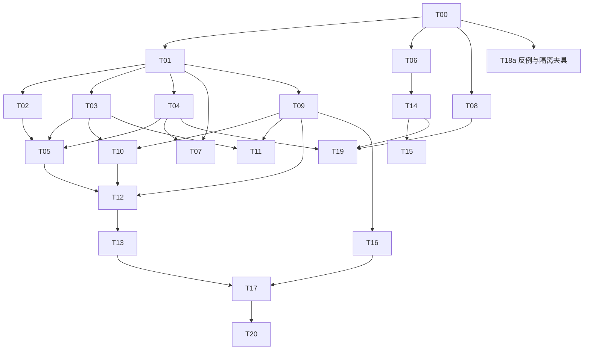

# wiz_ontology_workspace 整改开发任务与验收清单

> 日期：2026-09-24  
> 配套主报告：[01_深度审查与优化路线.md](01_深度审查与优化路线.md)  
> 审查基线：`3f29a226c79fef159539c64dd03a519fd59e9869`。  
> **本文件是开发建议，不代表已获执行、改库、重启服务、创建工作树或合并 main 的授权。**

## 0. 执行前必须确认的边界

已有实现先核对，不能按任务标题再造一遍。尤其解析 v3、Fact 可视化/评测、共享 Finalizer、执行权修复和 MCP 分支，都要检查最新实际代码及独立验收状态。用户提供的历史验收：`6419746` 的首阶段未通过，报告提交 `7ee4cd3`；这是历史输入，不是本文件作者本轮跑出的测试结果。

保留原生本体、项目物理绑定、现有函数编排、SQLite 权威存储、版本固定、人工评审、草稿交付与显式发布。禁止自动改项目映射或执行生成的规则/动作。默认测试只能使用临时数据库、假模型和隔离服务。

主报告的 C01～C30 代码证据与 R01～R15 对标来源是本任务清单的证据目录。此处文件路径是拟修改范围，**“新增建议”明确标出的文件/模块不表示当前已经存在**。

## 1. 优先级、责任和估算

P0：阻断自动构建完整性/默认交付承诺。P1：核心可靠性或交互安全。P2：语义治理、效率和可维护性。每项估算为熟悉代码的工程师人日，不是日历工期；含任务内测试，不含真实业务数据标注与等待外部环境。

| ID | 任务 | 级别 | 建议负责 | 前置依赖 | 估算人日 |
|---|---|---|---|---|---:|
| T00 | 基线、分支与契约差异清单 | P0 | 集成负责人 | 无 | 1～2 |
| T01 | CompletionReport 与完成状态契约 | P0 | 后端/契约负责人 | T00 | 3～5 |
| T02 | 输入/输出容量不静默丢失 | P0 | 后端 | T01 | 3～5 |
| T03 | 解析 v3 验收与接入 | P0 | 后端 | T00、T01 | 2～4 |
| T04 | 共享 Finalizer 与路径等价 | P0 | 后端 | T01 | 4～6 |
| T05 | 预检、交付和报告门禁统一 | P0 | 后端 | T02、T03、T04 | 3～5 |
| T06 | ProjectBinding 异步离开保护 | P1 | 前端 | T00 | 2～3 |
| T07 | 真实阶段、部分结果与进度页 | P1 | 前端 + 后端 | T01、T04 | 2～4 |
| T08 | 恢复失败可见与运行版本健康 | P1 | 后端/集成 | T00 | 3～4 |
| T09 | 类型化协议与渐进检查门禁 | P1 | 契约负责人 | T01 | 4～6 |
| T10 | 显式范围策略与计划预览 | P1 | 全栈 | T03、T09 | 5～8 |
| T11 | 确定性本体输入适配 | P1 | 后端/领域 | T03、T09 | 4～7 |
| T12 | 证据评审与批量操作增强 | P1 | 全栈 | T05、T09、T10 | 4～7 |
| T13 | 变更集、语义差异与影响分析 | P2 | 后端 + 前端 | T09、T12 | 6～10 |
| T14 | 统一导航上下文与图谱行为 | P1/P2 | 前端 | T06 | 5～8 |
| T15 | 设计验收与可访问性覆盖 | P2 | 前端/QA | T14 | 4～6 |
| T16 | 项目纯校验与派生逻辑分离 | P1 | 后端 | T00、T09 | 3～5 |
| T17 | 项目可执行语义快照编译 | P2 | 后端/领域 | T13、T16 | 8～12 |
| T18 | 反例、语义金样与独立验收 | P0/P1 | QA/领域 | T00 启动，分阶段接入 | 5～8 |
| T19 | 性能、故障与资源预算基线 | P2 | 全栈/QA | T04、T08、T14 | 3～5 |
| T20 | 与既有 MCP 的只读消费适配 | P2 | 后端 | T17、T18 的语义试点 | 4～7 |

**估算合计：78～127 工程人日。** 其中 T00～T08 的 G1 核心工作约 23～38 人日，另需 T18a 独立验收投入。已在分支完成的任务按“复用、补测、接入”估算；实际可进一步减少，但不能在未核验前记为零工作量。以上不是三名开发者简单相除得到的日历承诺，关键依赖、领域评审和真实环境可用性仍需排期。

T18 不是最后才做的测试大任务：T18a 在 T00 后提供 G1 的反例夹具；T18b 跟随语义功能补金样；T18c 做独立浏览器/发布验收。各开发任务仍需完成自己的测试，T18 负责跨模块验收与金样。

## 2. 接入顺序与并行限制



允许并行：容量/Finalizer后端、异步 guard 前端、验收夹具三条线。限制并行：同一轮不得多人无协调修改 `pipeline.py`、`App.vue`、共享协议枚举和同一个数据库迁移链。契约先固定、实现后分工，合并由独立集成者完成。

## 3. 任务卡

### T00｜基线、分支与契约差异清单

**目标**：解决“主干待修”和“分支已实现待验收”混在一起的问题。依据主报告第 2 节及 C02。

**输入/范围**：实际仓库状态、最近提交、现有工作树、运行服务版本、数据库迁移状态、02 验收清单和接口文档。读取必须是只读操作；不得终止占用端口的其他进程。

**开发/整理内容**：记录 main SHA、各相关分支 SHA、工作区脏文件、backend/frontend/schema 版本；对每条 F01～F12 记录主干与分支状态；确定接口文档与容量验收的冲突处理；核对任务中的文件路径与当前目录。

**交付**：一份基线矩阵和待接收提交清单；冻结 G1 的完成/部分结果/交付政策。

**验收**：
- [ ] 已有解析 v3、Finalizer、Fact 评测和 MCP 代码都被识别，没有重复建项。
- [ ] 首阶段历史 94/95 被准确写成含环境阻塞的记录，没有改成全绿。
- [ ] 运行服务与代码是否一致有证据；未知明确标 unknown。
- [ ] 未修改真实数据、未越权合并、未代提交其他执行者未提交文件。

### T01｜CompletionReport 与完成状态契约

**目标**：统一“执行结束、完整覆盖、可评审、可交付”四个概念，处理 F01/F04/F07。

**修改范围**：`workbench/ontology_build/` 的协议/任务/持久化模块，`workbench/storage/ontology_build.py`，前端 build 类型和 API 适配。新增建议：独立的 completion 领域模块；优先复用分支已有容量报告。

**实现内容**：定义版本化报告、互斥覆盖计数、losses、stageRecords、finalizerVersion 和 blockers；执行状态与 completeness 正交；report hash 绑定输入/范围/计划/候选/人工决定；报告由服务端产生。

旧任务没有报告时读取为 `unknown`。允许只读评审，不默认回填 complete。若能根据充分的旧记录确定性重建，另行提供显式重新评估操作；不能凭原 `succeeded` 推定。

**验收**：
- [ ] 500 completed + 20 pending = 520 的报告通过结构检查，但 `deliverable=false`。
- [ ] 同一单元不能同时计入 completed 和 blocked；父/子作业不重复计数。
- [ ] 报告所有派生字段可由权威账本复算，前端无法提交一个自行宣称完整的报告。
- [ ] 旧接口兼容已有客户端；新客户端明确展示旧报告未知状态。

**回退**：关闭新展示不删除报告；旧客户端也不能绕过最终交付门禁。安全限制不能随 UI feature flag 一起回退。

### T02｜输入/输出容量不静默丢失

**目标**：修 F01/F02。

**修改范围**：`pipeline.py`、`llm.py`、`output_codec.py`、对应批次执行/计划模块及现有容量测试。代码证据 C19/C23/C24。

**实现内容**：统一输入工作集超限、输出 token 截断、候选数超限、单候选过大四种错误；每种有稳定 code、保留结果策略与下一步动作。净化函数返回接受/拒收/超限的数量与原因，不能只有 accepted 数量。输出超限优先缩小语义目标或拆作业；设置总字节预算以防无界中间结果。

**验收**：
- [ ] 520→500 不再给完整结果；剩余 20 个目标可追踪。
- [ ] 501 个合法候选不无声裁切；测试不能继续期待 500 且成功。
- [ ] `finish_reason=length` 与程序候选上限是两条独立测试。
- [ ] 用户取消后晚到的拆批结果不写入新运行。
- [ ] 费用/调用次数不因重复规划无限增长，预算耗尽后有明确终态。

**回退**：已保存候选保留；禁用新拆分策略时仍保留超限阻断，不恢复“取前 N 条算成功”。

### T03｜解析 v3 验收与接入

**目标**：复用并验收分支已做的数组成员、结构清单与容量信息，不重新造解析器。

**修改范围**：`parsers/json_parser.py`、`parsers/structwalk.py`、解析基础契约、Fact 浏览和评测接线。代码 C20/C21，历史证据 H01。

**实现内容**：固定原始样本哈希与 parserVersion；明确证据原值、snippet、结构摘要、缺口的区别。成员定位和原文访问完整；不同来源身份不可因相同文本被意外去重。大数组支持有界处理、分页和清晰限制。

**验收**：
- [ ] 原始储能样本四条已知问题都能定位到原文，而非只显示数量。
- [ ] 7 个成员、空数组、混合类型、嵌套对象、超深与超大样本都有预期结果。
- [ ] `null`、空串、false、0 不被当成同一种缺失值。
- [ ] 限制/停止原因写入报告；原始总量未知时不编造完整率。
- [ ] 原生导入与通用 JSON 扫描的识别政策明确，不能仅靠文件名猜结构。

**兼容**：旧 Fact 保持旧 parserVersion；重新扫描产生新材料扫描 revision，不在原记录上改定位。

### T04｜共享 Finalizer 与生成路径等价

**目标**：固定和自适应仅是计划方式不同，不应输出不同程度的规范化结果。

**修改范围**：现有分支 Finalizer、`pipeline.py`、候选规范化/合并/引用校验/适配模块和候选存储。代码 C19、历史 H01。

**实现内容**：将收尾输入固定为“已接收候选 + 证据索引 + 运行基线 + 人工状态”；收尾函数可确定性重放。合并以稳定身份/归属为基础，不只靠名字相同；冲突保留双方证据；字段级支持状态不被整体标签掩盖。

**验收**：
- [ ] 同一候选集经两条路径得到相同规范化定义与问题集合。
- [ ] 两个对象各有“功率”属性不会仅因同名被合并。
- [ ] 对象跨批出现、链接端点在不同批次、候选键碰撞均正确处理。
- [ ] 同一输入收尾两次无重复定义、重复审计和漂移 ID。
- [ ] 收尾失败产生 report blocker；不能继续写 succeeded 并将阶段显示为全部完成。

**兼容**：旧候选及人工修改只读保留，重放使用新 finalizerVersion 和新产物版本；不原地污染历史。

### T05｜预检、交付和 CompletionReport 门禁统一

**目标**：保留现有原子交付能力，补完整性和内容版本校验，处理 F01/F02/F04。

**修改范围**：`delivery.py`、`review.py`、交付路由、相关存储事务与前端交付页。证据 C25/C26。

**实现内容**：单一 `evaluate_delivery_eligibility` 供预检和最终事务内重验；令牌绑定 reportHash、材料/范围/计划 revision、候选内容 revision、人工决定 revision 和交付选集。覆盖缺口与依赖缺口一起进入阻断。最终创建草稿、候选映射、收据一次提交。

**验收**：
- [ ] partial / unknown 默认不可交付，伪造客户端状态也无效。
- [ ] 预检后修改名称、类型、端点、纳入决定或范围，旧 token 均不能使用。
- [ ] 同 requestId 重试返回同收据；不同内容不能套同一请求身份绕过校验。
- [ ] 写入中故障无半成品草稿；恢复后可安全重试。
- [ ] 排除依赖对象后仍纳入其属性/链接，返回字段可定位的问题。
- [ ] 未自动发布本体，未自动创建任何项目物理映射。

**策略**：部分结果需要交付时必须显式形成可自洽的子范围与限制声明；不提供通用“忽略所有阻断”开关。

### T06｜ProjectBinding 异步离开保护

**目标**：修复已确认的 Promise 条件误用；不将本任务扩张为全仓 UI 重构。

**修改范围**：`frontend/src/project/ProjectBinding.vue`、相关子编辑器事件与前端测试。证据 C06。

**实现内容**：核对所有 `guardUnsaved()` 调用，等待结果再修改 `selected/detail/editorOpen`；确认与 discard 分离或加上下文保护；单飞导航，避免重复确认；所有调用路径都处理异常与迟到响应。

**验收**：
- [ ] `pick/setDetail/onGotoObject/onGoTabFromEditor/focusType` 等实际存在入口逐项核对。
- [ ] 不把被模板隐藏的按钮当作已复现路径；浏览器至少覆盖一个真实可达的脏表单导航。
- [ ] 选择“继续编辑”后页面对象、页签、草稿和编辑状态不变。
- [ ] 选择放弃后才发生切换；切换前后的 draft 属于正确上下文。
- [ ] 连续点击、等待中切换项目、组件卸载和旧确认返回均无状态污染。
- [ ] 最小语义复现与真实 Vue 事件测试分别记录，不混写为全链路通过。

### T07｜真实阶段、部分结果与进度页

**目标**：处理 F07，继续复用已有目标计数、预算说明和恢复入口。

**修改范围**：`BuildProgressPage.vue`、build 类型/API、服务端 stageRecords。证据 C27。

**实现内容**：阶段直接读取后端记录；显示 `running/completed/failed/skipped/notApplicable`，解释跳过原因。把执行状态与覆盖状态分开；部分结果开放评审和诊断，不开放默认交付。状态提示不能全靠颜色。

**验收**：
- [ ] 总 state 为 succeeded，但 completeness=partial 时不显示完整完成。
- [ ] 缺少某阶段记录时显示未知，不推断 done。
- [ ] 当前目标分母稳定；split 父作业不增加覆盖分母。
- [ ] 中断/失败后已生成候选可查看；取消不暗示已中止外部请求。
- [ ] 轮询失败不清空已展示结果；重进页面恢复正确 task/run 上下文。

### T08｜恢复失败可见与运行版本健康

**目标**：处理 F11 和历史运行版本不一致问题。

**修改范围**：`workbench/server.py`、`runner.py`、健康信息路由/存储状态、前端健康提示。证据 C18/C28/C02。

**实现内容**：关键恢复异常记录结构化错误并设置 degraded；区分阻断任务执行权的错误与可延迟的维护清理错误；展示 backend SHA、frontend build ID、schema version、关键 feature flags，不包含密钥。实际启动策略与现有主程序兼容。

**验收**：
- [ ] stale run 恢复失败时不吞掉异常继续假装完全健康。
- [ ] 新运行是否允许由明确政策控制；手工只读/编辑功能可按安全边界保留。
- [ ] 前端旧构建配新后端、数据库缺迁移都能被诊断。
- [ ] requestId/runId 可串联故障，无原始密钥与敏感材料日志。

### T09｜类型化协议与渐进检查门禁

**目标**：修复 F10 反映的边界薄弱问题，并为后续语义功能提供单一契约。

**修改范围**：Python/TypeScript DTO、`tsconfig.json`、`eslint.config.js`、`package.json`、协议测试。证据 C12/C13/C14。新增建议：契约 schema 目录及生成/一致性检查脚本，位置先由 T00 确认。

**实现内容**：先收敛 Candidate、EvidenceRef、CompletionReport、StageRecord、ValidationIssue。决定 JSON Schema 或 LinkML 等单一源方案；不一次替换所有存储。启用能识别异步误用的类型化规则；为高风险模块建立严格检查子集；旧 `any` 与 props 修改用基线约束新增量。

**验收**：
- [ ] Python 与前端对同一非法 DTO 的接受/拒绝一致。
- [ ] 新增 Promise 布尔误用能被检查阻断。
- [ ] typecheck、lint 和行为测试分开执行并报告。
- [ ] 严格化没有顺便重排全仓或改变已验收业务流程。
- [ ] schema 变更有版本、兼容测试和旧数据读取策略。

### T10｜显式范围策略与计划预览

**目标**：处理 F05，让用户能预见实际处理范围。

**修改范围**：`retrieval.py`、范围任务/接口、`BuildScopePage.vue`、计划预览和测试。证据 C22。

**实现内容**：增加明确范围模式、纳入/排除冲突政策、依赖补入理由和待确认项；输出冻结的 ScopeSnapshot。工作集包含稳定单元 ID 和处置原因；scopeHash 与计划绑定。旧任务维持旧策略，转换需明确动作。

**验收**：
- [ ] strict 模式不会无说明加入所有未命中项。
- [ ] conservative 模式展示补入项及计数，不把补入隐藏在模型侧。
- [ ] 同时命中纳入/排除不会静默套未声明政策。
- [ ] 修改范围后旧计划过期；未保存表单与已确认范围不混淆。
- [ ] 排除对象会展示依赖影响，但不能自动修改用户全部排除选择。

### T11｜确定性本体输入适配

**目标**：已知结构不经一次不必要的模型重建。

**修改范围**：材料识别、原生模型适配、`model_format.py`、导入预检；新增建议：版本化 `InputAdapter` 接口。证据 C15/C20/C21。

**实现内容**：明确支持的原生版本和外部子集；按内容识别并校验；转换输出统一 Candidate/ChangeSet 与 provenance；未知或不支持字段拒绝或列入 lossReport。对普通 JSON 保留通用扫描，不误判成本体。

**验收**：
- [ ] 已知原生本体可在零 LLM 调用下生成等价待确认结果。
- [ ] ID、链接端点、属性类型与共享引用不漂移。
- [ ] 往返测试揭示不支持语义；无静默字段丢失。
- [ ] 导入操作不自动覆盖已有发布版本和项目映射。
- [ ] 不声称支持完整 OWL/RDF，除非该 Profile 的兼容性测试真实通过。

### T12｜证据评审与批量操作增强

**目标**：沿用已有人工修改/合并机制，提高评审效率，而不是推倒旧流程。

**修改范围**：现有 review 页面/接口、`review.py`、Fact 原文定位与 diff 接口。证据 C26，参考 R13/R14。

**实现内容**：候选队列与字段级证据并排；按类型、证据状态、冲突和人工决定筛选；批量操作必须明确 selectedIds 或冻结筛选集；操作包含 revision；合并前展示引用和证据影响。原文不可读时提示不可验证，不缓存成“没有证据”。

**验收**：
- [ ] 批量操作不会影响当前过滤条件以外未选中的候选。
- [ ] 自动纳入与人工确认区分；文本相似不能直接认定等价。
- [ ] 重生成保留人工字段，冲突需明确解决。
- [ ] 合并/撤销后依赖链仍可解释，无悬空端点漏过预检。
- [ ] 大队列翻页/过滤后选集语义稳定，已选数量真实。

### T13｜变更集、语义差异与影响分析

**目标**：本体升级能够解释，而不是只比较两个大 JSON 文本。

**修改范围**：现有版本、引用与发布模块、对象/共享属性/项目关联展示；新增建议：ChangeSet 与 SemanticDiff 服务。证据 C01/C15/C16/C26。

**实现内容**：识别增加、改名、改类型、移动归属、合并、弃用和引用变化；将改名与删后重建区分。影响分析覆盖共享属性、属性来源、链接路径和函数输入输出；项目升级有预览与显式确认。

**验收**：
- [ ] 改名不改变稳定身份；历史发布版本只读。
- [ ] 删除/弃用被引用概念先给影响清单。
- [ ] 发布新本体不会改写固定在旧版本的项目。
- [ ] 升级失败不产生半升级项目；可回到原发布版本。
- [ ] 纯视图坐标变化不会显示成业务本体变更。

### T14｜统一导航上下文与图谱行为

**目标**：处理 F08/F09 的状态分散，保留当前图引擎。

**修改范围**：`App.vue`、`app/navigation.ts`、`saveCoordinator.ts` 的调用边界、`LegacyGraphHost.vue`、图编辑器桥接和工作区控制器。证据 C03/C04/C05/C08/C09。

**实现内容**：建立类型化 Location；移除依赖 DOM 文本/选中类恢复业务位置的路径；模块级选择记忆按账号/项目/版本分域。逐步把图谱的确认、提示和业务写入接到统一行为契约，保持撤销/重做含义不变。

**验收**：
- [ ] 设置页返回恢复准确对象/页签，不靠当前中文按钮文字猜位置。
- [ ] 切账号/项目不沿用错误上下文；选中态不构成跨账号读取许可。
- [ ] 图布局/缩放不污染业务 dirty；图谱编辑与表单编辑使用同一保存冲突政策。
- [ ] 浏览器返回、深链接、重载与旧请求晚到都可复现验证。
- [ ] 不新增第二个图引擎，不恢复已删除旧画布代码。

### T15｜设计验收与可访问性覆盖

**目标**：把现有设计规范真正覆盖到关键业务旅程。

**修改范围**：`DESIGN.md`、`design.qa.yaml`、共享 UI 和 legacyGraph 样式/弹窗桥接、截图/无障碍测试。证据 C10/C11/C30。

**实现内容**：增加材料、范围、生成、评审、映射和发布场景；三档桌面视口与 200% 缩放；旧图谱豁免逐项登记，设置退出条件。先校验行为再统一视觉，避免只为通过检查改颜色。

**验收**：
- [ ] 视觉比较与无障碍检查实际运行，不只是配置文件存在。
- [ ] 键盘可以完成核心表单旅程；危险弹窗焦点与取消行为正确。
- [ ] 长中文、长文件名、错误态和空态可读，无操作按钮被遮挡。
- [ ] 状态有文字/图标辅助，不仅用红绿颜色。
- [ ] 每个残留豁免有责任人和可验证的关闭条件。

### T16｜项目纯校验与派生逻辑分离

**目标**：处理 F12 中已标注的校验副作用，给快照编译提供稳定输入。

**修改范围**：`project_validation.py`、`project_mapping` 相关派生函数与校验调用方。证据 C16。

**实现内容**：以既有金样锁定输出；将 `derive_display_names` 等派生变更移到显式 normalize 或视图层；validator 输入只读。保留 unreadable/missing/unknown 等依赖状态区别，不顺手把错误降级成 warning。

**验收**：
- [ ] 校验前后输入哈希一致；重复校验输出稳定。
- [ ] 原有业务错误/警告集合不无理由减少。
- [ ] 连接目录不可读不会被当作空目录；失效编排阻断规则不退化。
- [ ] 未删除、迁移或补写用户原配置。

### T17｜项目可执行语义快照编译

**目标**：将本体语义、项目绑定与既有执行契约编译为可解释读模型。

**修改范围**：本体/项目版本读取、物理绑定与既有 flow/函数依赖服务。新增建议：`semantic_snapshot` 编译模块与版本化 DTO；具体目录与已开发 MCP 分支对齐。证据 C15/C16。

**实现内容**：快照包含固定版本、实例身份、属性形状、来源或既有执行器引用、必填输入、单位、时间、关联/聚合和错误政策；形成依赖 DAG 与能力缺口清单。相同版本输入得到相同规范化快照哈希。凭据仅引用，不进入快照内容。

**验收**：
- [ ] 字段属性和函数编排属性均可编译，并可解释源头。
- [ ] 无表登记对象、关联聚合和既有链接策略按实际支持范围验证。
- [ ] 未发布项目、失效依赖、缺时间规则等产生明确缺口，不猜默认值。
- [ ] 相同版本重复编译幂等；本体/项目/编排变化导致版本明确变化。
- [ ] 不在编译时查询真实业务数据或执行动作；可选只读验证须单独授权。

**接口草案（新增建议，不是当前路由）**：提供“获取快照”“解释属性”“列出能力缺口”三个应用服务，HTTP/MCP 适配均调用同一服务。是否采用 REST 路径由 T00 的接口基线决定，避免另起与既有风格冲突的端点。

### T18｜反例、语义金样与独立验收

**目标**：测试验证业务承诺，而不是只验证实现没抛异常。

**修改范围**：既有 `tests/run.py` 分组和相关测试、隔离夹具、人工金样、浏览器验收材料。证据 C29、历史 H01。

**T18a：G1 反例**：520/500、501候选、数组成员、双路径收尾、旧结果晚到、预检后修改、取消留在原地。错误正向测试必须反转，不保留两套互相冲突的断言。

**T18b：语义金样**：由领域专家标注对象/属性/关系、排除项、证据位置、同义与非同义对；固定样本版本。评测结构覆盖与语义召回分别计算，记录模型/provider/prompt/codec 配置。

**T18c：独立验收**：真实浏览器旅程、发布/升级/恢复故障注入、一个项目的可解释问数场景。开发者自测不替代独立验收。

**验收**：
- [ ] 使用现有测试入口；没有以零测试通过代替结果。
- [ ] 端口/外部服务阻塞单列 blocked，测试报告保留命令与退出码。
- [ ] 本轮运行结果与历史结果分栏记录。
- [ ] 提供每项 P0 的反例证据和修复后证据。
- [ ] 明确没有测到的路径，不用全量 build 替代浏览器验收。

### T19｜性能、故障与资源预算基线

**目标**：在宣称支持大材料、大本体之前给出测量边界。

**修改范围**：压测夹具、解析/存储/队列统计、前端加载/图布局分析。证据 C03/C04/C09/C17/C28。

**实现内容**：建立小/中/大三档样本，记录硬件、构建、数据版本；测扫描峰值内存、任务规划、保存、列表与图布局；故障注入覆盖数据库繁忙、恢复错误、provider 暂时故障。按实测决定懒加载、虚拟列表、分页与流式解析，不先重写全部数据层。

**验收**：
- [ ] 有原始结果和可重跑命令，而非凭感觉说“更流畅”。
- [ ] 输入资源上限与对用户的限制说明一致。
- [ ] 性能优化不破坏保存顺序、撤销、revision 和身份校验。
- [ ] 队列/内存/输出预算有上限，超限可诊断且可恢复。

### T20｜既有 MCP 的只读消费适配

**目标**：让智能问数消费快照和现有执行能力，不再建第二套映射/执行语义。

**修改范围**：实际 MCP 分支中的适配入口，T17 的应用服务与既有只读执行器。确切文件由 T00 发现，禁止凭本清单虚构目录。

**实现内容**：接入列能力、解释属性/计划、执行受支持只读查询、返回 provenance 和数据版本。缺能力要拒绝并说明；动作执行与只读查询分开权限。统一单位、时间窗、聚合政策与错误码。

**验收**：
- [ ] UI 与 MCP 对相同项目版本、属性和参数给出同一执行计划。
- [ ] 不允许模型临时猜表、猜字段或另生成未经批准的物理映射。
- [ ] “园区 A 当前平均 SOC”能解释成员范围、读数时间与平均口径；缺定义时返回缺口。
- [ ] 返回结果附本体/项目/快照/执行器版本与来源说明。
- [ ] 非只读动作不因问数工具权限而可调用；密钥不进入模型上下文。

## 4. 验收矩阵：不能删减的阻断用例

| ID | 测试场景 | 通过标准 | 责任任务 |
|---|---|---|---|
| CAP-01 | 输入 520 个单元，仅处理 500 | partial、pending=20、不可默认交付 | T01/T02/T05 |
| CAP-02 | 501 个合法候选 | 明确超限或完整中间处理，无声丢失=0 | T02 |
| CAP-03 | 模型长度截断 | 不当作完整 JSON 成功，允许有界拆分 | T02 |
| PARSE-01 | 7 个数组成员 | 成员与原值可定位 | T03 |
| PARSE-02 | null/false/0/空串/空数组 | 正确保留各自含义 | T03 |
| PARSE-03 | 大数组/深层结构达到预算 | 报告限制，不能伪造完整率 | T03/T19 |
| FINAL-01 | 两条路径相同模拟候选 | 规范化定义与问题集合等价 | T04 |
| FINAL-02 | 不同对象同名属性 | 不误合并 | T04 |
| FINAL-03 | 收尾重试 | 幂等，无重复或 ID 漂移 | T04 |
| GATE-01 | partial/unknown 报告 | 服务端拒绝默认交付 | T05 |
| GATE-02 | 预检后编辑内容/决定 | 原 token 失效 | T05 |
| GATE-03 | 交付事务中故障 | 无半成品，可安全重试 | T05 |
| SCOPE-01 | 同时纳入/排除 | 显式策略与理由 | T10 |
| SCOPE-02 | 范围变更但旧计划仍在 | 旧计划/门禁过期 | T10 |
| UI-01 | 脏表单取消导航 | 原对象、页签、草稿保持 | T06 |
| UI-02 | 连续导航/迟到确认 | 不重复弹窗、不串上下文 | T06/T14 |
| UI-03 | 总 succeeded 但 partial | 不显示完整完成 | T07 |
| UI-04 | 未执行阶段 | skipped/unknown，有解释 | T07 |
| UI-05 | 图布局变化 | 不产生业务 dirty | T14 |
| UI-06 | 设置返回/深链接/重载 | 恢复准确上下文 | T14 |
| UI-07 | 键盘/缩放/长中文 | 核心操作可完成 | T15 |
| RESUME-01 | 取消后旧 worker 返回 | 不写当前有效运行 | T02/T08 |
| RESUME-02 | 启动恢复失败 | degraded 可见，执行政策安全 | T08 |
| PURE-01 | 重复项目校验 | 输入哈希不变，输出稳定 | T16 |
| VERSION-01 | 新本体发布 | 旧项目固定引用不变 | T13 |
| SNAP-01 | 相同发布基线重复编译 | 相同规范化快照哈希 | T17 |
| SNAP-02 | 缺单位/时间/执行依赖 | 明确能力缺口，无猜测 | T17/T20 |
| SECURITY-01 | 跨账号读取构建证据/快照 | 拒绝访问，不通过内容哈希绕过权限 | T05/T17 |
| SECURITY-02 | 材料含工具调用指令 | 仅作数据，不触发动作执行 | T02/T20 |

每条记录 `pass/fail/blocked/not-run`，附运行版本和证据；不得把 blocked 和 not-run 合并到 pass。

## 5. 数据与接口兼容策略

### 5.1 迁移原则

新增字段与表优先前向兼容；新枚举必须有旧客户端读取策略。对已有报告缺失数据使用 unknown。迁移不修改原始材料、历史事实定位和已发布版本；数据库变更走现有迁移链，不手工改真实库补列。

旧生成任务可以只读查看；需要新报告的任务显式重新评估/生成。不得为了迁移成功而删除旧候选、人工决定和交付收据。

### 5.2 建议的新概念及归属

| 概念 | 权威归属 | 必须绑定 |
|---|---|---|
| SourceRevision | 材料存储 | owner、hash、原文、来源版本 |
| EvidenceAtom | 解析产物 | material revision、parserVersion、locator |
| ScopeSnapshot | 任务服务 | scope revision、模式、选择及理由 |
| TargetPlan | 计划服务 | scopeHash、目标身份、预算、计划版本 |
| CompletionReport | 完成判定服务 | 上述基线、losses、阶段和覆盖 |
| ChangeSet | 评审/版本服务 | 基线、操作、人工决定、证据 |
| SemanticSnapshot | 项目编译服务 | 本体/项目/执行器固定版本与依赖 |

这些是设计概念，可以映射到现有表/JSON 列。不要机械地每个概念都创建微服务。

### 5.3 错误码建议

`COVERAGE_INCOMPLETE`、`COMPLETENESS_UNKNOWN`、`CANDIDATE_LIMIT_EXCEEDED`、`OUTPUT_TRUNCATED`、`SCOPE_STALE`、`REVIEW_STALE`、`FINALIZER_INCOMPLETE`、`DELIVERY_TOKEN_STALE`、`RECOVERY_DEGRADED`、`SEMANTIC_CAPABILITY_MISSING`。

先核对并复用现有同义错误码；禁止制造两套代码表达同一错误。HTTP 状态遵循仓库既有契约，前端依据稳定 code 决定操作，不匹配中文异常字符串。

## 6. 推荐验收命令与环境纪律

以下是仓库已有入口或基于其结构的执行建议，**本轮没有运行这些仓库命令**。需在经用户授权的实际工作区执行；先完成 T00 并核对命令仍适用。

```bash
# 当前工作区与版本（只读）
git status --short
git rev-parse HEAD

# 既有隔离测试入口；不要直接用 pytest 替代整个测试体系
python3 tests/run.py --list
python3 tests/run.py all

# 前端分开报告类型、lint 和构建
cd frontend
npm run typecheck
npm run lint
npm run build
```

集成测试需临时 `WIZ_WORKBENCH_ROOT` 与独立数据库，遵循 `tests/run.py` 的环境清理策略；各测试自行设置隔离环境，不从用户 shell 继承真实连接。动态端口由测试夹具管理，不能擅自 kill 用户正在用的服务以让测试变绿。

真实 MySQL、真实模型和真实浏览器服务属于明确授权的后续验收。外部依赖缺失时报告 blocked，不应通过临时放宽断言取得绿色结果。

## 7. 分阶段签收表

| 门禁 | 必须满足 | 不可替代证据 |
|---|---|---|
| G0 | 基线和分支状态明确 | 实际 SHA、脏文件和运行版本清单。 |
| G1 | 容量真实、收尾统一、门禁有效、取消安全 | CAP/FINAL/GATE/UI-01/RESUME 的具体反例回归。 |
| G2 | 范围/输入/评审/语义契约稳定 | 冻结范围、确定性往返、人工金样与 revision 测试。 |
| G3 | 工作台交互一致且可用 | 完整浏览器旅程、截图、键盘/缩放与性能基线。 |
| G4 | 一个项目只读问数闭环 | 可重复执行计划、快照版本与业务口径解释。 |

G1 未过不得因 G3 页面好看宣布整改完成。G4 不应反向放宽 G1 的交付和证据要求。

## 8. 给 coding harness 的任务模板

下面模板需要填入明确任务号后使用；不要让多个执行者同时按整份总方案自由改仓库。

```text
执行任务：Txx（仅此任务）。
先读取已授权工作区的 AGENTS/协作规则、当前提交和相关接口契约。
核对该任务是否已在其他分支实现；已有实现先复用/验证，避免重复开发。
严格限制在任务卡定义的文件与行为范围；涉及共享协议先与集成负责人对齐。
不得改变本体/项目双边界，不得自动发布，不得生成/覆盖物理映射。
仅使用临时数据根、假模型和隔离测试，不操作用户真实数据库或服务。
交付：修改列表、契约/迁移说明、自动测试结果、必要浏览器证据、已知限制。
不把编译通过当成功能验收，不把历史测试结果当本轮结果。
未经用户明确授权，不创建新工作树、不重启真实服务、不合并 main。
```

## 9. 完成定义

一个任务完成，意味着：代码实现符合已冻结契约；旧数据可读；关键反例通过；行为/浏览器证据符合风险级别；无未说明副作用；独立验收者给出可复核结论。

**“已提交”“已 build”“页面能打开”“模型返回了 JSON”都只是过程状态，不是这套工作台的最终完成定义。**
