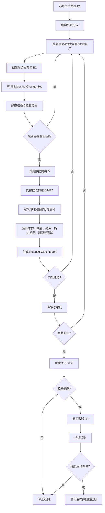
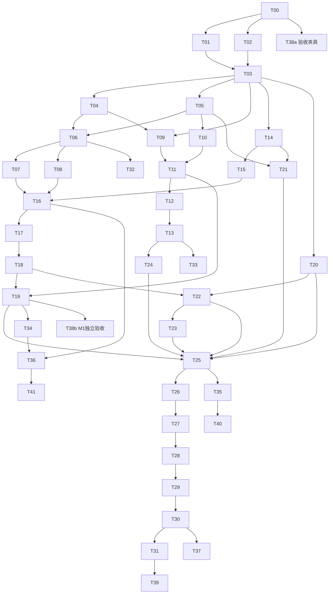

# 本体与项目映射版本迭代测试发布治理——完整需求、开发任务与验收方案

> 项目：`wiz_ontology_workspace`  
> 文档版本：V1.0  
> 日期：2026-09-25  
> 本文件为三份配套文档的单文件合订版。

---

# 第一部分：需求规格说明书


## 0. 文档定位与实施边界

本文定义一套面向生产环境的本体演进能力，用于解决：第一版本体及项目映射已经在线运行后，新业务导致本体、映射、规则或数据源契约变化，如何在发布前自动验证计划内变化、阻断计划外变化，并在发布异常时快速回滚。

本文是**目标需求**，不是对当前仓库已具备能力的陈述。实施前必须执行开发任务 T00，对主干、现有分支、数据库迁移、自动构建能力和已有版本能力进行基线核验。已有能力优先复用，禁止仅凭本文模块名重复建设。

本文默认沿用当前工作台的基本技术边界：

- 后端以 Python 领域模块和 HTTP API 为主；
- 前端以 Vue 工作台为主；
- SQLite 继续作为本地优先场景的权威元数据存储；
- 本体采用项目原生业务模型，同时允许接入 RDF/OWL、SHACL、SPARQL、ROBOT 等外部校验工具；
- 生产发布不能依赖大模型给出“通过/不通过”结论；大模型只能用于生成建议、解释差异或辅助编写测试，发布门禁必须由确定性程序执行。

---

## 1. 背景与问题定义

### 1.1 典型场景

生产环境已经存在：

```text
本体 O1
项目映射 M1
规则/函数 R1
源数据契约 S1
生产图谱 G1
下游消费者 C1...Cn
```

新业务提出以下一种或多种修改：

- 新增、删除、重命名对象类型；
- 修改对象继承关系；
- 新增或修改属性、数据类型、单位、基数、必填性；
- 新增或修改关系、端点、方向、逆关系；
- 修改业务主键、去重规则、来源表、来源字段、过滤条件；
- 修改转换函数、函数编排、规则、动作；
- 修改源数据结构或数据质量约束；
- 修改查询、报表、API、智能问数、动作等下游消费方式。

修改后希望发布：

```text
本体 O2
项目映射 M2
规则/函数 R2
源数据契约 S2
候选图谱 G2
```

系统必须回答：

1. 哪些资源被直接修改？
2. 哪些资源被传递影响？
3. 哪些实例节点、边、属性、推理结果和下游行为应该变化？
4. 哪些变化属于未声明的意外变化？
5. 未受影响资源是否保持兼容？
6. V2 是否允许发布？
7. 发生异常后是否可以原子回退到 V1？

### 1.2 当前常见误区

以下方式均不足以支撑生产发布：

- 只比较两个本体 JSON/OWL 文件；
- 只检查本体能否解析；
- 只看节点总数是否相同；
- 只测试手工修改过的几个节点；
- 直接在生产图上运行新映射，再人工抽查；
- 本体和项目映射分别发布；
- 将模型作业成功误认为版本完整、语义正确、可发布；
- 依靠人工勾选“我确认风险”绕过主键变化、批量删除等高风险错误。

---

## 2. 建设目标

### 2.1 总目标

建设一套“分支修改—影响分析—同数据双跑—语义差分—自动化测试—审批—灰度/激活—回滚”的版本治理闭环，使每次生产发布都能形成机器可复算、人工可审查、结果可追溯的测试证据。

### 2.2 可验证承诺

系统不承诺脱离边界条件的“绝对没有影响”，而应提供以下有界保证：

```text
给定：
- 固定数据快照 D；
- 明确的基线发布包 B1；
- 候选发布包 B2；
- 固定执行引擎及版本；
- 已登记的消费者与测试资产；

G1 = Build(B1, D)
G2 = Build(B2, D)

要求：
1. ActualDiff(G1, G2) 被 ExpectedChangeSet 完整解释；
2. UnexpectedDiffCount = 0；
3. MissingExpectedDiffCount = 0，或由明确政策接受；
4. 所有受保护资源的可观察行为保持兼容；
5. 所有阻断级测试通过；
6. 发布包具备已验证的回滚点。
```

### 2.3 业务目标

- 降低本体和映射变更引发生产图谱回归的概率；
- 将“是否可发布”从个人经验判断转为确定性门禁；
- 为评审人提供可理解的影响范围和图谱变化；
- 支持问题快速定位到本体定义、映射、源字段、转换函数或消费者；
- 支持项目级、租户级或对象类型级灰度；
- 保留旧版本和测试证据，满足审计与追责需求；
- 为后续智能问数、规则执行和项目交付提供稳定语义契约。

### 2.4 非目标

首期不包括：

- 自动替业务负责人决定一个语义变化是否合理；
- 自动执行高风险数据迁移并跳过人工评审；
- 自动把大模型生成的规则直接发布到生产；
- 取代完整的数据仓库、图数据库或 CI 平台；
- 强制将全部原生业务本体重写为 OWL；
- 对未登记、无法观测的所有外部消费者做无限范围兼容保证；
- 在没有相同数据快照的情况下对两个生产时点做强归因。

---

## 3. 核心术语

| 术语 | 定义 |
|---|---|
| Ontology Version | 不可变的本体定义版本，包含对象、属性、关系、约束、规则元数据等。 |
| Mapping Version | 不可变的项目映射版本，包含身份、属性、关系、过滤、函数和来源配置。 |
| Release Bundle | 一次发布的原子组合，绑定本体、映射、源契约、规则、约束、测试资产和执行器版本。 |
| Baseline Bundle | 当前生产激活或用户选择作为比较基线的发布包。 |
| Candidate Bundle | 待测试、待审批、待发布的候选发布包。 |
| Expected Change Set | 发布者在测试前声明的计划内变化及允许范围。 |
| Actual Change Set | 系统根据定义差分、映射差分和双构建图差分计算出的实际变化。 |
| Unexpected Change | 实际发生但未被预期变更规则覆盖的变化。 |
| Missing Expected Change | 已声明应该发生，但实际没有发生的变化。 |
| Direct Impact | 被本次修改直接命中的定义、映射、函数、约束或消费者。 |
| Transitive Impact | 通过依赖关系传播后可能受影响的资源。 |
| Protected Resource | 影响分析判断不应变化，或被用户显式保护的资源。 |
| Data Snapshot | 可重复读取、内容有校验和的固定输入数据集合。 |
| Baseline Graph / Candidate Graph | 使用相同快照分别由基线包和候选包构建的图谱结果。 |
| Semantic Fingerprint | 对节点或分区的身份、类型、属性、关系和推理结果规范化后生成的稳定摘要。 |
| Competency Question | 用自然语言描述、以确定性查询执行的核心业务问题。 |
| Consumer Contract | API、报表、查询、动作、智能问数等消费者依赖的结构和行为约束。 |
| Release Gate | 汇总所有测试、差异、审批和回滚条件后生成的发布判定。 |
| Activation | 将通过审批的发布包切换为生产读取或执行的当前版本。 |

---

## 4. 用户角色与权限

### 4.1 角色

| 角色 | 主要职责 |
|---|---|
| 领域建模者 | 修改本体定义，说明业务语义和预期变化。 |
| 项目实施工程师 | 修改项目映射、源字段、转换函数和关系绑定。 |
| 测试工程师 | 维护映射样例、能力问题、SHACL、消费者契约和故障夹具。 |
| 发布负责人 | 创建发布包、选择基线、发起测试、处理阻断项。 |
| 评审人 | 审阅差异、风险、测试证据和迁移计划。 |
| 生产管理员 | 执行灰度、激活、回滚和紧急冻结。 |
| 审计人员 | 只读查看版本、审批、测试报告和操作日志。 |

### 4.2 权限原则

- 创建和编辑草稿不等于拥有发布权限；
- 修改者不能作为唯一审批人批准自己的重大版本；
- 高风险例外必须由具备专门权限的角色发起，并且不能覆盖禁止绕过项；
- 激活和回滚必须有幂等请求 ID；
- 所有下载、导出、审批、激活和回滚均写审计日志；
- 敏感源数据快照默认只显示摘要，不在报告中泄露原始值；
- 测试运行服务账号采用最小权限，不得访问与测试无关的生产数据。

---

## 5. 产品不变量与强制业务规则

以下是不允许由前端自行推断或绕过的服务端不变量：

1. **不可变版本**：已创建的本体版本、映射版本、测试资产版本不得原地修改；修订产生新版本。
2. **原子发布**：生产激活的单位必须是 Release Bundle，而不是单独本体或单独映射。
3. **基线固定**：测试开始后，基线包、候选包、快照、执行器和测试包均锁定；任何变化必须创建新 Test Run。
4. **先声明再测试**：Expected Change Set 在测试运行开始后不可原地修改；修改后必须重新计算影响和重新测试。
5. **同数据双跑**：强差分必须在同一快照和同一归一化规则下生成 G1/G2。
6. **身份稳定优先**：业务主键和节点稳定 ID 的未声明变化一律阻断。
7. **未声明变化为零**：默认 `unexpectedChangeCount == 0` 才允许进入审批。
8. **部分完成不等于可发布**：任一必要阶段存在未处理单元、截断或未知覆盖时，默认 `deliverable=false`。
9. **服务端重验**：审批令牌、门禁结果和激活资格必须在最终事务内重验，不能相信前端状态。
10. **回滚点必需**：没有可用且完成演练的回滚点，不允许生产激活。
11. **历史证据不可覆盖**：历史测试结果、差异和审批记录只追加，不原地改写。
12. **禁止万能忽略**：主键变化、计划外删除、逻辑不一致、保护资源漂移、关键消费者失败不可由普通“确认风险”绕过。

---

## 6. 总体业务流程



### 6.1 发布状态机

```text
DRAFT
  → STATIC_VALIDATING
  → IMPACT_ANALYZED
  → SNAPSHOT_READY
  → BUILDING_BASELINE
  → BUILDING_CANDIDATE
  → DIFFING
  → TESTING
  → TESTED
  → IN_REVIEW
  → APPROVED
  → CANARY
  → ACTIVE
  → SUPERSEDED

失败/终止分支：
REJECTED | FAILED | CANCELLED | ROLLED_BACK | FROZEN
```

状态规则：

- 状态迁移由后端命令执行，前端不可任意赋值；
- `TESTED` 只表示测试执行完成，不自动表示门禁通过；
- `APPROVED` 必须绑定确切的 Gate Report hash；
- 任何会改变包内容、预期变更或测试资产的操作都会使既有审批失效；
- `ACTIVE` 版本不可编辑，只能被新版本替代或回滚；
- `ROLLED_BACK` 必须记录目标版本、原因、操作者和验证结果。

---

## 7. 功能需求

## FR-01 本体与映射不可变版本

### 需求说明

系统必须为本体、项目映射、规则/函数、约束和测试资产分别建立不可变版本，并记录来源草稿、创建人、创建时间、父版本、内容哈希和兼容级别。

### 功能点

- 从草稿创建版本；
- 从已发布版本创建分支草稿；
- 显示父子版本关系；
- 内容完全相同的重复提交可去重或明确提示；
- 稳定资源 ID 与展示名称分离；
- 支持 `deprecated`、`supersededBy` 和迁移说明；
- 版本内容可导出并进行校验和验证；
- 历史版本只读；
- 删除只能标记归档，不物理删除仍被发布包引用的版本。

### 版本兼容分类

- PATCH：标签、描述、展示元数据变化，不改变实例或消费者行为；
- MINOR：新增可选能力，旧消费者无需修改；
- MAJOR：删除/重命名稳定 ID、修改主键、数据类型、关系语义、约束或映射行为。

系统应给出自动分类建议，但最终分类需要评审确认；若人工降级版本级别，必须记录理由。

---

## FR-02 统一变更分支

### 需求说明

一个变更分支必须能同时承载本体、映射、规则、约束和测试资产的候选修改，避免各模块独立修改后在发布阶段才发现不兼容。

### 功能点

- 从指定 Baseline Bundle 创建分支；
- 分支记录基线 hash 和创建时版本；
- 支持 rebase 到更新的生产基线；
- 检测同一稳定资源的字段级冲突；
- 对无冲突资源自动合并；
- 冲突必须人工选择或重建，禁止静默覆盖；
- 分支可预览，但不可被生产消费者默认访问；
- 分支关闭前保留完整审计历史。

### Rebase 后置要求

rebase 成功后，已有影响分析、测试和审批全部失效，必须重新执行。

---

## FR-03 Release Bundle 原子发布包

### 需求说明

Release Bundle 是生产发布的唯一单位，至少包含：

```yaml
releaseBundle:
  id: energy-prod-2.3.0
  projectId: energy-project
  baselineBundleId: energy-prod-2.2.1
  ontologyVersionId: ontology-2.3.0
  mappingVersionId: mapping-2.3.0
  sourceContractVersionId: source-7
  ruleVersionId: rules-2.3.0
  constraintVersionId: constraints-2.3.0
  testPackVersionId: tests-2.3.0
  executionEngineVersion: build-engine-1.8.4
  canonicalizationVersion: canonical-v1
  expectedChangeSetId: change-20260925-001
```

### 功能点

- 创建、复制、校验和归档发布包；
- 检查所有引用版本存在且属于同一项目/兼容范围；
- 不允许发布包中出现可变草稿引用；
- 显示与基线包的资源版本差异；
- 计算 bundle hash；
- 一旦进入测试，资源版本固定；
- 资源变化时派生新候选包，不覆盖原包。

---

## FR-04 Expected Change Set 预期变更清单

### 需求说明

发布负责人必须在测试前声明允许和期望发生的变化。系统同时提供结构化编辑器和 YAML/JSON 高级编辑模式。

### 支持的变更类型

- 本体定义：新增、修改、废弃、删除；
- 映射：新增、修改、停用；
- 节点：允许新增/删除/身份迁移；
- 属性：允许指定字段变化；
- 边：允许新增/删除/端点迁移；
- 推理类型：允许新增/减少；
- 数量预算：按对象类型、映射、数据源设置上下限；
- 查询结果：允许完全相等、只新增、容差、schema 兼容；
- 性能预算：允许的 P95/P99 变化；
- 权限变化：允许的授权范围变化；
- 迁移表：旧 ID 到新 ID 的一对一、一对多或多对一规则。

### 示例

```yaml
expectedChangeSet:
  version: 1
  rationale: 新增额定功率并切换 SOC 来源字段
  ontology:
    addedProperties:
      - objectType: StorageDevice
        property: ratedPower
        required: false
    modifiedProperties:
      - objectType: StorageDevice
        property: soc
  mappings:
    modified:
      - storage-device-soc
  graphRules:
    - selector:
        objectType: StorageDevice
      allowedPropertyChanges: [ratedPower, soc]
      allowIdentityChange: false
      allowEdgeRemoval: false
  protectedSelectors:
    - objectType: Site
    - objectType: StorageSystem
  countBudgets:
    StorageDevice:
      added: {min: 0, max: 0}
      removed: {min: 0, max: 0}
  forbidden:
    - UNDECLARED_IDENTITY_CHANGE
    - UNDECLARED_EDGE_REMOVAL
```

### 规则

- 测试运行开始后清单被冻结；
- 清单修改产生新 revision 和新测试运行；
- 允许规则必须尽量窄，通配全图需要高权限并明确审计；
- “允许变化”不等于“变化必须发生”，是否必须发生由 `required=true/false` 控制；
- 规则冲突时使用更严格规则；
- 规则匹配结果必须可解释到具体规则 ID。

---

## FR-05 定义差分与兼容性分类

### 需求说明

系统必须分别计算本体、映射、源契约、规则和测试资产差分，避免只输出文本 diff。

### 本体差分

至少覆盖：

- 对象类型新增、删除、重命名、稳定 ID 变化；
- 父类、子类和多继承变化；
- 属性归属、类型、单位、必填性、默认值、基数、枚举变化；
- 关系起点、终点、方向、逆关系、传递性变化；
- 规则、动作、约束和说明变化；
- 资源废弃与替代关系。

### 映射差分

至少覆盖：

- 源连接、表、字段；
- 业务主键和节点 ID 生成规则；
- 字段转换、单位换算、默认值；
- 过滤、去重、聚合、关联条件；
- 关系端点映射；
- 函数/编排版本；
- 增量游标、时间窗口和删除策略。

### 兼容性级别

```text
NON_BREAKING
POTENTIALLY_BREAKING
BREAKING
UNKNOWN
```

自动分类需要给出规则 ID 和解释，不允许只有颜色或分数。

---

## FR-06 资源依赖图与影响分析

### 需求说明

系统必须维护跨本体、映射、函数、数据源、约束、查询和消费者的依赖图，并从直接变更计算传递影响闭包。

### 依赖边类型

- 对象类型 `inheritsFrom` 对象类型；
- 属性 `domainOf/rangeOf` 对象类型；
- 关系 `sourceType/targetType` 对象类型；
- 映射 `produces` 对象/属性/关系；
- 映射 `reads` 表/字段；
- 映射 `calls` 函数；
- 约束 `validates` 对象/属性/关系；
- 查询/报表/API `consumes` 语义资源；
- 动作/规则 `reads/writes` 属性或关系；
- 实例分区 `producedBy` 映射。

### 输出

- 直接变化资源；
- 传递影响资源；
- 受保护资源；
- 影响路径；
- 影响消费者；
- 建议运行的测试集合；
- 影响置信度与未知依赖。

### 规则

- 影响分析必须版本化；
- 未登记消费者标记为治理缺口，而不是默认“无影响”；
- 允许用户补充保护范围，但不能缩小系统推导的必要影响范围；
- 图谱实例影响可先按对象类型、映射和分区估算，双构建后再用实际差分确认。

---

## FR-07 数据快照与可重复构建

### 需求说明

系统必须支持创建固定数据快照，并保证基线和候选构建读取完全相同的数据内容。

### 快照类型

- 小规模内嵌样例快照；
- 数据库一致性快照；
- 文件/对象存储清单快照；
- 基于时间点和增量日志的逻辑快照；
- 脱敏生产样本；
- 合成边界数据集。

### 快照元数据

- 快照 ID、项目、来源；
- 表/文件/分区清单；
- 行数、字节数、schema hash；
- 内容校验和或分区校验和；
- 创建时间、创建方式、保留期限；
- 脱敏策略；
- 是否可重放；
- 权限范围。

### 规则

- 基线和候选构建必须引用同一 snapshot ID；
- 快照内容变化必须产生新快照 ID；
- 无法冻结的数据源必须进入影子双写模式，不能假装完成强差分；
- 快照读取失败、分区缺失或校验和不一致时测试失败；
- 快照保留期限不得短于发布证据要求；
- 报告默认只显示摘要和受控样例。

---

## FR-08 双版本构建与执行隔离

### 需求说明

系统必须在隔离空间中分别构建 Baseline Graph G1 和 Candidate Graph G2。

### 要求

- 使用相同的数据快照；
- 使用显式记录的执行器版本；
- 构建输出写入独立命名空间；
- 支持全量与增量构建；
- 构建过程幂等；
- 失败重试不能生成重复节点/边；
- 记录每个节点和边的来源映射、来源记录和构建运行；
- 输出覆盖报告，区分成功、失败、跳过、截断和未知；
- 任何未处理单元都必须导致 `completeness != complete`；
- 支持取消，但要区分“停止接收结果”和“底层任务已真正终止”。

### 构建结果

```yaml
buildResult:
  state: succeeded | failed | cancelled
  completeness: complete | partial | unknown
  graphSnapshotId: graph-candidate-001
  inputUnits: 100000
  completedUnits: 100000
  failedUnits: 0
  skippedUnits: 0
  truncatedUnits: 0
  blockers: []
```

`state=succeeded` 且 `completeness=partial` 仍然不可发布。

---

## FR-09 图谱规范化、差分与语义指纹

### 需求说明

系统必须将 G1/G2 转为与序列化顺序无关的规范化表示，再进行节点、属性、边、显式类型和推理类型差分。

### 节点规范化

至少包含：

```json
{
  "stableId": "storage-device:ES-001",
  "assertedTypes": ["StorageDevice"],
  "inferredTypes": ["Asset", "Equipment"],
  "properties": {
    "name": "1号储能柜",
    "siteId": "SITE-01"
  },
  "outgoingEdges": [
    ["belongsTo", "storage-system:SYS-01"]
  ],
  "incomingEdges": []
}
```

### 规范化规则

- 对集合、属性键和边排序；
- URI、数字、时间、布尔值、null 按固定规范编码；
- 区分缺失、null、空串、0、false；
- 排除明确声明为非语义的运行字段，如 `updatedAt`、run ID；
- 浮点值按属性定义的精度处理；
- 大文本可保存摘要，但差异下钻需可访问原始值；
- 规范化算法自身需要版本号。

### 差分类型

- 节点新增/删除；
- 稳定 ID 变化；
- 类型新增/删除；
- 属性新增/删除/修改；
- 边新增/删除/端点改变；
- 来源映射变化；
- 推理结果变化；
- 分区数量和摘要变化。

### 语义指纹

为 Protected Resource 生成 SHA-256 等稳定哈希。大图先比较分区摘要，摘要不同再下钻。门禁默认要求：

```text
protectedUnexpectedDiffCount == 0
```

---

## FR-10 预期变化与实际变化对账

### 需求说明

系统必须将 Actual Change Set 中的每条变化匹配到 Expected Change Set 规则。

### 输出分类

```text
EXPECTED_AND_OCCURRED
EXPECTED_BUT_MISSING
UNEXPECTED
AMBIGUOUS
IGNORED_NON_SEMANTIC
```

### 要求

- 每条实际差异显示命中的规则 ID；
- 一条差异同时命中允许和禁止规则时按禁止处理；
- 模糊匹配不得自动通过，必须进入 AMBIGUOUS；
- 支持按对象类型、映射、字段、节点 ID、关系、数据源分组；
- 支持查看样例和导出完整差异；
- 支持给差异添加评审意见，但不能直接修改历史差异；
- 修改预期规则后重新生成新 Test Run；
- 发布报告必须记录预期规则版本、匹配器版本和实际差异 hash。

---

## FR-11 本体逻辑与质量测试

### 需求说明

系统必须提供确定性的本体质量检查，支持项目原生规则，并可选集成 OWL/ROBOT/SPARQL。

### 检查范围

- 结构解析；
- 稳定 ID 唯一性；
- 悬空引用；
- 循环继承或不允许的循环；
- domain/range 合法性；
- 数据类型兼容；
- 基数、互斥和枚举约束；
- 不可满足类；
- 意外等价类；
- 废弃资源仍被新映射引用；
- 命名、标签、定义和文档规则；
- 自定义 SPARQL/规则检查。

### 严重级别

```text
BLOCKER | ERROR | WARN | INFO
```

BLOCKER/ERROR 的默认门禁由项目策略配置；身份和逻辑不一致始终为 BLOCKER。

---

## FR-12 项目映射单元与契约测试

### 需求说明

每条生产映射必须支持最小输入样例和期望输出，并具备可自动运行的单元测试。

### 测试内容

- 主键生成和稳定性；
- null、空串、非法值、极值；
- 类型转换和单位换算；
- 默认值和回退逻辑；
- 过滤条件；
- 去重和聚合；
- 一对一、一对多、多对一；
- 关系端点解析；
- 函数异常、超时和版本变化；
- 重复执行幂等性；
- 删除/失效数据的处理；
- 增量游标和迟到数据。

### 示例

```yaml
mappingTestCase:
  id: MT-STORAGE-SOC-001
  mappingId: storage-device-soc
  sourceRows:
    - device_id: ES-001
      battery_soc: 80
  expectedObjects:
    - stableId: storage-device:ES-001
      objectType: StorageDevice
      properties:
        soc: 0.8
  expectedEdges: []
  assertions:
    - noDuplicateObjects
    - deterministicOutput
```

---

## FR-13 SHACL/实例数据质量回归

### 需求说明

系统必须对 G1/G2 分别运行约束验证，并重点识别 V2 新增问题。

### 报告分类

- Baseline Existing Violation；
- Candidate Existing Violation；
- Newly Introduced Violation；
- Resolved Violation；
- Unknown/Not Evaluated。

### 默认门禁

- 新增 blocker 级违规必须为 0；
- 历史违规未增加时可按治理政策允许；
- 新增必填属性造成大量旧实例违规时必须阻断；
- 约束本身变化必须在差异中展示。

---

## FR-14 能力问题与黄金查询

### 需求说明

系统必须支持把业务问题固化为可执行查询，并比较基线与候选结果。

### 支持模式

- 完全相等；
- 集合相等、顺序无关；
- schema 相等；
- 只允许新增；
- 只允许指定记录变化；
- 数值容差；
- 行数范围；
- 必须包含/不得包含；
- 黄金文件对比；
- 基线动态对比。

### 智能问数测试

智能问数不能只比较最终自然语言答案，至少固定并检查：

- 问题文本；
- 语义解析出的对象、属性、关系；
- 查询计划；
- 最终 SQL/SPARQL/执行表达式；
- 返回 schema；
- 关键结果断言。

模型文本表达可单独做弱断言，不作为核心发布门禁。

---

## FR-15 消费者登记与契约测试

### 需求说明

系统必须建立 Consumer Registry，登记所有已知下游依赖。

### 消费者类型

- API；
- 报表和看板；
- SPARQL/图查询；
- 规则、动作和函数；
- 搜索索引；
- 数据导出；
- 智能问数模板；
- 外部系统同步。

### 登记内容

- 消费者 ID、负责人、环境；
- 依赖的对象、属性、关系和查询；
- 兼容策略；
- 测试入口；
- 阻断级别；
- 最近验证时间；
- 未维护或无法自动测试的风险标记。

影响分析根据依赖自动选择测试。未登记消费者在报告中形成治理告警，不能被描述为“确认不受影响”。

---

## FR-16 发布门禁引擎

### 需求说明

Release Gate 必须在服务端统一汇总差异、测试、覆盖、审批和回滚条件。

### 门禁维度

- 发布包引用完整性；
- 本体逻辑；
- 映射单测；
- 构建完整性；
- 实际/预期变化对账；
- 保护资源差异；
- SHACL/数据质量；
- 能力问题；
- 消费者契约；
- 性能预算；
- 权限变化；
- 回滚点；
- 审批策略。

### Gate 结果

```text
PASS
PASS_WITH_WARNINGS
FAIL
UNKNOWN
```

默认只有 PASS 和经策略允许的 PASS_WITH_WARNINGS 能进入审批。UNKNOWN 不得自动视为 PASS。

### 禁止绕过项

- 未声明的节点删除；
- 未声明的业务主键/稳定 ID 变化；
- 保护资源出现任意语义变化；
- 逻辑不一致或不可满足类；
- 映射引用不存在的源字段或目标定义；
- 批量关系丢失；
- 核心消费者契约失败；
- 测试或构建存在截断、未知覆盖；
- 没有可用回滚点。

---

## FR-17 Proposal、评审与审批

### 需求说明

系统应以类似代码 Pull Request 的方式展示发布 Proposal。

### Proposal 内容

- 发布目标和业务原因；
- 基线/候选发布包；
- 定义差异和映射差异；
- 影响路径；
- Expected/Actual 对账；
- 图谱变化样例和统计；
- 测试结果；
- 风险与迁移说明；
- 回滚方案；
- 评审评论和审批历史。

### 审批规则

- 支持按 MAJOR/MINOR/PATCH 配置不同审批人数；
- 高风险领域需要领域负责人和生产管理员双审批；
- 内容、测试包、预期变更、Gate Report 变化后自动撤销旧审批；
- 审批绑定 `bundleHash + gateReportHash`；
- 拒绝必须填写原因；
- 审批人可要求重新测试或缩小发布范围；
- 评论只能追加，编辑需保留修订历史。

---

## FR-18 灰度、影子运行与激活

### 需求说明

系统必须支持不直接覆盖生产的发布方式。

### 模式

1. **离线候选图**：仅用于测试，不接受生产读流量；
2. **影子运行**：同一实时事件同时进入 V1/V2，V2 不返回生产结果；
3. **灰度读取**：按项目、租户、用户组或对象类型把少量读取切到 V2；
4. **蓝绿切换**：通过逻辑别名/版本指针从 V1 原子切换到 V2；
5. **全量激活**：V2 成为默认生产版本。

### 激活要求

- 再次校验审批和 Gate Report 未过期；
- 记录激活前后的当前指针；
- 激活命令幂等；
- 切换期间禁止出现本体已切换、映射未切换的中间状态；
- 关键指标在观察窗口内持续健康；
- 达到自动停止条件时终止灰度；
- 自动回滚是否启用由项目策略配置。

---

## FR-19 回滚

### 需求说明

支持一键回滚到上一已验证发布包，优先采用版本指针回切而非逆向执行不可验证的数据迁移。

### 回滚要求

- 激活前必须确认目标回滚包仍可用；
- 回滚后执行最小健康检查；
- 若候选版本已产生不可逆外部副作用，必须在发布前声明补偿策略；
- 回滚操作要求高权限和二次确认；
- 回滚不删除失败版本及其证据；
- 回滚后自动冻结失败版本，防止未经新测试再次激活；
- 支持“只回流量指针”和“回流量并恢复索引/缓存”等策略。

---

## FR-20 运行监控与在线漂移检测

### 需求说明

发布后系统应持续监测关键指标，并区分版本回归和正常业务数据变化。

### 指标

- 构建失败率、延迟、重试；
- 节点/边增减速率；
- 映射异常和源 schema 漂移；
- SHACL 新增违规；
- 关键查询 P95/P99；
- API 错误率；
- 权限拒绝或越权告警；
- V1/V2 影子结果差异率；
- 稳定 ID 冲突；
- 数据新鲜度。

### 规则

- 在线监控不替代发布前测试；
- 触发阈值必须带版本和项目上下文；
- 告警应可定位到发布包和受影响资源；
- 自动回滚仅适用于可可靠判断且副作用可控的指标。

---

## FR-21 审计与可追溯性

系统必须记录：

- 谁在何时创建/修改了哪份草稿；
- 哪个版本由哪个草稿生成；
- 哪些资源进入发布包；
- Expected Change Set 的每次修订；
- 每次测试使用的快照、执行器、规范化器和测试包；
- 每个 Gate 条目如何计算；
- 谁审批、拒绝、激活、回滚；
- 版本指针历史；
- 导出和下载行为；
- 高风险例外申请。

审计日志只追加，不允许普通管理员修改；敏感数据值应脱敏，仅保留必要摘要。

---

## 8. 数据模型需求

以下为逻辑模型，实际表名和字段需结合现有仓库迁移体系确认。

### 8.1 核心实体

#### `ontology_versions`

- `id`
- `project_id`
- `semantic_version`
- `parent_version_id`
- `content_json`
- `content_hash`
- `compatibility_level`
- `status`
- `created_by`
- `created_at`
- `deprecated_at`

#### `mapping_versions`

- `id`
- `project_id`
- `semantic_version`
- `parent_version_id`
- `content_json`
- `content_hash`
- `source_contract_version_id`
- `created_by`
- `created_at`

#### `release_bundles`

- `id`
- `project_id`
- `baseline_bundle_id`
- 各资源版本 ID
- `bundle_hash`
- `state`
- `risk_level`
- `created_by`
- `created_at`
- `active_at`

#### `expected_change_sets`

- `id`
- `bundle_id`
- `revision`
- `rules_json`
- `rules_hash`
- `rationale`
- `created_by`
- `created_at`
- `frozen_at`

#### `resource_dependencies`

- `from_resource_type`
- `from_resource_id`
- `to_resource_type`
- `to_resource_id`
- `dependency_type`
- `source`
- `confidence`
- `valid_from_version`
- `valid_to_version`

#### `data_snapshots`

- `id`
- `project_id`
- `snapshot_type`
- `manifest_json`
- `schema_hash`
- `content_hash`
- `row_count`
- `byte_count`
- `retention_until`
- `created_at`

#### `graph_snapshots`

- `id`
- `bundle_id`
- `data_snapshot_id`
- `build_run_id`
- `namespace`
- `node_count`
- `edge_count`
- `partition_manifest_json`
- `content_hash`

#### `test_runs`

- `id`
- `bundle_id`
- `baseline_bundle_id`
- `snapshot_id`
- `test_pack_version_id`
- `state`
- `completeness`
- `input_hash`
- `started_at`
- `finished_at`

#### `test_results`

- `id`
- `test_run_id`
- `test_case_id`
- `category`
- `severity`
- `state`
- `summary`
- `details_json`
- `artifact_ref`

#### `change_items`

- `id`
- `test_run_id`
- `change_type`
- `resource_type`
- `resource_id`
- `before_json`
- `after_json`
- `classification`
- `matched_rule_id`
- `severity`

#### `gate_reports`

- `id`
- `test_run_id`
- `report_hash`
- `result`
- `blocker_count`
- `warning_count`
- `summary_json`
- `created_at`

#### `release_approvals`

- `id`
- `bundle_id`
- `gate_report_hash`
- `reviewer_id`
- `decision`
- `comment`
- `created_at`
- `revoked_at`

#### `release_activations`

- `id`
- `project_id`
- `from_bundle_id`
- `to_bundle_id`
- `activation_mode`
- `request_id`
- `state`
- `started_at`
- `finished_at`
- `rollback_of_activation_id`

### 8.2 版本与并发控制

- 所有可编辑草稿使用 `revision` 或 ETag 做乐观锁；
- 所有不可变版本以 `content_hash` 校验；
- 激活命令使用唯一 `request_id` 实现幂等；
- Gate Report 绑定 input hash，输入变化时报告自动过期；
- 数据库迁移必须向前兼容至少一个前端版本的只读查询。

---

## 9. API 需求草案

API 路径可按现有路由风格调整，语义要求如下。

### 9.1 版本与分支

```http
POST /api/projects/{projectId}/release-branches
GET  /api/projects/{projectId}/release-branches/{branchId}
POST /api/projects/{projectId}/release-branches/{branchId}/rebase
POST /api/projects/{projectId}/ontology-versions
POST /api/projects/{projectId}/mapping-versions
```

### 9.2 发布包

```http
POST /api/release-bundles
GET  /api/release-bundles/{bundleId}
POST /api/release-bundles/{bundleId}/validate
POST /api/release-bundles/{bundleId}/freeze
```

### 9.3 预期变更与影响分析

```http
PUT  /api/release-bundles/{bundleId}/expected-change-set
GET  /api/release-bundles/{bundleId}/expected-change-set
POST /api/release-bundles/{bundleId}/analyze-impact
GET  /api/release-bundles/{bundleId}/impact-report
```

### 9.4 快照与测试

```http
POST /api/projects/{projectId}/data-snapshots
GET  /api/data-snapshots/{snapshotId}
POST /api/release-bundles/{bundleId}/test-runs
GET  /api/test-runs/{runId}
POST /api/test-runs/{runId}/cancel
GET  /api/test-runs/{runId}/results
GET  /api/test-runs/{runId}/graph-diff
GET  /api/test-runs/{runId}/gate-report
```

### 9.5 审批、激活与回滚

```http
POST /api/release-bundles/{bundleId}/submit-review
POST /api/release-bundles/{bundleId}/approvals
POST /api/release-bundles/{bundleId}/canary
POST /api/release-bundles/{bundleId}/activate
POST /api/release-bundles/{bundleId}/rollback
GET  /api/projects/{projectId}/active-release
```

### 9.6 统一错误结构

```json
{
  "error": {
    "code": "GATE_REPORT_STALE",
    "message": "发布包内容已变化，原门禁报告失效",
    "requestId": "req-...",
    "details": {
      "expectedBundleHash": "...",
      "actualBundleHash": "..."
    }
  }
}
```

### 9.7 关键错误码

- `BUNDLE_REFERENCE_INVALID`
- `VERSION_NOT_IMMUTABLE`
- `EXPECTED_CHANGE_SET_REQUIRED`
- `SNAPSHOT_NOT_REPRODUCIBLE`
- `BASELINE_BUILD_INCOMPLETE`
- `CANDIDATE_BUILD_INCOMPLETE`
- `GRAPH_DIFF_INCOMPLETE`
- `UNEXPECTED_CHANGE_FOUND`
- `MISSING_EXPECTED_CHANGE`
- `PROTECTED_RESOURCE_CHANGED`
- `ONTOLOGY_INCONSISTENT`
- `MAPPING_REFERENCE_BROKEN`
- `CONSUMER_CONTRACT_FAILED`
- `GATE_REPORT_STALE`
- `APPROVAL_STALE`
- `ROLLBACK_POINT_MISSING`
- `ACTIVATION_CONFLICT`
- `REQUEST_ALREADY_PROCESSED`

---

## 10. 页面与交互需求

## 10.1 发布中心

展示：

- 当前生产发布包；
- 待测试、待审批、灰度中、已回滚版本；
- 最近测试结果；
- 风险级别；
- 激活和回滚历史。

禁止在列表页仅凭“成功”一个状态展示绿色完成；必须区分测试完成、门禁通过、审批通过和生产激活。

## 10.2 发布包详情

建议页签：

1. **概览**：目标、基线、资源版本、状态、负责人；
2. **定义差异**：对象、属性、关系、约束；
3. **映射差异**：源字段、主键、函数、过滤；
4. **影响范围**：直接影响、传递影响、消费者；
5. **预期变化**：结构化规则和版本；
6. **图谱差异**：节点、属性、边、推理变化；
7. **测试结果**：按层级、严重性、资源过滤；
8. **审批与发布**：评审、灰度、激活、回滚。

## 10.3 影响分析视图

- 默认使用可筛选列表和路径面包屑，不强迫用户在大图中查找；
- 图视图用于展示选中资源的上游/下游依赖；
- 标识 `DIRECTLY_CHANGED / TRANSITIVELY_IMPACTED / PROTECTED / UNKNOWN_DEPENDENCY`；
- 点击依赖边可查看来源：静态分析、运行追踪或人工登记；
- 未知依赖必须显式展示。

## 10.4 图谱差异视图

- 支持按对象类型、映射、数据源、差异类型筛选；
- 展示 before/after；
- 支持抽样与完整导出；
- 显示命中的 Expected Rule；
- 对身份变化、删除、关系丢失使用高风险视觉；
- 不使用“接受此差异”直接修改历史结果；应跳转到修订 Expected Change Set 并重新测试。

## 10.5 测试运行页

分开展示：

- 执行状态；
- 覆盖完整性；
- 当前阶段；
- 已完成/失败/跳过/截断单元；
- 费用与资源预算；
- 已产出但尚不可发布的结果；
- 取消和重试策略。

没有执行的阶段显示 `skipped/notApplicable/unknown`，不能根据总状态自动涂成完成。

## 10.6 审批页

审批人必须能看到：

- Gate Report hash；
- 自上次审批后的变化；
- 必须阅读的 blocker/warning；
- 迁移与回滚方案；
- 是否存在未知消费者；
- 生产灰度策略。

高风险审批要求二次确认，但确认不替代硬门禁。

## 10.7 交互一致性

- 离开脏表单必须 await 确认；
- 用户选择继续编辑后，页面上下文不得变化；
- 长任务可重进并恢复上下文；
- 迟到响应不能覆盖新页面或新运行；
- 所有危险操作说明目标、影响和回滚方式；
- 状态不能只靠颜色表达；
- 表格、图谱和详情对同一资源使用稳定 ID 跳转。

---

## 11. 自动化测试分层要求

| 层级 | 名称 | 默认门禁 |
|---|---|---|
| L0 | 引用、类型和静态完整性 | 全部错误阻断 |
| L1 | 本体逻辑、ROBOT/SPARQL 规则 | BLOCKER/ERROR 阻断 |
| L2 | 映射单元与幂等性测试 | 生产映射必须通过 |
| L3 | 同快照双构建 | 两侧均完整 |
| L4 | 依赖和影响范围 | 无无法解释的关键未知 |
| L5 | 保护节点语义指纹 | 意外差异为 0 |
| L6 | Expected/Actual 对账 | Unexpected=0；必需 Expected Missing=0 |
| L7 | 能力问题和黄金查询 | 核心用例全通过 |
| L8 | SHACL/数据质量 | 新增 blocker=0 |
| L9 | 消费者契约 | 核心消费者全通过 |
| L10 | 性能、权限、幂等、回滚 | 不越过预算，回滚演练通过 |

---

## 12. 非功能需求

### 12.1 可靠性

- 激活与回滚必须原子、幂等；
- 测试运行中断后可恢复或明确失败；
- 任何截断都必须进入覆盖报告；
- 失败时保留已完成的只读诊断产物；
- 报告可由底层账本复算；
- 不允许前端伪造完成状态。

### 12.2 性能目标（首期建议值，可按项目调整）

- 10 万节点、50 万边的标准回归：本地/测试环境 30 分钟内完成；
- 100 万节点级采用分区摘要和增量下钻，禁止一次性加载到浏览器；
- 发布详情基础元数据 P95 < 1 秒；
- 差异分页查询 P95 < 2 秒；
- 取消请求 2 秒内进入“停止接收新结果”状态；
- 激活指针切换 P95 < 5 秒；
- 回滚指针切换 P95 < 5 秒，不含外部缓存恢复时间；
- 单个测试运行的内存、CPU、调用次数和字节预算可配置。

这些是目标指标，实施前需用真实数据校准。

### 12.3 可扩展性

- 差分支持按对象类型、映射、数据源和 ID hash 分区；
- 测试执行器可插拔；
- 外部工具失败与业务测试失败分开记录；
- 图存储实现可替换，不影响上层 Release Gate 契约；
- 支持后续从 SQLite 元数据存储扩展到服务化数据库。

### 12.4 安全

- 快照、差异样例和日志默认脱敏；
- 禁止在模型提示词中发送未授权生产数据；
- API 使用项目级权限检查；
- 高风险命令需要 CSRF/重放防护和幂等键；
- 所有制品校验 hash；
- 外部测试脚本在隔离环境运行，限制网络、文件和执行权限；
- 下载完整差异需要单独权限和审计。

### 12.5 可观测性

每个请求、测试运行、构建运行、激活运行必须带：

- `requestId`
- `projectId`
- `bundleId`
- `testRunId/buildRunId`
- `baselineHash/candidateHash`
- 阶段、耗时、输入/输出计数；
- 错误码和可重试标识。

不得在日志中记录明文密钥、完整敏感数据或模型凭证。

### 12.6 可维护性

- 核心 DTO 有单一 schema 源；
- Python 与 TypeScript 对契约有一致性测试；
- 所有状态机迁移有单元测试；
- 规则和错误码稳定版本化；
- 数据库迁移可向前执行并有回滚/恢复说明；
- 关键算法带版本号：影响分析、规范化、差异匹配、门禁规则。

---

## 13. 兼容与迁移策略

### 13.1 旧本体和旧映射

- 将当前生产本体/映射登记为 Baseline Bundle；
- 无完整历史版本时创建“导入基线”，记录来源和未知项；
- 不凭旧状态推定测试通过；
- 首次纳管至少运行静态校验、快照构建、核心查询和回滚演练；
- 旧消费者逐步登记，未登记部分显示治理缺口。

### 13.2 旧任务和旧测试结果

- 旧运行没有 Gate Report 时显示 `unknown`；
- 不允许自动回填为 PASS；
- 可提供“重新评估”操作，用当前规则对历史只读产物生成新报告；
- 新报告不覆盖旧报告。

### 13.3 稳定 ID 迁移

- 展示名称变化不得改变稳定 ID；
- 真正需要更换 ID 时必须提供迁移表；
- 一对多、多对一迁移需要明确边和属性迁移政策；
- 迁移后保留旧 ID 查询别名的期限由项目政策定义；
- 主键迁移默认归类为 MAJOR。

---

## 14. 风险与约束

| 风险 | 缓解措施 |
|---|---|
| 依赖登记不完整 | 报告明确 UNKNOWN_DEPENDENCY；逐步建立 Consumer Registry；关键领域先人工补齐。 |
| 大图全量双跑成本高 | 分区摘要、抽样预检、增量构建；重大版本仍保留全量发布前验证。 |
| 源数据无法冻结 | 使用日志位点、影子双跑；降低保证级别并明确报告。 |
| 推理器或外部工具不稳定 | 固定版本、容器化、超时与隔离；工具失败不能当业务通过。 |
| Expected Change Set 写得过宽 | 通配规则需要高权限；展示规则覆盖比例；保护资源默认优先。 |
| 自动回滚误触发 | 只对高可信指标启用；先灰度停止，再由策略决定回滚。 |
| 本地 SQLite 并发限制 | 保持单写事务和任务队列；大规模执行产物可落独立文件/对象存储。 |
| 大模型输出不稳定 | 大模型不负责门禁；所有强结论由确定性规则和固定数据产生。 |

---

## 15. 里程碑与范围建议

### M0：需求与基线冻结

- 核验已有版本、映射、自动构建和发布能力；
- 冻结术语、状态机、门禁政策和核心 schema；
- 准备储能领域金样和故障样例。

### M1：P0 可用发布底座

- 不可变版本；
- Release Bundle；
- Expected Change Set；
- 定义/映射 diff；
- 固定快照；
- 双构建；
- 图谱差分和受保护指纹；
- 服务端 Gate；
- 蓝绿指针激活与回滚。

M1 完成后，系统应能对“未声明变化为零”给出基础证据。

### M2：语义质量与消费者回归

- 依赖图；
- 本体逻辑/ROBOT；
- 映射单测；
- SHACL；
- 能力问题；
- Consumer Registry；
- Proposal 审批。

### M3：生产级持续发布

- 影子双跑；
- 灰度；
- 在线漂移；
- 自动停止/回滚；
- 大图分区增量差分；
- 本体变化向映射和约束的迁移建议。

---

## 16. 需求完成定义

本需求不能以“页面做完”作为完成标准。最小业务闭环必须满足：

1. 能从 V1 生产基线创建 V2 候选发布包；
2. 本体和映射作为原子组合；
3. 能声明预期变化；
4. 能计算定义、映射和实际图谱差异；
5. 能在同一数据快照上双跑；
6. 能证明受保护节点没有意外语义变化；
7. 能运行至少本体、映射、能力问题和数据质量测试；
8. 服务端 Gate 能阻止未声明变化和部分完成结果；
9. 审批绑定确切的内容和测试报告；
10. 能灰度或原子激活；
11. 能回滚并验证恢复；
12. 全流程有审计证据。

---

## 17. 参考实践

- Palantir Global Branching：<https://www.palantir.com/docs/foundry/global-branching/overview/>
- Palantir Branching the Ontology：<https://www.palantir.com/docs/foundry/ontologies/branching-ontology/>
- Palantir Review Ontology Proposals：<https://www.palantir.com/docs/foundry/ontologies/review-ontology-proposals/>
- Palantir Branching Functions：<https://www.palantir.com/docs/foundry/functions/branching-functions/>
- Semantica Change Management：<https://docs.getsemantica.ai/guides/change-management/>
- Semantica GitHub：<https://github.com/semantica-agi/semantica>
- ROBOT：<https://robot.obolibrary.org/>
- Ontology Development Kit：<https://github.com/INCATools/ontology-development-kit>
- OntoRipple：<https://github.com/oeg-upm/OntoRipple>
- CFIHOS Ontology：<https://github.com/tecnomod-um/cfihos>
- WebProtégé：<https://github.com/protegeproject/webprotege>


---

# 第二部分：开发任务拆分


## 0. 使用说明

本文用于拆给开发者、测试工程师或 coding harness 执行。任务中的目录和文件是**建议修改范围**，实施前必须通过 T00 与当前仓库核对。已有能力优先接入和补验收，不按任务标题重复开发。

所有任务必须遵守：

- 不直接修改生产数据库；
- 不直接在生产图上试跑候选映射；
- 新功能默认使用临时数据库、测试快照和隔离命名空间；
- 发布门禁必须由后端确定性逻辑执行；
- 大模型输出不能成为 PASS 的唯一依据；
- 历史版本、测试结果、审批和审计日志不得原地覆盖；
- 任何截断、跳过或未知覆盖必须进入 Completion/Gate Report；
- 任务完成包括代码、迁移、测试、文档和回退说明，不仅是页面可见。

---

## 1. 工作流划分

| 工作流 | 目标 | 主要任务 |
|---|---|---|
| W0 基线与契约 | 核对现状并冻结领域模型 | T00～T03 |
| W1 版本与发布包 | 建立不可变版本和原子发布单位 | T04～T08 |
| W2 差分与影响分析 | 计算定义、映射和依赖影响 | T09～T13 |
| W3 快照、双构建和图差分 | 在同数据上生成可比较结果 | T14～T19 |
| W4 自动化测试资产 | 本体、映射、SHACL、业务查询、消费者 | T20～T24 |
| W5 门禁、审批和发布 | 统一判定、灰度、激活、回滚 | T25～T31 |
| W6 UI、观测和规模化 | 工作台体验、审计、大图性能 | T32～T37 |
| W7 独立验收与上线 | 金样、故障注入、演练、上线 | T38～T41 |

---

## 2. 优先级与里程碑

### P0 / M1：最小生产安全闭环

必须完成：T00～T19、T25～T31、T32 的核心页面、T38a 验收夹具、T39 回滚演练。

目标：能对 V1/V2 使用同一快照双构建，识别未声明变化，阻止危险发布，并能原子回滚。

### P1 / M2：语义质量与消费者兼容

完成：T20～T24、T33～T35、T38b。

目标：建立本体逻辑、映射单测、SHACL、能力问题和消费者契约。

### P2 / M3：持续发布和大规模治理

完成：T36～T37、T40～T41 及增强项。

目标：影子双跑、灰度、在线漂移、大图分区差分和迁移建议。

---

## 3. 总体依赖图



---

## 4. 人力与粗略估算

估算为熟悉仓库的工程人日，包含任务内单测，不包含等待领域专家标注和生产窗口。

| 阶段 | 任务 | 估算 |
|---|---|---:|
| 基线与契约 | T00～T03 | 8～14 人日 |
| 版本与发布包 | T04～T08 | 15～25 人日 |
| 差分与影响 | T09～T13 | 20～34 人日 |
| 快照与图差分 | T14～T19 | 28～46 人日 |
| 自动化测试 | T20～T24 | 20～35 人日 |
| 门禁与发布 | T25～T31 | 24～41 人日 |
| UI/观测/规模 | T32～T37 | 24～42 人日 |
| 验收上线 | T38～T41 | 15～28 人日 |
| **合计** |  | **154～265 人日** |

说明：

- 若当前仓库已有不可变发布版本、审批、图快照或回滚能力，可显著减少工作量；
- 这是任务规模估算，不是日历承诺；
- M1 建议由后端 2 人、前端 1 人、QA/领域 1 人并行推进；
- T14～T19 和 T25～T31 是关键链路，不适合多人同时无协调修改同一编排文件。

---

# 5. 任务卡

## T00｜仓库、运行环境与既有能力基线

**优先级**：P0  
**建议负责人**：技术负责人/集成负责人  
**前置依赖**：无

### 目标

明确哪些能力已经存在、哪些在分支中待接入、哪些确实缺失，避免重复开发和错误验收。

### 工作内容

1. 记录 main SHA、相关 feature/worktree SHA、工作区脏文件；
2. 核对后端、前端、数据库 schema、运行服务实际版本；
3. 盘点当前本体版本、项目映射版本、发布、回滚、审计和自动构建能力；
4. 核对已有 CompletionReport、容量守卫、共享 Finalizer、解析 v3、Fact 评测等实现；
5. 建立需求 FR 到现有模块的映射矩阵；
6. 固定开发与测试所用样例数据，不连接真实生产写路径；
7. 记录现有 API、数据库迁移体系、任务执行器和测试命令。

### 交付物

- `基线矩阵.md`；
- 当前架构图；
- 待复用提交清单；
- 风险和未知项清单；
- M1 的具体文件级改造计划。

### 验收

- [ ] 已有能力不会被误写成缺失；
- [ ] 运行服务与代码不一致时明确标记；
- [ ] 未触碰生产数据、未停止他人进程、未越权合并；
- [ ] 每个后续任务都能指向实际目录或标记为新增模块。

---

## T01｜领域术语、状态机和不变量冻结

**优先级**：P0  
**负责人**：产品 + 架构 + 后端  
**依赖**：T00

### 目标

统一 Release Bundle、Expected/Actual Change、Test Run、Gate、Approval、Activation 等概念，避免各页面和后端模块对“成功”理解不同。

### 实现内容

- 定义版本状态、测试运行状态、覆盖状态、门禁状态和激活状态；
- 定义合法状态迁移；
- 定义 12 条产品不变量；
- 定义硬门禁与可告警项；
- 明确旧任务、旧版本的 `unknown` 策略；
- 形成决策记录 ADR。

### 交付物

- `docs/adr/ontology-release-state-machine.md`；
- 状态枚举和错误码草案；
- 状态迁移表。

### 测试

- 状态机表驱动测试；
- 非法迁移必须返回稳定错误码；
- `TESTED` 不得自动等于 `PASS`；
- `APPROVED` 内容变化后自动失效。

---

## T02｜统一契约 Schema 与代码生成/校验

**优先级**：P0  
**负责人**：契约负责人  
**依赖**：T00

### 目标

为前后端、存储和测试建立单一契约源。

### 首批 Schema

- `ReleaseBundle`
- `ExpectedChangeSet`
- `ImpactReport`
- `BuildResult`
- `GraphChangeItem`
- `TestRun`
- `TestResult`
- `GateReport`
- `Approval`
- `Activation`
- `AuditEvent`

### 实现内容

- 选择 JSON Schema、Pydantic-first 或 LinkML 小范围方案；
- Python DTO 与 TypeScript 类型保持一致；
- 增加 schema 版本和兼容测试；
- 禁止前端向服务端提交派生 PASS 字段；
- 定义精确时间、数字、ID 和枚举格式。

### 验收

- [ ] Python 与 TypeScript 对非法样例接受/拒绝一致；
- [ ] CI 能检测 schema 生成物未更新；
- [ ] 旧客户端读取新字段时保持兼容；
- [ ] 所有核心 DTO 有示例和反例。

---

## T03｜数据库迁移与审计基础

**优先级**：P0  
**负责人**：后端/存储  
**依赖**：T01、T02

### 目标

建立版本治理的数据底座，并保证迁移可恢复。

### 新增/扩展表

- `ontology_versions`
- `mapping_versions`
- `release_bundles`
- `release_bundle_resources`
- `expected_change_sets`
- `resource_dependencies`
- `data_snapshots`
- `graph_snapshots`
- `build_runs`
- `test_runs`
- `test_results`
- `change_items`
- `gate_reports`
- `release_approvals`
- `release_activations`
- `audit_events`

### 实现要求

- 外键、唯一键和状态约束；
- 不可变记录禁止 UPDATE 内容字段；
- 大型差异明细允许外部制品存储，DB 保存索引和 hash；
- 审计只追加；
- 迁移前备份与恢复脚本；
- 旧数据库启动时明确迁移状态。

### 验收

- 全新数据库可一次建成；
- 旧数据库可向前迁移；
- 中途故障可安全重试；
- 不可变版本的内容更新被服务层和数据库策略阻止；
- 回退到旧程序时至少提供只读兼容或明确阻断，不静默损坏。

---

## T04｜本体不可变版本服务

**优先级**：P0  
**负责人**：本体后端  
**依赖**：T03

### 目标

从本体草稿生成不可变版本，支持稳定 ID、父版本和内容 hash。

### 实现内容

- 草稿校验；
- 版本创建；
- 内容规范化和 hash；
- 父版本引用；
- PATCH/MINOR/MAJOR 建议；
- `deprecated/supersededBy`；
- 导出与重新校验；
- 已引用版本禁止删除。

### 测试

- 相同内容 hash 稳定；
- 字段顺序变化不改变语义 hash；
- 展示名称变化不改变稳定资源 ID；
- 删除被映射引用的定义产生 blocker；
- 并发提交使用 CAS/ETag。

---

## T05｜项目映射不可变版本服务

**优先级**：P0  
**负责人**：映射后端  
**依赖**：T03

### 目标

将项目映射、源契约和函数版本固化为可测试、可审计版本。

### 实现内容

- 映射草稿规范化；
- 身份、属性、关系、过滤、转换、编排的稳定 ID；
- 绑定 source contract 和 function version；
- 静态引用校验；
- 版本 hash；
- 导出和差异基础数据；
- 旧映射只读。

### 测试

- 主键规则变化能被识别；
- 引用不存在字段/属性/关系失败；
- 映射顺序变化不改变 hash；
- 函数版本变化必须反映到映射版本或 Bundle hash；
- 并发保存冲突不静默覆盖。

---

## T06｜Release Bundle 服务

**优先级**：P0  
**负责人**：发布后端  
**依赖**：T04、T05

### 目标

以原子发布包绑定所有资源版本。

### 实现内容

- 创建/复制/冻结发布包；
- 校验资源归属和兼容性；
- 计算 bundle hash；
- 绑定 Baseline Bundle；
- 冻结后只允许派生新包；
- 显示资源变化；
- 生产当前指针只指向 Bundle。

### 验收

- 不允许 `O2 + M1` 在无显式兼容确认时直接激活；
- 发布包不能引用草稿；
- 测试开始后资源变化导致原 Test Run 失效；
- 相同资源组合得到相同 bundle hash；
- 当前生产指针不存在半组合状态。

---

## T07｜统一变更分支与 Rebase

**优先级**：P1（M1 可做最小版）  
**负责人**：全栈  
**依赖**：T06

### 目标

在同一分支中管理本体、映射、规则和测试资产变化。

### 实现内容

- 从 Baseline Bundle 创建分支；
- 分支资源草稿关联；
- rebase 到新基线；
- 稳定 ID 级冲突检测；
- 字段级差异和冲突解决；
- 分支预览；
- 分支关闭与审计。

### 验收

- 生产基线变化后旧测试和审批失效；
- 无冲突资源可自动合并；
- 同一稳定 ID 的相互冲突修改不可静默取任一方；
- 取消 rebase 后分支不变；
- 迟到响应不覆盖用户后续操作。

---

## T08｜版本兼容性分类器

**优先级**：P1  
**负责人**：领域后端  
**依赖**：T06

### 目标

根据定义和映射变化给出 PATCH/MINOR/MAJOR 与 breaking 风险建议。

### 规则示例

- 标签/描述：PATCH；
- 新增可选属性：MINOR；
- 删除属性：MAJOR；
- 主键、数据类型、domain/range、关系端点变化：MAJOR；
- 映射过滤和去重语义变化：至少 POTENTIALLY_BREAKING；
- 规则无法判断：UNKNOWN。

### 验收

- 分类包含规则 ID 和解释；
- UNKNOWN 不自动降级；
- 人工覆盖需记录理由；
- 分类器版本写入报告；
- 回归样例固定。

---

## T09｜本体结构化差分引擎

**优先级**：P0  
**负责人**：本体后端  
**依赖**：T03、T04

### 目标

输出与 JSON 顺序无关的本体语义差分。

### 实现内容

- 对象、继承、属性、关系、约束、规则差分；
- stable ID 与展示名称区分；
- before/after 结构；
- breaking 风险；
- Markdown/JSON 报告；
- 可选 OWL/ROBOT diff 适配。

### 验收

- 序列化顺序变化无差异；
- 重命名展示名和更换稳定 ID 被正确区分；
- 父类、range、基数变化均有专门类型；
- 大文件差分可分页；
- 输出 hash 稳定。

---

## T10｜项目映射结构化差分引擎

**优先级**：P0  
**负责人**：映射后端  
**依赖**：T03、T05

### 目标

识别源字段、主键、过滤、函数、关系端点等行为变化。

### 实现内容

- 规范化映射 AST；
- identity、property、link、function、filter、dedupe、incremental cursor 差分；
- 识别只改展示顺序的非语义差异；
- 对主键和过滤变化提高风险等级；
- 输出受影响目标定义和源字段。

### 验收

- `device_id → device_name` 被判定主键变化；
- 过滤条件逻辑变化被识别，而不是文本差异；
- 函数版本变化进入 diff；
- 关系端点来源变化可定位；
- 空值政策变化有专门差异类型。

---

## T11｜资源依赖图构建器

**优先级**：P0/P1  
**负责人**：架构/后端  
**依赖**：T09、T10

### 目标

构建本体、映射、源字段、函数、约束和消费者之间的依赖图。

### 实现内容

- 依赖边抽取接口；
- 静态依赖、运行追踪依赖、人工登记依赖分源；
- 版本化存储；
- 防止重复边；
- 依赖置信度；
- 检测未知/悬空依赖。

### 验收

- 属性能反查引用映射；
- 映射能反查源字段和目标资源；
- 函数变化能找到调用映射；
- 消费者能反查使用资源；
- 依赖来源可解释；
- 图构建幂等。

---

## T12｜影响分析与传递闭包

**优先级**：P0/P1  
**负责人**：后端  
**依赖**：T11

### 目标

从 DirectChanged 自动计算 TransitiveImpacted 和 Protected。

### 实现内容

- 依赖类型可配置传播规则；
- 防循环；
- 记录最短/关键影响路径；
- 输出建议测试集合；
- 识别未知消费者；
- 支持人工增加保护范围；
- 不允许人工缩小必要影响闭包。

### 验收

- 父类变化能传播到子类、实例映射和查询；
- 属性 range 变化能传播到端点和约束；
- 不相关领域不被无界扩散；
- 每个影响项至少有一条可解释路径；
- 算法版本和输入 hash 固定。

---

## T13｜影响分析页面与测试选择器

**优先级**：P1  
**负责人**：前端 + 后端  
**依赖**：T12

### 目标

让用户看到真实影响范围，并自动选择需要运行的测试。

### 实现内容

- 列表优先、图谱辅助；
- 直接/传递/保护/未知状态；
- 路径展开；
- 按业务域、资源类型、风险筛选；
- 自动测试选择说明；
- 未登记消费者告警。

### 验收

- 用户能从变更资源追到受影响消费者；
- 大图不一次性渲染全量节点；
- 状态不只用颜色；
- 选择测试的原因可查看；
- 页面显示与服务端 ImpactReport 一致。

---

## T14｜数据快照服务

**优先级**：P0  
**负责人**：数据/后端  
**依赖**：T03

### 目标

为双版本构建提供可重复、可校验、可审计的固定输入。

### 实现内容

- 快照 manifest；
- schema/content/partition hash；
- 样例、数据库、文件清单等快照适配器；
- 脱敏策略；
- 保留期限；
- 快照健康校验；
- 权限控制；
- 快照创建和删除审计。

### 验收

- 同一快照重复读取内容 hash 一致；
- 缺分区或 schema 漂移时失败；
- 快照内容修改产生新 ID；
- 基线和候选不能引用不同 snapshot；
- 报告不泄露未经授权的原始数据。

---

## T15｜隔离图命名空间与图快照存储

**优先级**：P0  
**负责人**：图谱/后端  
**依赖**：T14

### 目标

隔离存储 G1/G2 和测试产物，避免污染生产。

### 实现内容

- namespace 生命周期；
- 节点/边/来源记录；
- graph snapshot manifest；
- 分区统计；
- 清理策略；
- 快照只读；
- 与现有图存储适配。

### 验收

- 测试构建绝不写入生产 namespace；
- 失败运行的中间产物可清理且保留报告；
- graph snapshot 内容 hash 可复算；
- 同一 run 重试不会混入旧结果；
- 并发测试运行隔离。

---

## T16｜同数据双构建编排器

**优先级**：P0  
**负责人**：构建后端  
**依赖**：T07、T08、T15

### 目标

使用相同 D 分别构建基线 G1 和候选 G2，并输出完整覆盖报告。

### 实现内容

- Baseline/Candidate build plan；
- 执行器版本锁定；
- 预算、取消、重试；
- 完整性计数；
- 来源追踪；
- 幂等键；
- 部分结果策略；
- 不同执行路径共享 Finalizer/规范化。

### 验收

- 两侧快照 ID 完全相同；
- 任何一侧 partial/unknown 都阻止强差分通过；
- 520→500 等裁切不得显示 complete；
- 重试不产生重复节点；
- 取消后迟到结果不能写入新运行；
- 构建阶段和覆盖状态分离。

---

## T17｜图规范化器

**优先级**：P0  
**负责人**：图谱后端  
**依赖**：T16

### 目标

建立稳定、版本化、与序列化顺序无关的语义表示。

### 实现内容

- ID、类型、属性、边规范化；
- 时间、数字、URI、null/缺失规则；
- 非语义字段排除；
- 浮点精度策略；
- 规范化版本；
- 单节点与分区流式输出。

### 验收

- 属性顺序/边顺序变化不产生差异；
- null、空串、0、false 不混淆；
- 时区表示统一；
- 同一输入跨运行 hash 一致；
- 规范化规则变化必须升级版本并使旧报告不可混用。

---

## T18｜图差分与语义指纹引擎

**优先级**：P0  
**负责人**：图谱后端  
**依赖**：T17

### 目标

计算节点、属性、边、类型和推理结果差异，并为受保护资源生成指纹。

### 实现内容

- 节点新增/删除；
- identity/type/property/edge/inference diff；
- before/after；
- 分区摘要；
- 下钻；
- Protected fingerprint；
- 统计与完整明细制品。

### 验收

- 节点数量相同但身份替换能发现；
- 关系过滤错误导致边丢失能发现；
- 推理类型变化能发现；
- 保护分区摘要一致时无需逐节点展示；
- 摘要不一致可下钻到具体节点；
- 大图差分不要求浏览器持有全量数据。

---

## T19｜Expected/Actual 变更匹配器

**优先级**：P0  
**负责人**：发布后端  
**依赖**：T11、T18

### 目标

将实际差异与预期规则对账，得到可门禁的分类。

### 实现内容

- Expected Change Set 结构化编辑和解析；
- selector 匹配；
- allow/forbid/required；
- count budget；
- 规则优先级；
- AMBIGUOUS；
- 每条差异关联 rule ID；
- 结果 hash。

### 验收

- 未声明节点删除为 UNEXPECTED；
- 声明 soc 变化不能放行 node ID 变化；
- forbidden 优先于 allow；
- required 变化未发生为 MISSING；
- 通配规则需要高权限；
- 修改规则后原测试报告失效并要求重跑。

---

## T20｜本体逻辑/质量测试运行器

**优先级**：P1  
**负责人**：本体/QA  
**依赖**：T03

### 目标

实现本体静态与逻辑测试，可选接入 ROBOT/OWL 推理。

### 实现内容

- 原生规则运行器；
- 稳定 ID/悬空引用/循环/类型规则；
- ROBOT `report/verify/reason/diff` 适配；
- 工具版本固定；
- 超时和沙箱；
- 标准 TestResult 输出。

### 验收

- 不一致和不可满足类阻断；
- 外部工具不可用显示 TOOL_ERROR，不当 PASS；
- 规则严重级别可配置但身份类错误不可降级；
- 报告能定位资源和规则；
- 同一输入结果可复现。

---

## T21｜映射单元测试框架

**优先级**：P1  
**负责人**：映射后端/QA  
**依赖**：T05、T14

### 目标

让每条生产映射具备可执行样例和断言。

### 实现内容

- 测试用例 schema；
- source rows/fixtures；
- expected objects/edges；
- identity、转换、过滤、去重、关系、异常和幂等断言；
- 批量运行；
- 覆盖率统计；
- 映射变更自动选择用例。

### 验收

- 主键变化测试失败；
- 非法值、null、空串、单位换算覆盖；
- 同一输入重复运行不重复写；
- 函数异常可定位；
- 没有测试的生产映射形成 Gate warning/blocker（按阶段策略）。

---

## T22｜SHACL/实例约束回归

**优先级**：P1  
**负责人**：语义后端/QA  
**依赖**：T18、T20

### 目标

比较基线和候选违规，重点阻止新增问题。

### 实现内容

- 原生约束到 SHACL/内部规则适配；
- G1/G2 验证；
- existing/new/resolved 分类；
- 违规样例；
- 严重级别；
- 大图分区运行。

### 验收

- 新增必填属性导致旧数据违规可发现；
- 历史违规不被误算为新增；
- resolved 违规可展示；
- 新增 blocker=0 门禁；
- 约束版本写入 Test Run。

---

## T23｜能力问题与黄金查询框架

**优先级**：P1  
**负责人**：领域/QA  
**依赖**：T22

### 目标

把关键业务问题变成可执行回归测试。

### 实现内容

- CQ schema；
- SQL/SPARQL/内部查询适配；
- exact/set/schema/tolerance/contains 等断言；
- golden file 与 baseline dynamic 模式；
- 智能问数计划断言；
- 结果差异报告。

### 首批储能用例

- 园区下有哪些储能系统；
- 储能系统包含哪些设备；
- 每台设备最新 SOC；
- 是否存在无所属系统设备；
- 每园区设备数量和额定功率；
- 关系路径和权限过滤。

### 验收

- 查询结果排序变化不误报；
- schema 破坏能发现；
- 允许容差按字段定义；
- 自然语言答案不作为唯一断言；
- 核心 CQ 全部通过才允许 M2 发布。

---

## T24｜Consumer Registry 与契约测试

**优先级**：P1  
**负责人**：平台/QA  
**依赖**：T13

### 目标

登记并测试 API、报表、动作、问数等消费者。

### 实现内容

- 消费者元数据；
- 依赖资源；
- 所有者；
- 测试入口；
- 阻断级别；
- 自动选择；
- 未登记/过期状态；
- 契约结果汇总。

### 验收

- 属性删除能找出依赖消费者；
- 核心消费者失败阻断；
- 无负责人或测试过期形成告警；
- 无法测试的消费者标记风险，不描述为“已兼容”；
- Consumer Test 结果绑定 Bundle hash。

---

## T25｜Release Gate 引擎

**优先级**：P0  
**负责人**：发布后端  
**依赖**：T19～T24

### 目标

统一服务端发布判定，避免多个页面各自判断。

### 实现内容

- Gate rule registry；
- PASS/PASS_WITH_WARNINGS/FAIL/UNKNOWN；
- blocker/warning；
- 报告 hash；
- 可配置项目策略；
- 禁止绕过项；
- 报告复算；
- 预检与最终激活事务内重验共用同一函数。

### 验收

- partial/unknown 构建失败；
- unexpected diff > 0 失败；
- protected diff > 0 失败；
- 核心消费者失败；
- rollback point missing 失败；
- 客户端伪造 PASS 无效；
- 修改输入后报告自动 stale。

---

## T26｜Gate 报告与制品导出

**优先级**：P0/P1  
**负责人**：全栈  
**依赖**：T25

### 目标

生成可审查、可归档、可机器读取的发布报告。

### 输出

- JSON 机器报告；
- Markdown/HTML 人类报告；
- 定义/映射 diff；
- 图差分统计与样例；
- 测试结果；
- 未知依赖；
- 回滚点；
- hashes 和工具版本。

### 验收

- 报告能离线验证 hash；
- 不包含未授权敏感值；
- 完整制品可分页/下载；
- 报告与 UI 数字一致；
- 同一输入复算结果一致。

---

## T27｜Proposal、评论与审批

**优先级**：P0/P1  
**负责人**：全栈  
**依赖**：T26

### 目标

建立类似 Pull Request 的评审流程。

### 实现内容

- 提交评审；
- 评论；
- 请求修改；
- 审批策略；
- 自审限制；
- 审批绑定 hashes；
- 内容变化自动撤销；
- 审批审计。

### 验收

- 旧 Gate Report 不能继续审批；
- MAJOR 需要配置的多角色审批；
- 拒绝原因必填；
- 审批历史不可覆盖；
- 修改后所有旧审批显示 revoked/stale。

---

## T28｜发布前迁移计划与风险确认

**优先级**：P1  
**负责人**：领域/发布后端  
**依赖**：T27

### 目标

对主键、对象拆分合并、属性删除等重大变化强制提供迁移与补偿计划。

### 实现内容

- Migration Plan schema；
- old→new ID map；
- 属性/边迁移规则；
- 外部副作用补偿；
- 预演结果；
- 审批要求。

### 验收

- MAJOR 且需要迁移时无计划不能批准；
- 迁移映射覆盖率可计算；
- 多对一冲突有明确策略；
- 预演失败阻断；
- 迁移计划变化使审批失效。

---

## T29｜灰度与影子运行控制器

**优先级**：P1/P2  
**负责人**：运行平台  
**依赖**：T28

### 目标

在不影响主流量的情况下验证候选版本。

### 实现内容

- 影子事件复制；
- 灰度分流规则；
- V1/V2 指标比较；
- 停止条件；
- 观察窗口；
- 灰度扩大/缩小；
- 不可逆副作用隔离。

### 验收

- V2 影子不能写外部真实副作用；
- 同一事件可关联 V1/V2 结果；
- 达阈值自动停止灰度；
- 分流规则可审计；
- 灰度失败不改变生产默认指针。

---

## T30｜原子激活与版本指针

**优先级**：P0  
**负责人**：发布后端/运维  
**依赖**：T29（M1 可先无灰度直接接 T28）

### 目标

确保本体、映射、规则和图版本同时切换。

### 实现内容

- 当前发布指针；
- 激活事务；
- request ID 幂等；
- 最终 Gate/审批重验；
- 缓存和索引刷新协议；
- 激活状态；
- 失败补偿。

### 验收

- 不出现本体 V2 + 映射 V1 中间状态；
- 同 request ID 重试不重复激活；
- 并发激活只允许一个成功；
- 旧审批或 stale report 阻断；
- 激活失败保持原生产指针。

---

## T31｜一键回滚与冻结

**优先级**：P0  
**负责人**：发布后端/运维  
**依赖**：T30

### 目标

快速回退到上一已验证发布包，并冻结失败版本。

### 实现内容

- 回滚目标校验；
- 指针回切；
- 最小健康检查；
- 缓存/索引恢复；
- 失败版本冻结；
- 原因和审计；
- 可选自动回滚策略。

### 验收

- 回滚后生产读取回到 V1；
- 回滚命令幂等；
- 不删除 V2 证据；
- V2 未重新测试前不能再次激活；
- 回滚演练可在隔离环境自动执行。

---

## T32｜发布中心与发布包详情 UI

**优先级**：P0/P1  
**负责人**：前端  
**依赖**：T06

### 目标

提供完整、真实、不误导的发布状态和操作入口。

### 页面

- 发布中心列表；
- Bundle 概览；
- 定义差异；
- 映射差异；
- 影响范围；
- Expected Change；
- 图谱差异；
- 测试结果；
- 审批/灰度/激活/回滚。

### 验收

- 测试完成、Gate 通过、审批通过、激活分开显示；
- partial 不显示完整成功；
- 无阶段记录显示 unknown；
- 脏数据离开确认必须 await；
- 迟到响应不切回旧 Bundle；
- 键盘和屏幕阅读器可识别关键状态。

---

## T33｜Expected Change Set 编辑器

**优先级**：P0/P1  
**负责人**：前端 + 后端  
**依赖**：T19

### 目标

降低结构化声明预期变化的门槛，同时保持规则精确。

### 实现内容

- 向导模式；
- YAML/JSON 高级模式；
- selector 预览；
- 规则覆盖数量；
- 通配风险提示；
- required/allowed/forbidden；
- revision；
- 冻结和克隆。

### 验收

- 保存前可预览命中哪些资源；
- 通配全图需要高权限；
- 冲突规则可检测；
- 测试开始后不能原地修改；
- 修改生成新 revision 并使旧 Test Run stale。

---

## T34｜图差分浏览与大结果分页

**优先级**：P0/P1  
**负责人**：前端 + 后端  
**依赖**：T19

### 目标

让用户在大量差异中快速定位意外变化。

### 实现内容

- 统计卡；
- 服务端分页；
- 筛选；
- before/after；
- rule match；
- 关键样例；
- 完整导出；
- 分区下钻；
- 稳定资源跳转。

### 验收

- 百万级差异不一次性传浏览器；
- 筛选结果总数准确；
- 身份、删除、边丢失优先展示；
- UI 与导出使用同一数据源；
- “接受”操作必须走规则修订和重测，不篡改历史结果。

---

## T35｜审计、日志与运行健康页

**优先级**：P1  
**负责人**：后端 + 前端  
**依赖**：T25

### 目标

支持问题追踪和运行版本诊断。

### 实现内容

- request/run/bundle 关联日志；
- backend SHA、frontend build、schema version；
- degraded 状态；
- 审计查询；
- 敏感字段脱敏；
- 关键失败可见。

### 验收

- 恢复失败不被吞掉；
- 前后端版本不匹配可诊断；
- 日志不含密钥；
- 审计能还原一次激活的完整链路；
- 普通用户不能删除或修改审计记录。

---

## T36｜大图分区摘要与增量差分

**优先级**：P2  
**负责人**：图谱/性能  
**依赖**：T16、T34

### 目标

降低百万/千万级图谱回归成本。

### 实现内容

- 按对象类型、映射、数据源、ID hash 分区；
- Merkle/分区 hash；
- 只下钻变化分区；
- 增量构建；
- 性能预算；
- 结果完整性证明。

### 验收

- 未变化分区无需逐节点比较；
- 变化分区可准确下钻；
- 分区策略变化有版本号；
- 增量结果与全量结果抽样/金样一致；
- 不因优化而遗漏节点或边。

---

## T37｜在线漂移监控与自动停止/回滚策略

**优先级**：P2  
**负责人**：运行平台  
**依赖**：T30

### 目标

发布后持续检测源 schema、映射结果和消费者行为漂移。

### 实现内容

- 指标采集；
- 版本维度仪表盘；
- 影子差异率；
- schema drift；
- 稳定 ID 冲突；
- 自动停止灰度；
- 有条件自动回滚；
- 告警路由。

### 验收

- 告警定位到 Bundle；
- 数据自然增长不被误判为版本回归；
- 自动回滚仅对已批准规则生效；
- 告警风暴有聚合和抑制；
- 模拟故障能触发预期动作。

---

## T38｜测试金样、反例和独立验收资产

**优先级**：P0/P1  
**负责人**：QA + 领域专家  
**依赖**：T00 启动，贯穿全程

### T38a M1 反例夹具

至少包含：

- 主键误改；
- 节点数相同但身份整体替换；
- 关系过滤错误导致边丢失；
- 新属性误设必填；
- 父类变化引起推理漂移；
- 520→500 输入截断；
- 501 候选截断；
- 快照缺分区；
- 旧审批套用新内容；
- 并发激活；
- 回滚点丢失。

### T38b M2 语义金样

- 储能对象、属性、关系金样；
- 映射输入输出金样；
- 能力问题和黄金结果；
- SHACL 违规集；
- 消费者契约。

### 验收

- 每个高风险缺陷至少有一个“必须失败”用例；
- 金样由领域专家签字；
- 测试夹具版本化；
- 不使用真实敏感生产数据；
- 测试不依赖固定端口或其他进程状态。

---

## T39｜激活与回滚灾难演练

**优先级**：P0  
**负责人**：QA/运维  
**依赖**：T31

### 目标

证明发布和回滚不是纸面能力。

### 故障注入

- 激活前 Gate 过期；
- 指针更新中断；
- 缓存刷新失败；
- 图 namespace 不可用；
- 并发激活；
- 回滚目标损坏；
- 激活后健康检查失败。

### 验收

- 原生产版本不会因失败丢失；
- 半激活状态可检测和恢复；
- 回滚符合目标时间；
- 所有操作有审计；
- 演练报告归档到 Release Bundle。

---

## T40｜完整浏览器与无障碍验收

**优先级**：P1  
**负责人**：QA/前端  
**依赖**：T35

### 场景

- 创建 Bundle；
- 编辑 Expected Change；
- 发起测试；
- 查看 partial/failed；
- 查看差异；
- 提交审批；
- 审批失效；
- 灰度/激活/回滚；
- 脏表单取消离开；
- 网络断开重进恢复。

### 验收

- Chromium/Firefox 或项目支持浏览器通过；
- 关键流程键盘可操作；
- 状态不只依赖颜色；
- 焦点返回正确；
- 延迟响应不污染当前上下文；
- 截图基线和行为断言均执行。

---

## T41｜上线迁移、灰度和运营手册

**优先级**：P1/P2  
**负责人**：技术负责人/运维/产品  
**依赖**：T36

### 目标

将现有生产版本纳入新治理体系，并定义运营责任。

### 实现内容

- 导入当前生产为 Baseline Bundle；
- 旧版本/映射 hash；
- 首次快照；
- 核心消费者登记；
- 首次回归；
- 数据保留；
- 告警责任人；
- 紧急冻结和回滚手册；
- 版本发布模板。

### 验收

- 当前生产功能不因纳管中断；
- 首次基线未知项有记录；
- 至少完成一次非生产全流程演练；
- 操作手册由非开发人员按步骤成功执行；
- 上线后有明确的值班和升级路径。

---

# 6. CI/CD 流水线建议

## 6.1 Pull Request 阶段

```text
格式/类型检查
→ Schema 一致性
→ 单元测试
→ 数据库迁移测试
→ 本体静态规则
→ 映射 fixture 测试
→ 小型双构建金样
→ 图差分反例
→ 前端行为测试
```

## 6.2 Release Candidate 阶段

```text
冻结 Bundle
→ 创建正式 Snapshot
→ 全量双构建
→ 图差分
→ SHACL/CQ/消费者测试
→ Gate Report
→ Proposal 审批
```

## 6.3 Production 阶段

```text
部署候选运行组件
→ 影子/灰度
→ 健康观察
→ 原子激活
→ 发布后验证
→ 归档证据
```

任何 CI 失败不得通过“重新运行直到偶然通过”处理；非确定性用例必须修复或隔离并记录。

---

# 7. 分支、提交和合并规范

- 每个任务使用独立分支/工作树；
- 共享 schema、迁移和状态枚举由指定负责人串行合并；
- 一个提交只解决一个可描述问题；
- 数据库迁移与模型代码同提交或明确依赖；
- 所有行为变化附测试；
- 不在重构提交中顺便改变发布语义；
- 合并前执行 `diff --check`、后端单测、前端构建和任务专项验收；
- PR 描述包含：需求 ID、风险、迁移、回退、测试证据；
- 高风险任务由非作者复核测试结果。

---

# 8. Definition of Done

一个任务只有在以下条件全部满足时才算完成：

- [ ] 需求和边界已实现；
- [ ] 正常、边界、失败、并发或权限用例按任务性质覆盖；
- [ ] API/Schema/数据库迁移文档更新；
- [ ] 审计和错误码接入；
- [ ] 不产生静默截断或未知成功；
- [ ] 前后端状态一致；
- [ ] 对旧数据和旧客户端有兼容策略；
- [ ] 有回退说明；
- [ ] 通过独立代码审查；
- [ ] 相关验收用例有可复现证据。


---

# 第三部分：验收方案


## 0. 验收目标

本方案用于判断系统是否真正具备“安全演进已在生产使用的本体和项目映射”的能力。验收结论不能只依据页面可操作、测试进程退出码为 0 或开发者自述。

验收必须证明：

1. 本体和映射以不可变版本管理；
2. 发布单位是原子 Release Bundle；
3. V1/V2 能在同一数据快照上独立构建；
4. 定义、映射、节点、属性、边和推理结果的差异可被准确识别；
5. Expected Change Set 能放行计划内变化、阻断计划外变化；
6. 未受影响资源的语义指纹保持一致；
7. 本体逻辑、映射、数据质量、能力问题和消费者契约可自动运行；
8. 部分执行、截断、未知覆盖不会被误报为完整成功；
9. 审批绑定确切内容和报告，内容变化后审批失效；
10. 激活原子、幂等，失败不污染生产；
11. 回滚经过演练并能恢复到上一版本；
12. 全流程可审计、可复算、无敏感数据泄露。

---

## 1. 验收原则

### 1.1 证据优先

每项结论必须至少有一种可复现证据：

- 自动化测试日志；
- API 请求/响应；
- 数据库只读查询；
- Gate Report；
- 差异制品；
- 浏览器录屏/截图；
- 故障注入记录；
- hash 和版本信息。

“开发者确认”“代码看起来实现了”不能作为最终通过依据。

### 1.2 正向与反向同时验收

每个关键门禁既要证明正确版本能通过，也要证明错误版本**必须失败**。尤其是：

- 主键变化；
- 节点删除；
- 关系丢失；
- 推理漂移；
- 截断；
- stale approval；
- 并发激活；
- 缺失回滚点。

### 1.3 隔离验收

- 使用临时数据库；
- 使用测试图 namespace；
- 不写真实生产数据；
- 外部函数和动作使用 stub/sandbox；
- 测试不依赖固定端口，可动态分配；
- 不结束或修改其他进程；
- 测试结束清理临时资源，但保留报告和必要日志。

### 1.4 不将工具失败算作业务通过

ROBOT、推理器、图数据库、外部函数或浏览器测试环境失败时，应记录 `TOOL_ERROR/ENV_BLOCKED`。在必要测试未完成的情况下，整体结论不得写 PASS。

### 1.5 不将历史问题掩盖为新问题，也不反过来

G1/G2 数据质量必须区分：

- Baseline 已存在；
- Candidate 仍存在；
- Candidate 新增；
- Candidate 修复。

发布门禁重点阻止新增 blocker，但报告必须保留历史问题。

---

## 2. 验收层级与发布门槛

## G0｜组件与契约验收

适用：每个开发任务合并前。

通过条件：

- 单元测试；
- schema 一致性；
- 数据库迁移；
- 错误码；
- 状态机；
- 安全基础检查。

G0 通过不代表系统可以上线。

## G1｜M1 核心闭环验收

适用：最小生产安全底座。

必须通过：

- 不可变版本和 Release Bundle；
- Expected Change Set；
- 定义/映射 diff；
- 数据快照；
- V1/V2 双构建；
- 图规范化、差分和保护指纹；
- Release Gate；
- 审批绑定；
- 原子激活和回滚；
- 核心反例。

G1 未通过，不允许对外宣称“可安全迭代生产本体”。

## G2｜M2 语义质量验收

必须通过：

- 本体逻辑/ROBOT；
- 映射单元测试；
- SHACL/约束回归；
- 能力问题；
- Consumer Registry；
- 完整 Proposal 流程；
- 浏览器与可访问性。

## G3｜M3 生产级规模与持续发布验收

必须通过：

- 影子双跑；
- 灰度；
- 大图分区差分；
- 在线漂移；
- 自动停止/回滚；
- 性能和容量目标。

---

## 3. 验收角色与职责

| 角色 | 责任 |
|---|---|
| 验收负责人 | 冻结范围、协调环境、签发结论。 |
| 独立 QA | 执行自动化、反例、故障注入和浏览器测试。 |
| 领域专家 | 确认储能本体、映射、能力问题和预期变化金样。 |
| 后端代表 | 解释实现但不能单独批准自己的任务。 |
| 前端代表 | 支持页面问题定位。 |
| 运维/平台 | 执行激活、回滚和性能演练。 |
| 安全审查 | 检查权限、审计、数据泄露和脚本隔离。 |
| 发布负责人 | 确认业务发布策略和回滚责任。 |

重大版本的最终验收签字至少包含：验收负责人、领域专家、运维/生产管理员。

---

## 4. 验收环境

### 4.1 环境矩阵

| 环境 | 用途 | 数据 | 外部副作用 |
|---|---|---|---|
| Unit | 纯函数、状态机、Schema | 内存/fixture | 禁止 |
| Integration | API、DB、任务编排 | 临时 SQLite、测试文件 | 禁止 |
| E2E | 浏览器全流程 | 独立测试项目 | 禁止 |
| Performance | 大图/大差异 | 合成或脱敏数据 | 禁止 |
| Staging | 激活、灰度、回滚 | 脱敏快照/仿真流量 | 受控 |
| Production rehearsal | 上线前演练 | 生产配置但非生产 namespace | 禁止写真实副作用 |

### 4.2 环境记录

每轮验收必须记录：

- Git SHA；
- 前端 build ID；
- 数据库 schema version；
- 操作系统和运行时版本；
- 依赖工具及版本；
- feature flags；
- 快照 ID 和 hash；
- 基线/候选 Bundle hash；
- 测试包版本；
- canonicalizer、diff、matcher、gate 版本。

### 4.3 环境准入

进入 G1 前：

- 数据库备份/恢复脚本可运行；
- 临时图 namespace 可创建和删除；
- 测试快照可重放；
- 浏览器环境可用；
- 动态端口可分配；
- 不存在连接生产写端点的凭证；
- 日志脱敏开启。

---

## 5. 验收数据与金样

## 5.1 储能基线数据集 D1

建议至少包含：

- 2 个园区；
- 每个园区 2 个储能系统；
- 每个系统 5 台储能设备；
- 不同设备名称可能重复但 `device_id` 唯一；
- SOC 包含 0、100、null、非法值、迟到值；
- 部分设备缺少额定功率；
- 一台设备缺失所属系统，用于数据质量基线；
- 一条重复源记录，用于去重；
- 一条已删除/失效记录；
- 至少一条关系跨表关联。

### V1 定义

```text
对象：Site、StorageSystem、StorageDevice
主键：device_id
属性：name、soc
关系：Site contains StorageSystem；StorageSystem contains StorageDevice
```

### V2 正常候选

- 新增可选 `ratedPower`；
- `soc` 来源从 `soc_pct` 改为 `battery_soc`；
- 主键和关系不变。

### V2 预期变化

- 节点 ID 和数量不变；
- 只有 StorageDevice 的 `soc/ratedPower` 可变化；
- contains 关系不变；
- Site、StorageSystem 语义指纹不变；
- 核心查询除显式读取新字段外结果兼容。

## 5.2 反例候选

| ID | 故障 | 预期门禁 |
|---|---|---|
| F01 | 主键改为 `device_name` | 阻断：身份变化 |
| F02 | 过滤条件漏掉一半关系 | 阻断：边删除 |
| F03 | `ratedPower` 改为必填 | 阻断：新增数据质量问题 |
| F04 | StorageDevice 父类改变 | 若未声明，阻断推理漂移 |
| F05 | 删除 `soc` 但消费者仍依赖 | 阻断消费者契约 |
| F06 | 输入 520 单元只处理 500 | 阻断完整性 |
| F07 | 501 个候选裁成 500 | 阻断输出完整性 |
| F08 | Snapshot 缺少一个分区 | 阻断可重复构建 |
| F09 | 测试后修改 Mapping | Gate/Approval stale |
| F10 | 并发激活两个 Bundle | 仅一个成功 |
| F11 | 回滚目标损坏 | 激活前阻断或回滚失败可诊断 |
| F12 | 外部测试工具崩溃 | UNKNOWN/TOOL_ERROR，不得 PASS |

## 5.3 大规模数据集 D2

建议分级：

- D2-S：10 万节点、50 万边；
- D2-M：100 万节点、500 万边；
- D2-L：根据实际生产规模生成。

包含：

- 多对象类型；
- 多映射来源；
- 边高低度混合；
- 分区无变化和局部变化；
- 大文本、时间、浮点和 null；
- 稳定 ID 冲突样例。

---

## 6. 验收入口与退出条件

### 6.1 G1 入口条件

- T00 基线完成；
- 需求、状态机、错误码冻结；
- 数据库迁移通过；
- D1 和反例候选已版本化；
- 所有 P0 任务自测通过；
- 不存在 blocker 级已知缺陷；
- 发布/回滚演练环境可用。

### 6.2 G1 退出条件

- 所有 AC-P0 用例通过；
- 所有“必须失败”反例确实失败，并返回正确原因；
- 无 blocker/critical 缺陷；
- high 缺陷为 0，或经联合评审明确不影响 G1 范围；
- 全量测试报告、差异制品和审计归档；
- 回滚演练通过；
- 验收人签字。

### 6.3 G2/G3 退出条件

分别满足对应层级用例、性能目标和生产演练要求。不能用 G1 通过代替 G2/G3。

---

# 7. 详细验收用例

## A. 版本与不可变性

### AC-VERSION-001 创建本体不可变版本

**前置**：存在可保存的本体草稿。  
**步骤**：

1. 从草稿创建 `ontology-1.0.0`；
2. 读取版本内容和 hash；
3. 尝试直接修改已创建版本；
4. 从该版本创建新草稿并提交 `ontology-1.0.1`。

**预期**：

- 首个版本内容固定；
- 直接修改被拒绝；
- 新修订产生新 ID/hash；
- 父版本关系正确；
- 审计包含创建者和时间。

### AC-VERSION-002 序列化顺序不改变语义 hash

对同一语义内容改变 JSON 字段和集合顺序。预期语义 hash 一致；若存在顺序有业务含义的字段，必须按 schema 明确处理。

### AC-VERSION-003 稳定 ID 与展示名称分离

只修改“储能设备”的展示名称。预期稳定 ID 不变，兼容性建议为 PATCH 或非破坏性；实例节点 ID 不变化。

### AC-VERSION-004 被引用版本不可物理删除

本体版本已被 Release Bundle 引用。删除操作应被拒绝，只允许归档/废弃。

### AC-VERSION-005 映射函数版本进入 hash

映射内容不变，仅函数版本变化。预期 Mapping Version 或 Bundle hash 变化，旧测试报告失效。

---

## B. Release Bundle 与分支

### AC-BUNDLE-001 原子绑定

创建 Bundle，绑定 O2/M2/规则/约束/测试包。预期所有引用不可变，bundle hash 可复算。

### AC-BUNDLE-002 禁止草稿引用

将可变本体草稿放入 Bundle。预期 `BUNDLE_REFERENCE_INVALID`。

### AC-BUNDLE-003 禁止半组合激活

尝试只把本体指针切到 O2，映射仍为 M1。预期 API 不提供此路径或服务端拒绝。

### AC-BUNDLE-004 Bundle 内容变化使测试失效

Test Run 完成后派生修改 Mapping。旧 Gate Report 显示 stale，不能用于审批或激活。

### AC-BRANCH-001 从生产基线创建分支

分支保存 Baseline Bundle hash，修改不影响生产读取。

### AC-BRANCH-002 Rebase 冲突

主分支和候选分支同时修改同一属性数据类型。预期进入人工冲突，不静默覆盖；旧测试和审批失效。

---

## C. Expected Change Set

### AC-EXPECT-001 正常声明

声明 StorageDevice 允许 `soc/ratedPower` 变化，禁止身份和边变化。预期规则可保存、预览命中范围正确。

### AC-EXPECT-002 测试开始后冻结

测试运行开始后编辑同一 Expected Change Set。预期禁止原地修改，只能创建新 revision，并要求新 Test Run。

### AC-EXPECT-003 通配规则权限

普通发布人声明全图任意变化。预期被拒绝或要求高权限审批；报告显示覆盖比例和风险。

### AC-EXPECT-004 冲突规则

同一 selector 同时允许和禁止边删除。预期禁止规则优先，编辑器提示冲突。

### AC-EXPECT-005 必需变化缺失

声明 `ratedPower` 必须新增，但候选构建未产生。预期 `MISSING_EXPECTED_CHANGE`，门禁失败。

### AC-EXPECT-006 允许属性变化不能放行身份变化

只允许 `soc` 修改，实际 stable ID 改变。预期 identity diff 为 UNEXPECTED。

---

## D. 本体与映射差分

### AC-DIFF-ONTO-001 父类变化

改变 StorageDevice 父类。预期输出专门的 inheritance diff，不仅是文本变更，并标记可能影响实例推理。

### AC-DIFF-ONTO-002 数据类型变化

`soc: decimal → string`。预期 breaking/major 风险，影响映射和消费者。

### AC-DIFF-ONTO-003 属性重命名与稳定 ID 变化区分

- 仅 label 变化：非破坏；
- property stable ID 变化：删除+新增或迁移，破坏性。

### AC-DIFF-MAP-001 主键变化

`device_id → device_name`。预期 mapping diff 类型为 IDENTITY_RULE_CHANGED，风险 BLOCKER/MAJOR。

### AC-DIFF-MAP-002 过滤逻辑变化

即使文本格式不同，也能识别逻辑是否等价；若当前首期只支持规范 AST，无法判断时必须 UNKNOWN，不可误报等价。

### AC-DIFF-MAP-003 函数版本变化

同函数名、版本变化必须进入差分。

### AC-DIFF-004 顺序噪声

本体、映射仅重新排序。预期无语义差异。

---

## E. 依赖与影响分析

### AC-IMPACT-001 属性反向依赖

修改 `StorageDevice.soc`，应找到：

- 产生它的映射；
- 读取它的查询/报表；
- 验证它的约束；
- 使用它的规则/动作。

### AC-IMPACT-002 父类传递影响

修改父类后，子类、实例映射、推理查询进入传递影响。

### AC-IMPACT-003 不相关领域不扩散

修改储能设备属性，不应把完全无依赖的人员管理领域全部标为受影响。

### AC-IMPACT-004 影响路径解释

每个 Transitive Impact 至少有一条路径，例如：

```text
StorageDevice.soc
→ consumedBy CQ-003
→ usedBy Dashboard-Energy
```

### AC-IMPACT-005 未登记消费者

运行追踪发现未知查询依赖。预期 `UNKNOWN_DEPENDENCY` 告警，不能显示“无消费者影响”。

### AC-IMPACT-006 用户不能缩小必要闭包

用户尝试取消系统推导的关键消费者。预期不允许移除，只能附加说明或降低非强制测试优先级（若政策允许）。

---

## F. 数据快照

### AC-SNAPSHOT-001 可重复读取

同一 snapshot 读取两次，manifest、schema hash、content hash 一致。

### AC-SNAPSHOT-002 内容变化新 ID

修改一条源记录。预期生成新 Snapshot ID，不允许沿用旧 ID。

### AC-SNAPSHOT-003 缺分区

删除 manifest 中一个分区。预期构建前校验失败，不能继续强差分。

### AC-SNAPSHOT-004 基线和候选同快照

尝试 G1 用 D1、G2 用 D2。预期双构建编排器拒绝或报告不可比较。

### AC-SNAPSHOT-005 脱敏与权限

普通评审人只能看到摘要；有权限用户查看样例时写审计。报告和日志不出现完整敏感值。

### AC-SNAPSHOT-006 无法冻结的数据源

对不可快照流数据选择影子模式。预期报告降低保证级别，不伪装成固定快照强差分。

---

## G. 双构建与完整性

### AC-BUILD-001 正常双构建

B1/B2 使用 D1 完整构建。预期两侧 `state=succeeded, completeness=complete`，各自 namespace 隔离。

### AC-BUILD-002 输入 520→500 截断

构造 520 个必须处理单元，模拟只处理 500。预期：

- `completed=500`、`truncated/pending=20`；
- completeness=partial；
- Gate 失败；
- UI 不显示完整完成；
- 不能审批/激活。

### AC-BUILD-003 输出 501→500 截断

模型/执行器返回 501 个合法候选或结果，处理器达到 500 上限。预期不能静默丢弃；返回稳定错误或拆分策略，完整性失败。

### AC-BUILD-004 重试幂等

同一 run/partition 重试两次。预期无重复节点/边，计数不翻倍。

### AC-BUILD-005 取消与迟到结果

取消运行后模拟底层结果迟到。预期不写入已取消 run 或新 run；状态和日志明确。

### AC-BUILD-006 一侧失败

Baseline 完成、Candidate 失败。预期不生成可通过的图差分和 Gate。

### AC-BUILD-007 测试 namespace 隔离

构建前后生产 namespace 内容/hash 不变。

---

## H. 规范化、图差分和指纹

### AC-GRAPH-001 顺序无关

同一节点属性、类型、边顺序不同。预期无差异，fingerprint 相同。

### AC-GRAPH-002 null/空串/0/false 区分

四种值分别构造。预期规范化后不混淆。

### AC-GRAPH-003 节点数相同但身份替换

删除 10 个正确节点并新增 10 个错误 ID，节点总数不变。预期识别 10 删除+10 新增，门禁失败。

### AC-GRAPH-004 属性计划内变化

`soc/ratedPower` 按 Expected 变化。预期分类 EXPECTED_AND_OCCURRED。

### AC-GRAPH-005 关系意外丢失

删除一部分 `contains` 边。预期 edge removal 为 UNEXPECTED。

### AC-GRAPH-006 推理类型变化

显式属性不变，父类变化导致 inferred type 改变。预期 inference diff 被识别。

### AC-GRAPH-007 Protected 指纹

Site 和 StorageSystem 被保护。正常 V2 指纹完全一致；修改任一受保护属性后 `protectedUnexpectedDiffCount > 0`。

### AC-GRAPH-008 浮点精度

0.8 与 0.8000000001 按属性精度策略判断相同/不同，结果稳定且规则可见。

### AC-GRAPH-009 规范化版本变化

升级 canonicalizer 后不得将新旧 fingerprint 直接混用；旧报告显示算法版本。

### AC-GRAPH-010 分区下钻

大图只有一个分区变化。预期未变化分区摘要相等，不逐节点传输；变化分区能定位具体节点。

---

## I. Expected/Actual 对账

### AC-MATCH-001 正常候选全匹配

正常 V2 的所有实际差异均匹配 Expected，且必需变化均发生。预期 Unexpected=0、Missing=0。

### AC-MATCH-002 未声明节点删除

预期 UNEXPECTED，Gate FAIL。

### AC-MATCH-003 必需新增未发生

预期 MISSING_EXPECTED_CHANGE，Gate FAIL。

### AC-MATCH-004 模糊 selector

规则无法唯一判断某差异。预期 AMBIGUOUS，不自动 PASS。

### AC-MATCH-005 禁止优先

同一差异命中 allow 与 forbidden。预期 forbidden 生效。

### AC-MATCH-006 数量预算

声明 StorageDevice 新增/删除均为 0，实际删除 1。预期预算失败。

### AC-MATCH-007 规则可解释

每条 EXPECTED 变化都能显示匹配规则 ID；无匹配则不得标 EXPECTED。

---

## J. 本体逻辑与质量

### AC-ONTO-001 悬空引用

属性 domain 指向不存在对象。预期 BLOCKER。

### AC-ONTO-002 不可满足类

构造互相冲突约束。推理器应识别并 Gate FAIL。

### AC-ONTO-003 外部工具崩溃

模拟 ROBOT/推理器异常。预期 TOOL_ERROR/UNKNOWN，不得报告测试通过。

### AC-ONTO-004 自定义 SPARQL 规则

执行“DatatypeProperty 必须有 domain”等规则，查询到违规即失败。

### AC-ONTO-005 废弃定义新引用

新映射引用 deprecated 且禁止新引用的属性。预期 ERROR/BLOCKER。

### AC-ONTO-006 报告定位

每条问题至少包含资源 ID、规则 ID、严重级别和修复提示。

---

## K. 映射单元测试

### AC-MAPTEST-001 正常主键

输入 ES-001，输出 stable ID `storage-device:ES-001`。

### AC-MAPTEST-002 空值策略

null、空串、0、false 按映射声明处理，不混淆。

### AC-MAPTEST-003 单位换算

80% 映射为 0.8，边界 0/100 正确，非法 120 按策略失败或告警。

### AC-MAPTEST-004 去重

重复源记录不产生重复节点。

### AC-MAPTEST-005 关系端点

设备和系统关联正确，找不到端点时有明确错误/跳过策略。

### AC-MAPTEST-006 函数异常

转换函数超时/异常。预期测试失败并定位函数版本，不返回默认成功。

### AC-MAPTEST-007 幂等

同一输入运行两次输出相同，不累积重复。

### AC-MAPTEST-008 无测试的生产映射

按阶段政策形成 warning 或 blocker，报告显示覆盖率。

---

## L. SHACL/数据质量

### AC-SHACL-001 新增 blocker

V2 将 `ratedPower` 设为必填，大量旧设备缺失。预期 Newly Introduced Violation > 0，Gate FAIL。

### AC-SHACL-002 历史问题不误报新增

D1 已有一台无所属系统设备，G1/G2 均存在。预期分类 existing，不计为 V2 新增。

### AC-SHACL-003 修复历史问题

V2 修复该关系。预期 Resolved Violation +1。

### AC-SHACL-004 关系端点类型

StorageDevice 错连 Site。预期违规并定位边。

### AC-SHACL-005 约束版本变化

修改约束后 Test Run 记录新版本，旧报告 stale。

---

## M. 能力问题与黄金查询

### AC-CQ-001 园区—系统—设备查询

正常 V2 与 V1 结果集合一致。

### AC-CQ-002 SOC 查询

允许值按新来源变化，但 schema 和设备集合不变。

### AC-CQ-003 无所属系统设备

基线有 1 条；正常 V2 保持 1 或按 Expected 修复。未声明变化应失败。

### AC-CQ-004 排序无关

结果顺序变化不失败。

### AC-CQ-005 schema 破坏

字段名/类型变化且未声明。预期失败。

### AC-CQ-006 数值容差

聚合值在配置容差内通过，超出失败。

### AC-CQ-007 智能问数计划

问题“某园区有哪些设备”，检查语义对象、关系路径、查询 schema 和关键结果；自然语言措辞变化不单独阻断。

---

## N. 消费者契约

### AC-CONSUMER-001 API schema

属性删除导致 API 响应 schema 变化。核心 API 测试失败，Gate FAIL。

### AC-CONSUMER-002 报表字段

报表依赖 `soc`，映射变化后字段仍存在且类型兼容，测试通过。

### AC-CONSUMER-003 动作写入

动作依赖已废弃属性。影响分析识别并契约失败。

### AC-CONSUMER-004 未登记消费者

发现运行追踪依赖但 Registry 无记录。报告 UNKNOWN_DEPENDENCY；按核心领域政策可阻断。

### AC-CONSUMER-005 测试过期

消费者测试超过有效期或负责人缺失。显示治理告警，不描述为已验证兼容。

---

## O. Release Gate

### AC-GATE-001 正常 V2 PASS

所有必要测试通过，Unexpected=0、Missing=0、Protected=0、回滚点存在。预期 PASS。

### AC-GATE-002 部分构建 FAIL

任一 build completeness=partial。预期 Gate FAIL。

### AC-GATE-003 UNKNOWN 不等于 PASS

必要工具失败、消费者未知或报告缺失。预期 UNKNOWN/FAIL，不能激活。

### AC-GATE-004 禁止绕过

普通用户尝试对主键变化点击“确认风险”。预期服务端拒绝。

### AC-GATE-005 报告复算

从底层 Test Results/Changes 重新计算 Gate，结果和 hash 一致。

### AC-GATE-006 客户端伪造

手工调用激活 API 并提交 `gate=PASS`。服务端忽略客户端派生字段，使用权威报告。

### AC-GATE-007 输入变化 stale

修改 Expected、Bundle、Snapshot 或 Test Pack 任一项，旧报告不得继续使用。

---

## P. Proposal 与审批

### AC-REVIEW-001 提交评审

只有 Gate 允许的 Bundle 可提交。Proposal 包含所有必要报告。

### AC-REVIEW-002 自审限制

重大版本创建者不能作为唯一审批人。

### AC-REVIEW-003 内容变化撤销审批

审批后修改 Mapping/Expected/Test Pack。旧审批自动 revoked/stale。

### AC-REVIEW-004 Gate hash 绑定

审批记录绑定 bundleHash + gateReportHash。

### AC-REVIEW-005 拒绝原因

拒绝操作必须填写理由并保留历史。

### AC-REVIEW-006 评论不可覆盖

编辑评论保留修订或只允许追加，审计完整。

---

## Q. 激活、并发与幂等

### AC-ACTIVATE-001 正常原子激活

B1→B2，一次事务切换 Bundle 指针。生产读取本体、映射、图版本一致。

### AC-ACTIVATE-002 同 request ID 重试

同一个幂等键重复调用。预期返回同一结果，不重复执行。

### AC-ACTIVATE-003 并发激活

两个不同 Bundle 同时激活。预期仅一个成功，另一个 `ACTIVATION_CONFLICT`。

### AC-ACTIVATE-004 stale approval

审批绑定旧 Gate，激活时内容已变。预期 `APPROVAL_STALE`。

### AC-ACTIVATE-005 激活中故障

在指针切换/缓存刷新之间注入故障。预期不会留下不可诊断半状态；要么原版本继续生效，要么状态明确可恢复。

### AC-ACTIVATE-006 无回滚点

删除/破坏上一版本可用性。预期激活前阻断。

### AC-ACTIVATE-007 未授权用户

普通建模者调用激活 API。预期 403 并审计。

---

## R. 灰度和影子

### AC-CANARY-001 影子不产生真实副作用

V2 动作/外部写入被 sandbox，生产系统无写入。

### AC-CANARY-002 结果关联

同一事件可查询 V1/V2 处理结果和差异。

### AC-CANARY-003 阈值停止

错误率/差异率超过阈值，灰度自动停止，不扩大流量。

### AC-CANARY-004 灰度失败不切生产指针

默认生产仍为 B1。

### AC-CANARY-005 灰度扩大审计

每次 1%→10%→50%→100% 有操作者、时间和指标证据。

---

## S. 回滚

### AC-ROLLBACK-001 正常回滚

B2 激活后回滚 B1。预期指针恢复、健康检查通过、B2 冻结。

### AC-ROLLBACK-002 幂等回滚

同 request ID 重试无重复副作用。

### AC-ROLLBACK-003 回滚后证据保留

B2 的测试、审批、激活日志不删除。

### AC-ROLLBACK-004 失败版本不可再次激活

未创建新测试和审批前，B2 再激活被拒绝。

### AC-ROLLBACK-005 回滚目标损坏

目标 hash/namespace 不可用。预期回滚前检查失败并发出高优先级告警，不误报成功。

### AC-ROLLBACK-006 回滚时间

在目标规模下达到项目约定 RTO；记录测量数据。

---

## T. 审计、安全与权限

### AC-SEC-001 权限矩阵

逐角色验证创建、编辑、测试、审批、激活、回滚和下载权限。

### AC-SEC-002 资源越权

用户 A 尝试访问项目 B 的 Bundle/Snapshot/报告。预期拒绝。

### AC-SEC-003 敏感信息

扫描日志、报告、错误响应，不含密钥、完整连接串和未授权原始数据。

### AC-SEC-004 脚本沙箱

恶意测试脚本尝试访问文件系统/网络/环境变量。预期被限制并记录。

### AC-SEC-005 重放防护

旧激活请求或伪造幂等键不能对新内容生效。

### AC-SEC-006 审计不可变

普通管理员无法编辑/删除审计事件。

### AC-SEC-007 下载审计

下载完整图差分需要权限并产生审计记录。

---

## U. 前端交互与可访问性

### AC-UI-001 状态真实

`state=succeeded, completeness=partial` 时，页面显示部分结果，不显示完整通过，不开放激活。

### AC-UI-002 缺阶段记录

显示 unknown/skipped，不自动补 done。

### AC-UI-003 脏表单取消离开

用户选择继续编辑，当前对象、页签、草稿和焦点均保持。

### AC-UI-004 迟到响应

用户切到新 Bundle 后旧请求返回，不能覆盖当前页面。

### AC-UI-005 差异分页

大量差异使用服务端分页，浏览器内存稳定。

### AC-UI-006 状态非颜色唯一

图标、文本和 aria 标签共同表达状态。

### AC-UI-007 键盘操作

创建 Bundle、筛选差异、提交审批等关键流程可用键盘完成。

### AC-UI-008 焦点管理

确认框关闭后焦点回到触发元素；错误后焦点进入错误摘要。

### AC-UI-009 网络中断恢复

刷新/重进后恢复正确 run/bundle 上下文，不丢失已保存数据。

### AC-UI-010 危险操作说明

激活/回滚确认框明确目标版本、影响范围和回滚点。

---

## V. 性能、容量与稳定性

### AC-PERF-001 标准回归时长

D2-S（10 万节点、50 万边）在约定环境中 30 分钟内完成全流程或达到经评审的新预算。

### AC-PERF-002 差异查询

发布详情基础元数据 P95 < 1 秒；差异分页 P95 < 2 秒（建议目标，按实测校准）。

### AC-PERF-003 大结果内存

百万级差异不一次性加载前端；后端流式/分页，无 OOM。

### AC-PERF-004 并发测试

多个项目并发运行时隔离正确，单项目资源预算生效。

### AC-PERF-005 预算耗尽

CPU、时间、调用次数或字节预算耗尽后，运行进入明确终态，不能无限重试。

### AC-PERF-006 长时间运行恢复

服务重启后可恢复或明确失败，不重复写入。

### AC-PERF-007 分区摘要正确性

增量/分区差分结果与全量金样一致。

---

## W. 数据库迁移与兼容

### AC-MIGRATION-001 新库初始化

空数据库一次迁移成功，所有表和索引存在。

### AC-MIGRATION-002 旧库升级

从当前生产 schema 副本升级，既有本体/映射可读。

### AC-MIGRATION-003 中断重试

迁移中途故障，恢复后可安全重试。

### AC-MIGRATION-004 当前生产纳管

将现有生产 O1/M1 导入 Baseline Bundle，不改变生产行为。

### AC-MIGRATION-005 旧报告 unknown

无 Gate Report 的历史任务显示 unknown，不回填 PASS。

### AC-MIGRATION-006 前后端兼容

支持约定的前后端滚动部署窗口；不兼容时健康页明确阻断。

---

# 8. 需求追踪矩阵

| 需求 | 核心验收用例 |
|---|---|
| FR-01 不可变版本 | AC-VERSION-001～005 |
| FR-02 统一分支 | AC-BRANCH-001～002 |
| FR-03 Release Bundle | AC-BUNDLE-001～004 |
| FR-04 Expected Change | AC-EXPECT-001～006 |
| FR-05 定义/映射差分 | AC-DIFF-* |
| FR-06 影响分析 | AC-IMPACT-* |
| FR-07 数据快照 | AC-SNAPSHOT-* |
| FR-08 双构建 | AC-BUILD-* |
| FR-09 图差分/指纹 | AC-GRAPH-* |
| FR-10 对账 | AC-MATCH-* |
| FR-11 本体质量 | AC-ONTO-* |
| FR-12 映射单测 | AC-MAPTEST-* |
| FR-13 SHACL | AC-SHACL-* |
| FR-14 能力问题 | AC-CQ-* |
| FR-15 消费者契约 | AC-CONSUMER-* |
| FR-16 Gate | AC-GATE-* |
| FR-17 Proposal/审批 | AC-REVIEW-* |
| FR-18 灰度/激活 | AC-CANARY-*、AC-ACTIVATE-* |
| FR-19 回滚 | AC-ROLLBACK-* |
| FR-20 在线监控 | AC-CANARY-003、性能与生产演练 |
| FR-21 审计 | AC-SEC-*、AC-ACTIVATE-*、AC-ROLLBACK-* |

---

# 9. 故障注入方案

| 故障点 | 注入方式 | 预期 |
|---|---|---|
| Snapshot 分区缺失 | 删除测试分区或篡改 hash | 构建前失败 |
| 构建任务超时 | stub sleep/超时 | partial/failed，不 PASS |
| 候选输出超限 | 返回 501 条 | 明确超限，不能静默截断 |
| DB 提交失败 | 事务提交前注入异常 | 无半成品激活 |
| Gate 生成后内容变化 | 修改 Bundle/Expected | stale |
| 审批后报告变化 | 重新测试产生新 hash | approval revoked |
| 指针切换并发 | 两线程/进程激活 | 仅一个成功 |
| 缓存刷新失败 | stub 返回失败 | 状态可恢复，旧版本可用 |
| 回滚目标不可用 | 删除测试 namespace | 回滚前阻断/明确告警 |
| 外部推理器崩溃 | 非零退出/超时 | TOOL_ERROR，不 PASS |
| 服务重启 | 运行中停止测试服务 | 可恢复或明确失败 |
| 网络中断 | 浏览器断网再恢复 | 页面上下文正确恢复 |

所有故障注入都必须在隔离环境进行。

---

# 10. 发布门禁验收清单

只有以下全部满足，G1 才可签字：

```text
[ ] Bundle 所有资源不可变且 hash 可复算
[ ] Baseline/Candidate/Expected/Snapshot/TestPack 已冻结
[ ] 本体和映射差分完整
[ ] 影响分析可解释，关键未知依赖已处置
[ ] G1/G2 使用同一 Snapshot
[ ] 两侧构建 completeness=complete
[ ] 图差分完整且算法版本明确
[ ] Unexpected Change Count = 0
[ ] 必需 Missing Expected Change Count = 0
[ ] Protected Unexpected Diff Count = 0
[ ] 本体逻辑无 blocker
[ ] 映射关键用例通过
[ ] 新增 SHACL blocker = 0（G2）
[ ] 核心能力问题通过（G2）
[ ] 核心消费者契约通过（G2）
[ ] 性能和权限不越过预算
[ ] Gate Report 可复算且未 stale
[ ] 审批人数和角色满足
[ ] 回滚点存在且演练通过
[ ] 激活/回滚幂等和并发测试通过
[ ] 审计、日志和敏感信息检查通过
```

---

# 11. 缺陷分级

| 级别 | 定义 | 示例 | 验收政策 |
|---|---|---|---|
| Critical | 可能污染生产、越权、无法回滚或错误放行 | 原子激活失败导致 O2+M1；客户端伪造 PASS | 必须修复 |
| High | 核心门禁失效或严重回归 | 主键变化未发现；partial 显示成功 | 必须修复 |
| Medium | 非核心功能错误或诊断明显不足 | 次要筛选错误、非关键报告字段错 | 评审后决定 |
| Low | 文案、轻微视觉或不影响判断的问题 | 对齐、辅助提示 | 可带入后续，但需登记 |
| Environment | 环境阻塞，尚不能判断业务 | 依赖服务不可用、端口冲突 | 不算通过，修复环境后重测 |

任何 Critical/High 未关闭，G1/G2/G3 均不得通过。

---

# 12. 验收报告模板

```markdown
# 验收报告

## 1. 基线
- Git SHA：
- 前端 Build：
- Schema：
- Bundle：
- Snapshot：
- Test Pack：
- 工具版本：

## 2. 范围
- 验收层级：G0/G1/G2/G3
- 纳入需求：
- 排除项：

## 3. 结果摘要
- 用例总数：
- 通过：
- 失败：
- 环境阻塞：
- 未执行：
- Critical/High：

## 4. 强制反例结果
- 主键变化：
- 关系丢失：
- 截断：
- stale approval：
- 并发激活：
- 回滚：

## 5. 性能
- 数据规模：
- 总耗时：
- P95/P99：
- 峰值资源：

## 6. 风险与限制

## 7. 证据链接

## 8. 结论
- PASS / FAIL / ENV_BLOCKED
- 签字：
```

---

# 13. 最终通过口径

系统只有在 G1 通过后，才可以表述为：

> 在固定数据快照、已登记依赖和版本化测试资产范围内，系统可以对本体与项目映射候选版本进行同数据双构建，识别并阻断未声明变化，保护未受影响资源，并通过原子发布包完成可审计激活和回滚。

系统不能表述为：

> 修改了几个节点，其他所有节点绝对不会受影响。

因为未登记消费者、无法快照的数据源和外部不可观察副作用仍然构成边界。验收报告必须明确当前保证覆盖的项目、数据、消费者和版本。

