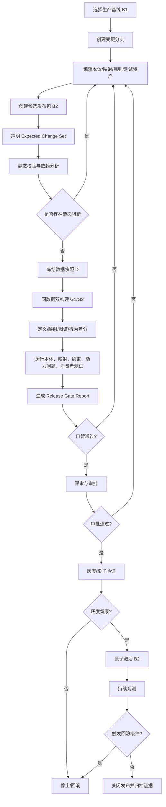

# 本体与项目映射版本迭代测试发布治理——需求规格说明书

> 项目：`wiz_ontology_workspace`  
> 文档版本：V1.0  
> 日期：2026-09-25  
> 状态：待产品、架构、领域和测试联合评审  
> 适用范围：本体版本、项目映射版本、规则/函数版本、测试资产以及生产图谱发布治理

---

## 0. 文档定位与实施边界

本文定义一套面向生产环境的本体演进能力，用于解决：第一版本体及项目映射已经在线运行后，新业务导致本体、映射、规则或数据源契约变化，如何在发布前自动验证计划内变化、阻断计划外变化，并在发布异常时快速回滚。

本文是**目标需求**，不是对当前仓库已具备能力的陈述。实施前必须执行开发任务 T00，对主干、现有分支、数据库迁移、自动构建能力和已有版本能力进行基线核验。已有能力优先复用，禁止仅凭本文模块名重复建设。

本文默认沿用当前工作台的基本技术边界：

- 后端以 Python 领域模块和 HTTP API 为主；
- 前端以 Vue 工作台为主；
- SQLite 继续作为本地优先场景的权威元数据存储；
- 本体采用项目原生业务模型，同时允许接入 RDF/OWL、SHACL、SPARQL、ROBOT 等外部校验工具；
- 生产发布不能依赖大模型给出“通过/不通过”结论；大模型只能用于生成建议、解释差异或辅助编写测试，发布门禁必须由确定性程序执行。

---

## 1. 背景与问题定义

### 1.1 典型场景

生产环境已经存在：

```text
本体 O1
项目映射 M1
规则/函数 R1
源数据契约 S1
生产图谱 G1
下游消费者 C1...Cn
```

新业务提出以下一种或多种修改：

- 新增、删除、重命名对象类型；
- 修改对象继承关系；
- 新增或修改属性、数据类型、单位、基数、必填性；
- 新增或修改关系、端点、方向、逆关系；
- 修改业务主键、去重规则、来源表、来源字段、过滤条件；
- 修改转换函数、函数编排、规则、动作；
- 修改源数据结构或数据质量约束；
- 修改查询、报表、API、智能问数、动作等下游消费方式。

修改后希望发布：

```text
本体 O2
项目映射 M2
规则/函数 R2
源数据契约 S2
候选图谱 G2
```

系统必须回答：

1. 哪些资源被直接修改？
2. 哪些资源被传递影响？
3. 哪些实例节点、边、属性、推理结果和下游行为应该变化？
4. 哪些变化属于未声明的意外变化？
5. 未受影响资源是否保持兼容？
6. V2 是否允许发布？
7. 发生异常后是否可以原子回退到 V1？

### 1.2 当前常见误区

以下方式均不足以支撑生产发布：

- 只比较两个本体 JSON/OWL 文件；
- 只检查本体能否解析；
- 只看节点总数是否相同；
- 只测试手工修改过的几个节点；
- 直接在生产图上运行新映射，再人工抽查；
- 本体和项目映射分别发布；
- 将模型作业成功误认为版本完整、语义正确、可发布；
- 依靠人工勾选“我确认风险”绕过主键变化、批量删除等高风险错误。

---

## 2. 建设目标

### 2.1 总目标

建设一套“分支修改—影响分析—同数据双跑—语义差分—自动化测试—审批—灰度/激活—回滚”的版本治理闭环，使每次生产发布都能形成机器可复算、人工可审查、结果可追溯的测试证据。

### 2.2 可验证承诺

系统不承诺脱离边界条件的“绝对没有影响”，而应提供以下有界保证：

```text
给定：
- 固定数据快照 D；
- 明确的基线发布包 B1；
- 候选发布包 B2；
- 固定执行引擎及版本；
- 已登记的消费者与测试资产；

G1 = Build(B1, D)
G2 = Build(B2, D)

要求：
1. ActualDiff(G1, G2) 被 ExpectedChangeSet 完整解释；
2. UnexpectedDiffCount = 0；
3. MissingExpectedDiffCount = 0，或由明确政策接受；
4. 所有受保护资源的可观察行为保持兼容；
5. 所有阻断级测试通过；
6. 发布包具备已验证的回滚点。
```

### 2.3 业务目标

- 降低本体和映射变更引发生产图谱回归的概率；
- 将“是否可发布”从个人经验判断转为确定性门禁；
- 为评审人提供可理解的影响范围和图谱变化；
- 支持问题快速定位到本体定义、映射、源字段、转换函数或消费者；
- 支持项目级、租户级或对象类型级灰度；
- 保留旧版本和测试证据，满足审计与追责需求；
- 为后续智能问数、规则执行和项目交付提供稳定语义契约。

### 2.4 非目标

首期不包括：

- 自动替业务负责人决定一个语义变化是否合理；
- 自动执行高风险数据迁移并跳过人工评审；
- 自动把大模型生成的规则直接发布到生产；
- 取代完整的数据仓库、图数据库或 CI 平台；
- 强制将全部原生业务本体重写为 OWL；
- 对未登记、无法观测的所有外部消费者做无限范围兼容保证；
- 在没有相同数据快照的情况下对两个生产时点做强归因。

---

## 3. 核心术语

| 术语 | 定义 |
|---|---|
| Ontology Version | 不可变的本体定义版本，包含对象、属性、关系、约束、规则元数据等。 |
| Mapping Version | 不可变的项目映射版本，包含身份、属性、关系、过滤、函数和来源配置。 |
| Release Bundle | 一次发布的原子组合，绑定本体、映射、源契约、规则、约束、测试资产和执行器版本。 |
| Baseline Bundle | 当前生产激活或用户选择作为比较基线的发布包。 |
| Candidate Bundle | 待测试、待审批、待发布的候选发布包。 |
| Expected Change Set | 发布者在测试前声明的计划内变化及允许范围。 |
| Actual Change Set | 系统根据定义差分、映射差分和双构建图差分计算出的实际变化。 |
| Unexpected Change | 实际发生但未被预期变更规则覆盖的变化。 |
| Missing Expected Change | 已声明应该发生，但实际没有发生的变化。 |
| Direct Impact | 被本次修改直接命中的定义、映射、函数、约束或消费者。 |
| Transitive Impact | 通过依赖关系传播后可能受影响的资源。 |
| Protected Resource | 影响分析判断不应变化，或被用户显式保护的资源。 |
| Data Snapshot | 可重复读取、内容有校验和的固定输入数据集合。 |
| Baseline Graph / Candidate Graph | 使用相同快照分别由基线包和候选包构建的图谱结果。 |
| Semantic Fingerprint | 对节点或分区的身份、类型、属性、关系和推理结果规范化后生成的稳定摘要。 |
| Competency Question | 用自然语言描述、以确定性查询执行的核心业务问题。 |
| Consumer Contract | API、报表、查询、动作、智能问数等消费者依赖的结构和行为约束。 |
| Release Gate | 汇总所有测试、差异、审批和回滚条件后生成的发布判定。 |
| Activation | 将通过审批的发布包切换为生产读取或执行的当前版本。 |

---

## 4. 用户角色与权限

### 4.1 角色

| 角色 | 主要职责 |
|---|---|
| 领域建模者 | 修改本体定义，说明业务语义和预期变化。 |
| 项目实施工程师 | 修改项目映射、源字段、转换函数和关系绑定。 |
| 测试工程师 | 维护映射样例、能力问题、SHACL、消费者契约和故障夹具。 |
| 发布负责人 | 创建发布包、选择基线、发起测试、处理阻断项。 |
| 评审人 | 审阅差异、风险、测试证据和迁移计划。 |
| 生产管理员 | 执行灰度、激活、回滚和紧急冻结。 |
| 审计人员 | 只读查看版本、审批、测试报告和操作日志。 |

### 4.2 权限原则

- 创建和编辑草稿不等于拥有发布权限；
- 修改者不能作为唯一审批人批准自己的重大版本；
- 高风险例外必须由具备专门权限的角色发起，并且不能覆盖禁止绕过项；
- 激活和回滚必须有幂等请求 ID；
- 所有下载、导出、审批、激活和回滚均写审计日志；
- 敏感源数据快照默认只显示摘要，不在报告中泄露原始值；
- 测试运行服务账号采用最小权限，不得访问与测试无关的生产数据。

---

## 5. 产品不变量与强制业务规则

以下是不允许由前端自行推断或绕过的服务端不变量：

1. **不可变版本**：已创建的本体版本、映射版本、测试资产版本不得原地修改；修订产生新版本。
2. **原子发布**：生产激活的单位必须是 Release Bundle，而不是单独本体或单独映射。
3. **基线固定**：测试开始后，基线包、候选包、快照、执行器和测试包均锁定；任何变化必须创建新 Test Run。
4. **先声明再测试**：Expected Change Set 在测试运行开始后不可原地修改；修改后必须重新计算影响和重新测试。
5. **同数据双跑**：强差分必须在同一快照和同一归一化规则下生成 G1/G2。
6. **身份稳定优先**：业务主键和节点稳定 ID 的未声明变化一律阻断。
7. **未声明变化为零**：默认 `unexpectedChangeCount == 0` 才允许进入审批。
8. **部分完成不等于可发布**：任一必要阶段存在未处理单元、截断或未知覆盖时，默认 `deliverable=false`。
9. **服务端重验**：审批令牌、门禁结果和激活资格必须在最终事务内重验，不能相信前端状态。
10. **回滚点必需**：没有可用且完成演练的回滚点，不允许生产激活。
11. **历史证据不可覆盖**：历史测试结果、差异和审批记录只追加，不原地改写。
12. **禁止万能忽略**：主键变化、计划外删除、逻辑不一致、保护资源漂移、关键消费者失败不可由普通“确认风险”绕过。

---

## 6. 总体业务流程



### 6.1 发布状态机

```text
DRAFT
  → STATIC_VALIDATING
  → IMPACT_ANALYZED
  → SNAPSHOT_READY
  → BUILDING_BASELINE
  → BUILDING_CANDIDATE
  → DIFFING
  → TESTING
  → TESTED
  → IN_REVIEW
  → APPROVED
  → CANARY
  → ACTIVE
  → SUPERSEDED

失败/终止分支：
REJECTED | FAILED | CANCELLED | ROLLED_BACK | FROZEN
```

状态规则：

- 状态迁移由后端命令执行，前端不可任意赋值；
- `TESTED` 只表示测试执行完成，不自动表示门禁通过；
- `APPROVED` 必须绑定确切的 Gate Report hash；
- 任何会改变包内容、预期变更或测试资产的操作都会使既有审批失效；
- `ACTIVE` 版本不可编辑，只能被新版本替代或回滚；
- `ROLLED_BACK` 必须记录目标版本、原因、操作者和验证结果。

---

## 7. 功能需求

## FR-01 本体与映射不可变版本

### 需求说明

系统必须为本体、项目映射、规则/函数、约束和测试资产分别建立不可变版本，并记录来源草稿、创建人、创建时间、父版本、内容哈希和兼容级别。

### 功能点

- 从草稿创建版本；
- 从已发布版本创建分支草稿；
- 显示父子版本关系；
- 内容完全相同的重复提交可去重或明确提示；
- 稳定资源 ID 与展示名称分离；
- 支持 `deprecated`、`supersededBy` 和迁移说明；
- 版本内容可导出并进行校验和验证；
- 历史版本只读；
- 删除只能标记归档，不物理删除仍被发布包引用的版本。

### 版本兼容分类

- PATCH：标签、描述、展示元数据变化，不改变实例或消费者行为；
- MINOR：新增可选能力，旧消费者无需修改；
- MAJOR：删除/重命名稳定 ID、修改主键、数据类型、关系语义、约束或映射行为。

系统应给出自动分类建议，但最终分类需要评审确认；若人工降级版本级别，必须记录理由。

---

## FR-02 统一变更分支

### 需求说明

一个变更分支必须能同时承载本体、映射、规则、约束和测试资产的候选修改，避免各模块独立修改后在发布阶段才发现不兼容。

### 功能点

- 从指定 Baseline Bundle 创建分支；
- 分支记录基线 hash 和创建时版本；
- 支持 rebase 到更新的生产基线；
- 检测同一稳定资源的字段级冲突；
- 对无冲突资源自动合并；
- 冲突必须人工选择或重建，禁止静默覆盖；
- 分支可预览，但不可被生产消费者默认访问；
- 分支关闭前保留完整审计历史。

### Rebase 后置要求

rebase 成功后，已有影响分析、测试和审批全部失效，必须重新执行。

---

## FR-03 Release Bundle 原子发布包

### 需求说明

Release Bundle 是生产发布的唯一单位，至少包含：

```yaml
releaseBundle:
  id: energy-prod-2.3.0
  projectId: energy-project
  baselineBundleId: energy-prod-2.2.1
  ontologyVersionId: ontology-2.3.0
  mappingVersionId: mapping-2.3.0
  sourceContractVersionId: source-7
  ruleVersionId: rules-2.3.0
  constraintVersionId: constraints-2.3.0
  testPackVersionId: tests-2.3.0
  executionEngineVersion: build-engine-1.8.4
  canonicalizationVersion: canonical-v1
  expectedChangeSetId: change-20260925-001
```

### 功能点

- 创建、复制、校验和归档发布包；
- 检查所有引用版本存在且属于同一项目/兼容范围；
- 不允许发布包中出现可变草稿引用；
- 显示与基线包的资源版本差异；
- 计算 bundle hash；
- 一旦进入测试，资源版本固定；
- 资源变化时派生新候选包，不覆盖原包。

---

## FR-04 Expected Change Set 预期变更清单

### 需求说明

发布负责人必须在测试前声明允许和期望发生的变化。系统同时提供结构化编辑器和 YAML/JSON 高级编辑模式。

### 支持的变更类型

- 本体定义：新增、修改、废弃、删除；
- 映射：新增、修改、停用；
- 节点：允许新增/删除/身份迁移；
- 属性：允许指定字段变化；
- 边：允许新增/删除/端点迁移；
- 推理类型：允许新增/减少；
- 数量预算：按对象类型、映射、数据源设置上下限；
- 查询结果：允许完全相等、只新增、容差、schema 兼容；
- 性能预算：允许的 P95/P99 变化；
- 权限变化：允许的授权范围变化；
- 迁移表：旧 ID 到新 ID 的一对一、一对多或多对一规则。

### 示例

```yaml
expectedChangeSet:
  version: 1
  rationale: 新增额定功率并切换 SOC 来源字段
  ontology:
    addedProperties:
      - objectType: StorageDevice
        property: ratedPower
        required: false
    modifiedProperties:
      - objectType: StorageDevice
        property: soc
  mappings:
    modified:
      - storage-device-soc
  graphRules:
    - selector:
        objectType: StorageDevice
      allowedPropertyChanges: [ratedPower, soc]
      allowIdentityChange: false
      allowEdgeRemoval: false
  protectedSelectors:
    - objectType: Site
    - objectType: StorageSystem
  countBudgets:
    StorageDevice:
      added: {min: 0, max: 0}
      removed: {min: 0, max: 0}
  forbidden:
    - UNDECLARED_IDENTITY_CHANGE
    - UNDECLARED_EDGE_REMOVAL
```

### 规则

- 测试运行开始后清单被冻结；
- 清单修改产生新 revision 和新测试运行；
- 允许规则必须尽量窄，通配全图需要高权限并明确审计；
- “允许变化”不等于“变化必须发生”，是否必须发生由 `required=true/false` 控制；
- 规则冲突时使用更严格规则；
- 规则匹配结果必须可解释到具体规则 ID。

---

## FR-05 定义差分与兼容性分类

### 需求说明

系统必须分别计算本体、映射、源契约、规则和测试资产差分，避免只输出文本 diff。

### 本体差分

至少覆盖：

- 对象类型新增、删除、重命名、稳定 ID 变化；
- 父类、子类和多继承变化；
- 属性归属、类型、单位、必填性、默认值、基数、枚举变化；
- 关系起点、终点、方向、逆关系、传递性变化；
- 规则、动作、约束和说明变化；
- 资源废弃与替代关系。

### 映射差分

至少覆盖：

- 源连接、表、字段；
- 业务主键和节点 ID 生成规则；
- 字段转换、单位换算、默认值；
- 过滤、去重、聚合、关联条件；
- 关系端点映射；
- 函数/编排版本；
- 增量游标、时间窗口和删除策略。

### 兼容性级别

```text
NON_BREAKING
POTENTIALLY_BREAKING
BREAKING
UNKNOWN
```

自动分类需要给出规则 ID 和解释，不允许只有颜色或分数。

---

## FR-06 资源依赖图与影响分析

### 需求说明

系统必须维护跨本体、映射、函数、数据源、约束、查询和消费者的依赖图，并从直接变更计算传递影响闭包。

### 依赖边类型

- 对象类型 `inheritsFrom` 对象类型；
- 属性 `domainOf/rangeOf` 对象类型；
- 关系 `sourceType/targetType` 对象类型；
- 映射 `produces` 对象/属性/关系；
- 映射 `reads` 表/字段；
- 映射 `calls` 函数；
- 约束 `validates` 对象/属性/关系；
- 查询/报表/API `consumes` 语义资源；
- 动作/规则 `reads/writes` 属性或关系；
- 实例分区 `producedBy` 映射。

### 输出

- 直接变化资源；
- 传递影响资源；
- 受保护资源；
- 影响路径；
- 影响消费者；
- 建议运行的测试集合；
- 影响置信度与未知依赖。

### 规则

- 影响分析必须版本化；
- 未登记消费者标记为治理缺口，而不是默认“无影响”；
- 允许用户补充保护范围，但不能缩小系统推导的必要影响范围；
- 图谱实例影响可先按对象类型、映射和分区估算，双构建后再用实际差分确认。

---

## FR-07 数据快照与可重复构建

### 需求说明

系统必须支持创建固定数据快照，并保证基线和候选构建读取完全相同的数据内容。

### 快照类型

- 小规模内嵌样例快照；
- 数据库一致性快照；
- 文件/对象存储清单快照；
- 基于时间点和增量日志的逻辑快照；
- 脱敏生产样本；
- 合成边界数据集。

### 快照元数据

- 快照 ID、项目、来源；
- 表/文件/分区清单；
- 行数、字节数、schema hash；
- 内容校验和或分区校验和；
- 创建时间、创建方式、保留期限；
- 脱敏策略；
- 是否可重放；
- 权限范围。

### 规则

- 基线和候选构建必须引用同一 snapshot ID；
- 快照内容变化必须产生新快照 ID；
- 无法冻结的数据源必须进入影子双写模式，不能假装完成强差分；
- 快照读取失败、分区缺失或校验和不一致时测试失败；
- 快照保留期限不得短于发布证据要求；
- 报告默认只显示摘要和受控样例。

---

## FR-08 双版本构建与执行隔离

### 需求说明

系统必须在隔离空间中分别构建 Baseline Graph G1 和 Candidate Graph G2。

### 要求

- 使用相同的数据快照；
- 使用显式记录的执行器版本；
- 构建输出写入独立命名空间；
- 支持全量与增量构建；
- 构建过程幂等；
- 失败重试不能生成重复节点/边；
- 记录每个节点和边的来源映射、来源记录和构建运行；
- 输出覆盖报告，区分成功、失败、跳过、截断和未知；
- 任何未处理单元都必须导致 `completeness != complete`；
- 支持取消，但要区分“停止接收结果”和“底层任务已真正终止”。

### 构建结果

```yaml
buildResult:
  state: succeeded | failed | cancelled
  completeness: complete | partial | unknown
  graphSnapshotId: graph-candidate-001
  inputUnits: 100000
  completedUnits: 100000
  failedUnits: 0
  skippedUnits: 0
  truncatedUnits: 0
  blockers: []
```

`state=succeeded` 且 `completeness=partial` 仍然不可发布。

---

## FR-09 图谱规范化、差分与语义指纹

### 需求说明

系统必须将 G1/G2 转为与序列化顺序无关的规范化表示，再进行节点、属性、边、显式类型和推理类型差分。

### 节点规范化

至少包含：

```json
{
  "stableId": "storage-device:ES-001",
  "assertedTypes": ["StorageDevice"],
  "inferredTypes": ["Asset", "Equipment"],
  "properties": {
    "name": "1号储能柜",
    "siteId": "SITE-01"
  },
  "outgoingEdges": [
    ["belongsTo", "storage-system:SYS-01"]
  ],
  "incomingEdges": []
}
```

### 规范化规则

- 对集合、属性键和边排序；
- URI、数字、时间、布尔值、null 按固定规范编码；
- 区分缺失、null、空串、0、false；
- 排除明确声明为非语义的运行字段，如 `updatedAt`、run ID；
- 浮点值按属性定义的精度处理；
- 大文本可保存摘要，但差异下钻需可访问原始值；
- 规范化算法自身需要版本号。

### 差分类型

- 节点新增/删除；
- 稳定 ID 变化；
- 类型新增/删除；
- 属性新增/删除/修改；
- 边新增/删除/端点改变；
- 来源映射变化；
- 推理结果变化；
- 分区数量和摘要变化。

### 语义指纹

为 Protected Resource 生成 SHA-256 等稳定哈希。大图先比较分区摘要，摘要不同再下钻。门禁默认要求：

```text
protectedUnexpectedDiffCount == 0
```

---

## FR-10 预期变化与实际变化对账

### 需求说明

系统必须将 Actual Change Set 中的每条变化匹配到 Expected Change Set 规则。

### 输出分类

```text
EXPECTED_AND_OCCURRED
EXPECTED_BUT_MISSING
UNEXPECTED
AMBIGUOUS
IGNORED_NON_SEMANTIC
```

### 要求

- 每条实际差异显示命中的规则 ID；
- 一条差异同时命中允许和禁止规则时按禁止处理；
- 模糊匹配不得自动通过，必须进入 AMBIGUOUS；
- 支持按对象类型、映射、字段、节点 ID、关系、数据源分组；
- 支持查看样例和导出完整差异；
- 支持给差异添加评审意见，但不能直接修改历史差异；
- 修改预期规则后重新生成新 Test Run；
- 发布报告必须记录预期规则版本、匹配器版本和实际差异 hash。

---

## FR-11 本体逻辑与质量测试

### 需求说明

系统必须提供确定性的本体质量检查，支持项目原生规则，并可选集成 OWL/ROBOT/SPARQL。

### 检查范围

- 结构解析；
- 稳定 ID 唯一性；
- 悬空引用；
- 循环继承或不允许的循环；
- domain/range 合法性；
- 数据类型兼容；
- 基数、互斥和枚举约束；
- 不可满足类；
- 意外等价类；
- 废弃资源仍被新映射引用；
- 命名、标签、定义和文档规则；
- 自定义 SPARQL/规则检查。

### 严重级别

```text
BLOCKER | ERROR | WARN | INFO
```

BLOCKER/ERROR 的默认门禁由项目策略配置；身份和逻辑不一致始终为 BLOCKER。

---

## FR-12 项目映射单元与契约测试

### 需求说明

每条生产映射必须支持最小输入样例和期望输出，并具备可自动运行的单元测试。

### 测试内容

- 主键生成和稳定性；
- null、空串、非法值、极值；
- 类型转换和单位换算；
- 默认值和回退逻辑；
- 过滤条件；
- 去重和聚合；
- 一对一、一对多、多对一；
- 关系端点解析；
- 函数异常、超时和版本变化；
- 重复执行幂等性；
- 删除/失效数据的处理；
- 增量游标和迟到数据。

### 示例

```yaml
mappingTestCase:
  id: MT-STORAGE-SOC-001
  mappingId: storage-device-soc
  sourceRows:
    - device_id: ES-001
      battery_soc: 80
  expectedObjects:
    - stableId: storage-device:ES-001
      objectType: StorageDevice
      properties:
        soc: 0.8
  expectedEdges: []
  assertions:
    - noDuplicateObjects
    - deterministicOutput
```

---

## FR-13 SHACL/实例数据质量回归

### 需求说明

系统必须对 G1/G2 分别运行约束验证，并重点识别 V2 新增问题。

### 报告分类

- Baseline Existing Violation；
- Candidate Existing Violation；
- Newly Introduced Violation；
- Resolved Violation；
- Unknown/Not Evaluated。

### 默认门禁

- 新增 blocker 级违规必须为 0；
- 历史违规未增加时可按治理政策允许；
- 新增必填属性造成大量旧实例违规时必须阻断；
- 约束本身变化必须在差异中展示。

---

## FR-14 能力问题与黄金查询

### 需求说明

系统必须支持把业务问题固化为可执行查询，并比较基线与候选结果。

### 支持模式

- 完全相等；
- 集合相等、顺序无关；
- schema 相等；
- 只允许新增；
- 只允许指定记录变化；
- 数值容差；
- 行数范围；
- 必须包含/不得包含；
- 黄金文件对比；
- 基线动态对比。

### 智能问数测试

智能问数不能只比较最终自然语言答案，至少固定并检查：

- 问题文本；
- 语义解析出的对象、属性、关系；
- 查询计划；
- 最终 SQL/SPARQL/执行表达式；
- 返回 schema；
- 关键结果断言。

模型文本表达可单独做弱断言，不作为核心发布门禁。

---

## FR-15 消费者登记与契约测试

### 需求说明

系统必须建立 Consumer Registry，登记所有已知下游依赖。

### 消费者类型

- API；
- 报表和看板；
- SPARQL/图查询；
- 规则、动作和函数；
- 搜索索引；
- 数据导出；
- 智能问数模板；
- 外部系统同步。

### 登记内容

- 消费者 ID、负责人、环境；
- 依赖的对象、属性、关系和查询；
- 兼容策略；
- 测试入口；
- 阻断级别；
- 最近验证时间；
- 未维护或无法自动测试的风险标记。

影响分析根据依赖自动选择测试。未登记消费者在报告中形成治理告警，不能被描述为“确认不受影响”。

---

## FR-16 发布门禁引擎

### 需求说明

Release Gate 必须在服务端统一汇总差异、测试、覆盖、审批和回滚条件。

### 门禁维度

- 发布包引用完整性；
- 本体逻辑；
- 映射单测；
- 构建完整性；
- 实际/预期变化对账；
- 保护资源差异；
- SHACL/数据质量；
- 能力问题；
- 消费者契约；
- 性能预算；
- 权限变化；
- 回滚点；
- 审批策略。

### Gate 结果

```text
PASS
PASS_WITH_WARNINGS
FAIL
UNKNOWN
```

默认只有 PASS 和经策略允许的 PASS_WITH_WARNINGS 能进入审批。UNKNOWN 不得自动视为 PASS。

### 禁止绕过项

- 未声明的节点删除；
- 未声明的业务主键/稳定 ID 变化；
- 保护资源出现任意语义变化；
- 逻辑不一致或不可满足类；
- 映射引用不存在的源字段或目标定义；
- 批量关系丢失；
- 核心消费者契约失败；
- 测试或构建存在截断、未知覆盖；
- 没有可用回滚点。

---

## FR-17 Proposal、评审与审批

### 需求说明

系统应以类似代码 Pull Request 的方式展示发布 Proposal。

### Proposal 内容

- 发布目标和业务原因；
- 基线/候选发布包；
- 定义差异和映射差异；
- 影响路径；
- Expected/Actual 对账；
- 图谱变化样例和统计；
- 测试结果；
- 风险与迁移说明；
- 回滚方案；
- 评审评论和审批历史。

### 审批规则

- 支持按 MAJOR/MINOR/PATCH 配置不同审批人数；
- 高风险领域需要领域负责人和生产管理员双审批；
- 内容、测试包、预期变更、Gate Report 变化后自动撤销旧审批；
- 审批绑定 `bundleHash + gateReportHash`；
- 拒绝必须填写原因；
- 审批人可要求重新测试或缩小发布范围；
- 评论只能追加，编辑需保留修订历史。

---

## FR-18 灰度、影子运行与激活

### 需求说明

系统必须支持不直接覆盖生产的发布方式。

### 模式

1. **离线候选图**：仅用于测试，不接受生产读流量；
2. **影子运行**：同一实时事件同时进入 V1/V2，V2 不返回生产结果；
3. **灰度读取**：按项目、租户、用户组或对象类型把少量读取切到 V2；
4. **蓝绿切换**：通过逻辑别名/版本指针从 V1 原子切换到 V2；
5. **全量激活**：V2 成为默认生产版本。

### 激活要求

- 再次校验审批和 Gate Report 未过期；
- 记录激活前后的当前指针；
- 激活命令幂等；
- 切换期间禁止出现本体已切换、映射未切换的中间状态；
- 关键指标在观察窗口内持续健康；
- 达到自动停止条件时终止灰度；
- 自动回滚是否启用由项目策略配置。

---

## FR-19 回滚

### 需求说明

支持一键回滚到上一已验证发布包，优先采用版本指针回切而非逆向执行不可验证的数据迁移。

### 回滚要求

- 激活前必须确认目标回滚包仍可用；
- 回滚后执行最小健康检查；
- 若候选版本已产生不可逆外部副作用，必须在发布前声明补偿策略；
- 回滚操作要求高权限和二次确认；
- 回滚不删除失败版本及其证据；
- 回滚后自动冻结失败版本，防止未经新测试再次激活；
- 支持“只回流量指针”和“回流量并恢复索引/缓存”等策略。

---

## FR-20 运行监控与在线漂移检测

### 需求说明

发布后系统应持续监测关键指标，并区分版本回归和正常业务数据变化。

### 指标

- 构建失败率、延迟、重试；
- 节点/边增减速率；
- 映射异常和源 schema 漂移；
- SHACL 新增违规；
- 关键查询 P95/P99；
- API 错误率；
- 权限拒绝或越权告警；
- V1/V2 影子结果差异率；
- 稳定 ID 冲突；
- 数据新鲜度。

### 规则

- 在线监控不替代发布前测试；
- 触发阈值必须带版本和项目上下文；
- 告警应可定位到发布包和受影响资源；
- 自动回滚仅适用于可可靠判断且副作用可控的指标。

---

## FR-21 审计与可追溯性

系统必须记录：

- 谁在何时创建/修改了哪份草稿；
- 哪个版本由哪个草稿生成；
- 哪些资源进入发布包；
- Expected Change Set 的每次修订；
- 每次测试使用的快照、执行器、规范化器和测试包；
- 每个 Gate 条目如何计算；
- 谁审批、拒绝、激活、回滚；
- 版本指针历史；
- 导出和下载行为；
- 高风险例外申请。

审计日志只追加，不允许普通管理员修改；敏感数据值应脱敏，仅保留必要摘要。

---

## 8. 数据模型需求

以下为逻辑模型，实际表名和字段需结合现有仓库迁移体系确认。

### 8.1 核心实体

#### `ontology_versions`

- `id`
- `project_id`
- `semantic_version`
- `parent_version_id`
- `content_json`
- `content_hash`
- `compatibility_level`
- `status`
- `created_by`
- `created_at`
- `deprecated_at`

#### `mapping_versions`

- `id`
- `project_id`
- `semantic_version`
- `parent_version_id`
- `content_json`
- `content_hash`
- `source_contract_version_id`
- `created_by`
- `created_at`

#### `release_bundles`

- `id`
- `project_id`
- `baseline_bundle_id`
- 各资源版本 ID
- `bundle_hash`
- `state`
- `risk_level`
- `created_by`
- `created_at`
- `active_at`

#### `expected_change_sets`

- `id`
- `bundle_id`
- `revision`
- `rules_json`
- `rules_hash`
- `rationale`
- `created_by`
- `created_at`
- `frozen_at`

#### `resource_dependencies`

- `from_resource_type`
- `from_resource_id`
- `to_resource_type`
- `to_resource_id`
- `dependency_type`
- `source`
- `confidence`
- `valid_from_version`
- `valid_to_version`

#### `data_snapshots`

- `id`
- `project_id`
- `snapshot_type`
- `manifest_json`
- `schema_hash`
- `content_hash`
- `row_count`
- `byte_count`
- `retention_until`
- `created_at`

#### `graph_snapshots`

- `id`
- `bundle_id`
- `data_snapshot_id`
- `build_run_id`
- `namespace`
- `node_count`
- `edge_count`
- `partition_manifest_json`
- `content_hash`

#### `test_runs`

- `id`
- `bundle_id`
- `baseline_bundle_id`
- `snapshot_id`
- `test_pack_version_id`
- `state`
- `completeness`
- `input_hash`
- `started_at`
- `finished_at`

#### `test_results`

- `id`
- `test_run_id`
- `test_case_id`
- `category`
- `severity`
- `state`
- `summary`
- `details_json`
- `artifact_ref`

#### `change_items`

- `id`
- `test_run_id`
- `change_type`
- `resource_type`
- `resource_id`
- `before_json`
- `after_json`
- `classification`
- `matched_rule_id`
- `severity`

#### `gate_reports`

- `id`
- `test_run_id`
- `report_hash`
- `result`
- `blocker_count`
- `warning_count`
- `summary_json`
- `created_at`

#### `release_approvals`

- `id`
- `bundle_id`
- `gate_report_hash`
- `reviewer_id`
- `decision`
- `comment`
- `created_at`
- `revoked_at`

#### `release_activations`

- `id`
- `project_id`
- `from_bundle_id`
- `to_bundle_id`
- `activation_mode`
- `request_id`
- `state`
- `started_at`
- `finished_at`
- `rollback_of_activation_id`

### 8.2 版本与并发控制

- 所有可编辑草稿使用 `revision` 或 ETag 做乐观锁；
- 所有不可变版本以 `content_hash` 校验；
- 激活命令使用唯一 `request_id` 实现幂等；
- Gate Report 绑定 input hash，输入变化时报告自动过期；
- 数据库迁移必须向前兼容至少一个前端版本的只读查询。

---

## 9. API 需求草案

API 路径可按现有路由风格调整，语义要求如下。

### 9.1 版本与分支

```http
POST /api/projects/{projectId}/release-branches
GET  /api/projects/{projectId}/release-branches/{branchId}
POST /api/projects/{projectId}/release-branches/{branchId}/rebase
POST /api/projects/{projectId}/ontology-versions
POST /api/projects/{projectId}/mapping-versions
```

### 9.2 发布包

```http
POST /api/release-bundles
GET  /api/release-bundles/{bundleId}
POST /api/release-bundles/{bundleId}/validate
POST /api/release-bundles/{bundleId}/freeze
```

### 9.3 预期变更与影响分析

```http
PUT  /api/release-bundles/{bundleId}/expected-change-set
GET  /api/release-bundles/{bundleId}/expected-change-set
POST /api/release-bundles/{bundleId}/analyze-impact
GET  /api/release-bundles/{bundleId}/impact-report
```

### 9.4 快照与测试

```http
POST /api/projects/{projectId}/data-snapshots
GET  /api/data-snapshots/{snapshotId}
POST /api/release-bundles/{bundleId}/test-runs
GET  /api/test-runs/{runId}
POST /api/test-runs/{runId}/cancel
GET  /api/test-runs/{runId}/results
GET  /api/test-runs/{runId}/graph-diff
GET  /api/test-runs/{runId}/gate-report
```

### 9.5 审批、激活与回滚

```http
POST /api/release-bundles/{bundleId}/submit-review
POST /api/release-bundles/{bundleId}/approvals
POST /api/release-bundles/{bundleId}/canary
POST /api/release-bundles/{bundleId}/activate
POST /api/release-bundles/{bundleId}/rollback
GET  /api/projects/{projectId}/active-release
```

### 9.6 统一错误结构

```json
{
  "error": {
    "code": "GATE_REPORT_STALE",
    "message": "发布包内容已变化，原门禁报告失效",
    "requestId": "req-...",
    "details": {
      "expectedBundleHash": "...",
      "actualBundleHash": "..."
    }
  }
}
```

### 9.7 关键错误码

- `BUNDLE_REFERENCE_INVALID`
- `VERSION_NOT_IMMUTABLE`
- `EXPECTED_CHANGE_SET_REQUIRED`
- `SNAPSHOT_NOT_REPRODUCIBLE`
- `BASELINE_BUILD_INCOMPLETE`
- `CANDIDATE_BUILD_INCOMPLETE`
- `GRAPH_DIFF_INCOMPLETE`
- `UNEXPECTED_CHANGE_FOUND`
- `MISSING_EXPECTED_CHANGE`
- `PROTECTED_RESOURCE_CHANGED`
- `ONTOLOGY_INCONSISTENT`
- `MAPPING_REFERENCE_BROKEN`
- `CONSUMER_CONTRACT_FAILED`
- `GATE_REPORT_STALE`
- `APPROVAL_STALE`
- `ROLLBACK_POINT_MISSING`
- `ACTIVATION_CONFLICT`
- `REQUEST_ALREADY_PROCESSED`

---

## 10. 页面与交互需求

## 10.1 发布中心

展示：

- 当前生产发布包；
- 待测试、待审批、灰度中、已回滚版本；
- 最近测试结果；
- 风险级别；
- 激活和回滚历史。

禁止在列表页仅凭“成功”一个状态展示绿色完成；必须区分测试完成、门禁通过、审批通过和生产激活。

## 10.2 发布包详情

建议页签：

1. **概览**：目标、基线、资源版本、状态、负责人；
2. **定义差异**：对象、属性、关系、约束；
3. **映射差异**：源字段、主键、函数、过滤；
4. **影响范围**：直接影响、传递影响、消费者；
5. **预期变化**：结构化规则和版本；
6. **图谱差异**：节点、属性、边、推理变化；
7. **测试结果**：按层级、严重性、资源过滤；
8. **审批与发布**：评审、灰度、激活、回滚。

## 10.3 影响分析视图

- 默认使用可筛选列表和路径面包屑，不强迫用户在大图中查找；
- 图视图用于展示选中资源的上游/下游依赖；
- 标识 `DIRECTLY_CHANGED / TRANSITIVELY_IMPACTED / PROTECTED / UNKNOWN_DEPENDENCY`；
- 点击依赖边可查看来源：静态分析、运行追踪或人工登记；
- 未知依赖必须显式展示。

## 10.4 图谱差异视图

- 支持按对象类型、映射、数据源、差异类型筛选；
- 展示 before/after；
- 支持抽样与完整导出；
- 显示命中的 Expected Rule；
- 对身份变化、删除、关系丢失使用高风险视觉；
- 不使用“接受此差异”直接修改历史结果；应跳转到修订 Expected Change Set 并重新测试。

## 10.5 测试运行页

分开展示：

- 执行状态；
- 覆盖完整性；
- 当前阶段；
- 已完成/失败/跳过/截断单元；
- 费用与资源预算；
- 已产出但尚不可发布的结果；
- 取消和重试策略。

没有执行的阶段显示 `skipped/notApplicable/unknown`，不能根据总状态自动涂成完成。

## 10.6 审批页

审批人必须能看到：

- Gate Report hash；
- 自上次审批后的变化；
- 必须阅读的 blocker/warning；
- 迁移与回滚方案；
- 是否存在未知消费者；
- 生产灰度策略。

高风险审批要求二次确认，但确认不替代硬门禁。

## 10.7 交互一致性

- 离开脏表单必须 await 确认；
- 用户选择继续编辑后，页面上下文不得变化；
- 长任务可重进并恢复上下文；
- 迟到响应不能覆盖新页面或新运行；
- 所有危险操作说明目标、影响和回滚方式；
- 状态不能只靠颜色表达；
- 表格、图谱和详情对同一资源使用稳定 ID 跳转。

---

## 11. 自动化测试分层要求

| 层级 | 名称 | 默认门禁 |
|---|---|---|
| L0 | 引用、类型和静态完整性 | 全部错误阻断 |
| L1 | 本体逻辑、ROBOT/SPARQL 规则 | BLOCKER/ERROR 阻断 |
| L2 | 映射单元与幂等性测试 | 生产映射必须通过 |
| L3 | 同快照双构建 | 两侧均完整 |
| L4 | 依赖和影响范围 | 无无法解释的关键未知 |
| L5 | 保护节点语义指纹 | 意外差异为 0 |
| L6 | Expected/Actual 对账 | Unexpected=0；必需 Expected Missing=0 |
| L7 | 能力问题和黄金查询 | 核心用例全通过 |
| L8 | SHACL/数据质量 | 新增 blocker=0 |
| L9 | 消费者契约 | 核心消费者全通过 |
| L10 | 性能、权限、幂等、回滚 | 不越过预算，回滚演练通过 |

---

## 12. 非功能需求

### 12.1 可靠性

- 激活与回滚必须原子、幂等；
- 测试运行中断后可恢复或明确失败；
- 任何截断都必须进入覆盖报告；
- 失败时保留已完成的只读诊断产物；
- 报告可由底层账本复算；
- 不允许前端伪造完成状态。

### 12.2 性能目标（首期建议值，可按项目调整）

- 10 万节点、50 万边的标准回归：本地/测试环境 30 分钟内完成；
- 100 万节点级采用分区摘要和增量下钻，禁止一次性加载到浏览器；
- 发布详情基础元数据 P95 < 1 秒；
- 差异分页查询 P95 < 2 秒；
- 取消请求 2 秒内进入“停止接收新结果”状态；
- 激活指针切换 P95 < 5 秒；
- 回滚指针切换 P95 < 5 秒，不含外部缓存恢复时间；
- 单个测试运行的内存、CPU、调用次数和字节预算可配置。

这些是目标指标，实施前需用真实数据校准。

### 12.3 可扩展性

- 差分支持按对象类型、映射、数据源和 ID hash 分区；
- 测试执行器可插拔；
- 外部工具失败与业务测试失败分开记录；
- 图存储实现可替换，不影响上层 Release Gate 契约；
- 支持后续从 SQLite 元数据存储扩展到服务化数据库。

### 12.4 安全

- 快照、差异样例和日志默认脱敏；
- 禁止在模型提示词中发送未授权生产数据；
- API 使用项目级权限检查；
- 高风险命令需要 CSRF/重放防护和幂等键；
- 所有制品校验 hash；
- 外部测试脚本在隔离环境运行，限制网络、文件和执行权限；
- 下载完整差异需要单独权限和审计。

### 12.5 可观测性

每个请求、测试运行、构建运行、激活运行必须带：

- `requestId`
- `projectId`
- `bundleId`
- `testRunId/buildRunId`
- `baselineHash/candidateHash`
- 阶段、耗时、输入/输出计数；
- 错误码和可重试标识。

不得在日志中记录明文密钥、完整敏感数据或模型凭证。

### 12.6 可维护性

- 核心 DTO 有单一 schema 源；
- Python 与 TypeScript 对契约有一致性测试；
- 所有状态机迁移有单元测试；
- 规则和错误码稳定版本化；
- 数据库迁移可向前执行并有回滚/恢复说明；
- 关键算法带版本号：影响分析、规范化、差异匹配、门禁规则。

---

## 13. 兼容与迁移策略

### 13.1 旧本体和旧映射

- 将当前生产本体/映射登记为 Baseline Bundle；
- 无完整历史版本时创建“导入基线”，记录来源和未知项；
- 不凭旧状态推定测试通过；
- 首次纳管至少运行静态校验、快照构建、核心查询和回滚演练；
- 旧消费者逐步登记，未登记部分显示治理缺口。

### 13.2 旧任务和旧测试结果

- 旧运行没有 Gate Report 时显示 `unknown`；
- 不允许自动回填为 PASS；
- 可提供“重新评估”操作，用当前规则对历史只读产物生成新报告；
- 新报告不覆盖旧报告。

### 13.3 稳定 ID 迁移

- 展示名称变化不得改变稳定 ID；
- 真正需要更换 ID 时必须提供迁移表；
- 一对多、多对一迁移需要明确边和属性迁移政策；
- 迁移后保留旧 ID 查询别名的期限由项目政策定义；
- 主键迁移默认归类为 MAJOR。

---

## 14. 风险与约束

| 风险 | 缓解措施 |
|---|---|
| 依赖登记不完整 | 报告明确 UNKNOWN_DEPENDENCY；逐步建立 Consumer Registry；关键领域先人工补齐。 |
| 大图全量双跑成本高 | 分区摘要、抽样预检、增量构建；重大版本仍保留全量发布前验证。 |
| 源数据无法冻结 | 使用日志位点、影子双跑；降低保证级别并明确报告。 |
| 推理器或外部工具不稳定 | 固定版本、容器化、超时与隔离；工具失败不能当业务通过。 |
| Expected Change Set 写得过宽 | 通配规则需要高权限；展示规则覆盖比例；保护资源默认优先。 |
| 自动回滚误触发 | 只对高可信指标启用；先灰度停止，再由策略决定回滚。 |
| 本地 SQLite 并发限制 | 保持单写事务和任务队列；大规模执行产物可落独立文件/对象存储。 |
| 大模型输出不稳定 | 大模型不负责门禁；所有强结论由确定性规则和固定数据产生。 |

---

## 15. 里程碑与范围建议

### M0：需求与基线冻结

- 核验已有版本、映射、自动构建和发布能力；
- 冻结术语、状态机、门禁政策和核心 schema；
- 准备储能领域金样和故障样例。

### M1：P0 可用发布底座

- 不可变版本；
- Release Bundle；
- Expected Change Set；
- 定义/映射 diff；
- 固定快照；
- 双构建；
- 图谱差分和受保护指纹；
- 服务端 Gate；
- 蓝绿指针激活与回滚。

M1 完成后，系统应能对“未声明变化为零”给出基础证据。

### M2：语义质量与消费者回归

- 依赖图；
- 本体逻辑/ROBOT；
- 映射单测；
- SHACL；
- 能力问题；
- Consumer Registry；
- Proposal 审批。

### M3：生产级持续发布

- 影子双跑；
- 灰度；
- 在线漂移；
- 自动停止/回滚；
- 大图分区增量差分；
- 本体变化向映射和约束的迁移建议。

---

## 16. 需求完成定义

本需求不能以“页面做完”作为完成标准。最小业务闭环必须满足：

1. 能从 V1 生产基线创建 V2 候选发布包；
2. 本体和映射作为原子组合；
3. 能声明预期变化；
4. 能计算定义、映射和实际图谱差异；
5. 能在同一数据快照上双跑；
6. 能证明受保护节点没有意外语义变化；
7. 能运行至少本体、映射、能力问题和数据质量测试；
8. 服务端 Gate 能阻止未声明变化和部分完成结果；
9. 审批绑定确切的内容和测试报告；
10. 能灰度或原子激活；
11. 能回滚并验证恢复；
12. 全流程有审计证据。

---

## 17. 参考实践

- Palantir Global Branching：<https://www.palantir.com/docs/foundry/global-branching/overview/>
- Palantir Branching the Ontology：<https://www.palantir.com/docs/foundry/ontologies/branching-ontology/>
- Palantir Review Ontology Proposals：<https://www.palantir.com/docs/foundry/ontologies/review-ontology-proposals/>
- Palantir Branching Functions：<https://www.palantir.com/docs/foundry/functions/branching-functions/>
- Semantica Change Management：<https://docs.getsemantica.ai/guides/change-management/>
- Semantica GitHub：<https://github.com/semantica-agi/semantica>
- ROBOT：<https://robot.obolibrary.org/>
- Ontology Development Kit：<https://github.com/INCATools/ontology-development-kit>
- OntoRipple：<https://github.com/oeg-upm/OntoRipple>
- CFIHOS Ontology：<https://github.com/tecnomod-um/cfihos>
- WebProtégé：<https://github.com/protegeproject/webprotege>

