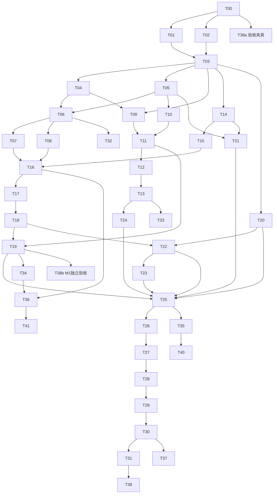

# 本体与项目映射版本迭代测试发布治理——开发任务拆分

> 项目：`wiz_ontology_workspace`  
> 文档版本：V1.0  
> 日期：2026-09-25  
> 配套需求：[01_需求规格说明书_本体与项目映射版本迭代测试发布治理.md](01_需求规格说明书_本体与项目映射版本迭代测试发布治理.md)  
> 配套验收：[03_验收方案_本体与项目映射版本迭代测试发布治理.md](03_验收方案_本体与项目映射版本迭代测试发布治理.md)

---

## 0. 使用说明

本文用于拆给开发者、测试工程师或 coding harness 执行。任务中的目录和文件是**建议修改范围**，实施前必须通过 T00 与当前仓库核对。已有能力优先接入和补验收，不按任务标题重复开发。

所有任务必须遵守：

- 不直接修改生产数据库；
- 不直接在生产图上试跑候选映射；
- 新功能默认使用临时数据库、测试快照和隔离命名空间；
- 发布门禁必须由后端确定性逻辑执行；
- 大模型输出不能成为 PASS 的唯一依据；
- 历史版本、测试结果、审批和审计日志不得原地覆盖；
- 任何截断、跳过或未知覆盖必须进入 Completion/Gate Report；
- 任务完成包括代码、迁移、测试、文档和回退说明，不仅是页面可见。

---

## 1. 工作流划分

| 工作流 | 目标 | 主要任务 |
|---|---|---|
| W0 基线与契约 | 核对现状并冻结领域模型 | T00～T03 |
| W1 版本与发布包 | 建立不可变版本和原子发布单位 | T04～T08 |
| W2 差分与影响分析 | 计算定义、映射和依赖影响 | T09～T13 |
| W3 快照、双构建和图差分 | 在同数据上生成可比较结果 | T14～T19 |
| W4 自动化测试资产 | 本体、映射、SHACL、业务查询、消费者 | T20～T24 |
| W5 门禁、审批和发布 | 统一判定、灰度、激活、回滚 | T25～T31 |
| W6 UI、观测和规模化 | 工作台体验、审计、大图性能 | T32～T37 |
| W7 独立验收与上线 | 金样、故障注入、演练、上线 | T38～T41 |

---

## 2. 优先级与里程碑

### P0 / M1：最小生产安全闭环

必须完成：T00～T19、T25～T31、T32 的核心页面、T38a 验收夹具、T39 回滚演练。

目标：能对 V1/V2 使用同一快照双构建，识别未声明变化，阻止危险发布，并能原子回滚。

### P1 / M2：语义质量与消费者兼容

完成：T20～T24、T33～T35、T38b。

目标：建立本体逻辑、映射单测、SHACL、能力问题和消费者契约。

### P2 / M3：持续发布和大规模治理

完成：T36～T37、T40～T41 及增强项。

目标：影子双跑、灰度、在线漂移、大图分区差分和迁移建议。

---

## 3. 总体依赖图



---

## 4. 人力与粗略估算

估算为熟悉仓库的工程人日，包含任务内单测，不包含等待领域专家标注和生产窗口。

| 阶段 | 任务 | 估算 |
|---|---|---:|
| 基线与契约 | T00～T03 | 8～14 人日 |
| 版本与发布包 | T04～T08 | 15～25 人日 |
| 差分与影响 | T09～T13 | 20～34 人日 |
| 快照与图差分 | T14～T19 | 28～46 人日 |
| 自动化测试 | T20～T24 | 20～35 人日 |
| 门禁与发布 | T25～T31 | 24～41 人日 |
| UI/观测/规模 | T32～T37 | 24～42 人日 |
| 验收上线 | T38～T41 | 15～28 人日 |
| **合计** |  | **154～265 人日** |

说明：

- 若当前仓库已有不可变发布版本、审批、图快照或回滚能力，可显著减少工作量；
- 这是任务规模估算，不是日历承诺；
- M1 建议由后端 2 人、前端 1 人、QA/领域 1 人并行推进；
- T14～T19 和 T25～T31 是关键链路，不适合多人同时无协调修改同一编排文件。

---

# 5. 任务卡

## T00｜仓库、运行环境与既有能力基线

**优先级**：P0  
**建议负责人**：技术负责人/集成负责人  
**前置依赖**：无

### 目标

明确哪些能力已经存在、哪些在分支中待接入、哪些确实缺失，避免重复开发和错误验收。

### 工作内容

1. 记录 main SHA、相关 feature/worktree SHA、工作区脏文件；
2. 核对后端、前端、数据库 schema、运行服务实际版本；
3. 盘点当前本体版本、项目映射版本、发布、回滚、审计和自动构建能力；
4. 核对已有 CompletionReport、容量守卫、共享 Finalizer、解析 v3、Fact 评测等实现；
5. 建立需求 FR 到现有模块的映射矩阵；
6. 固定开发与测试所用样例数据，不连接真实生产写路径；
7. 记录现有 API、数据库迁移体系、任务执行器和测试命令。

### 交付物

- `基线矩阵.md`；
- 当前架构图；
- 待复用提交清单；
- 风险和未知项清单；
- M1 的具体文件级改造计划。

### 验收

- [ ] 已有能力不会被误写成缺失；
- [ ] 运行服务与代码不一致时明确标记；
- [ ] 未触碰生产数据、未停止他人进程、未越权合并；
- [ ] 每个后续任务都能指向实际目录或标记为新增模块。

---

## T01｜领域术语、状态机和不变量冻结

**优先级**：P0  
**负责人**：产品 + 架构 + 后端  
**依赖**：T00

### 目标

统一 Release Bundle、Expected/Actual Change、Test Run、Gate、Approval、Activation 等概念，避免各页面和后端模块对“成功”理解不同。

### 实现内容

- 定义版本状态、测试运行状态、覆盖状态、门禁状态和激活状态；
- 定义合法状态迁移；
- 定义 12 条产品不变量；
- 定义硬门禁与可告警项；
- 明确旧任务、旧版本的 `unknown` 策略；
- 形成决策记录 ADR。

### 交付物

- `docs/adr/ontology-release-state-machine.md`；
- 状态枚举和错误码草案；
- 状态迁移表。

### 测试

- 状态机表驱动测试；
- 非法迁移必须返回稳定错误码；
- `TESTED` 不得自动等于 `PASS`；
- `APPROVED` 内容变化后自动失效。

---

## T02｜统一契约 Schema 与代码生成/校验

**优先级**：P0  
**负责人**：契约负责人  
**依赖**：T00

### 目标

为前后端、存储和测试建立单一契约源。

### 首批 Schema

- `ReleaseBundle`
- `ExpectedChangeSet`
- `ImpactReport`
- `BuildResult`
- `GraphChangeItem`
- `TestRun`
- `TestResult`
- `GateReport`
- `Approval`
- `Activation`
- `AuditEvent`

### 实现内容

- 选择 JSON Schema、Pydantic-first 或 LinkML 小范围方案；
- Python DTO 与 TypeScript 类型保持一致；
- 增加 schema 版本和兼容测试；
- 禁止前端向服务端提交派生 PASS 字段；
- 定义精确时间、数字、ID 和枚举格式。

### 验收

- [ ] Python 与 TypeScript 对非法样例接受/拒绝一致；
- [ ] CI 能检测 schema 生成物未更新；
- [ ] 旧客户端读取新字段时保持兼容；
- [ ] 所有核心 DTO 有示例和反例。

---

## T03｜数据库迁移与审计基础

**优先级**：P0  
**负责人**：后端/存储  
**依赖**：T01、T02

### 目标

建立版本治理的数据底座，并保证迁移可恢复。

### 新增/扩展表

- `ontology_versions`
- `mapping_versions`
- `release_bundles`
- `release_bundle_resources`
- `expected_change_sets`
- `resource_dependencies`
- `data_snapshots`
- `graph_snapshots`
- `build_runs`
- `test_runs`
- `test_results`
- `change_items`
- `gate_reports`
- `release_approvals`
- `release_activations`
- `audit_events`

### 实现要求

- 外键、唯一键和状态约束；
- 不可变记录禁止 UPDATE 内容字段；
- 大型差异明细允许外部制品存储，DB 保存索引和 hash；
- 审计只追加；
- 迁移前备份与恢复脚本；
- 旧数据库启动时明确迁移状态。

### 验收

- 全新数据库可一次建成；
- 旧数据库可向前迁移；
- 中途故障可安全重试；
- 不可变版本的内容更新被服务层和数据库策略阻止；
- 回退到旧程序时至少提供只读兼容或明确阻断，不静默损坏。

---

## T04｜本体不可变版本服务

**优先级**：P0  
**负责人**：本体后端  
**依赖**：T03

### 目标

从本体草稿生成不可变版本，支持稳定 ID、父版本和内容 hash。

### 实现内容

- 草稿校验；
- 版本创建；
- 内容规范化和 hash；
- 父版本引用；
- PATCH/MINOR/MAJOR 建议；
- `deprecated/supersededBy`；
- 导出与重新校验；
- 已引用版本禁止删除。

### 测试

- 相同内容 hash 稳定；
- 字段顺序变化不改变语义 hash；
- 展示名称变化不改变稳定资源 ID；
- 删除被映射引用的定义产生 blocker；
- 并发提交使用 CAS/ETag。

---

## T05｜项目映射不可变版本服务

**优先级**：P0  
**负责人**：映射后端  
**依赖**：T03

### 目标

将项目映射、源契约和函数版本固化为可测试、可审计版本。

### 实现内容

- 映射草稿规范化；
- 身份、属性、关系、过滤、转换、编排的稳定 ID；
- 绑定 source contract 和 function version；
- 静态引用校验；
- 版本 hash；
- 导出和差异基础数据；
- 旧映射只读。

### 测试

- 主键规则变化能被识别；
- 引用不存在字段/属性/关系失败；
- 映射顺序变化不改变 hash；
- 函数版本变化必须反映到映射版本或 Bundle hash；
- 并发保存冲突不静默覆盖。

---

## T06｜Release Bundle 服务

**优先级**：P0  
**负责人**：发布后端  
**依赖**：T04、T05

### 目标

以原子发布包绑定所有资源版本。

### 实现内容

- 创建/复制/冻结发布包；
- 校验资源归属和兼容性；
- 计算 bundle hash；
- 绑定 Baseline Bundle；
- 冻结后只允许派生新包；
- 显示资源变化；
- 生产当前指针只指向 Bundle。

### 验收

- 不允许 `O2 + M1` 在无显式兼容确认时直接激活；
- 发布包不能引用草稿；
- 测试开始后资源变化导致原 Test Run 失效；
- 相同资源组合得到相同 bundle hash；
- 当前生产指针不存在半组合状态。

---

## T07｜统一变更分支与 Rebase

**优先级**：P1（M1 可做最小版）  
**负责人**：全栈  
**依赖**：T06

### 目标

在同一分支中管理本体、映射、规则和测试资产变化。

### 实现内容

- 从 Baseline Bundle 创建分支；
- 分支资源草稿关联；
- rebase 到新基线；
- 稳定 ID 级冲突检测；
- 字段级差异和冲突解决；
- 分支预览；
- 分支关闭与审计。

### 验收

- 生产基线变化后旧测试和审批失效；
- 无冲突资源可自动合并；
- 同一稳定 ID 的相互冲突修改不可静默取任一方；
- 取消 rebase 后分支不变；
- 迟到响应不覆盖用户后续操作。

---

## T08｜版本兼容性分类器

**优先级**：P1  
**负责人**：领域后端  
**依赖**：T06

### 目标

根据定义和映射变化给出 PATCH/MINOR/MAJOR 与 breaking 风险建议。

### 规则示例

- 标签/描述：PATCH；
- 新增可选属性：MINOR；
- 删除属性：MAJOR；
- 主键、数据类型、domain/range、关系端点变化：MAJOR；
- 映射过滤和去重语义变化：至少 POTENTIALLY_BREAKING；
- 规则无法判断：UNKNOWN。

### 验收

- 分类包含规则 ID 和解释；
- UNKNOWN 不自动降级；
- 人工覆盖需记录理由；
- 分类器版本写入报告；
- 回归样例固定。

---

## T09｜本体结构化差分引擎

**优先级**：P0  
**负责人**：本体后端  
**依赖**：T03、T04

### 目标

输出与 JSON 顺序无关的本体语义差分。

### 实现内容

- 对象、继承、属性、关系、约束、规则差分；
- stable ID 与展示名称区分；
- before/after 结构；
- breaking 风险；
- Markdown/JSON 报告；
- 可选 OWL/ROBOT diff 适配。

### 验收

- 序列化顺序变化无差异；
- 重命名展示名和更换稳定 ID 被正确区分；
- 父类、range、基数变化均有专门类型；
- 大文件差分可分页；
- 输出 hash 稳定。

---

## T10｜项目映射结构化差分引擎

**优先级**：P0  
**负责人**：映射后端  
**依赖**：T03、T05

### 目标

识别源字段、主键、过滤、函数、关系端点等行为变化。

### 实现内容

- 规范化映射 AST；
- identity、property、link、function、filter、dedupe、incremental cursor 差分；
- 识别只改展示顺序的非语义差异；
- 对主键和过滤变化提高风险等级；
- 输出受影响目标定义和源字段。

### 验收

- `device_id → device_name` 被判定主键变化；
- 过滤条件逻辑变化被识别，而不是文本差异；
- 函数版本变化进入 diff；
- 关系端点来源变化可定位；
- 空值政策变化有专门差异类型。

---

## T11｜资源依赖图构建器

**优先级**：P0/P1  
**负责人**：架构/后端  
**依赖**：T09、T10

### 目标

构建本体、映射、源字段、函数、约束和消费者之间的依赖图。

### 实现内容

- 依赖边抽取接口；
- 静态依赖、运行追踪依赖、人工登记依赖分源；
- 版本化存储；
- 防止重复边；
- 依赖置信度；
- 检测未知/悬空依赖。

### 验收

- 属性能反查引用映射；
- 映射能反查源字段和目标资源；
- 函数变化能找到调用映射；
- 消费者能反查使用资源；
- 依赖来源可解释；
- 图构建幂等。

---

## T12｜影响分析与传递闭包

**优先级**：P0/P1  
**负责人**：后端  
**依赖**：T11

### 目标

从 DirectChanged 自动计算 TransitiveImpacted 和 Protected。

### 实现内容

- 依赖类型可配置传播规则；
- 防循环；
- 记录最短/关键影响路径；
- 输出建议测试集合；
- 识别未知消费者；
- 支持人工增加保护范围；
- 不允许人工缩小必要影响闭包。

### 验收

- 父类变化能传播到子类、实例映射和查询；
- 属性 range 变化能传播到端点和约束；
- 不相关领域不被无界扩散；
- 每个影响项至少有一条可解释路径；
- 算法版本和输入 hash 固定。

---

## T13｜影响分析页面与测试选择器

**优先级**：P1  
**负责人**：前端 + 后端  
**依赖**：T12

### 目标

让用户看到真实影响范围，并自动选择需要运行的测试。

### 实现内容

- 列表优先、图谱辅助；
- 直接/传递/保护/未知状态；
- 路径展开；
- 按业务域、资源类型、风险筛选；
- 自动测试选择说明；
- 未登记消费者告警。

### 验收

- 用户能从变更资源追到受影响消费者；
- 大图不一次性渲染全量节点；
- 状态不只用颜色；
- 选择测试的原因可查看；
- 页面显示与服务端 ImpactReport 一致。

---

## T14｜数据快照服务

**优先级**：P0  
**负责人**：数据/后端  
**依赖**：T03

### 目标

为双版本构建提供可重复、可校验、可审计的固定输入。

### 实现内容

- 快照 manifest；
- schema/content/partition hash；
- 样例、数据库、文件清单等快照适配器；
- 脱敏策略；
- 保留期限；
- 快照健康校验；
- 权限控制；
- 快照创建和删除审计。

### 验收

- 同一快照重复读取内容 hash 一致；
- 缺分区或 schema 漂移时失败；
- 快照内容修改产生新 ID；
- 基线和候选不能引用不同 snapshot；
- 报告不泄露未经授权的原始数据。

---

## T15｜隔离图命名空间与图快照存储

**优先级**：P0  
**负责人**：图谱/后端  
**依赖**：T14

### 目标

隔离存储 G1/G2 和测试产物，避免污染生产。

### 实现内容

- namespace 生命周期；
- 节点/边/来源记录；
- graph snapshot manifest；
- 分区统计；
- 清理策略；
- 快照只读；
- 与现有图存储适配。

### 验收

- 测试构建绝不写入生产 namespace；
- 失败运行的中间产物可清理且保留报告；
- graph snapshot 内容 hash 可复算；
- 同一 run 重试不会混入旧结果；
- 并发测试运行隔离。

---

## T16｜同数据双构建编排器

**优先级**：P0  
**负责人**：构建后端  
**依赖**：T07、T08、T15

### 目标

使用相同 D 分别构建基线 G1 和候选 G2，并输出完整覆盖报告。

### 实现内容

- Baseline/Candidate build plan；
- 执行器版本锁定；
- 预算、取消、重试；
- 完整性计数；
- 来源追踪；
- 幂等键；
- 部分结果策略；
- 不同执行路径共享 Finalizer/规范化。

### 验收

- 两侧快照 ID 完全相同；
- 任何一侧 partial/unknown 都阻止强差分通过；
- 520→500 等裁切不得显示 complete；
- 重试不产生重复节点；
- 取消后迟到结果不能写入新运行；
- 构建阶段和覆盖状态分离。

---

## T17｜图规范化器

**优先级**：P0  
**负责人**：图谱后端  
**依赖**：T16

### 目标

建立稳定、版本化、与序列化顺序无关的语义表示。

### 实现内容

- ID、类型、属性、边规范化；
- 时间、数字、URI、null/缺失规则；
- 非语义字段排除；
- 浮点精度策略；
- 规范化版本；
- 单节点与分区流式输出。

### 验收

- 属性顺序/边顺序变化不产生差异；
- null、空串、0、false 不混淆；
- 时区表示统一；
- 同一输入跨运行 hash 一致；
- 规范化规则变化必须升级版本并使旧报告不可混用。

---

## T18｜图差分与语义指纹引擎

**优先级**：P0  
**负责人**：图谱后端  
**依赖**：T17

### 目标

计算节点、属性、边、类型和推理结果差异，并为受保护资源生成指纹。

### 实现内容

- 节点新增/删除；
- identity/type/property/edge/inference diff；
- before/after；
- 分区摘要；
- 下钻；
- Protected fingerprint；
- 统计与完整明细制品。

### 验收

- 节点数量相同但身份替换能发现；
- 关系过滤错误导致边丢失能发现；
- 推理类型变化能发现；
- 保护分区摘要一致时无需逐节点展示；
- 摘要不一致可下钻到具体节点；
- 大图差分不要求浏览器持有全量数据。

---

## T19｜Expected/Actual 变更匹配器

**优先级**：P0  
**负责人**：发布后端  
**依赖**：T11、T18

### 目标

将实际差异与预期规则对账，得到可门禁的分类。

### 实现内容

- Expected Change Set 结构化编辑和解析；
- selector 匹配；
- allow/forbid/required；
- count budget；
- 规则优先级；
- AMBIGUOUS；
- 每条差异关联 rule ID；
- 结果 hash。

### 验收

- 未声明节点删除为 UNEXPECTED；
- 声明 soc 变化不能放行 node ID 变化；
- forbidden 优先于 allow；
- required 变化未发生为 MISSING；
- 通配规则需要高权限；
- 修改规则后原测试报告失效并要求重跑。

---

## T20｜本体逻辑/质量测试运行器

**优先级**：P1  
**负责人**：本体/QA  
**依赖**：T03

### 目标

实现本体静态与逻辑测试，可选接入 ROBOT/OWL 推理。

### 实现内容

- 原生规则运行器；
- 稳定 ID/悬空引用/循环/类型规则；
- ROBOT `report/verify/reason/diff` 适配；
- 工具版本固定；
- 超时和沙箱；
- 标准 TestResult 输出。

### 验收

- 不一致和不可满足类阻断；
- 外部工具不可用显示 TOOL_ERROR，不当 PASS；
- 规则严重级别可配置但身份类错误不可降级；
- 报告能定位资源和规则；
- 同一输入结果可复现。

---

## T21｜映射单元测试框架

**优先级**：P1  
**负责人**：映射后端/QA  
**依赖**：T05、T14

### 目标

让每条生产映射具备可执行样例和断言。

### 实现内容

- 测试用例 schema；
- source rows/fixtures；
- expected objects/edges；
- identity、转换、过滤、去重、关系、异常和幂等断言；
- 批量运行；
- 覆盖率统计；
- 映射变更自动选择用例。

### 验收

- 主键变化测试失败；
- 非法值、null、空串、单位换算覆盖；
- 同一输入重复运行不重复写；
- 函数异常可定位；
- 没有测试的生产映射形成 Gate warning/blocker（按阶段策略）。

---

## T22｜SHACL/实例约束回归

**优先级**：P1  
**负责人**：语义后端/QA  
**依赖**：T18、T20

### 目标

比较基线和候选违规，重点阻止新增问题。

### 实现内容

- 原生约束到 SHACL/内部规则适配；
- G1/G2 验证；
- existing/new/resolved 分类；
- 违规样例；
- 严重级别；
- 大图分区运行。

### 验收

- 新增必填属性导致旧数据违规可发现；
- 历史违规不被误算为新增；
- resolved 违规可展示；
- 新增 blocker=0 门禁；
- 约束版本写入 Test Run。

---

## T23｜能力问题与黄金查询框架

**优先级**：P1  
**负责人**：领域/QA  
**依赖**：T22

### 目标

把关键业务问题变成可执行回归测试。

### 实现内容

- CQ schema；
- SQL/SPARQL/内部查询适配；
- exact/set/schema/tolerance/contains 等断言；
- golden file 与 baseline dynamic 模式；
- 智能问数计划断言；
- 结果差异报告。

### 首批储能用例

- 园区下有哪些储能系统；
- 储能系统包含哪些设备；
- 每台设备最新 SOC；
- 是否存在无所属系统设备；
- 每园区设备数量和额定功率；
- 关系路径和权限过滤。

### 验收

- 查询结果排序变化不误报；
- schema 破坏能发现；
- 允许容差按字段定义；
- 自然语言答案不作为唯一断言；
- 核心 CQ 全部通过才允许 M2 发布。

---

## T24｜Consumer Registry 与契约测试

**优先级**：P1  
**负责人**：平台/QA  
**依赖**：T13

### 目标

登记并测试 API、报表、动作、问数等消费者。

### 实现内容

- 消费者元数据；
- 依赖资源；
- 所有者；
- 测试入口；
- 阻断级别；
- 自动选择；
- 未登记/过期状态；
- 契约结果汇总。

### 验收

- 属性删除能找出依赖消费者；
- 核心消费者失败阻断；
- 无负责人或测试过期形成告警；
- 无法测试的消费者标记风险，不描述为“已兼容”；
- Consumer Test 结果绑定 Bundle hash。

---

## T25｜Release Gate 引擎

**优先级**：P0  
**负责人**：发布后端  
**依赖**：T19～T24

### 目标

统一服务端发布判定，避免多个页面各自判断。

### 实现内容

- Gate rule registry；
- PASS/PASS_WITH_WARNINGS/FAIL/UNKNOWN；
- blocker/warning；
- 报告 hash；
- 可配置项目策略；
- 禁止绕过项；
- 报告复算；
- 预检与最终激活事务内重验共用同一函数。

### 验收

- partial/unknown 构建失败；
- unexpected diff > 0 失败；
- protected diff > 0 失败；
- 核心消费者失败；
- rollback point missing 失败；
- 客户端伪造 PASS 无效；
- 修改输入后报告自动 stale。

---

## T26｜Gate 报告与制品导出

**优先级**：P0/P1  
**负责人**：全栈  
**依赖**：T25

### 目标

生成可审查、可归档、可机器读取的发布报告。

### 输出

- JSON 机器报告；
- Markdown/HTML 人类报告；
- 定义/映射 diff；
- 图差分统计与样例；
- 测试结果；
- 未知依赖；
- 回滚点；
- hashes 和工具版本。

### 验收

- 报告能离线验证 hash；
- 不包含未授权敏感值；
- 完整制品可分页/下载；
- 报告与 UI 数字一致；
- 同一输入复算结果一致。

---

## T27｜Proposal、评论与审批

**优先级**：P0/P1  
**负责人**：全栈  
**依赖**：T26

### 目标

建立类似 Pull Request 的评审流程。

### 实现内容

- 提交评审；
- 评论；
- 请求修改；
- 审批策略；
- 自审限制；
- 审批绑定 hashes；
- 内容变化自动撤销；
- 审批审计。

### 验收

- 旧 Gate Report 不能继续审批；
- MAJOR 需要配置的多角色审批；
- 拒绝原因必填；
- 审批历史不可覆盖；
- 修改后所有旧审批显示 revoked/stale。

---

## T28｜发布前迁移计划与风险确认

**优先级**：P1  
**负责人**：领域/发布后端  
**依赖**：T27

### 目标

对主键、对象拆分合并、属性删除等重大变化强制提供迁移与补偿计划。

### 实现内容

- Migration Plan schema；
- old→new ID map；
- 属性/边迁移规则；
- 外部副作用补偿；
- 预演结果；
- 审批要求。

### 验收

- MAJOR 且需要迁移时无计划不能批准；
- 迁移映射覆盖率可计算；
- 多对一冲突有明确策略；
- 预演失败阻断；
- 迁移计划变化使审批失效。

---

## T29｜灰度与影子运行控制器

**优先级**：P1/P2  
**负责人**：运行平台  
**依赖**：T28

### 目标

在不影响主流量的情况下验证候选版本。

### 实现内容

- 影子事件复制；
- 灰度分流规则；
- V1/V2 指标比较；
- 停止条件；
- 观察窗口；
- 灰度扩大/缩小；
- 不可逆副作用隔离。

### 验收

- V2 影子不能写外部真实副作用；
- 同一事件可关联 V1/V2 结果；
- 达阈值自动停止灰度；
- 分流规则可审计；
- 灰度失败不改变生产默认指针。

---

## T30｜原子激活与版本指针

**优先级**：P0  
**负责人**：发布后端/运维  
**依赖**：T29（M1 可先无灰度直接接 T28）

### 目标

确保本体、映射、规则和图版本同时切换。

### 实现内容

- 当前发布指针；
- 激活事务；
- request ID 幂等；
- 最终 Gate/审批重验；
- 缓存和索引刷新协议；
- 激活状态；
- 失败补偿。

### 验收

- 不出现本体 V2 + 映射 V1 中间状态；
- 同 request ID 重试不重复激活；
- 并发激活只允许一个成功；
- 旧审批或 stale report 阻断；
- 激活失败保持原生产指针。

---

## T31｜一键回滚与冻结

**优先级**：P0  
**负责人**：发布后端/运维  
**依赖**：T30

### 目标

快速回退到上一已验证发布包，并冻结失败版本。

### 实现内容

- 回滚目标校验；
- 指针回切；
- 最小健康检查；
- 缓存/索引恢复；
- 失败版本冻结；
- 原因和审计；
- 可选自动回滚策略。

### 验收

- 回滚后生产读取回到 V1；
- 回滚命令幂等；
- 不删除 V2 证据；
- V2 未重新测试前不能再次激活；
- 回滚演练可在隔离环境自动执行。

---

## T32｜发布中心与发布包详情 UI

**优先级**：P0/P1  
**负责人**：前端  
**依赖**：T06

### 目标

提供完整、真实、不误导的发布状态和操作入口。

### 页面

- 发布中心列表；
- Bundle 概览；
- 定义差异；
- 映射差异；
- 影响范围；
- Expected Change；
- 图谱差异；
- 测试结果；
- 审批/灰度/激活/回滚。

### 验收

- 测试完成、Gate 通过、审批通过、激活分开显示；
- partial 不显示完整成功；
- 无阶段记录显示 unknown；
- 脏数据离开确认必须 await；
- 迟到响应不切回旧 Bundle；
- 键盘和屏幕阅读器可识别关键状态。

---

## T33｜Expected Change Set 编辑器

**优先级**：P0/P1  
**负责人**：前端 + 后端  
**依赖**：T19

### 目标

降低结构化声明预期变化的门槛，同时保持规则精确。

### 实现内容

- 向导模式；
- YAML/JSON 高级模式；
- selector 预览；
- 规则覆盖数量；
- 通配风险提示；
- required/allowed/forbidden；
- revision；
- 冻结和克隆。

### 验收

- 保存前可预览命中哪些资源；
- 通配全图需要高权限；
- 冲突规则可检测；
- 测试开始后不能原地修改；
- 修改生成新 revision 并使旧 Test Run stale。

---

## T34｜图差分浏览与大结果分页

**优先级**：P0/P1  
**负责人**：前端 + 后端  
**依赖**：T19

### 目标

让用户在大量差异中快速定位意外变化。

### 实现内容

- 统计卡；
- 服务端分页；
- 筛选；
- before/after；
- rule match；
- 关键样例；
- 完整导出；
- 分区下钻；
- 稳定资源跳转。

### 验收

- 百万级差异不一次性传浏览器；
- 筛选结果总数准确；
- 身份、删除、边丢失优先展示；
- UI 与导出使用同一数据源；
- “接受”操作必须走规则修订和重测，不篡改历史结果。

---

## T35｜审计、日志与运行健康页

**优先级**：P1  
**负责人**：后端 + 前端  
**依赖**：T25

### 目标

支持问题追踪和运行版本诊断。

### 实现内容

- request/run/bundle 关联日志；
- backend SHA、frontend build、schema version；
- degraded 状态；
- 审计查询；
- 敏感字段脱敏；
- 关键失败可见。

### 验收

- 恢复失败不被吞掉；
- 前后端版本不匹配可诊断；
- 日志不含密钥；
- 审计能还原一次激活的完整链路；
- 普通用户不能删除或修改审计记录。

---

## T36｜大图分区摘要与增量差分

**优先级**：P2  
**负责人**：图谱/性能  
**依赖**：T16、T34

### 目标

降低百万/千万级图谱回归成本。

### 实现内容

- 按对象类型、映射、数据源、ID hash 分区；
- Merkle/分区 hash；
- 只下钻变化分区；
- 增量构建；
- 性能预算；
- 结果完整性证明。

### 验收

- 未变化分区无需逐节点比较；
- 变化分区可准确下钻；
- 分区策略变化有版本号；
- 增量结果与全量结果抽样/金样一致；
- 不因优化而遗漏节点或边。

---

## T37｜在线漂移监控与自动停止/回滚策略

**优先级**：P2  
**负责人**：运行平台  
**依赖**：T30

### 目标

发布后持续检测源 schema、映射结果和消费者行为漂移。

### 实现内容

- 指标采集；
- 版本维度仪表盘；
- 影子差异率；
- schema drift；
- 稳定 ID 冲突；
- 自动停止灰度；
- 有条件自动回滚；
- 告警路由。

### 验收

- 告警定位到 Bundle；
- 数据自然增长不被误判为版本回归；
- 自动回滚仅对已批准规则生效；
- 告警风暴有聚合和抑制；
- 模拟故障能触发预期动作。

---

## T38｜测试金样、反例和独立验收资产

**优先级**：P0/P1  
**负责人**：QA + 领域专家  
**依赖**：T00 启动，贯穿全程

### T38a M1 反例夹具

至少包含：

- 主键误改；
- 节点数相同但身份整体替换；
- 关系过滤错误导致边丢失；
- 新属性误设必填；
- 父类变化引起推理漂移；
- 520→500 输入截断；
- 501 候选截断；
- 快照缺分区；
- 旧审批套用新内容；
- 并发激活；
- 回滚点丢失。

### T38b M2 语义金样

- 储能对象、属性、关系金样；
- 映射输入输出金样；
- 能力问题和黄金结果；
- SHACL 违规集；
- 消费者契约。

### 验收

- 每个高风险缺陷至少有一个“必须失败”用例；
- 金样由领域专家签字；
- 测试夹具版本化；
- 不使用真实敏感生产数据；
- 测试不依赖固定端口或其他进程状态。

---

## T39｜激活与回滚灾难演练

**优先级**：P0  
**负责人**：QA/运维  
**依赖**：T31

### 目标

证明发布和回滚不是纸面能力。

### 故障注入

- 激活前 Gate 过期；
- 指针更新中断；
- 缓存刷新失败；
- 图 namespace 不可用；
- 并发激活；
- 回滚目标损坏；
- 激活后健康检查失败。

### 验收

- 原生产版本不会因失败丢失；
- 半激活状态可检测和恢复；
- 回滚符合目标时间；
- 所有操作有审计；
- 演练报告归档到 Release Bundle。

---

## T40｜完整浏览器与无障碍验收

**优先级**：P1  
**负责人**：QA/前端  
**依赖**：T35

### 场景

- 创建 Bundle；
- 编辑 Expected Change；
- 发起测试；
- 查看 partial/failed；
- 查看差异；
- 提交审批；
- 审批失效；
- 灰度/激活/回滚；
- 脏表单取消离开；
- 网络断开重进恢复。

### 验收

- Chromium/Firefox 或项目支持浏览器通过；
- 关键流程键盘可操作；
- 状态不只依赖颜色；
- 焦点返回正确；
- 延迟响应不污染当前上下文；
- 截图基线和行为断言均执行。

---

## T41｜上线迁移、灰度和运营手册

**优先级**：P1/P2  
**负责人**：技术负责人/运维/产品  
**依赖**：T36

### 目标

将现有生产版本纳入新治理体系，并定义运营责任。

### 实现内容

- 导入当前生产为 Baseline Bundle；
- 旧版本/映射 hash；
- 首次快照；
- 核心消费者登记；
- 首次回归；
- 数据保留；
- 告警责任人；
- 紧急冻结和回滚手册；
- 版本发布模板。

### 验收

- 当前生产功能不因纳管中断；
- 首次基线未知项有记录；
- 至少完成一次非生产全流程演练；
- 操作手册由非开发人员按步骤成功执行；
- 上线后有明确的值班和升级路径。

---

# 6. CI/CD 流水线建议

## 6.1 Pull Request 阶段

```text
格式/类型检查
→ Schema 一致性
→ 单元测试
→ 数据库迁移测试
→ 本体静态规则
→ 映射 fixture 测试
→ 小型双构建金样
→ 图差分反例
→ 前端行为测试
```

## 6.2 Release Candidate 阶段

```text
冻结 Bundle
→ 创建正式 Snapshot
→ 全量双构建
→ 图差分
→ SHACL/CQ/消费者测试
→ Gate Report
→ Proposal 审批
```

## 6.3 Production 阶段

```text
部署候选运行组件
→ 影子/灰度
→ 健康观察
→ 原子激活
→ 发布后验证
→ 归档证据
```

任何 CI 失败不得通过“重新运行直到偶然通过”处理；非确定性用例必须修复或隔离并记录。

---

# 7. 分支、提交和合并规范

- 每个任务使用独立分支/工作树；
- 共享 schema、迁移和状态枚举由指定负责人串行合并；
- 一个提交只解决一个可描述问题；
- 数据库迁移与模型代码同提交或明确依赖；
- 所有行为变化附测试；
- 不在重构提交中顺便改变发布语义；
- 合并前执行 `diff --check`、后端单测、前端构建和任务专项验收；
- PR 描述包含：需求 ID、风险、迁移、回退、测试证据；
- 高风险任务由非作者复核测试结果。

---

# 8. Definition of Done

一个任务只有在以下条件全部满足时才算完成：

- [ ] 需求和边界已实现；
- [ ] 正常、边界、失败、并发或权限用例按任务性质覆盖；
- [ ] API/Schema/数据库迁移文档更新；
- [ ] 审计和错误码接入；
- [ ] 不产生静默截断或未知成功；
- [ ] 前后端状态一致；
- [ ] 对旧数据和旧客户端有兼容策略；
- [ ] 有回退说明；
- [ ] 通过独立代码审查；
- [ ] 相关验收用例有可复现证据。

