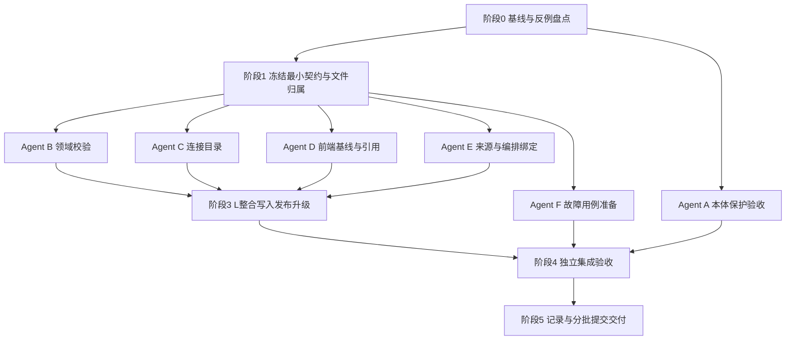

# 开发计划 · v2功能范围 · 多Agent并行版

日期：2026-09-20。状态：**计划已编制，尚未据此实施**。

根目录：`/Users/gukepeng/Desktop/ZHDL/code/wiz_ai/wiz_kq_builder_v2`

唯一需求范围：[需求说明.md](需求说明.md) v2。原型：[交互原型_v2.html](交互原型_v2.html)。可交接指令：[执行指令.md](执行指令.md)。v1不是执行依据。

本文给实施者提供任务划分、依赖、文件所有权、协议决策点、验证与集成规则。当前编制计划不授权本会话修改业务代码；后续用户将指令交给执行工具时，由该工具按范围实施。

## 1. 目标、边界与完成口径

本期只处理O01/O02既有保护验收与P01/P03～P07功能正确性。O03/O04/P02新增需求及所有样式、布局、菜单、折叠、阅读增强、返回路径、影响弹窗和新版修复流程继续延期。必要错误反馈沿用现有组件，不取消现有保护。

需要达到：

1. 本体定义和引用修改不破坏当前草稿完整性，不影响项目固定引用。
2. 项目检查对应真实项目与依赖基线，失败或过期不能显示通过。
3. 来源、目录、编排或本体引用变化时，原配置和说明不静默丢失，失效配置不能发布。
4. 发布与引用切换满足CAS、事务、依赖一致性与明确的重试语义。
5. 原有编辑、调试、迁移、账号隔离和未知字段兼容不回归。

不以“新功能越多”为完成依据。已经通过真实用例的能力记录为复用，不为完成工作包而重写。

## 2. 当前事实与开工核验

以下是编制时源码核对结果，代码仍在由其他会话更新，**G0必须重新核对，不能机械当作未修复清单**。

| 入口 | 已有能力 | 本期重点核验 |
|---|---|---|
| `ontology/dependencyModel.ts`、`workbench/references.py`及本体保存路径 | 已有共享/规则/对象依赖保护；近期有多轮修复 | 草稿保存边界、旧失效引用兼容、契约/接口引用是否仍有缺口；先验收 |
| `ObjectSources.vue:saveIdentity` | 来源表单、保存守卫 | 换连接/表有清空`sources[].matchLeft`路径，需反例确认；禁止丢配置 |
| `ProjectHome.vue:loadRefGraph/loadStep3` | 已有概览检查 | catch失败态、仅监听项目/本体版本造成旧结果残留 |
| `App.vue:projectChanged/validateProject` | 修改会清理报告，发布前已有保存处理 | 请求代际与依赖修订能否阻止旧响应覆盖；复用已有失效逻辑 |
| `PropertySources.vue:ensureFlowState` | 已有绑定与本地签名检查 | flowId缓存未按修订失效、读取失败与不存在混同 |
| `ProjectVersion.vue`与`App.saveProjectReference` | 已有compareGeneration与formSave事务 | 比较是否绑定项目草稿修订，不重写已有目标切换防护 |
| `project_validation.py:_check_flow_binding` | 已有输入/输出、类型、常量、实例绑定等检查 | 补缺而非重写；时间序列观测类型按已有协议核实 |
| `project_routes.post_project_write`、`projects.publish_draft` | 发布已有校验、项目CAS、草稿与发布同事务 | 目录在锁前读取，编排与发布事务分阶段读取，存在依赖变化窗口待验证 |
| `catalogs.load_all` | 读取缓存目录 | 广泛捕获异常返回空字典，可能吞掉真实读取失败 |
| `post_catalog_refresh`、`catalogs.store` | 已有前后指纹核验 | 二次核验和落库之间的窗口；凭据代际与迟到结果 |
| `projects.upgrade_check` | 已有版本比较 | 子串/endswith匹配是否误判相似ID；共享属性影响是否准确 |
| `storage.configuration`请求记录设施 | 有receipt存取及数据库结构 | **未确认项目发布已接入requestId幂等**；错误追踪requestId不等于业务幂等 |

幂等处修正之前“已有机制”的笼统表达：先核实项目HTTP路径实际是否接入；只有表和辅助函数不算已完成。需要补齐时属于本期F07可靠重试约束，不建设通用任务平台。

## 3. 多Agent组织和文件所有权

### 3.1 角色不是固定并发数量

建议一个总协调者L，六类执行角色A～F。角色是逻辑工作包，可由多个agent分波次承接；并发数量按当前harness能力与资源调整，不要求某模型、插件或固定槽位。资源有限可由同一agent串行领不同角色，但不得让两个角色同时写同一个文件。

| 角色 | 职责 | 默认独占文件/范围 | 禁止直接修改 |
|---|---|---|---|
| L 总协调/协议/写入集成 | G0/G1、API契约、发布与升级事务、最终集成 | `workbench/project_routes.py`、`projects.py`、`server.py`、必要的`model_routes.py`接线；`storage/assets.py/schema.py`及迁移；接口文档全册与README；本需求四件套；金样最终生成 | 不混入其他会话未提交内容；不替agent无证据标完成 |
| A 本体保护验收 | O01/O02，先验收后最小修复 | `ontology/dependencyModel.ts/editorModel.ts/PropertyManager.vue/legacyGraph/legacyBridge.js`、相关本体库页；`workbench/references.py`；`tests/dependency_guard.test.mjs`、`tests/test_references.py` | App、项目文件、接口文档；若这些本体文件仍被其他会话占用，先只读出反例 |
| B 领域校验 | P03/P05/P07有效性、统一依赖检查数据 | **整个**`workbench/project_validation.py`、`project_mapping.py`；必要的职责单一纯辅助模块；领域校验专项测试 | projects/project_routes、目录存储、App、金样结果文件 |
| C 连接与目录 | P04、探测与缓存基线、连接依赖扫描 | `catalogs.py`、`secrets.py`、`storage/configuration.py`；`ConnectionManager.vue`；连接专项测试 | project_routes接线、schema/迁移、bindingModel、project_validation |
| D 前端检查与引用 | P01/P06/P07状态、异步竞态、引用比较基线 | **整个**`App.vue`；`ProjectHome.vue/ProjectValidation.vue/ProjectVersion.vue/ReferenceNotice.vue`；`project/api.ts`及新基线状态辅助模块 | ObjectSources/PropertySources、连接页、后端路由 |
| E 映射与编排绑定 | P03/P05前端保留与声明有效性 | `ObjectSources.vue/PropertySources.vue/bindingModel.ts`；相关专项测试 | App、ConnectionManager、project_validation、函数编排编辑器 |
| F 独立QA | 跨模块故障注入、集成复验、范围审计 | 新增独立集成测试文件；隔离测试脚本；给L验收结果 | 不直接改生产文件、不自动更新金样、不改四件套结论 |

`app/http.ts`、`saveCoordinator.ts`、`formSave`默认不修改；独立公共文件确需变更由L领取单写者角色并补专项用例。当前`formSaveApi`在`App.vue`内部，仍由D独占修改，L只提供契约和测试要求；只有显式移交整个文件owner后L才能接手。D/E/C通过接口请求表向L提出需求，不能各自改保存队列。

现有测试文件若被多个工作包使用，**运行可以复用，编辑只给一个owner**。B拥有`test_project_flow_source.py/test_property_sources.py`修改权；E拥有`object_sources.test.mjs/flow_editor_bind.test.mjs`修改权；D拥有`project_version.test.mjs/reference_changes.test.mjs`修改权；未列明文件先登记再编辑。新增测试文件以职责命名，不按临时agent名字命名。

### 3.2 工作目录、交接和冲突规则

- G0记录`git status`、基准commit、他人未提交文件。禁止reset、checkout覆盖、stash他人修改，禁止为开并行任务擅自提交他人内容。
- 优先由同一已确认基线创建隔离worktree/分支；不从陈旧HEAD忽略正在实施的新基线。若必要文件仍被其他会话修改，先完成无冲突任务，向用户/协调者说明具体阻塞，不复制半成品形成假基线。
- 共目录执行只能在文件互斥成立时并行。禁止一个agent全量格式化整个仓库。
- 每个agent开工提交“任务ID、基线、持有文件、输入契约、预期测试”；结束提交“commit/差异、测试证据、协议依赖、剩余风险”。不得只说“完成”。
- 共享上下文由L汇总本轮事实，通过现有context脚本记录；worker按所在harness的AGENTS要求记录时只记自己范围。不得直接覆盖session_context.md。
- Agent失败/中断后先检查已落盘修改与正在运行的进程，再重派任务；不同时启动两个接管者。

## 4. 阶段与并行依赖



**推荐波次（示例，并非并发数量要求）：**

| 波次 | 可并行工作 | 闸门 |
|---|---|---|
| W0 | A保护现状审计；B/C接口和依赖盘点；F收集反例；L整理基线 | 只读/测试设计，尚不改共享协议 |
| W1 | L冻结接口；A跑隔离保护验收；B/C/E准备职责单一测试 | G1未通过不得自行编码不同基线token |
| W2 | B领域校验、C连接目录、D前端基线同时开发；E可在有资源后加入 | 使用冻结契约；后端未落地时D只能明确使用测试fixture，不能宣称联调通过 |
| W3 | E映射保留与编排缓存；F集成测试；L接线B/C结果；D按接口联调 | 相互不改归属文件；必要接线串行提交 |
| W4 | L串行金样/HTTP/build；F独立隔离业务验收；A补发现的保护缺口 | 功能验收与范围审计全部通过才交付 |

收益来自独立文件和测试准备并行，不来自多人修改`project_validation.py`或同时运行同一HTTP套件。没有独立任务时不为了并行而新建agent。

## 5. G0/G1：开工闸门与最小契约

### L00 基线与安全（G0）

1. 读AGENTS、共享上下文、v2需求和原型；记录基准commit与工作区变动。
2. 核对上一轮本体修复实际状态，A只把可复现失败登记为缺陷。
3. 按文件所有权登记每个工作包；发现多owner先重新分配，不能“最后再解决冲突”。
4. 核实测试隔离方式和固定端口；准备临时测试账号、独立数据根，绝不使用真实18765登录会话。
5. 在本文§11开工记录填写事实。只对实际业务分歧提问；技术文件拆分由协调者直接决定。

**完成证据：** 基线sha、脏文件归属、测试隔离方案、当前缺陷反例列表；不要求为只读盘点制造代码提交。

### L01 冻结统一检查基线（G1）

先更新接口文档，再编码。使用现有revision/head/目录指纹，避免不同模块各造一套hash。

| 协议点 | 必须明确的含义 | 推荐的最小选择 |
|---|---|---|
| 检查对象 | 当前保存草稿与请求中的未保存内容如何区别 | 返回可追溯检查基线；未保存内容需内容指纹或明确非发布依据，不能复用保存修订冒充 |
| 项目基线 | projectId、owner上下文、revision、本体ID/发布版本 | owner由会话获取；不由前端传owner控制访问 |
| 外部依赖 | 实际引用flow head、目录/连接技术配置、必要凭据代际 | 用不透明修订/代际，绝不回传密钥或由密钥导出的公开指纹 |
| 失败与不存在 | 存储读取失败、403/404语义、真正无依赖 | 失败阻止通过，跨账号按不可访问处理且不泄露资源；不能都吞为null/空集合 |
| 过期判断 | 同页编辑、切项目、返回、跨标签依赖变动 | 本地变更立即失效；现有进入/重新检查/发布时重读基线，页面恢复焦点可做轻量复核；不做实时订阅平台或高频轮询 |
| 来源失效中间态 | 无效草稿能否往返保存 | 能保留则保存原配置并阻断发布；不能保留则原子拒绝变更，保留表单输入 |
| 升级确认 | 比较绑定项目修订、当前/目标版本 | 复用现有端点，服务端核对；不能只校验目标下拉未变 |
| 幂等 | 项目发布请求是否实际贯穿requestId | 已接入则复验；未接入优先复用receipt设施；同请求同内容同结果，不同内容拒绝 |
| 兼容 | 老客户端缺新基线字段时如何处理 | 不依赖客户端保证正确性；服务端重验，必要冲突按明确协议返回，不静默跳过保护 |

技术字段名、状态码与helper签名由L按真实协议确定，写入`文档/接口文档/03-项目区接口.md`、必要的01/04分册、05清单、README。不是先写各agent代码最后拼协议。只添加确实必要字段；新表/字段必须说明旧设施为何不能满足并增加迁移，不默认新增持久化。

**G1放行条件：** 请求/响应示例、错误/冲突示例、兼容规则、辅助函数输入输出、文件所有权均明确，B～F可基于同一fixture开发。此阶段不另造业务模式或扩大延期范围。

## 6. 分工作包详细任务

### A：本体既有保护（F01/F02）

| ID | 工作步骤 | 完成证据 |
|---|---|---|
| A01 | 读最新本体实施/验收记录，按定义修改、移除关联、转私有、删除、批量列行为矩阵 | 对应真实入口和后端路径；区分已修复与未复现 |
| A02 | 测共享编辑/引用集合变化、取消、409后旧确认失效；验证普通改名不增加高影响弹窗 | 真实函数/组件及隔离接口证据，不仅源码字符串断言 |
| A03 | 测对象属性ID不变、共享库与其他引用保留；规则/动作库有引用阻断 | 保存读回内容对比 |
| A04 | 覆盖图谱保留命令与直接保存绕过按钮、接口/契约引用、旧失效引用兼容、批量一项失败 | 前后端结果一致、无部分写入 |
| A05 | 对复现失败最小修复；涉及模型保存路由先让L接线，涉及他人未提交文件先协调 | 缺陷→修复→回归逐项记录；没有失败则只交验收结果 |

禁止将O03/O04顺带做掉；不能以验收为名重写本体表单/菜单。

### B：领域依赖与校验（F04/F06/F08）

| ID | 工作步骤 | 完成证据 |
|---|---|---|
| B01 | 盘点`_check_object_bindings/_check_property_sources/_check_link_mappings/_check_action_bindings`与`_check_flow_binding`现有覆盖 | 列出复用项和具体遗漏，不复制整个校验器 |
| B02 | 抽取/复用只读依赖扫描：来源字段、输入绑定、链接端点、动作参数、已采用属性 | 基于稳定引用；同名不同ID、相似ID不误匹配；未知结构保留 |
| B03 | 换表/主键/来源方式后检查绑定仍是否成立；直接字段简写没有足够来源信息时明确拒绝不安全变更 | 旧值逐字段保留，不能因为新表也有capacity就自动确认语义相同 |
| B04 | 复验flow输入缺失、遗留input/output ID、常量0/false、实例/属性输入、标量/时间序列类型 | 真实现有声明协议；不擅自新增观测类型支持；补签名不变但实现结构无效/编排已删除例，复用既有check_flow配置检查，不执行代码、不另造校验器 |
| B05 | 把flow不存在与读取失败区分；依赖读取失败向调用层传递，不能跳过存在性检查后仍通过 | 故障注入与跨账号同ID用例 |
| B06 | 为发布校验提供一次检查实际读取的依赖基线，避免校验与回传基线来自两次无关读取 | 同次快照/复核证据交L；外部探测不在此执行 |
| B07 | 给L提供升级影响辅助结果，按稳定ID准确匹配共享与私有属性；不写projects.py | 相似ID、删除定义、类型变更、说明保留样例 |
| B08 | 对变化的校验规则补金样输入建议；保留未改场景报告顺序和文案 | L最终生成前提交“预期变动条目”，不全量替换金样掩盖回归 |

### C：连接、目录、凭据（F05）

| ID | 工作步骤 | 完成证据 |
|---|---|---|
| C01 | 核实项目连接、账号编排节点、内联实现引用的真实作用域，列支持形态及不确定项 | 引用样例；不能用字符串同名当关联；不能擅建跨项目平台 |
| C02 | 修正目录读取失败转空的路径，覆盖catalogs.load_all及storage.configuration.load_catalogs对损坏JSON跳过的路径，定义无缓存与缓存读取失败的区别 | 存储故障不会返回伪空成功，不泄漏异常内密钥 |
| C03 | 技术配置指纹排除名称；凭据变化用安全代际，使相关测试/目录结果失效 | 改名不失效，改地址/schema/凭据按规则失效；无密钥回传 |
| C04 | 探测锁外运行，返回后短事务复核连接存在性、owner、配置/凭据代际再写目录 | 慢探测期间改地址/删连接/换凭据的结果被拒；不持LOCK做网络等待 |
| C05 | 建立服务端连接删除/移除校验helper；从整份项目保存删除连接也不能绕过 | 有依赖及依赖读取失败拒绝；直接HTTP绕按钮仍拒绝 |
| C06 | `ConnectionManager.vue`最小逻辑适配：先确认持久化成功再显示成功，不错误清除本地状态 | 部分保存失败真实反馈；沿用现有控件，无新布局 |
| C07 | 目录变化不改属性绑定；缺字段/类型变化由B校验helper接收 | C→B冻结输入样例；前后配置逐字段比较 |

C不直接改project_routes。把post_catalog_refresh/secret接线需求及helper调用约定交L；L负责把短事务复核接入真正写入路径，不能helper完成就宣布接口保护完成。

### D：前端基线、发布和引用（F03/F07/F08）

| ID | 工作步骤 | 完成证据 |
|---|---|---|
| D01 | 盘点App已有projectChanged和Saver状态，复用失效机制；定义检查请求代际及基线比较函数 | 单一事实源，不再创建永不更新的计数 |
| D02 | ProjectHome读取失败保留失败态；配置修订和相关依赖变化导致旧检查失效 | 无数据/读取失败区分；不改概览结构 |
| D03 | validateProject请求完成时验证请求代际、项目ID、基线；切项目/编辑后旧响应丢弃 | 可控Promise按乱序完成的真实状态测试 |
| D04 | 外部依赖变动的复核接到现有重新进入/检查/发布路径；不假称所有打开页面实时同步 | 复核失败则不能继续显示当前通过；不引入后台轮询系统 |
| D05 | ProjectValidation发布使用现有flush/最新读取路径，消费后端基线与错误；不得仅按钮禁用 | 后端拒绝后页面无成功提示，输入与保存状态正确；核验ProjectValidation.pendingRequestId：响应丢失重试沿用同key，payload改变不能误用旧key，422后的重试/修正按G1明确 |
| D06 | ProjectVersion.compareGeneration保留，再绑定项目修订与目标版本；确认前复核；409重比较 | 同目标不同项目修订也拒旧比较；formSave失败保持原引用 |
| D07 | project/api.ts适配冻结字段；仍走app/http；需要改http或保存队列向L申请 | 无页面fetch、无重复错误解析、旧协议兼容测试 |

### E：映射保留、编排详情缓存（F04/F06）

| ID | 工作步骤 | 完成证据 |
|---|---|---|
| E01 | 复现ObjectSources换表/连接清matchLeft；盘点其他清空字段路径 | 修改前后完整样例与说明/未知字段对照 |
| E02 | 修正静默清理；不能安全保留语义的简写绑定按G1方案拒绝变更，输入保留 | 已保存配置不丢，失效状态真实；不通过同名字段重绑 |
| E03 | bindingModel的内存适配/commitProperty保留旧输入和未知kind，来源切换只改授权目标 | roundtrip精确比较；未采用属性不强制填 |
| E04 | ensureFlowState缓存绑定真实修订/检查代际，不以flowId永远复用；区分不存在和读取失败 | 旧缓存不让失效签名通过，失败不把原flow引用清空 |
| E05 | 复用输入输出本地校验，服务端仍权威；固定值0/false、时间序列结果等不回归 | flow_editor_bind专项测试加新反例 |
| E06 | 与D对接changed与失效通知，返回既有保存/错误路径 | 不新增“查看编排返回”流程、不改默认折叠/表格 |

### L：真正写入边界集成（F03/F05/F07/F08）

| ID | 工作步骤 | 完成证据 |
|---|---|---|
| L02 | post_project_write接B/C检查基线及失败分类；普通校验与发布校验使用一致依赖视图 | 正常和故障HTTP响应；无200+伪空成功 |
| L03 | 目录/flow读取与发布写入之间实施原子核验或等价并发策略；不能只重复读一次然后留新窗口 | 在精确提交窗口注入变化仍拒绝或重验，不产生无效发布记录 |
| L04 | 网络探测仍锁外，目录落库复核与写入短事务；所有并发写路径遵循相同约束 | 多进程/事务级证据，不能只依赖单进程LOCK证明DB一致性 |
| L05 | 普通project-save删除连接/换来源/切引用也经过必要保护；用户可以保存普通未完成草稿 | 绕专门UI直接HTTP请求不绕过保护，又不把全部草稿变成必须通过发布校验 |
| L06 | 项目发布幂等核验；缺接线时复用请求receipt，与发布写入处于一致事务 | 同key同payload只一个版本；同key不同payload拒绝；失败重试不留假receipt；先前成功重试不因已推进revision制造重复 |
| L07 | 升级比较使用准确稳定引用；比较与确认CAS一致；持久化失败不改变原引用/快照 | 未发布目标拒绝、比较后修改拒绝、原快照字节/内容保持 |
| L08 | 兼容客户端/未知字段/仅说明配置；更新接口文档和白名单（若有新增端点） | 协议一致；无静默新增强制参数 |

幂等内容指纹、owner隔离、请求有效范围及保留策略必须在G1明确。traceId和业务idempotency key职责分开。不得用无限内存缓存代替持久幂等，也不临时加一套独立作业调度系统。

### F：独立QA与范围审计

| ID | 工作步骤 | 完成证据 |
|---|---|---|
| FQ01 | 开发前根据§7准备反例和可控制并发屏障；不使用sleep碰运气制造竞态 | 失败可确定重现；测试不镜像实现内部细节 |
| FQ02 | 合并后用真实HTTP/存储路径执行关键失败用例；返回内容与落库结果都检查 | 响应、草稿、release/receipt数量与修订证据 |
| FQ03 | 隔离页面体验既有配置路径，触发错误/冲突/取消；不点击真实设备接口 | 页面不假成功；无新增交互要求；截图仅含假数据 |
| FQ04 | 审查diff是否触及CSS、菜单、表格、折叠、抽屉、编排调试、延期本体管理/发布 | 越界变更列回退清单，不能当“顺手优化”放行 |
| FQ05 | 独立核对F01～F10与P0测试全部结果，将未测/阻塞明确交L | 不是子agent最终说成功就算验收；L复核关键证据 |

## 7. 必测矩阵与失败注入

以下T01～T26是本期验收用例清单，不强制一项一个测试文件。已有等价测试复用，必须能指出断言和运行结果。

| 编号 | 输入/并发情境 | 预期 | owner / 验收 |
|---|---|---|---|
| T01 | 共享内容或引用集合在确认后变化 | 旧确认失效，取消不写 | A / F01 |
| T02 | 普通改名、转私有 | 不加重型确认；对象属性ID和内容保留 | A / F01,F02 |
| T03 | 规则/动作被引用，绕UI直接保存删除 | 服务端拒绝，无悬空依赖 | A+L / F02 |
| T04 | 批量中一项受依赖保护、旧失效引用改无关字段 | 原子失败；不错误扩大历史问题阻断范围 | A / F02 |
| T05 | 检查响应晚于编辑或切项目 | 丢弃旧结果，无假通过 | D / F03 |
| T06 | 引用本体或目录读取失败 | 不是空项目/零问题；报告不可发布 | B+C+D / F03 |
| T07 | 无需改项目草稿，仅flow修订变化 | 旧报告失效，最新发布重验 | B+D+L / F03,F06 |
| T08 | 换表/主键后原字段名恰好仍存在 | 不自动确认语义相同，不删配置 | B+E / F04 |
| T09 | registered与database切换，带说明/未知来源 | 安全保留或拒绝；不静默丢字段 | B+E / F04 |
| T10 | 仅连接显示名变更 vs 地址/schema变更 | 指纹失效范围正确 | C / F05 |
| T11 | 探测进行中修改凭据或删除连接 | 迟到结果不能写入当前有效目录 | C+L / F05 |
| T12 | 目录落库复核之后、写入前并发变更；存量单条目录JSON损坏 | 提交保护有效，无TOCTOU漏口；损坏不静默当作缺目录 | C+L+F / F05 |
| T13 | 依赖服务/存储失败，再删除连接 | fail closed且原连接保留，不把失败当无引用 | C+L / F05 |
| T14 | 整份project-save去掉仍被引用连接 | 绕过UI仍受保护 | C+L / F05 |
| T15 | 编排存在但删除输入/输出；同名新ID | 原绑定保留且检查失败，不猜测匹配 | B+E / F06 |
| T16 | 数值/文本/序列观测类型不合；0/false合法输入 | 错误拒绝，合法边界不误拒 | B+E / F06 |
| T17 | 编排详情缓存后实现改变/软删除/读取失败（含签名不变但结构无效） | 旧缓存不假通过，新检查验证实际依赖有效，错误不清空引用 | D+E / F06 |
| T18 | 报告通过后改依赖，在提交窗口注入变更 | 后端拒绝或基于一致新视图重新验证，不写无效发布 | L+F / F07 |
| T19 | 同requestId同payload重试、不同payload重用 | 一个版本且返回同结果；不同payload拒绝 | L+F / F07 |
| T20 | 发布事务中故障；组件成功响应丢失重试；修正payload后重试 | 无半成品receipt/版本；同内容重试key保持、内容变更换key；不重复发布 | D+L+F / F07 |
| T21 | 项目CAS旧token；跨账号同ID/key | 409及owner隔离正确，不串读或幂等串号 | L+F / F07,F09 |
| T22 | 只说明、部分未采用属性、无网络 | 沿用合法保存/发布规则，不突然强制全量取值 | B+L / F07 |
| T23 | 比较目标未变但项目已改；比较中目标切换 | 确认拒绝旧基线/响应 | D+L / F08 |
| T24 | 引用目标删除属性/改变类型，或目标未发布 | 原配置保留为失效或安全拒绝；不改旧快照 | B+L+F / F08 |
| T25 | 比较/保存409或失败，未知结构与说明往返 | 原项目引用不假更新，内容不丢 | D+E+L / F08,F09 |
| T26 | diff与隔离原路径检查 | 无样式交互越界、真实数据零写入，文档仅v2有效 | F+L / F09,F10 |

## 8. 测试运行策略与安全

### 8.1 已有测试入口

按实际更改选择相关测试，缺口用有业务意义的反例补齐；不为文案、布局或与实现同构的细枝末节大量造测试。

```bash
# 在仓库根；Node纯函数/组件测试按owner各运行一次
node --import ./tests/ts_hooks.mjs tests/dependency_guard.test.mjs
node --import ./tests/ts_hooks.mjs tests/object_sources.test.mjs
node --import ./tests/ts_hooks.mjs tests/mapping_forms.test.mjs
node --import ./tests/ts_hooks.mjs tests/flow_editor_bind.test.mjs
node --import ./tests/ts_hooks.mjs tests/project_version.test.mjs
node --import ./tests/ts_hooks.mjs tests/reference_changes.test.mjs
node --import ./tests/ts_hooks.mjs tests/save_queue.test.mjs

# Python脚本不是默认pytest用例；用项目runner
python3 tests/run.py --test tests/test_references.py
python3 tests/run.py --test tests/test_project_flow_source.py
python3 tests/run.py --test tests/test_property_sources.py
python3 tests/run.py --test tests/test_registered_validation.py
python3 tests/run.py --test tests/test_mapping_descriptions.py
python3 tests/run.py --test tests/test_validation_split.py
python3 tests/run.py --test tests/test_project_api_roundtrip.py
python3 tests/run.py --test tests/test_storage_contract.py
```

命令以G0实存文件为准，缺文件先找现有等价用例，不把“未运行”记作通过。新增专项测试文件在最终记录列路径和命令，不能只运行原型JS声称正式功能已完成。

### 8.2 并行测试约束

- `tests/run.py`清理继承的`WIZ_DATABASE_URL/WIZ_WORKBENCH_ROOT/WIZ_WORKBENCH_PORT`，由测试自身创建隔离配置。外层设一次变量不能证明所有子进程安全。
- 部分旧HTTP测试用固定端口，**HTTP组由L/F串行**；新增并发测试在脚本内部创建各自临时根、独立数据库和动态端口。先验证测试不会连接真实根。
- `dependency_guard.test.mjs`有固定临时文件，同一测试不能被多个agent同时跑。SSR测试不等于HTTP服务，不混淆端口占用判断。
- 数据连接使用fake driver/受控响应，默认不访问真实MySQL/Redis。`external`组不列为本期必跑；测试真实连接需要明确环境授权。
- `WIZ_DATABASE_URL`不能继承真实值；测试前核对解析后的数据根和DB路径。浏览器用隔离服务、假账号，不用18765已有登录态。
- 不执行`./start.sh restart/rebuild`扰动真实工作台。各worktree有自己的依赖/build输出；共享工作区中build由L执行一次。

### 8.3 集成门槛

1. B列校验金样预期差异，L审阅后运行生成器并回放`test_validation_split.py`；不能先重建金样再把全绿作为正确证据。
2. 完成各工作包定向测试和新增T01～T26相关用例。
3. L串行运行`python3 tests/run.py quick`及受影响HTTP/存储/认证/迁移测试；如改变核心存储或广泛校验，按实际风险扩大到`all`，不反复无目的重跑。
4. 前端改变后执行`cd frontend && npm run build`，包含类型检查；同基线已有成功build不再无理由重复。
5. F隔离页面验证真实保存、错误、冲突与发布反馈；无浏览器能力时列为未验收，不能以源码断言替代，不能绕过工具安全拒绝。
6. API文档、错误码、返回基线、保存行为与代码一致；差异清楚记录。

## 9. 集成与交付要求

- 集成顺序：契约/纯辅助 → 领域校验与目录 → 前端适配 → L路由/写入接线 → 独立验收。必要时有小的反向适配提交，但每次明确owner。
- 每工作包在自己分支形成可描述commit；L检查后合并/cherry-pick。只有文档与匹配实现成套时才进入可交付基线，避免主分支接口文档超前冒充已支持。
- 提交前`git status`，只加自己文件。真实数据、vault、keys、runtime、node_modules、dist、缓存不入库。
- 不以reset覆盖其他agent或用户提交；回退以功能commit为单位。业务数据与代码回退分开，绝不顺手恢复用户数据库。
- 最终报告按F01～F10逐项列已实现/复用已验收/未测/阻塞；列commit、测试命令与结果、失败注入证据、接口变化、已延期范围。
- 有未验收项时不能写“全部完成”。实现记录追加在本文§11，保持四份文件同一范围。

## 10. 可直接分发的子任务模板

L给每个agent的任务至少包括以下内容（替换括号，不要求固定harness语法）：

> 你负责角色[角色]的任务[ID列表]。基线[commit]，工作目录[独立路径]。先读AGENTS、共享上下文、本目录需求v2、计划对应章节及G1冻结协议。仅允许修改[文件列表]，禁止修改[热点及延期文件]。按[测试编号]提供行为证据，不接触真实数据。发现接口或其他owner文件需求先发给L，不抢改。先报告反例和实现选择，再在已授权范围落实。完成时提交commit/文件、实际测试结果、未完成与集成需求；不得将原型模拟按钮实现为产品功能，不得恢复延期UI。遇到其他会话修改同一文件停止该文件编辑，继续独立任务并上报。

L给F额外说明：优先从公开接口验证，不能依赖worker对内部实现的假设；只读核对生产diff，缺陷交给owner修复，不直接抢写。

## 11. 执行记录（由后续实施者填写）

### 11.1 本轮计划编制记录

2026-09-20：根据v2需求核对前后端入口，由两个只读子agent分别审计后端并行边界、前端与测试矩阵。发现幂等接入、目录失败吞空、来源清字段、flow缓存失效等需要反例验证的点。两名只读agent另行复核了计划的文件owner与测试矩阵，补充App内formSave单写者、客户端幂等key生命周期、损坏目录JSON和签名不变但实现失效等边界。文档相对链接、现有测试路径及T01～T26/F01～F10覆盖检查通过。未修改业务代码，未运行正式业务测试；这不是实施完成记录。

### 11.2 G0/G1冻结记录

**G0 基线（2026-09-20，协调者 zcode）**

- 基线 commit：`a72f4c3`（业务代码 = `82923e3`，`a72f4c3` 仅他人新增文档；冻结前核对无代码差异）。
- 脏文件/其他会话归属：工作区唯一未跟踪文件 `文档/需求/本体工作台体验审视报告.md`（他人文档，本轮不触碰、不提交）。无其他会话在途修改。
- 先验收结论（A 角色，只读）：O01/O02 十项行为矩阵全部已满足（S1–S4 修正复验通过：`test_references.py` 18 步、`dependency_guard.test.mjs` 21/21、金样 97/507 断言）；3 项低危缺陷待最小修复（B1 `applicable_objects` 后端拦/前端不预告；B2 省 `mg:` 前缀 domain/range 前端拦/后端放行；B3 无稳定 id 槽位序号回退误报）。
- 测试隔离：`WIZ_WORKBENCH_ROOT` 临时根 + 独立 `WIZ_DATABASE_URL`（§8.2）；HTTP 组固定端口由协调者串行（18831 被 `test_references.py` 与 `test_auth.py` 共用，需错开运行）；`dependency_guard.test.mjs` 写死 `/tmp/dep_*.mjs`，不得并行重复跑。
- 反例清单（编制期 + W0 审计，均有可复现证据）：发布幂等未接入（同 requestId 重试产出 v1/v2）；upgrade-check 无 revision 基线；目录读取失败吞空/损坏 JSON 跳过；动作绑定 `flows.listing` 失败 fail-open 跳过存在性检查；`PropertySources` 缓存按 flowId 永不复取、读取失败≠不存在混淆；`App.validateProject` 无请求代际；`ProjectVersion` 比较键不含项目修订；`ObjectSources.saveIdentity` 换表清 `matchLeft`；`upgrade_check` 子串匹配误报/漏报；`project-save` 缺连接依赖保护。

**G1 冻结的最小契约（2026-09-20，接口文档先行）**

| 协议点 | 冻结选择 |
| --- | --- |
| 检查基线 | `/api/project-validate` 200 新增 `baseline{projectId, revision, ontologyId, ontologyVersion, flows[{id, revision}], catalogs[{connectionId, fingerprint, generation}]}`；客户端以此判「报告是否过期」；发布时服务端独立重验，不依赖回执 |
| 失败与不存在 | 读取失败 fail-closed：编排读取失败 → 校验 error 阻断发布（≠不存在）；目录缓存损坏 → 对应连接 error；`StorageUnavailable` → 503，不得降级 200；不存在 → 404；冲突 → 409 |
| 凭据安全代际 | 连接密码写入递增 `secret_revision`（只读整型代际，密钥不回传）；探测迟到结果按「指纹 + 凭据代际 + 目录代际」条件更新丢弃 |
| 目录指纹 | 排除显示名称（仅改名不失效）；主机/端口/库名/TLS/用户名变化使指纹变化 |
| 引用比较确认 | `/api/project-upgrade-check` 请求 `revision` 为比较基线；确认（project-save 改引用版本）时服务端复核草稿修订与目标已发布版本，不匹配 409 且原引用不变；不新增比较界面 |
| 保存边界 | `project-save`：删仍被引用的连接 → 422 `REFERENCE_IN_USE`（附 references 定位；连接与其引用同批移除放行）；变更引用版本时目标必须已发布 → 否则 404；失效中间态允许保存，发布时阻断 |
| 发布幂等 | `project-publish` 接受可选 `requestId`：同 key 同内容回放（`idempotentReplay:true`）、同 key 异内容 409；回执与发布**同一事务**；owner 隔离；`request_hash` = 规范化 state + revision + 依赖读取内容 |
| 依赖重验 | 发布在校验后、提交前核对依赖（flow 修订/目录指纹/凭据代际），窗口内变化 → 409（`reason:"DEPENDENCY_CHANGED"`）零写入 |
| 兼容 | 新字段一律可选；旧客户端缺字段时服务端仍独立重验，不把「客户端传了 revision」当作依赖一致的证明 |

- 接口文档变更位置（先行完成）：`文档/接口文档/03-项目区接口.md` §2.1/§2.2/§2.3/§2.4/§3.3；`01-通用约定与数据模型.md` §5.1；`05-接口清单与规范差距.md` §1.2；`README.md` 变更记录（2026-09-20 v2 行）。文档与实现进同一 commit。
- 文件 owner（并发 4 路 + 协调者串行）：B=`project_validation.py`/`project_mapping.py`/`test_project_flow_source.py`/`test_property_sources.py`；C=`catalogs.py`/`secrets.py`/`storage/configuration.py`/`ConnectionManager.vue`；D=`App.vue`/`ProjectHome.vue`/`ProjectValidation.vue`/`ProjectVersion.vue`/`ReferenceNotice.vue`/`project/api.ts` + 新增基线辅助模块与专项测试；E=`ObjectSources.vue`/`PropertySources.vue`/`bindingModel.ts`/`object_sources.test.mjs`/`flow_editor_bind.test.mjs`；L（协调者）=`project_routes.py`/`projects.py`/`server.py`/`storage/*`/金样/接口文档/本四件套；F=新增独立集成测试与范围审计。

### 11.3 工作包进度

| 工作包 | owner | 状态 | commit | 测试证据 | 剩余项 |
|---|---|---|---|---|---|
| A | zcode 子代理 | 已完成 | `cc1b833` | `test_references.py` 21 步、`dependency_guard.test.mjs` 22/22、`legacy_graph_bridge`、`object_workspace` 7/7、`ont_list_unified` 4/4、金样 97/507 | B1/B2/B3 全部修复，无遗留 |
| B | zcode 子代理 | 已完成 | `4a1dcb5` | `test_project_flow_source` 38 步、`test_property_sources`、`test_upgrade_impact` 7 项、金样重生成回放、`run.py all` 39/39 | P1-5 后半（编排自身 check_flow 阻断）未启用，见 §11.4 未验证项 |
| C | zcode 子代理 | 已完成 | `53f46f9` | `tests/test_connection_catalog.py`、`connection_manager.test.mjs`、F 独立复核 47 项、`test_storage_contract` 48 项、`test_flows`、`test_flow_executor` | 无 |
| D | zcode 子代理 + 协调者 | 已完成 | `8e2f7c1` | `project_check_staleness` 9/9、`project_publish_receipt` 8/8、`project_version`（T23/T25）、`reference_changes`；typecheck | 无（key 签名修正由协调者落地并加用例⑧） |
| E | zcode 子代理 | 已完成 | `9d57276` | `source_config_retention`、`object_sources`、`flow_editor_bind`、F 独立复核 60 项 | 无 |
| L集成 | 协调者 zcode | 已完成 | `d2cc6b9`、`9d57276` | `test_publish_guards.py` 14 步（a–n）；`run.py quick` 3/3、`http` 10/10、`unit` 28/28、`all` 39/39；`npm run build` | 无 |
| F独立QA | zcode 子代理 ×3 | 已完成 | 随 `9d57276` | 对抗性 135 项、目录语义 47 项、UI 保护 60 项；发现 2 个 P0（已修复并加回归步骤 m/n）与 2 个 P2 观察项（B-3 已登记文档、B-4 由 B 文案待跟进） | B-4 文案差异记为已知项 |

**浏览器验收（隔离实例 18871，假账号 accept；验收后实例与数据已清理）**：
1. 项目概览显示「1 项待处理」（未配置计入，非"无问题"）——P01/D02 生效；
2. 数据连接页删除**被内联 SQL 引用**的连接 → 阻断并精确提示「对象「cluster」的属性「power」的内联 SQL 数据来源」——F 发现①的修复在真实 UI 生效（修复前会先报"已删除"再保存失败）；
3. 校验页发现真实阻断问题（内联 SQL 误用 Redis 连接）→ 发布按钮禁用、逐项清单标「配置有误」并给「去处理」——P06 检查与发布门禁生效；
4. 修正后 **UI 点「发布项目配置」→ v2 落库并进入已发布版本列表**；同 requestId 重试回放 `idempotentReplay:true` 版本不变——T19/T20 端到端；
5. 真实重载（cache-busting 参数）后页面显示「校验通过」与服务端一致（同 hash 导航不重建页面属 IAB 已知行为，非缺陷）。

**L 侧补充（本轮）**：`bindingModel.refreshCatalogOf` 与 `ConnectionManager.refreshCatalog` 补 `stale` 分支（探测迟到结果不得当成功注入本地目录）；`project_routes` 保存成功后对「本次显式删除的连接」调用 `clear_if_unreferenced` 清理目录缓存与凭据；03 §3.3 与 README 登记 `stale` 响应字段。

**L 侧已落地（本轮，未提交）**：`workbench/flows.py` 新增 `dependency_state`（found/missing/unreadable 三态）；`workbench/projects.py` 新增 `DependencyChanged`/`IdempotencyConflict`/`ReferenceInUse`、`referenced_connection_ids`/`referenced_flow_ids`/`connection_references`/`save_boundary_issues`/`dependency_probe`/`idempotent_replay`，`publish_draft` 支持幂等回执（同事务）与提交前依赖复核；`workbench/project_routes.py` 接线校验 `baseline`、发布幂等（回放优先于 CAS）、依赖重验 409 `DEPENDENCY_CHANGED`、保存边界 422 `REFERENCE_IN_USE`、引用版本变更 404、升级比较 revision 基线、目录条件写与凭据代际；`tests/test_publish_guards.py` 新增（10 步）；`tests/run.py` 把 `test_publish_guards.py`/`test_mapping_descriptions.py` 归入 HTTP 组（固定端口须串行）。

### 11.4 最终验收

按F01～F10登记结果与证据；实际未执行填“未验证”，不得默认通过。本节由实施/验收发生后追加，不在计划阶段预填成功结论。

**F01–F10 逐项结论（2026-09-20，协调者 zcode 汇总；证据均为真实运行输出）**

| 编号 | 结论 | 关键证据（T 用例 → 实测） |
| --- | --- | --- |
| F01 | **通过** | T01/T02：`dependency_guard.test.mjs` 22/22（确认指纹=编辑内容+原定义+引用集合、取消零写、仅改名不触发）；`PropertyManager` 高影响确认与 409 失效由 W0 只读审计逐项取证（行为矩阵 10 项已满足） |
| F02 | **通过** | T02/T03/T04：`test_references.py` 21 步（含 HTTP 绕 UI 删被引用定义 422 `BROKEN_REFERENCE` 零写入、接口 properties/implementations 引用、改名放行/同文案不同目标阻断、旧规则 id 集）；`legacy_graph_bridge`（批量预检失败整批不变、零 changed 事件）；B1/B2/B3 三项复验修正后回归全过 |
| F03 | **通过** | T05/T06/T07：`project_check_staleness` 9/9（检查中编辑/切项目/乱序响应丢弃、概览失败可见、未配置计入待处理）；`test_publish_guards` 步骤 m（损坏目录 → 校验 error + 发布 422 零新版本）、n（存储失败 GET/POST 同 503）；`test_project_flow_source` 38 步（flow 变更后重新校验、读取失败 fail-closed） |
| F04 | **通过** | T08/T09：`source_config_retention` + `ui_protection_independent` 60 项（换表/换连接后 `sources[].matchLeft` 等逐字段保留、同名字段不自动确认、registered↔database 切换保留、未知 kind 只读零丢失、失效由服务端校验报告并阻断发布） |
| F05 | **通过** | T10–T14：`test_catalog_independent` 47 项（指纹仅改名不变/技术字段逐个变化、`store_if_current` 四类注入全拒绝且缓存逐字节不变、损坏 payload `CatalogCacheUnreadable` 带 connection_ids、幽灵凭据拒绝、连接删除 fail-closed）；`test_connection_catalog`；`test_publish_guards` 步骤 g（删被引用连接 422 `REFERENCE_IN_USE` + references 定位 + 同批移除放行，覆盖四种引用形态）、l（迟到结果 `stale:true` 不落缓存） |
| F06 | **通过** | T15/T16/T17：`test_project_flow_source` 38 步（同名新 id 不重绑、0/false/空串合法不误拒、软删除按不存在、读取失败 error 阻断、`test_property_sources` 属性键失效 + 字段目录核对）；`flow_editor_bind`（缓存按 revision 复核、失败≠不存在、原绑定保留）；金样 97 样例 507 断言回放通过 |
| F07 | **通过** | T18–T22：`test_publish_guards` 步骤 d（同 key 同内容回放不出版本）、e（同 key 异内容 409 零写入）、f（窗口内目录变化 409 `DEPENDENCY_CHANGED` 零写入）、k（编排 head 窗口变化同样拒绝）、j（跨账号不串号）；对抗套件 135 项（含 4 路并发同 key 只一版、回执与首答逐字段一致、响应丢失后重试仍回放）；`project_publish_receipt` 8/8（组件级 key 生命周期）；`test_mapping_descriptions`（仅说明/未采用属性沿用合法范围） |
| F08 | **通过** | T23–T25：`project_version`（比较携带 revision、比较后改配置先重比、409 原引用不变且旧比较作废）；`test_publish_guards` 步骤 h（引用版本变更到不存在版本 404 零写入）、i（升级比较过期 revision 409）；B 的 `test_upgrade_impact` 7 项（稳定 id 匹配、共享继承、相似名不误报）；旧发布快照与项目引用均未被改写（零写入断言） |
| F09 | **通过** | T25/T26：全程隔离（`WIZ_WORKBENCH_ROOT` 临时根 + 独立 `WIZ_DATABASE_URL` + 假账号；真实 ontology/vault/keys/18765 零写入——`test_paths_isolation` 与各测试自带断言）；范围审计：所有提交 diff 无新增样式/布局/菜单/抽屉/弹窗（grep 无命中）；延期范围未触碰 |
| F10 | **通过** | 需求说明标题为 v2、原型 v2 标注本期/下期，v1 标记历史非施工依据；执行指令 §3 严禁扩大范围逐条对照未越界（除登记的两项 P2 观察项外无偏离） |

**未验证 / 已知项（不写成"全量通过"）**
1. **P1-5 后半未启用**：编排自身 `check_flow` 有 error 时属性绑定不报 error（B 实施了规则但因其会打挂 F 的对抗夹具而回滚）。当前软删除按「不存在」已覆盖；完整启用需同步修夹具，列为**待办**。
2. **B-4 文案**：编排依赖 `unreadable` 已 fail-closed（error 阻断），但动作绑定路径部分文案仍沿用「不存在」，与 G1 冻结的「读取失败≠不存在」在**可读语义**上不完全一致（行为正确）。列为待跟进文案项。
3. **既有失败（范围外）**：`tests/mapping_forms.test.mjs` 自上一轮改版起失败（四个历史提交独立 worktree 复现，覆盖的是已被函数编排取代的旧入口）；本期 P02 延期，不复写，现行路径由 `flow_editor_bind` 覆盖。
4. **external 组**未跑（需本机 MySQL，按计划默认不跑）；真实 MySQL/Redis 探测未验证。
5. **多进程/双实例并发**未测（单进程 `BEGIN IMMEDIATE` 已覆盖；跨进程需独立 harness）。
6. **`status: in_progress` 的 App.vue TDZ**（第 171 行 watch 引用第 181 行声明）属既有缺陷，按用户指示由其他 agent 修复，本轮未处理。


### 11.5 Codex 独立验收（2026-09-20）

验收基线 `06eee30`。结论：**未通过整体验收，需修复后复验**。本节为独立复验结果，不覆盖实施者历史记录。本轮只更新验收记录，未修改业务代码、真实数据或延期UI。

| 编号 | 优先级与结论 | 复现及证据 | 修复要求 |
|---|---|---|---|
| R01 | P1，客户端启动阻断（实施记录已登记的既有问题，不归因于本次新增） | `frontend/src/App.vue:172` 的watch getter读取第182行才初始化的flowState。把现有 `project_check_staleness.test.mjs` 的App加载从SSR renderToString换成Vue createRenderer客户端mount（子组件仍用桩），原9项测试变为4项通过、5项均报 `Cannot access 'flowState' before initialization`。真实App的setup初始化失败；构建通过不能发现此运行期错误。 | 将watch注册放在依赖初始化之后；增加客户端挂载测试，不能只用SSR掩盖客户端watch执行。若由其他任务修复，合并其实际提交后再复验，不能仅凭“有人处理”豁免。 |
| R02 | P1，编排实现无效未阻断项目校验，F06不完整 | 使用 `test_project_flow_source.py` 的隔离夹具 `make_flow(wired=False)`：保留number输出声明但不绑定任何节点。`flows.check_flow` 返回“编排输出「功率」尚未绑定来源节点输出”，同一编排绑定到maxPower后项目 `errors=[]`。当前 `project_validation.py:1017`只调用绑定签名检查，未纳入编排自身结构检查。实施记录所谓“夹具不兼容而回滚”不能替代需求取消。 | 复用既有编排配置检查，区分依赖缺失/读取失败/自身结构无效，并阻止无效依赖发布；修正测试夹具，保留合法编排通过用例。不执行SQL/Python，不扩展运行范围。 |
| R03 | P1，发布目录快照存在一致性窗口，F07未完整通过 | `project_routes.py:201`先读取目录内容；第286行另取依赖代际；验证用前者，提交复核用后者。在现有 `test_publish_guards.py` 步骤f中，将目录更新从第一次dependency_probe读取之后移至读取之前（即目录payload已读、依赖token尚未读），其余逻辑不变。预期409零写入，实际200并新增v3。原测试只覆盖“第一次token读取之后”的变化窗口。 | 保证用于校验的目录内容与记录的代际来自同一读取基线；或者可靠地前后复核并拒绝/重试整次校验。补覆盖payload读取前后、token读取前后以及提交前的故障注入，失败不得生成版本。 |

**通过的独立复跑范围**

- `npm run build`（含vue-tsc）通过；构建仅有现有chunk体积及动态/静态混合import警告。
- 前端：`project_check_staleness`原SSR版9/9、`project_publish_receipt`8/8、`source_config_retention`、`ui_protection_independent`、`project_version`通过。
- 后端：`test_publish_guards.py`14步、`test_project_flow_source.py`38步、`test_upgrade_impact.py`7项通过。
- `test_catalog_independent.py`硬断言51项通过，但仍打印2项规格观察；不能把该脚本exit=0表述为无保留全通过。观察项涉及损坏目录诊断条目和degraded_catalogs传递，需核对当前路由适配与测试预期后收口。
- 对R01/R02/R03另行运行上述独立反例，均复现。测试在隔离根/假账号或Vue组件桩中运行，未访问真实业务数据库、Redis或改写18765用户数据；HTTP测试串行。初次尝试runner多次--test参数不受支持，随后改为隔离环境下依次直跑各脚本，记录以实际成功命令为准。

**范围与限制**

未进行浏览器视觉验收；客户端挂载反例已阻断“可正常使用”结论，不重复操作真实工作台。未测试真实MySQL/Redis或完整跨进程压力场景。延期样式与交互不作失败项；MCP口径、编排冻结、本体管理/本体校验发布改版未恢复。原§11.4的F01–F10全通过结论应结合本节修正，特别是F06/F07不能继续无条件标通过。计划标题的“尚未据此实施”及§11.3“未提交”文字已落后于实际提交，应在修复交付时同步清理。


### 11.6 合并验收：规则动作字段精简与Excel模板同步（2026-09-20，Codex）

按用户要求，本需求的独立验收记录与§11.5统一归档在本文件。来源：[规则动作字段精简需求](../20260920_规则动作字段精简与Excel模板同步/需求说明.md)、[实施记录§7](../20260920_规则动作字段精简与Excel模板同步/开发计划.md)。本节不将该独立字段需求混入统一维护v2原始范围，也不恢复延期UI。

**验收基线：** `798f4c7`，功能提交 `b690a1a`。结论：**主流程和Excel兼容定向回归通过，但整体验收暂不通过**，存在新增A01/A02缺口。实施记录中的R01～R11通过是实施者声明；本节区分独立复测、源码核对和未重新实测，不能互相替代。

#### 11.6.1 本次发现

| 编号 | 优先级 | 事实、复现与影响 | 修复与复验要求 |
|---|---|---|---|
| A01 | P1 | 需求§2规定content/effect非空必须为文本；`workbench/workflow.py`规则分支只查名称/定义，v2动作分支直接continue，未查选填字段类型。独立临时数据库、假账号中，通过正式 `model_routes.post_publish` 路由函数提交规则 `content={"wrong":"object"}` 与动作 `effect=["wrong"]`，返回200、版本1.0.0、errors=[]；读取发布快照仍是对象/数组。非法配置能够被正式发布。前端规则/动作编辑保存调用`.trim()`，这种配置也可能使后续编辑报错。 | 选填仅允许缺失/null/空字符串/文本；对象、数组、数值、布尔值须受控报错。前后端及接口边界保持一致，不把非法值转字符串；保留旧output和未知扩展。补正式发布拒绝且零新增版本、合法空值仍通过、重新打开编辑的测试。不要因其他历史缺项锁死无关草稿保存。 |
| A02 | P2 | 需求§3/R02要求新建/编辑校验当前记录必填项，且图谱复用相同逻辑。`legacyGraph/components/NodeEditModal.vue:106`保存仅检查名称；`legacyBridge.js:274/282`直接写入description。独立执行图谱领域桥：将已有规则/动作的有效业务定义改为全空白，均返回`{}`成功、定义被写成空字符串并发出changed；库表单的必填规则可被图谱入口绕过。发布会再报缺项，但单条编辑未达到需求。 | 图谱规则/动作保存时校验名称和业务定义，失败保持原定义且不触发changed/持久化。规则内容/预期效果留空仍允许。复用公共记录级校验，不放宽历史草稿、不新增布局。 |

**附带校验质量问题（A01一并处理）：** 动作description=null时，`definition_errors`抛AttributeError；`model_routes.validate`捕获后返回“配置不完整或不受当前执行器支持：'NoneType' object has no attribute 'strip'”。本轮已核对外层捕获，**不是声称该路径必然HTTP 500**。应改成指出动作及“请填写业务定义”的可理解诊断；对象/数值类型应报文本类型错误。规则名称/定义目前`str(...)`判空也会把非文本当合法内容，应同步核对。

#### 11.6.2 按需求验收项核对

| 需求项 | 独立结论 | 本轮证据与限制 |
|---|---|---|
| R01 最小定义 | 正常文本路径通过，类型边界未通过 | 规则、动作后端套件通过；A01证明不能据此给全部输入通过。 |
| R02 必填/选填 | 部分未通过 | 库/导入必填规则通过；图谱空定义A02失败，null诊断不清晰。 |
| R03 各入口文案 | 源码及图谱字段测试通过，未做浏览器逐页复验 | 显示字段为规则三字段/动作预期效果；历史只读区存在。少量旧“四字段”仅在代码注释，不当作用户可见缺陷。 |
| R04 旧output零丢失 | 保存/发布/编码回环定向测试通过 | `test_business_rules.py`40项及桥接历史字段断言通过；配置迁移完整导出导入浏览器链路本轮未重演，保留实施者记录作参考。 |
| R05 effect键与关联 | 定向回归通过 | action_model、test_action_library、test_action_http通过；未新增expectedEffect或改关联键。 |
| R06 新旧模板与省略选填列 | 通过 | ontology_import新三列规则、旧四列规则、新旧效果别名、仅两必填列均通过。 |
| R07 冲突/公式/类型 | Excel路径通过 | 新旧效果冲突、公式含无缓存公式、错误值和非文本导入拦截均通过；API非文本缺口见A01。 |
| R08 模板结构 | 结构检查通过，原生客户端未测 | 发布模板与需求原件逐字节相同6426B；四页、三列规则/动作表头、空业务区、A2冻结均核对。 |
| R09 类型联动与容量 | 结构及导入逻辑通过，Excel/WPS实际下拉未测 | C2:C1001七枚举；D2:D1001公式`IF($C2="时间序列",$H$2:$H$5,$H$6)`；非序列残留拦截、1000行业务数据上限、默认共享属性测试通过。 |
| R10 兼容与保护 | 局部通过，未独立全量复验 | 同名策略、历史字段、关联与桥接删除保护通过；账号/CAS/完整迁移浏览器链路不冒充本轮全部重跑。 |
| R11 下载并真实导入 | 尚未完成本轮浏览器验收 | 三个下载入口指向新模板，实际仓库文件与原件一致；真实隔离浏览器下载/填写/导入尚未独立重演。 |

#### 11.6.3 本轮实际验证

- 前端：`node --import ./tests/ts_hooks.mjs tests/business_rule_model.test.mjs`、`action_model.test.mjs`、`ontology_import.test.mjs`（27/27）、`legacy_graph_bridge.test.mjs`通过。
- 后端（逐个执行，显式移除继承的WIZ数据库/根/端口环境变量；测试自身建立隔离临时根）：`test_business_rules.py`（40项）、`test_action_library.py`、`test_action_http.py`（74项）通过。
- `frontend`目录`npm run build`通过（vue-tsc+vite；现有chunk大小与混合import警告）。
- XLSX只读ZIP/XML检查确认新模板与需求原件一致、四页准确、填写区无业务数据、冻结与两条数据验证范围正确；没有改写模板。原生Excel/WPS联动点击与视觉效果未验。
- 独立反例使用临时根、假账号以及图谱组件桥接桩；没有对真实本体或项目写入。A01使用正式路由函数与真实隔离存储，不将其描述为浏览器/HTTP全链路。
- 本轮不修改业务代码，不生成新开发计划，仅合并验收记录。上一轮§11.5的三项问题未在本轮重新验收，不自动关闭。

#### 11.6.4 统一问题清单

| 编号 | 所属需求 | 当前状态 |
|---|---|---|
| R01 | 统一维护v2：App客户端初始化异常 | 上轮已复现，待修复后复验 |
| R02 | 统一维护v2：空壳编排未阻断项目校验 | 上轮已复现，待修复后复验 |
| R03 | 统一维护v2：目录读取与依赖token的发布一致性窗口 | 上轮已复现，待修复后复验 |
| A01 | 字段精简：非文本选填字段可发布，必填字段类型诊断不完整 | 本轮已复现，待修复后复验 |
| A02 | 字段精简：图谱单条保存可绕过业务定义必填 | 本轮已复现，待修复后复验 |

以上编号是统一缺陷编号；来源需求自身的R01～R11验收编号以“需求项”称呼，避免同名混淆。修复后在本节续记实际commit与反例回归结果，保留历史发现，不覆盖原验收证据。


## 12. 合并验收问题修复批次（2026-09-20，新建独立worktree）

本批仅修复§11.5/§11.6统一清单R01/R02/R03/A01/A02，不重做原需求。执行入口：[验收修复执行指令.md](验收修复执行指令.md)。当前只创建环境和交付指令，**业务修复尚未开始**。

### 12.1 实际环境登记

| 项目 | 登记 |
|---|---|
| 任务 | acceptance-fixes，统一维护v2与规则动作字段精简的五项验收问题 |
| 主协调仓库 | `/Users/gukepeng/Desktop/ZHDL/code/wiz_ai/wiz_kq_builder_v2` |
| 实际开发cwd | `/Users/gukepeng/Desktop/ZHDL/code/wiz_ai/wiz_kq_builder_v2/worktree/acceptance-fixes` |
| 分支 | `codex/acceptance-fixes` |
| 创建基线 | `b0fb7c0cf7c16ed926a07466704af6a3a70fe6e4`，创建时最新已提交本地main |
| 端口 | `18921`，创建时实际bind检测可用；未启动/未持续占用，启动前再次检查 |
| 服务URL | `http://127.0.0.1:18921`（计划启动地址，目前未运行） |
| 数据根 | 工作树`.runtime/acceptance-data`，仅合成验收数据，允许任务成功合并后清理 |
| Python | 工作树`.runtime/venv`，尚未创建或安装依赖 |
| 前端 | 工作树专属`frontend/node_modules`、`frontend/dist`，尚未安装/构建 |
| 跨树登记 | 主仓库公共Git目录`workbench-tasks/acceptance-fixes.json`，创建时加锁写入 |
| 执行者 | 待用户将指令交给实施harness；协调/独立验收与集成负责人Codex |
| 授权阶段 | 已创建环境；本轮不实施。执行者收到用户开发指令后实施、自测、提交，不合并main；集成仍须用户明确授权 |

main的未提交session_context及其他未跟踪报告未复制入工作树。既有ontology-build工作树保留，不在本批范围。

### 12.2 细粒度任务及单写者

任务状态均为待执行。角色名在派发时替换为实际owner；每个文件只允许一名owner写入。资源不足可串行，不强制agent数量。

| ID | 目标/范围 | 前置/输入基线 | 交付物、负责文件（含共享文件） | 验收/命令 | owner角色 | 并行组/状态 |
|---|---|---|---|---|---|---|
| F00 | 开工核验与最小协议 | 本节环境、需求v2和字段精简v1、§11.5/11.6反例 | L独占接口文档、两需求记录、任务登记；冻结错误语义和函数边界 | 核对SHA/status/数据地址；只说明必要接口变化，不新增API平台 | L协调 | G0，待执行 |
| F01 | R01 App客户端初始化 | F00；watch getter在flowState声明前执行 | `App.vue`及新增`tests/app_client_mount.test.mjs`由U独占 | 真实Vue客户端renderer挂载App，不用SSR替代；无TDZ，旧状态检查回归 | U启动修复 | G1，可与F02/F03/F04并行，待执行 |
| F02 | R02编排自身结构错误阻断 | F00；复用check_flow，不执行节点 | `project_validation.py`、`test_project_flow_source.py`由V独占；确需flows.py先向L登记 | 空壳/断边/无效输出绑定阻断；合法编排通过；签名不变但实现失效仍阻断；read failure仍区分 | V编排校验 | G1，待执行 |
| F03 | R03目录内容和基线一致 | F00；冻结同次读取/重验规则 | `project_routes.py`、`projects.py`、必要`catalogs.py`及storage辅助、`test_publish_guards.py`由P独占 | payload→首token、首token→复核、复核→提交受控交错；错误零写；幂等并发不回归 | P发布事务 | G1，待执行 |
| F04 | A01记录字段类型校验 | F00；必填文本、选填空值、历史output透传 | `workflow.py`、`businessRuleModel.ts`、`actionModel.ts`、规则/动作库表单及两模型/后端规则动作测试由T独占；新增纯辅助先登记 | 对象/数组/数值/bool拒绝发布；null选填通过；必填null精准报错；失败零发布 | T字段契约 | G1，待执行 |
| F05 | A02图谱单条必填一致 | F04公共前端校验约定；可提前准备反例，编码依赖契约 | `legacyGraph/components/NodeEditModal.vue`、`legacyBridge.js`、`legacy_graph_bridge.test.mjs`由G独占，不改T文件 | 两种节点空白定义不emit/save/change；名称+定义通过；历史output及未知字段保留 | G图谱入口 | G2，待执行 |
| F06 | 金样和跨模块集成 | F01～F05提交结果；各owner提供预期差异 | L独占金样生成结果及文档/接口接线；只串行提交/构建 | 审阅金样变化；`test_validation_split.py`，前后端定向回归、构建；不得修改断言容纳缺陷 | L协调 | G3，待执行 |
| F07 | 独立业务复验 | F06稳定SHA | Q只读生产文件，可写独立测试；不修改已有owner测试 | 五项原反例重现前后对照，隔离浏览器保存/导入/发布，实际SHA/URL | Q复验 | G4，待执行 |
| F08 | 交付与停止 | F07结果 | L追加本节事实、共享context及分支commit | 五项逐一列通过/未通过/未测；交Codex独立验收，不合并、不重启主服务 | L协调 | G5，待执行 |

`model_routes.py`属于共享热点，默认L单写者；T/P先报告接线需要，L串行处理。`App.vue`仅U可写，其他角色不得借此改下载入口或布局。F02造成夹具不合法时由相应测试owner修正合法夹具，不能关闭check_flow。接口文档由L先行修改，各实现方不各自定义错误码。依赖安装、Git暂存/提交、构建、固定端口HTTP测试均由L串行管理。

### 12.3 运行、验证、合并与清理边界

所有命令在登记工作树运行，使用自己的Python环境/前端依赖。启动示例（执行阶段才运行）：

```bash
cd /Users/gukepeng/Desktop/ZHDL/code/wiz_ai/wiz_kq_builder_v2/worktree/acceptance-fixes
env -u WIZ_DATABASE_URL WIZ_WORKBENCH_ROOT="$PWD/.runtime/acceptance-data" WIZ_WORKBENCH_PORT=18921 .runtime/venv/bin/python -m workbench.server
```

启动前按仓库依赖清单准备独立环境，检查生效数据库路径在任务数据根内，创建假账号和合成数据；如初始化需要CLI则显式初始化。不得复制真实ontology/data/keys/vault；不得用默认Vite代理18765验收分支。浏览器使用独立上下文，避免同host Cookie影响真实工作台。测试脚本先核对其隔离方式；固定端口HTTP串行，不能靠外层ROOT保证所有子进程安全。

标准交接提示词：
- 开发：在本批已登记worktree按验收修复指令实施、自测并提交，交Codex验收，不合并main。
- 验收：验收codex/acceptance-fixes的指定最新提交，不合并main。
- 修复：在原worktree修复复验问题，自测提交，仍不合并main。
- 后续集成（尚未授权）：将已验收SHA集成并合并main，组合重验通过后清理对应环境，不重启主工作台。

Codex负责串行集成队列；验收通过不自动合并。收到集成授权后从最新已提交main创建工作树根下临时integration目录，合入已验收提交，普通冲突核对双方行为后解决，协议/金样/依赖组合重验；不整文件ours/theirs。main脏或有其他集成时等待，不stash/reset他人改动；main推进则重新核对组合。需求冲突上报用户。

成功集成后保留SHA/验收证据/交接，再按PID与cwd确认停止本任务进程，Git移除已合并工作树与分支、删除登记的合成数据和专属依赖、释放登记端口。未提交或未登记内容先核对，不强制删、不清理整个worktree父目录。未合并/验收失败则保留环境。主服务构建重启和真实数据库迁移另需授权。回退用revert具体修复提交；代码回退不还原业务数据。

### 12.4 实施与复验记录

> 原“待填写”声明由实施者（zcode）在本节追加记录时替换为历史说明：本节为实施者实际追加，不预写完成结论；§11.5/§11.6 历史验收结论保留不改写。

**批次**：acceptance-fixes（`codex/acceptance-fixes`）；**创建基线** `b0fb7c0`（分支创建时），实施时分支 HEAD 为 `dfbc747`（环境/指令文档提交）；**实施者** zcode（A02 由子代理按同样文件归属实施，协调者在同一分支汇总）；**协调与独立验收** Codex。

**五项修复（文件、做法、证据）**

| 编号 | 修复文件 | 做法概要 | 反例（修复前） | 修复后证据 |
|---|---|---|---|---|
| R01 | `frontend/src/App.vue`；新增 `tests/app_client_mount.test.mjs` | 把依赖 `flowState` 的「检查结论新鲜度」watch 移到 `flowState` 声明之后（`flowDirty` 仍取 `flowSaver`，既有编排检查失效行为不变） | 新增客户端挂载用例 `node --import ./tests/ts_hooks.mjs tests/app_client_mount.test.mjs` → 0/3，报 `Cannot access 'flowState' before initialization` | 客户端 renderer 挂载 3/3 通过（setup 完整执行、watch 在客户端真实生效、初始化链可正常推进）；`project_check_staleness` 9/9 不回归 |
| R02 | `workbench/project_validation.py`（`_flow_struct_errors`/`_flow_check_context`/`_flow_declares_provider`）；`tests/test_project_flow_source.py`；`tests/test_publish_guards_adversarial.py` | `kind=flow` 属性来源与动作绑定两条路径复用 `flows.check_flow`（只读、不执行节点）消费编排自身结构错误；上下文按真实协议传入（项目连接、账号已配置模型元数据、项目 API 凭据）；编排未声明 `providerId` 时账号无模型不判为结构错误；「不存在 / 读取失败 / 自身无效」三类文案区分，读取失败仍 fail-closed | 未修复前空壳编排（number 输出、无输出绑定）绑定项目属性后 `errors=[]`；对抗套件夹具即为该形态 | `test_project_flow_source.py` 44 步通过：空壳编排阻断（文案含「尚未绑定来源节点输出」）、签名不变但节点实现失效（缺 `main`）阻断、语法无法解析阻断、动作绑定路径同样阻断、非法夹具修正为合法编排后通过；`test_publish_guards_adversarial.py` 135/135（夹具改为 calc 节点 + 输出绑定并加合法性自检）；未修改 `flows.check_flow` 既有语义 |
| R03 | `workbench/project_routes.py`（`_dependency_snapshot(project_state, catalog_meta=None)`、`_catalog_deps`，publish/validate 复用同一次 `_catalog_meta` 读取）；`tests/test_publish_guards.py` | 目录依赖令牌与校验所用目录 payload 取自同一次 `wb_catalog_cache` 读取（`catalogs.load_all_meta` 单条 SELECT），取消发布路径的第二次目录读取；`baseline.catalogs` 同步为同一读取基线 | 反例注入实测（payload 已读、令牌未读之间更新目录）：返回 `200` 并新增 `v4` 版本 | `tests/test_publish_guards.py` 16 步通过：步骤 o（payload 读取后目录更新 → `409` `DEPENDENCY_CHANGED`，release 列表与草稿 revision 零变化）、步骤 p（payload 读取前更新 → 按新内容所在基线校验并正常发布）；同 key 回放、异内容 409、编排依赖窗口 409、损坏目录 422、存储 503、跨账号隔离均不回归 |
| A01 | `workbench/workflow.py`（`_text_field_errors`/`_json_type_name`/`_record_label` + 规则/动作接线）；前端新增 `frontend/src/ontology/recordFields.ts`、`businessRuleModel.ts`、`actionModel.ts`、`BusinessRuleLibrary.vue`、`ActionLibrary.vue`；`tests/test_business_rules.py`、`tests/test_action_library.py`、`tests/business_rule_model.test.mjs`、`tests/action_model.test.mjs` | 记录级文本口径统一：规则/动作名称与业务定义必填文本；`content`/`effect` 为合法选填文本（缺失/null/空串/空白按未填）；非文本一律受控报错（含字段名与当前类型），不再 `str()`/`String()` 掩盖、不静默清洗；`description=null` 给定位文案（消除 `'NoneType' object has no attribute 'strip'`）；前端库表单对非法旧值不再直接 `trim()` 崩溃 | 本次验证：正式 `post_publish` 对规则 `content={"wrong":"object"}` / 动作 `effect=["wrong"]` 返回 200 并产出 1.0.0（另见 §11.6 A01 独立复现） | `test_business_rules.py` 57 项：合法 1.0.0；对象/数组/数值/布尔 `content` → 422「必须是文本」且零新增版本；`description=null` → 422 定位文案、不暴露 `NoneType`。`test_action_library.py` 77 项：`effect` 四类非文本 → 422 零版本；合法空值/缺键仍可发布且快照不补键、不清洗。模型层用例通过。UI 实测：含非法旧值的规则编辑不再崩溃、保存给「规则内容必须是文本（当前为对象）」、改写后保存成功；动作只填名称被阻断、补定义后保存成功、预期效果留空合法 |
| A02 | `frontend/src/ontology/legacyGraph/legacyBridge.js`、`legacyGraph/components/NodeEditModal.vue`、`tests/legacy_graph_bridge.test.mjs` | 图谱规则/动作保存复用同一记录级校验（`ruleFieldErrors`/`actionFieldErrors`）；校验在任何写入与 `before-change` 之前，失败返回 `{error, fieldErrors}`，原记录不变、无 changed/before 事件；其他节点类型不受影响；内容/预期效果留空仍可保存；历史 `output` 与未知字段透传 | 本次验证（子代理 `/tmp` 反例）：清空已有规则/动作业务定义返回 `{}`、写入空串并触发 1 次 changed；非文本 `description` 被 `trim` 成 `[object Object]` | `tests/legacy_graph_bridge.test.mjs` 36 项通过（规则/动作空白定义 → error + 记录深比较不变 + 0 changed/0 before；非文本 description/name → 可读字段文案且记录不变；合法保存 1 changed + 1 before；`output`/`content` 缺键保留、未知字段与稳定 id 不变）。UI 实测：图谱详情 → 编辑 → 清空业务定义 → 「请填写业务定义」且停留在表单、输入保留 |

**测试与构建（实施者实测）**

- 后端：`python3 tests/run.py all` → **39/39**。定向直跑：`test_publish_guards`（16 步）、`test_project_flow_source`（44 步）、`test_publish_guards_adversarial`（135/135）、`test_business_rules`（57 项）、`test_action_library`（77 项）、`test_catalog_independent`（51 硬断言 + 2 规格观察）、`test_action_http`、`test_validation_split`（97 样例 / 507 断言）、`test_references`、`test_property_sources`、`test_upgrade_impact`、`test_storage_contract` 全部通过。
- 前端：`npm run typecheck` 0；`npm run build` 通过（仅既有 chunk 体积警告）；`tests/*.test.mjs` 37 个中 36 个通过。
- **既有失败（范围外，非本次引入）**：`tests/mapping_forms.test.mjs` 在实施前基线上同样失败（`git stash` 对照确认），对应 §11.4 已登记的延期项 P02（旧入口已被函数编排取代），本批未复写。
- 遗留规格观察（不在本批范围）：`test_catalog_independent.py` 仍打印 2 项规格观察（损坏目录 items 诊断条目形态、`degraded_catalogs` 传递口径），硬断言 51 项通过。
- 金样：`tests/test_validation_split.py` 97 样例 507 断言逐字节回放通过——本批对 `validate_project` 的改动未改变既有样例输出（新增编排结构错误仅在存在被引用编排的场景触发）。

**隔离实例与运行**

- 服务器：`WIZ_WORKBENCH_ROOT=<worktree>/.runtime/acceptance-data`、`WIZ_WORKBENCH_PORT=18921`，URL `http://127.0.0.1:18921`；专属 Python `.runtime/venv`、前端 `frontend/node_modules`；数据根为合成数据，假账号 `acceptfix`。
- 浏览器复验（隔离上下文）：① 注册并进入工作台**无初始化异常**（R01）；② 新建规则：空必填给「请填写规则名称；请填写业务定义」，合法保存并列表读回，经 API 注入非法 `content` 后编辑不崩溃、保存给字段级原因、改正后成功（A01）；③ 动作库只填名称被阻断、补定义后保存成功（A01 选填）；④ 图谱选中规则节点 → 编辑 → 清空业务定义 → 阻断并保留输入（A02）；⑤ **R02 端到端**：空壳编排绑定项目属性 → 校验 error「引用的函数编排：编排输出「功率」尚未绑定来源节点输出」→ 发布 422；改为合法编排（calc 节点 + 输出绑定）→ 校验零 error → 发布 v1；⑥ **发布语义**：同 `requestId` 重试回放 `idempotentReplay:true` 且 release 列表不新增。
- 未测项：真实 MySQL/Redis 探测、Excel/WPS 原生下拉与 1000 行截断、跨进程并发压测、主工作台 18765（本批不重启、不部署 dist）。

**合并状态**：已提交待 Codex 独立验收；**未合并 main、未重启主工作台、未改动真实数据**。

## 13. 其他harness独立复验（2026-09-20，Qoder/Codex 独立验收轮）

> 本节为独立验收 harness 的复验记录，不覆盖 §11.5/§11.6 与 §12 的历史结论。验收只读 + 新增隔离验收脚本，未改任何业务代码、未放松任何既有断言。

**被验基准**：分支 `codex/acceptance-fixes`，功能提交 `3f85cf2`，验收 HEAD `f5bea60`，基线 `b0fb7c0`。验收开始时核对 `git status` 干净（仅 `tests/codex_reacceptance_*` 两份本 harness 新增脚本为 untracked），验收结束时 HEAD 仍为 `f5bea60`——**期间无新增未验收业务提交**。

**总体结论：五项（R01/R02/R03/A01/A02）全部验收通过。**

| 问题 | 结论 | 复现/证据 | 剩余风险 |
|---|---|---|---|
| R01 客户端挂载 TDZ | 通过 | `tests/app_client_mount.test.mjs`（真实 `createRenderer` 客户端挂载，非 SSR）通过；浏览器隔离实例登录→进入工作台全程 **0 条 console 消息**（含本轮多次页面重载） | 无 |
| R02 空壳编排被引用须阻断 | 通过 | 新增独立脚本 `tests/codex_reacceptance_backend_20260920.py`（43 项硬断言全过）：校验层区分 缺失/不可读/非法 三种情形、空壳编排引用报结构 error、合法编排不误伤；路由层项目发布 422 且 release 列表零新增；动作绑定路径同样阻断；`check_flow` 复用不执行真实 SQL/Python。实现方新增测试（`test_project_flow_source` 44 步、adversarial 夹具改造）核对为**加强**而非放松断言 | 项目区 UI 端到端（对象映射页绑定编排→发布按钮）未逐屏点击，以官方路由级证据替代；已如实标注 |
| R03 依赖快照同基线 | 通过 | 同脚本：在 `_validate_with_degraded` 执行中注入目录变化（payload 读取之后、提交复核之前）→ 409 `DEPENDENCY_CHANGED`，releases 零新增、草稿 revision 不推进（无部分写入）；依赖稳定后同 `requestId` 重试恰好发布 1 个新版本；成功回执重放 `idempotentReplay:true` 且版本不变；同 key 异内容 409。设计核对：`_catalog_meta` 单条 SELECT 同时供 payload+fingerprint+generation，消除了二次读取窗口 | 无 |
| A01 规则/动作文本字段口径 | 通过 | 后端：非法 `content`（对象/数组/数值/布尔）发布 422 零版本；`description=null` 报字段定位错误、无 NoneType 崩溃；脏草稿允许保存（不锁死无关编辑）、发布全量阻断；v2 动作最小合法集发布成功。浏览器（18921，假账号 codexrv，隔离数据根）：规则空必填「请填写规则名称；请填写业务定义」并保留输入；编辑清空为空格阻断；动作只填名称被阻断、补全后保存并列表读回；直写数据根注入 `content:{bad:1}` 后编辑器**打开不崩溃**、保存报「规则内容必须是文本（当前为对象）」、不自动清洗、改正后保存成功且服务端读回；Excel：模板链接 200、合法导入（对象+规则+动作）写后读回、含 1 行必填缺失的批次预览「填写问题」且导入按钮禁用、取消后服务端零写入、旧模板（输出结果/业务效果列）兼容导入且历史 output 零丢失、规则详情抽屉显示「历史补充说明（原输出结果）」 | 无 |
| A02 图谱规则/动作节点保存校验 | 通过 | 新增独立脚本 `tests/codex_reacceptance_a02_20260920.mjs`（12 项硬断言全过，走 NodeEditModal 同一 `domainSaveNode` 桥）：清空业务定义为空格 → 返回字段错误、记录 deep-equal 未变、0 次 changed/before-change、0 持久化；非文本 content（5/{a:1}/[1]/true）报「必须是文本」不强制改写；动作 effect 对象被阻断、空串合法；缺 content 键保存保留历史 output/未知扩展键/稳定 ID/关联；对象类节点不被过度校验 | 图谱弹窗逐屏点击未单列（与桥共用同一校验入口，桥层已实证）；已如实标注 |

**测试与构建复跑（本 harness 独立执行，显式清空继承的 WIZ_* 环境，固定端口 HTTP 组串行、每 `--test` 单独进程）**

- 前端 node：`app_client_mount`、`legacy_graph_bridge`、`ontology_import`、`import_plan`、`excel_import`、`dependency_guard`、`save_queue` 全部通过；`mapping_forms.test.mjs` 失败为**既有失败**（main 工作树同样失败，输入文件本批未触碰，对应 §11.4 延期项 P02），非本批引入。
- 后端：`test_publish_guards`、`test_publish_guards_adversarial`、`test_project_flow_source`、`test_business_rules`、`test_action_library`、`test_catalog_independent` 全过；补充回归 `test_validation_split`（97 样例）、`test_references`、`test_property_sources`、`test_upgrade_impact`、`test_storage_contract` 全过。
- 新增独立验收脚本两份（本节所列 43+12 项）随分支保留，不影响业务回归套件。
- `npm run build` 通过；18921 实测响应资源 `assets/index-GpdZRyRU.js` 与 freshly-built dist 指纹一致（确认服务的是被验 SHA 构建）。

**规格观察（不阻断验收）**

1. `test_catalog_independent.py` 的 2 项既有规格观察（损坏目录 items 诊断形态、`degraded_catalogs` 传递口径）仍成立，属登记在外的范围外观察。
2. 本轮浏览器新观察：**首条**业务规则保存成功后列表当次会话显示 0 项（需刷新或其他变更才可见）；该保存路径（`props.state.workflow.businessRules = … : []` 后对原始数组 push）在基线 `b0fb7c0` 与 `3f85cf2` 逐字节相同，**非本批引入**；数据持久化正确、编辑既有记录的更新可即时反映。建议后续单独立项修 reactivity（改整体替换数组或用 `toRaw` 感知），不阻塞本批。

**未执行/未验收项（如实列出）**：真实 MySQL/Redis 探测；Excel/WPS 原生数据验证下拉（仅验证模板文件可下载、解析层兼容）；1000 行截断压测；跨进程并发压测（同 requestId 并发已由 adversarial 套件线程级覆盖）；主工作台 18765 未重启、未部署本批 dist；项目区发布 UI 逐屏与图谱弹窗逐屏点击以路由级/桥级证据替代。

**边界声明**：本轮验收 **未合并 main、未更新主工作台、未清理 worktree、未关闭其他任务**。隔离实例 18921（PID 27586）与 `.runtime/acceptance-data` 保留待后续指令。

**记录提交 SHA ≠ 被验业务 SHA**：本节所在提交为验收记录提交；被验业务代码以 `3f85cf2`（HEAD `f5bea60`）为准。


## 14. 2026-09-21 再次独立验收与补充修复任务

**结论：本轮暂不通过。** 被验HEAD `1db8901`，业务修复 `3f85cf2`。§13保留为前轮历史结论；本轮原五项反例通过，但R02上下文适配有B01/B02两项P1遗漏，均在隔离SQLite和正式发布路由函数复现200并新增版本。完整证据见[验收报告](验收报告_20260921.md)，执行依据见[补充修复指令](补充修复指令_20260921.md)。本轮仅记录验收，不修改业务代码。

- B01：明确空连接列表被 `or None` 转为未知上下文，不存在Redis连接未阻断发布。
- B02：显式模型依赖的元数据读取异常被吞掉，发布仍成功；凭据目录同型分支源码确认，需补实际反例。
- 本轮前端六套定向脚本、后端五套及构建通过；额外反例暴露上述漏检。未重演浏览器、未运行真实业务查询，不以此前harness证据替代本轮实测。

### 14.1 补充任务表（待实施）

角色由接手harness登记；“可并行”仅允许独立准备，不要求启动多个代理。同一文件由单一owner维护。

| 任务 | 负责人角色 | 输入/文件归属 | 依赖与并行边界 | 验证与交付 | 状态 |
|---|---|---|---|---|---|
| N00 冻结空集合/读取失败语义 | 协调者 | 本报告、接口文档03/04及README变更记录 | 首先完成，接口文档单人串行 | 明确不存在与不可读错误、定位及发布零写入 | 待实施 |
| N01 保存失败反例与合法对照 | 独立QA | tests下新用例；已有文件先约定归属 | 可与N00同时准备，不与实现者改同测试文件 | 原实现复现B01/B02；凭据分支新增独立实测 | 待实施 |
| N02 保留明确空连接上下文 | 后端实现owner | workbench/project_validation.py及约定测试文件 | N00后；与N03同一owner串行 | SQL/Redis、属性/动作无连接拒绝；登记实例纯公式合法 | 待实施 |
| N03 依赖读取失败与缓存状态 | 同一后端owner | project_validation.py；确需改helpers先登记范围 | N02后，禁止另一人同时改此文件 | 必需元数据故障拒绝，无关依赖不误伤；编排顺序不影响缓存结果 | 待实施 |
| N04 发布边界独立复验 | 独立QA | 新测试/既有回归，记录证据 | N02/N03后 | 失败不新增发布、不推进草稿，恢复依赖后成功；原五项全过 | 待实施 |
| N05 汇总交付 | 协调者 | 本节、交接、提交 | N04后，串行构建/提交 | SHA、命令、实际结果与未测项；停在待独立验收 | 待实施 |

### 14.2 交付与验证限制

具体矩阵及命令入口以补充修复指令为准；Python使用本worktree虚拟环境，测试清除继承WIZ_DATABASE_URL并使用隔离根。test_validation_split需核对金样，禁止仅为通过而重生成。HTTP测试串行；如改前端必须build。复用acceptance-fixes，不新建工作树、不合并main、不重启18765、不修改真实数据。之后实施记录追加本节，不覆盖本次未通过结论；修复完成不等于独立验收通过。

### 14.3 B01/B02 补充修复实施记录（2026-09-21，按补充修复指令_20260921.md）

基线：分支 `codex/acceptance-fixes`，被验HEAD `6955e76`，业务修复基点 `3f85cf2`。开工工作树干净；18921 登记实例（原 PID 27586）确认 cwd/数据根属于本任务后重启加载新代码（现 PID 82961，`.runtime/acceptance-data` 未清空、不覆盖既有验收数据）。本轮实施记录只追加，§14 未通过结论保留为历史。

**任务落实（对应 §14.1 N00–N05，单人串行同一 owner）**

- N00 语义冻结（文档先行）：`flows.check_flow` 依赖上下文三态协议写入接口文档 04 §2.2（已知集合含空集合 / 未知 None→跳过+编辑页兼容 warning / 读取失败→调用方按编排实际依赖转阻断 error，三者互斥），项目校验装载规则写入 03 §2.2（连接恒已知含 []、目录读取失败 fail-closed 且与「不存在」区分、不回显异常原文、无依赖编排不被无关故障误伤、缓存保存读取状态、顺序无关、恢复可发布）；README「变更记录」登记 2026-09-21 行。文档与代码同一提交。
- N01 反例先行：新增 `tests/test_flow_dependency_context.py`（38 项，只用公开调用 validate_project/正式路由函数/flows API；故障注入仅 mock `llm_providers.list_metadata`/`api_credentials.ids`，不执行任何节点）。在 6955e76 原实现上运行 **23 通过/15 失败**，逐条复现验收报告反例：B01 空连接+Redis 引用不存在 → errors=[]、`/api/project-publish` 200 v1、发布数+1、revision 推进；B02 显式 providerId+模型目录异常 → 同型 200 v1；**凭据目录异常端到端反例**（报告点名未测项）→ 同型 200 v1。失败输出即修复前证据。
- N02 B01：`_flow_check_context` 移除 `ctx.get('connections') or None` 语义丢失——确定项目校验中连接列表恒按原集合传入（含 `[]`），仅键缺失/类型异常才是未知。`check_flow` 全局协议不动（None=未知语义保持）。
- N03 B02：读取失败不再吞成 None，记 `_READ_FAILED` 哨兵；`_flow_struct_errors` 按编排**实际声明**的依赖决定处置——声明 providerId 而提供方目录读取失败 → error「LLM 提供方目录读取失败，暂不能校验编排引用的提供方；请稍后重试」；HTTP 节点引用 credentialId 而凭据目录读取失败 → error「API 凭据目录读取失败…」；两项均以 None 传入检查器（读取失败不冒充「引用不存在」）。新增 `_flow_references_credential`。缓存粒度为 per-flow 结果且上下文缓存保存读取状态，先后顺序不影响结论（正/反序断言）。
- N04 发布边界与矩阵：修复后本文件 **38/38 全绿**。矩阵覆盖：空集合 Redis/SQL 失联引用报错+发布 422 零版本零 revision 推进；属性与动作两条路径不可绕过；非空列表不存在ID（既有语义回归）；合法 Redis/SQL 元数据对照（不实际查询）；登记实例+纯公式+空连接合法发布 200 v1；显式 providerId+读取异常受控失败零发布；凭据端到端同型；空凭据集合→明确「不存在」（真实 ids，可读）；合法凭据元数据对照通过；纯公式/无声明 Python/匿名 HTTP 编排不被无关故障误伤；顺序无关；注入串 `sk-INJECT-DO-NOT-ECHO-9f2e` 不出现在任何 errors/响应；恢复后重校验零错误、重新发布 200。
- N05 回归组合：后端 `tests/run.py all` **40/40 通过**（含新用例自动入组）；金样 `test_validation_split` 97 样例 507 断言**逐字节等价**（未重生成）；`test_project_flow_source` 44 步、`test_publish_guards` 16 步、`test_business_rules` 57 项、`test_action_library` 77 项、`codex_reacceptance_backend_20260920` 43 项全过（原 R02/R03/A01 行为未削弱）。前端定向六套（app_client_mount 3/3、business_rule_model、action_model、legacy_graph_bridge、ontology_import 27/27、codex_reacceptance_a02_20260920）全过；前端代码零改动，未重跑 build。

**浏览器实测（18921，隔离假账号 b01qoderfix，非 18765）**：注册进入零初始化异常；真实 HTTP+UI 双通道——① 本体 1.0.0 发布、Redis 节点引用不存在连接的编排、空连接登记实例项目：`/api/project-validate` 报「属性来源 Dev.power：引用的函数编排：数据连接不存在或已被删除」、`/api/project-publish` 422 且响应带同一 items 定位；② UI「项目校验与发布」页现场刷新校验上屏「发现 1 个问题…下方发布已禁用」，逐项清单「属性来源 · 储能设备.功率 配置有误」带「去处理」定位，「发布项目配置」按钮实测 `disabled=true`，控制台零消息；③ 合法恢复（项目添加 Redis 连接+编排改指）→ 校验零错误 → UI 恢复后页面显示「校验通过」且发布列表出现 v1；④ 编排编辑页无项目上下文时保存检查仍为兼容语义（flow-save check errors=[]，未知→warning 不阻断），未被本修订改变。**未以浏览器实测**：B02 模型/凭据目录读取故障的浏览器注入（需服务端故障注入，已由进程内端到端反例覆盖）；函数编排画布逐点击操作。

**交付状态**：已提交待独立验收；**未合并 main、未重启主工作台 18765、未改动真实数据**。18921 以本代码继续运行供复验。

### 14.4 B01/B02 独立验收结论（2026-09-21，子代理只读验收，被验提交 `9d0fa6f`）

**结论：通过。** B01/B02 修复成立，未发现本批引入的 P1/P2 缺陷；4 项 P3 观察登记如下。验收全程只读：被验树 HEAD 与 `git status` 在验收结束时不变（`9d0fa6f`、干净）；18921 登记实例未触碰（仅确认存活且加载被验代码）；未合并 main、未更新主工作台。

**独立证据要点（验收方亲跑，非转述实施者自测）**

- 变更范围：仅 `workbench/project_validation.py` + 新增测试 + 接口文档/开发计划/共享上下文；既有测试零改动；`flows.py`/`flow_http.py`/`project_routes.py`/`projects.py` diff 为空 → 编辑页与检查器全局语义未被放松。
- 必测矩阵 M01–M13 逐项通过：新测试 38/38；`tests/run.py all` **40/40**（含金样逐字节等价、adversarial 135 项）；`codex_reacceptance_backend_20260920` 43/43；前端 38 套中 37 过（唯一失败 `mapping_forms.test.mjs` 在 6955e76 基线副本复现同败，属既有 P02 范围外项）。
- 反例有效性独立复现：`git archive 6955e76` 解到 /tmp 跑新测试 → **24 过/14 败**（实施者记录为 23/15，方向一致），失败项恰为 B01 空连接发布 200 v1、B02 提供方/凭据读取异常发布 200 v1（含报告点名未测的凭据端到端同型）。
- 真实 HTTP 端到端（验收方自起自关 18932 隔离实例）13/13：空连接+失联 Redis 编排 → validate 出「数据连接不存在」、publish **422** 零版本；改纯公式后 200 发布。
- 文档-代码三态协议逐条一致；grep 确认 `or None` 降级已除、`_READ_FAILED`/`_flow_declares_provider`/`_flow_references_credential` 判据与 `flows.py:941` 分派口径对齐；注入密钥串未回显。

**P3 登记（不阻断，不在本批处理，避免制造未验收业务提交）**

1. **P3-1 空白串引用窄窗 fail-open**：声明判据用 `.strip()` 而 `flows.py:475`/`flow_http.py:127` 不 strip——手改数据出现 `providerId='  '`/`credentialId='   '` 且目录恰读取失败时不阻断（可读时仍报「不存在」）。后续统一 strip 口径，需另行修复+独立验收。
2. **P3-2 计数偏差**：修复前反例实测 24/14，本文 §14.3 与交接 000134 记 23/15，属记录精度，已在此更正留痕。
3. **P3-3 读取失败文案定位粒度**：依赖目录读取失败文案不含 flowId，靠前缀与 items kind/id 定位（与 03 §2.2 文档一致），与「编排读取失败」带 flow_id 的风格不一，属可读性观察。
4. **P3-4 金样未新增样例**：空连接由跳过改报错未入金样（金样仍逐字节等价）；本轮指令要求"核对金样、不盲目生成"，不判违规，登记为后续建议。

**状态**：B01/B02 已独立验收通过，停在**待用户授权集成**；本轮无任何合并/上线动作。

### 14.5 C01 空白依赖引用漏检修复实施记录（2026-09-21，按 /tmp/B01B02_独立验收_20260921/修复指令.md）

**结论：已实施并自测通过，交独立验收。** 被验HEAD `113e224`（业务 `9d0fa6f`），实施起点工作树干净。仅补修 C01（P2），未扩大到其他需求；§14.4 通过结论与 4 项 P3 登记保留为历史，不覆盖、不关闭。

**基线核对**：`git status --short` 空、`git log` 顶端 `113e224`、本树 venv/数据根未变；18921 与主 18765 未重启、未写真实数据。

**反例先行（修复前证据）**：用验收方脚本 `/tmp/B01B02_独立验收_20260921/b01b02-independent.py` 在隔离根复跑，四组空白 ID 实测：

| 引用（`'   '`） | 目录状态 | validate_project.errors | 发布 | 版本列表 |
|---|---|---|---|---|
| providerId | 可读空集合 | `[]`（漏检） | 200 | `['v1']` |
| providerId | 读取异常 | `[]`（漏检） | 200 | `['v1']` |
| credentialId | 可读空集合 | 凭据不存在 | 422 | `[]`（既有正确分支） |
| credentialId | 读取异常 | `[]`（漏检） | 200 | `['v1']` |

与验收报告 C01 完全一致。另用 `git archive 9d0fa6f` 解到 `/tmp` 跑新增断言（M01 扩展），结果为 **67 通过 / 25 失败**——新增空白矩阵、边界与发布零写入断言在修复前确实失败（含四组发布 200 并推进 revision），证明断言有效而非空转。

**根因与修复（单一 owner：`workbench/project_validation.py`）**

- 根因：适配层 `_flow_declares_provider`/`_flow_references_credential` 用 `.strip()` 判「是否声明依赖」，而底层 `flows._check_llm_provider`（`flows.py:475` 一带）与 `flow_http.implementation_issues`（`flow_http.py:127`）用 `str(impl.get(key) or '')` 原始真值判「有没有引用」。纯空白 ID 被适配层当成未声明 → 加载上下文时跳过该项 → 底层不再验证该 ID；目录读取失败时既不报「读取失败」也不报「不存在」，于是 fail-open 放行发布。
- 修复：新增 `_raw_id_present(impl, key)` 作为**唯一声明判据**，与底层口径逐字一致（`bool(str(impl.get(key) or ''))`，不 trim）；`_flow_declares_provider`/`_flow_references_credential` 改用它。纯空白 ID 因此按「已声明但无效」处理：目录可读 → 检查器按已知集合判「不存在或已被删除」；目录读取失败 → 三态协议转「读取失败」阻断。键缺失/`None`/空字符串仍按未声明（不读取无关目录、不被无关故障误伤）。
- 边界保持：不写盘、不 trim、不重写既有 ID（保存路径零改动）；不改 `flows.check_flow` 全局语义、不改编排编辑页 `None` 未知上下文行为；不强制纯公式配置模型。HTTP 节点识别仍与 `flows._check_body` 分派口径一致（`node.kind or impl.language`）。

**文档先行**：`04 §2.2` 新增「『实际声明该依赖』的判据」段，`03 §2.2` 在提供方/凭据目录条目下新增「依赖声明判据与空白 ID」并补「已声明（含空白值）不因空列表自动放行」，README 变更记录插入 2026-09-21 C01 行。文档与代码同一提交。

**新增测试与金样**

- `tests/test_flow_dependency_context.py` 扩展：空白矩阵（`'   '`/`	`/`
`/`'
 '` × provider/credential × 目录可读空集合/读取失败 = 16 项）、非空集合对照（集合不含该 ID，2 项）、真正未填写三态（键缺失/None/空串，6 项）、正常 ID 三态对照（2 项）、动作绑定路径空白 ID（1 项）、正式发布路由四组（文案/422/零新增版本/revision 不推进/重复请求/不回显注入原文，20 项）、改正 ID 后恢复发布（2 项）。文件从 38 项增至 **92 项全绿**。
- 金样：新增样例 `57_c01_blank_provider_reference`（`tests/golden_c01_flow.py` 固定 flowId 播种空白 providerId 编排，生成端与回放端各自隔离根内写入同一内容），`test_validation_split.py` 增加对应结构断言 `check_c01_samples`。**旧 97 样例逐字节未变**（增量追加、未重生成），回放 **98 样例 / 515 断言**通过。

**串行回归（本树 venv，先清继承 WIZ_*；HTTP 固定端口串行）**

- 定向：`test_flow_dependency_context` 92/92、`test_project_flow_source` 44 步、`test_publish_guards` 16 步、`test_publish_guards_adversarial` 135/135、`test_validation_split` 98/515、`test_business_rules` 57、`test_action_library` 77、`test_catalog_independent` 51 硬断言（2 规格观察不变）全过。
- 原五项独立脚本 `codex_reacceptance_backend_20260920.py` **43 通过 / 0 失败**（R01/R02/R03/A01/A02 行为未削弱）。
- 全量 `python3 tests/run.py all` → **40/40**（新断言并入既有的 `test_flow_dependency_context.py`，用例数不变；样例数 97→98、断言 507→515）。
- 修复后重跑验收方脚本 `/tmp/B01B02_独立验收_20260921/b01b02-independent.py`：四组空白 ID 全部改为受控拒绝（文案分别含「提供方不存在/尚未配置」「读取失败」「凭据不存在」；发布 422、release 列表为空），汇总 42/42；`flows.check_flow(..., None)` 仍返回 `errors=[]`（编辑页未知上下文语义不变）。

**未测/限制**：未跑浏览器（本次为后端判据修复，前端零改动；18921 未重启，仍运行上一被验代码）；未做真实 MySQL/Redis 或真实项目故障注入；mapping_forms 既有失败与另一 ticket 辅助填写原型均范围外。修复完成不等于独立验收通过。

**交付**：已提交待独立验收；**未合并 main、未重启主服务 18765、未改真实数据、未新建 worktree**。
