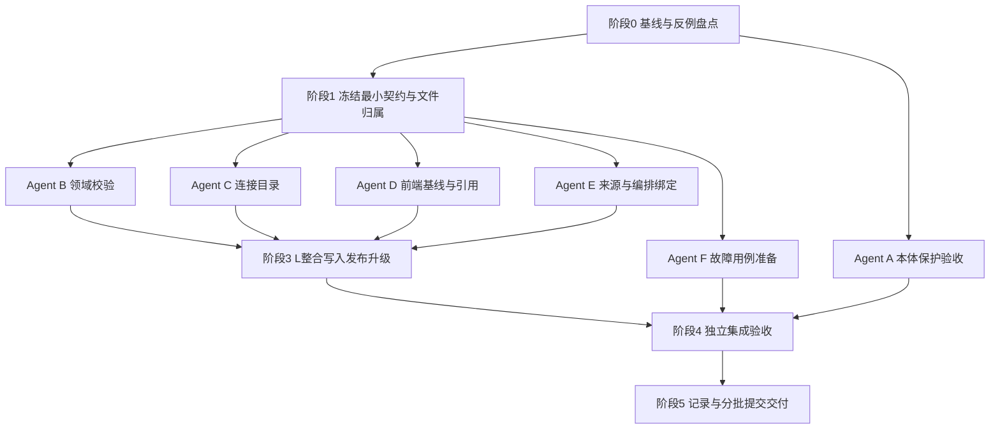

# 开发计划 · v2功能范围 · 多Agent并行版

日期：2026-09-20。状态：**计划已编制，尚未据此实施**。

根目录：`/Users/gukepeng/Desktop/ZHDL/code/wiz_ai/wiz_kq_builder_v2`

唯一需求范围：[需求说明.md](需求说明.md) v2。原型：[交互原型_v2.html](交互原型_v2.html)。可交接指令：[执行指令.md](执行指令.md)。v1不是执行依据。

本文给实施者提供任务划分、依赖、文件所有权、协议决策点、验证与集成规则。当前编制计划不授权本会话修改业务代码；后续用户将指令交给执行工具时，由该工具按范围实施。

## 1. 目标、边界与完成口径

本期只处理O01/O02既有保护验收与P01/P03～P07功能正确性。O03/O04/P02新增需求及所有样式、布局、菜单、折叠、阅读增强、返回路径、影响弹窗和新版修复流程继续延期。必要错误反馈沿用现有组件，不取消现有保护。

需要达到：

1. 本体定义和引用修改不破坏当前草稿完整性，不影响项目固定引用。
2. 项目检查对应真实项目与依赖基线，失败或过期不能显示通过。
3. 来源、目录、编排或本体引用变化时，原配置和说明不静默丢失，失效配置不能发布。
4. 发布与引用切换满足CAS、事务、依赖一致性与明确的重试语义。
5. 原有编辑、调试、迁移、账号隔离和未知字段兼容不回归。

不以“新功能越多”为完成依据。已经通过真实用例的能力记录为复用，不为完成工作包而重写。

## 2. 当前事实与开工核验

以下是编制时源码核对结果，代码仍在由其他会话更新，**G0必须重新核对，不能机械当作未修复清单**。

| 入口 | 已有能力 | 本期重点核验 |
|---|---|---|
| `ontology/dependencyModel.ts`、`workbench/references.py`及本体保存路径 | 已有共享/规则/对象依赖保护；近期有多轮修复 | 草稿保存边界、旧失效引用兼容、契约/接口引用是否仍有缺口；先验收 |
| `ObjectSources.vue:saveIdentity` | 来源表单、保存守卫 | 换连接/表有清空`sources[].matchLeft`路径，需反例确认；禁止丢配置 |
| `ProjectHome.vue:loadRefGraph/loadStep3` | 已有概览检查 | catch失败态、仅监听项目/本体版本造成旧结果残留 |
| `App.vue:projectChanged/validateProject` | 修改会清理报告，发布前已有保存处理 | 请求代际与依赖修订能否阻止旧响应覆盖；复用已有失效逻辑 |
| `PropertySources.vue:ensureFlowState` | 已有绑定与本地签名检查 | flowId缓存未按修订失效、读取失败与不存在混同 |
| `ProjectVersion.vue`与`App.saveProjectReference` | 已有compareGeneration与formSave事务 | 比较是否绑定项目草稿修订，不重写已有目标切换防护 |
| `project_validation.py:_check_flow_binding` | 已有输入/输出、类型、常量、实例绑定等检查 | 补缺而非重写；时间序列观测类型按已有协议核实 |
| `project_routes.post_project_write`、`projects.publish_draft` | 发布已有校验、项目CAS、草稿与发布同事务 | 目录在锁前读取，编排与发布事务分阶段读取，存在依赖变化窗口待验证 |
| `catalogs.load_all` | 读取缓存目录 | 广泛捕获异常返回空字典，可能吞掉真实读取失败 |
| `post_catalog_refresh`、`catalogs.store` | 已有前后指纹核验 | 二次核验和落库之间的窗口；凭据代际与迟到结果 |
| `projects.upgrade_check` | 已有版本比较 | 子串/endswith匹配是否误判相似ID；共享属性影响是否准确 |
| `storage.configuration`请求记录设施 | 有receipt存取及数据库结构 | **未确认项目发布已接入requestId幂等**；错误追踪requestId不等于业务幂等 |

幂等处修正之前“已有机制”的笼统表达：先核实项目HTTP路径实际是否接入；只有表和辅助函数不算已完成。需要补齐时属于本期F07可靠重试约束，不建设通用任务平台。

## 3. 多Agent组织和文件所有权

### 3.1 角色不是固定并发数量

建议一个总协调者L，六类执行角色A～F。角色是逻辑工作包，可由多个agent分波次承接；并发数量按当前harness能力与资源调整，不要求某模型、插件或固定槽位。资源有限可由同一agent串行领不同角色，但不得让两个角色同时写同一个文件。

| 角色 | 职责 | 默认独占文件/范围 | 禁止直接修改 |
|---|---|---|---|
| L 总协调/协议/写入集成 | G0/G1、API契约、发布与升级事务、最终集成 | `workbench/project_routes.py`、`projects.py`、`server.py`、必要的`model_routes.py`接线；`storage/assets.py/schema.py`及迁移；接口文档全册与README；本需求四件套；金样最终生成 | 不混入其他会话未提交内容；不替agent无证据标完成 |
| A 本体保护验收 | O01/O02，先验收后最小修复 | `ontology/dependencyModel.ts/editorModel.ts/PropertyManager.vue/legacyGraph/legacyBridge.js`、相关本体库页；`workbench/references.py`；`tests/dependency_guard.test.mjs`、`tests/test_references.py` | App、项目文件、接口文档；若这些本体文件仍被其他会话占用，先只读出反例 |
| B 领域校验 | P03/P05/P07有效性、统一依赖检查数据 | **整个**`workbench/project_validation.py`、`project_mapping.py`；必要的职责单一纯辅助模块；领域校验专项测试 | projects/project_routes、目录存储、App、金样结果文件 |
| C 连接与目录 | P04、探测与缓存基线、连接依赖扫描 | `catalogs.py`、`secrets.py`、`storage/configuration.py`；`ConnectionManager.vue`；连接专项测试 | project_routes接线、schema/迁移、bindingModel、project_validation |
| D 前端检查与引用 | P01/P06/P07状态、异步竞态、引用比较基线 | **整个**`App.vue`；`ProjectHome.vue/ProjectValidation.vue/ProjectVersion.vue/ReferenceNotice.vue`；`project/api.ts`及新基线状态辅助模块 | ObjectSources/PropertySources、连接页、后端路由 |
| E 映射与编排绑定 | P03/P05前端保留与声明有效性 | `ObjectSources.vue/PropertySources.vue/bindingModel.ts`；相关专项测试 | App、ConnectionManager、project_validation、函数编排编辑器 |
| F 独立QA | 跨模块故障注入、集成复验、范围审计 | 新增独立集成测试文件；隔离测试脚本；给L验收结果 | 不直接改生产文件、不自动更新金样、不改四件套结论 |

`app/http.ts`、`saveCoordinator.ts`、`formSave`默认不修改；独立公共文件确需变更由L领取单写者角色并补专项用例。当前`formSaveApi`在`App.vue`内部，仍由D独占修改，L只提供契约和测试要求；只有显式移交整个文件owner后L才能接手。D/E/C通过接口请求表向L提出需求，不能各自改保存队列。

现有测试文件若被多个工作包使用，**运行可以复用，编辑只给一个owner**。B拥有`test_project_flow_source.py/test_property_sources.py`修改权；E拥有`object_sources.test.mjs/flow_editor_bind.test.mjs`修改权；D拥有`project_version.test.mjs/reference_changes.test.mjs`修改权；未列明文件先登记再编辑。新增测试文件以职责命名，不按临时agent名字命名。

### 3.2 工作目录、交接和冲突规则

- G0记录`git status`、基准commit、他人未提交文件。禁止reset、checkout覆盖、stash他人修改，禁止为开并行任务擅自提交他人内容。
- 优先由同一已确认基线创建隔离worktree/分支；不从陈旧HEAD忽略正在实施的新基线。若必要文件仍被其他会话修改，先完成无冲突任务，向用户/协调者说明具体阻塞，不复制半成品形成假基线。
- 共目录执行只能在文件互斥成立时并行。禁止一个agent全量格式化整个仓库。
- 每个agent开工提交“任务ID、基线、持有文件、输入契约、预期测试”；结束提交“commit/差异、测试证据、协议依赖、剩余风险”。不得只说“完成”。
- 共享上下文由L汇总本轮事实，通过现有context脚本记录；worker按所在harness的AGENTS要求记录时只记自己范围。不得直接覆盖session_context.md。
- Agent失败/中断后先检查已落盘修改与正在运行的进程，再重派任务；不同时启动两个接管者。

## 4. 阶段与并行依赖



**推荐波次（示例，并非并发数量要求）：**

| 波次 | 可并行工作 | 闸门 |
|---|---|---|
| W0 | A保护现状审计；B/C接口和依赖盘点；F收集反例；L整理基线 | 只读/测试设计，尚不改共享协议 |
| W1 | L冻结接口；A跑隔离保护验收；B/C/E准备职责单一测试 | G1未通过不得自行编码不同基线token |
| W2 | B领域校验、C连接目录、D前端基线同时开发；E可在有资源后加入 | 使用冻结契约；后端未落地时D只能明确使用测试fixture，不能宣称联调通过 |
| W3 | E映射保留与编排缓存；F集成测试；L接线B/C结果；D按接口联调 | 相互不改归属文件；必要接线串行提交 |
| W4 | L串行金样/HTTP/build；F独立隔离业务验收；A补发现的保护缺口 | 功能验收与范围审计全部通过才交付 |

收益来自独立文件和测试准备并行，不来自多人修改`project_validation.py`或同时运行同一HTTP套件。没有独立任务时不为了并行而新建agent。

## 5. G0/G1：开工闸门与最小契约

### L00 基线与安全（G0）

1. 读AGENTS、共享上下文、v2需求和原型；记录基准commit与工作区变动。
2. 核对上一轮本体修复实际状态，A只把可复现失败登记为缺陷。
3. 按文件所有权登记每个工作包；发现多owner先重新分配，不能“最后再解决冲突”。
4. 核实测试隔离方式和固定端口；准备临时测试账号、独立数据根，绝不使用真实18765登录会话。
5. 在本文§11开工记录填写事实。只对实际业务分歧提问；技术文件拆分由协调者直接决定。

**完成证据：** 基线sha、脏文件归属、测试隔离方案、当前缺陷反例列表；不要求为只读盘点制造代码提交。

### L01 冻结统一检查基线（G1）

先更新接口文档，再编码。使用现有revision/head/目录指纹，避免不同模块各造一套hash。

| 协议点 | 必须明确的含义 | 推荐的最小选择 |
|---|---|---|
| 检查对象 | 当前保存草稿与请求中的未保存内容如何区别 | 返回可追溯检查基线；未保存内容需内容指纹或明确非发布依据，不能复用保存修订冒充 |
| 项目基线 | projectId、owner上下文、revision、本体ID/发布版本 | owner由会话获取；不由前端传owner控制访问 |
| 外部依赖 | 实际引用flow head、目录/连接技术配置、必要凭据代际 | 用不透明修订/代际，绝不回传密钥或由密钥导出的公开指纹 |
| 失败与不存在 | 存储读取失败、403/404语义、真正无依赖 | 失败阻止通过，跨账号按不可访问处理且不泄露资源；不能都吞为null/空集合 |
| 过期判断 | 同页编辑、切项目、返回、跨标签依赖变动 | 本地变更立即失效；现有进入/重新检查/发布时重读基线，页面恢复焦点可做轻量复核；不做实时订阅平台或高频轮询 |
| 来源失效中间态 | 无效草稿能否往返保存 | 能保留则保存原配置并阻断发布；不能保留则原子拒绝变更，保留表单输入 |
| 升级确认 | 比较绑定项目修订、当前/目标版本 | 复用现有端点，服务端核对；不能只校验目标下拉未变 |
| 幂等 | 项目发布请求是否实际贯穿requestId | 已接入则复验；未接入优先复用receipt设施；同请求同内容同结果，不同内容拒绝 |
| 兼容 | 老客户端缺新基线字段时如何处理 | 不依赖客户端保证正确性；服务端重验，必要冲突按明确协议返回，不静默跳过保护 |

技术字段名、状态码与helper签名由L按真实协议确定，写入`文档/接口文档/03-项目区接口.md`、必要的01/04分册、05清单、README。不是先写各agent代码最后拼协议。只添加确实必要字段；新表/字段必须说明旧设施为何不能满足并增加迁移，不默认新增持久化。

**G1放行条件：** 请求/响应示例、错误/冲突示例、兼容规则、辅助函数输入输出、文件所有权均明确，B～F可基于同一fixture开发。此阶段不另造业务模式或扩大延期范围。

## 6. 分工作包详细任务

### A：本体既有保护（F01/F02）

| ID | 工作步骤 | 完成证据 |
|---|---|---|
| A01 | 读最新本体实施/验收记录，按定义修改、移除关联、转私有、删除、批量列行为矩阵 | 对应真实入口和后端路径；区分已修复与未复现 |
| A02 | 测共享编辑/引用集合变化、取消、409后旧确认失效；验证普通改名不增加高影响弹窗 | 真实函数/组件及隔离接口证据，不仅源码字符串断言 |
| A03 | 测对象属性ID不变、共享库与其他引用保留；规则/动作库有引用阻断 | 保存读回内容对比 |
| A04 | 覆盖图谱保留命令与直接保存绕过按钮、接口/契约引用、旧失效引用兼容、批量一项失败 | 前后端结果一致、无部分写入 |
| A05 | 对复现失败最小修复；涉及模型保存路由先让L接线，涉及他人未提交文件先协调 | 缺陷→修复→回归逐项记录；没有失败则只交验收结果 |

禁止将O03/O04顺带做掉；不能以验收为名重写本体表单/菜单。

### B：领域依赖与校验（F04/F06/F08）

| ID | 工作步骤 | 完成证据 |
|---|---|---|
| B01 | 盘点`_check_object_bindings/_check_property_sources/_check_link_mappings/_check_action_bindings`与`_check_flow_binding`现有覆盖 | 列出复用项和具体遗漏，不复制整个校验器 |
| B02 | 抽取/复用只读依赖扫描：来源字段、输入绑定、链接端点、动作参数、已采用属性 | 基于稳定引用；同名不同ID、相似ID不误匹配；未知结构保留 |
| B03 | 换表/主键/来源方式后检查绑定仍是否成立；直接字段简写没有足够来源信息时明确拒绝不安全变更 | 旧值逐字段保留，不能因为新表也有capacity就自动确认语义相同 |
| B04 | 复验flow输入缺失、遗留input/output ID、常量0/false、实例/属性输入、标量/时间序列类型 | 真实现有声明协议；不擅自新增观测类型支持；补签名不变但实现结构无效/编排已删除例，复用既有check_flow配置检查，不执行代码、不另造校验器 |
| B05 | 把flow不存在与读取失败区分；依赖读取失败向调用层传递，不能跳过存在性检查后仍通过 | 故障注入与跨账号同ID用例 |
| B06 | 为发布校验提供一次检查实际读取的依赖基线，避免校验与回传基线来自两次无关读取 | 同次快照/复核证据交L；外部探测不在此执行 |
| B07 | 给L提供升级影响辅助结果，按稳定ID准确匹配共享与私有属性；不写projects.py | 相似ID、删除定义、类型变更、说明保留样例 |
| B08 | 对变化的校验规则补金样输入建议；保留未改场景报告顺序和文案 | L最终生成前提交“预期变动条目”，不全量替换金样掩盖回归 |

### C：连接、目录、凭据（F05）

| ID | 工作步骤 | 完成证据 |
|---|---|---|
| C01 | 核实项目连接、账号编排节点、内联实现引用的真实作用域，列支持形态及不确定项 | 引用样例；不能用字符串同名当关联；不能擅建跨项目平台 |
| C02 | 修正目录读取失败转空的路径，覆盖catalogs.load_all及storage.configuration.load_catalogs对损坏JSON跳过的路径，定义无缓存与缓存读取失败的区别 | 存储故障不会返回伪空成功，不泄漏异常内密钥 |
| C03 | 技术配置指纹排除名称；凭据变化用安全代际，使相关测试/目录结果失效 | 改名不失效，改地址/schema/凭据按规则失效；无密钥回传 |
| C04 | 探测锁外运行，返回后短事务复核连接存在性、owner、配置/凭据代际再写目录 | 慢探测期间改地址/删连接/换凭据的结果被拒；不持LOCK做网络等待 |
| C05 | 建立服务端连接删除/移除校验helper；从整份项目保存删除连接也不能绕过 | 有依赖及依赖读取失败拒绝；直接HTTP绕按钮仍拒绝 |
| C06 | `ConnectionManager.vue`最小逻辑适配：先确认持久化成功再显示成功，不错误清除本地状态 | 部分保存失败真实反馈；沿用现有控件，无新布局 |
| C07 | 目录变化不改属性绑定；缺字段/类型变化由B校验helper接收 | C→B冻结输入样例；前后配置逐字段比较 |

C不直接改project_routes。把post_catalog_refresh/secret接线需求及helper调用约定交L；L负责把短事务复核接入真正写入路径，不能helper完成就宣布接口保护完成。

### D：前端基线、发布和引用（F03/F07/F08）

| ID | 工作步骤 | 完成证据 |
|---|---|---|
| D01 | 盘点App已有projectChanged和Saver状态，复用失效机制；定义检查请求代际及基线比较函数 | 单一事实源，不再创建永不更新的计数 |
| D02 | ProjectHome读取失败保留失败态；配置修订和相关依赖变化导致旧检查失效 | 无数据/读取失败区分；不改概览结构 |
| D03 | validateProject请求完成时验证请求代际、项目ID、基线；切项目/编辑后旧响应丢弃 | 可控Promise按乱序完成的真实状态测试 |
| D04 | 外部依赖变动的复核接到现有重新进入/检查/发布路径；不假称所有打开页面实时同步 | 复核失败则不能继续显示当前通过；不引入后台轮询系统 |
| D05 | ProjectValidation发布使用现有flush/最新读取路径，消费后端基线与错误；不得仅按钮禁用 | 后端拒绝后页面无成功提示，输入与保存状态正确；核验ProjectValidation.pendingRequestId：响应丢失重试沿用同key，payload改变不能误用旧key，422后的重试/修正按G1明确 |
| D06 | ProjectVersion.compareGeneration保留，再绑定项目修订与目标版本；确认前复核；409重比较 | 同目标不同项目修订也拒旧比较；formSave失败保持原引用 |
| D07 | project/api.ts适配冻结字段；仍走app/http；需要改http或保存队列向L申请 | 无页面fetch、无重复错误解析、旧协议兼容测试 |

### E：映射保留、编排详情缓存（F04/F06）

| ID | 工作步骤 | 完成证据 |
|---|---|---|
| E01 | 复现ObjectSources换表/连接清matchLeft；盘点其他清空字段路径 | 修改前后完整样例与说明/未知字段对照 |
| E02 | 修正静默清理；不能安全保留语义的简写绑定按G1方案拒绝变更，输入保留 | 已保存配置不丢，失效状态真实；不通过同名字段重绑 |
| E03 | bindingModel的内存适配/commitProperty保留旧输入和未知kind，来源切换只改授权目标 | roundtrip精确比较；未采用属性不强制填 |
| E04 | ensureFlowState缓存绑定真实修订/检查代际，不以flowId永远复用；区分不存在和读取失败 | 旧缓存不让失效签名通过，失败不把原flow引用清空 |
| E05 | 复用输入输出本地校验，服务端仍权威；固定值0/false、时间序列结果等不回归 | flow_editor_bind专项测试加新反例 |
| E06 | 与D对接changed与失效通知，返回既有保存/错误路径 | 不新增“查看编排返回”流程、不改默认折叠/表格 |

### L：真正写入边界集成（F03/F05/F07/F08）

| ID | 工作步骤 | 完成证据 |
|---|---|---|
| L02 | post_project_write接B/C检查基线及失败分类；普通校验与发布校验使用一致依赖视图 | 正常和故障HTTP响应；无200+伪空成功 |
| L03 | 目录/flow读取与发布写入之间实施原子核验或等价并发策略；不能只重复读一次然后留新窗口 | 在精确提交窗口注入变化仍拒绝或重验，不产生无效发布记录 |
| L04 | 网络探测仍锁外，目录落库复核与写入短事务；所有并发写路径遵循相同约束 | 多进程/事务级证据，不能只依赖单进程LOCK证明DB一致性 |
| L05 | 普通project-save删除连接/换来源/切引用也经过必要保护；用户可以保存普通未完成草稿 | 绕专门UI直接HTTP请求不绕过保护，又不把全部草稿变成必须通过发布校验 |
| L06 | 项目发布幂等核验；缺接线时复用请求receipt，与发布写入处于一致事务 | 同key同payload只一个版本；同key不同payload拒绝；失败重试不留假receipt；先前成功重试不因已推进revision制造重复 |
| L07 | 升级比较使用准确稳定引用；比较与确认CAS一致；持久化失败不改变原引用/快照 | 未发布目标拒绝、比较后修改拒绝、原快照字节/内容保持 |
| L08 | 兼容客户端/未知字段/仅说明配置；更新接口文档和白名单（若有新增端点） | 协议一致；无静默新增强制参数 |

幂等内容指纹、owner隔离、请求有效范围及保留策略必须在G1明确。traceId和业务idempotency key职责分开。不得用无限内存缓存代替持久幂等，也不临时加一套独立作业调度系统。

### F：独立QA与范围审计

| ID | 工作步骤 | 完成证据 |
|---|---|---|
| FQ01 | 开发前根据§7准备反例和可控制并发屏障；不使用sleep碰运气制造竞态 | 失败可确定重现；测试不镜像实现内部细节 |
| FQ02 | 合并后用真实HTTP/存储路径执行关键失败用例；返回内容与落库结果都检查 | 响应、草稿、release/receipt数量与修订证据 |
| FQ03 | 隔离页面体验既有配置路径，触发错误/冲突/取消；不点击真实设备接口 | 页面不假成功；无新增交互要求；截图仅含假数据 |
| FQ04 | 审查diff是否触及CSS、菜单、表格、折叠、抽屉、编排调试、延期本体管理/发布 | 越界变更列回退清单，不能当“顺手优化”放行 |
| FQ05 | 独立核对F01～F10与P0测试全部结果，将未测/阻塞明确交L | 不是子agent最终说成功就算验收；L复核关键证据 |

## 7. 必测矩阵与失败注入

以下T01～T26是本期验收用例清单，不强制一项一个测试文件。已有等价测试复用，必须能指出断言和运行结果。

| 编号 | 输入/并发情境 | 预期 | owner / 验收 |
|---|---|---|---|
| T01 | 共享内容或引用集合在确认后变化 | 旧确认失效，取消不写 | A / F01 |
| T02 | 普通改名、转私有 | 不加重型确认；对象属性ID和内容保留 | A / F01,F02 |
| T03 | 规则/动作被引用，绕UI直接保存删除 | 服务端拒绝，无悬空依赖 | A+L / F02 |
| T04 | 批量中一项受依赖保护、旧失效引用改无关字段 | 原子失败；不错误扩大历史问题阻断范围 | A / F02 |
| T05 | 检查响应晚于编辑或切项目 | 丢弃旧结果，无假通过 | D / F03 |
| T06 | 引用本体或目录读取失败 | 不是空项目/零问题；报告不可发布 | B+C+D / F03 |
| T07 | 无需改项目草稿，仅flow修订变化 | 旧报告失效，最新发布重验 | B+D+L / F03,F06 |
| T08 | 换表/主键后原字段名恰好仍存在 | 不自动确认语义相同，不删配置 | B+E / F04 |
| T09 | registered与database切换，带说明/未知来源 | 安全保留或拒绝；不静默丢字段 | B+E / F04 |
| T10 | 仅连接显示名变更 vs 地址/schema变更 | 指纹失效范围正确 | C / F05 |
| T11 | 探测进行中修改凭据或删除连接 | 迟到结果不能写入当前有效目录 | C+L / F05 |
| T12 | 目录落库复核之后、写入前并发变更；存量单条目录JSON损坏 | 提交保护有效，无TOCTOU漏口；损坏不静默当作缺目录 | C+L+F / F05 |
| T13 | 依赖服务/存储失败，再删除连接 | fail closed且原连接保留，不把失败当无引用 | C+L / F05 |
| T14 | 整份project-save去掉仍被引用连接 | 绕过UI仍受保护 | C+L / F05 |
| T15 | 编排存在但删除输入/输出；同名新ID | 原绑定保留且检查失败，不猜测匹配 | B+E / F06 |
| T16 | 数值/文本/序列观测类型不合；0/false合法输入 | 错误拒绝，合法边界不误拒 | B+E / F06 |
| T17 | 编排详情缓存后实现改变/软删除/读取失败（含签名不变但结构无效） | 旧缓存不假通过，新检查验证实际依赖有效，错误不清空引用 | D+E / F06 |
| T18 | 报告通过后改依赖，在提交窗口注入变更 | 后端拒绝或基于一致新视图重新验证，不写无效发布 | L+F / F07 |
| T19 | 同requestId同payload重试、不同payload重用 | 一个版本且返回同结果；不同payload拒绝 | L+F / F07 |
| T20 | 发布事务中故障；组件成功响应丢失重试；修正payload后重试 | 无半成品receipt/版本；同内容重试key保持、内容变更换key；不重复发布 | D+L+F / F07 |
| T21 | 项目CAS旧token；跨账号同ID/key | 409及owner隔离正确，不串读或幂等串号 | L+F / F07,F09 |
| T22 | 只说明、部分未采用属性、无网络 | 沿用合法保存/发布规则，不突然强制全量取值 | B+L / F07 |
| T23 | 比较目标未变但项目已改；比较中目标切换 | 确认拒绝旧基线/响应 | D+L / F08 |
| T24 | 引用目标删除属性/改变类型，或目标未发布 | 原配置保留为失效或安全拒绝；不改旧快照 | B+L+F / F08 |
| T25 | 比较/保存409或失败，未知结构与说明往返 | 原项目引用不假更新，内容不丢 | D+E+L / F08,F09 |
| T26 | diff与隔离原路径检查 | 无样式交互越界、真实数据零写入，文档仅v2有效 | F+L / F09,F10 |

## 8. 测试运行策略与安全

### 8.1 已有测试入口

按实际更改选择相关测试，缺口用有业务意义的反例补齐；不为文案、布局或与实现同构的细枝末节大量造测试。

```bash
# 在仓库根；Node纯函数/组件测试按owner各运行一次
node --import ./tests/ts_hooks.mjs tests/dependency_guard.test.mjs
node --import ./tests/ts_hooks.mjs tests/object_sources.test.mjs
node --import ./tests/ts_hooks.mjs tests/mapping_forms.test.mjs
node --import ./tests/ts_hooks.mjs tests/flow_editor_bind.test.mjs
node --import ./tests/ts_hooks.mjs tests/project_version.test.mjs
node --import ./tests/ts_hooks.mjs tests/reference_changes.test.mjs
node --import ./tests/ts_hooks.mjs tests/save_queue.test.mjs

# Python脚本不是默认pytest用例；用项目runner
python3 tests/run.py --test tests/test_references.py
python3 tests/run.py --test tests/test_project_flow_source.py
python3 tests/run.py --test tests/test_property_sources.py
python3 tests/run.py --test tests/test_registered_validation.py
python3 tests/run.py --test tests/test_mapping_descriptions.py
python3 tests/run.py --test tests/test_validation_split.py
python3 tests/run.py --test tests/test_project_api_roundtrip.py
python3 tests/run.py --test tests/test_storage_contract.py
```

命令以G0实存文件为准，缺文件先找现有等价用例，不把“未运行”记作通过。新增专项测试文件在最终记录列路径和命令，不能只运行原型JS声称正式功能已完成。

### 8.2 并行测试约束

- `tests/run.py`清理继承的`WIZ_DATABASE_URL/WIZ_WORKBENCH_ROOT/WIZ_WORKBENCH_PORT`，由测试自身创建隔离配置。外层设一次变量不能证明所有子进程安全。
- 部分旧HTTP测试用固定端口，**HTTP组由L/F串行**；新增并发测试在脚本内部创建各自临时根、独立数据库和动态端口。先验证测试不会连接真实根。
- `dependency_guard.test.mjs`有固定临时文件，同一测试不能被多个agent同时跑。SSR测试不等于HTTP服务，不混淆端口占用判断。
- 数据连接使用fake driver/受控响应，默认不访问真实MySQL/Redis。`external`组不列为本期必跑；测试真实连接需要明确环境授权。
- `WIZ_DATABASE_URL`不能继承真实值；测试前核对解析后的数据根和DB路径。浏览器用隔离服务、假账号，不用18765已有登录态。
- 不执行`./start.sh restart/rebuild`扰动真实工作台。各worktree有自己的依赖/build输出；共享工作区中build由L执行一次。

### 8.3 集成门槛

1. B列校验金样预期差异，L审阅后运行生成器并回放`test_validation_split.py`；不能先重建金样再把全绿作为正确证据。
2. 完成各工作包定向测试和新增T01～T26相关用例。
3. L串行运行`python3 tests/run.py quick`及受影响HTTP/存储/认证/迁移测试；如改变核心存储或广泛校验，按实际风险扩大到`all`，不反复无目的重跑。
4. 前端改变后执行`cd frontend && npm run build`，包含类型检查；同基线已有成功build不再无理由重复。
5. F隔离页面验证真实保存、错误、冲突与发布反馈；无浏览器能力时列为未验收，不能以源码断言替代，不能绕过工具安全拒绝。
6. API文档、错误码、返回基线、保存行为与代码一致；差异清楚记录。

## 9. 集成与交付要求

- 集成顺序：契约/纯辅助 → 领域校验与目录 → 前端适配 → L路由/写入接线 → 独立验收。必要时有小的反向适配提交，但每次明确owner。
- 每工作包在自己分支形成可描述commit；L检查后合并/cherry-pick。只有文档与匹配实现成套时才进入可交付基线，避免主分支接口文档超前冒充已支持。
- 提交前`git status`，只加自己文件。真实数据、vault、keys、runtime、node_modules、dist、缓存不入库。
- 不以reset覆盖其他agent或用户提交；回退以功能commit为单位。业务数据与代码回退分开，绝不顺手恢复用户数据库。
- 最终报告按F01～F10逐项列已实现/复用已验收/未测/阻塞；列commit、测试命令与结果、失败注入证据、接口变化、已延期范围。
- 有未验收项时不能写“全部完成”。实现记录追加在本文§11，保持四份文件同一范围。

## 10. 可直接分发的子任务模板

L给每个agent的任务至少包括以下内容（替换括号，不要求固定harness语法）：

> 你负责角色[角色]的任务[ID列表]。基线[commit]，工作目录[独立路径]。先读AGENTS、共享上下文、本目录需求v2、计划对应章节及G1冻结协议。仅允许修改[文件列表]，禁止修改[热点及延期文件]。按[测试编号]提供行为证据，不接触真实数据。发现接口或其他owner文件需求先发给L，不抢改。先报告反例和实现选择，再在已授权范围落实。完成时提交commit/文件、实际测试结果、未完成与集成需求；不得将原型模拟按钮实现为产品功能，不得恢复延期UI。遇到其他会话修改同一文件停止该文件编辑，继续独立任务并上报。

L给F额外说明：优先从公开接口验证，不能依赖worker对内部实现的假设；只读核对生产diff，缺陷交给owner修复，不直接抢写。

## 11. 执行记录（由后续实施者填写）

### 11.1 本轮计划编制记录

2026-09-20：根据v2需求核对前后端入口，由两个只读子agent分别审计后端并行边界、前端与测试矩阵。发现幂等接入、目录失败吞空、来源清字段、flow缓存失效等需要反例验证的点。两名只读agent另行复核了计划的文件owner与测试矩阵，补充App内formSave单写者、客户端幂等key生命周期、损坏目录JSON和签名不变但实现失效等边界。文档相对链接、现有测试路径及T01～T26/F01～F10覆盖检查通过。未修改业务代码，未运行正式业务测试；这不是实施完成记录。

### 11.2 G0/G1冻结记录

- 基线commit与时间：待填。
- 脏文件/其他会话归属与处理：待填。
- 最终文件owner表及并发资源：待填。
- 基线协议、失败状态、幂等与中间态选择：待填。
- 接口文档变更位置：待填。

### 11.3 工作包进度

| 工作包 | owner | 状态 | commit | 测试证据 | 剩余项 |
|---|---|---|---|---|---|
| A | 待分配 | 未开始 | — | — | — |
| B | 待分配 | 未开始 | — | — | — |
| C | 待分配 | 未开始 | — | — | — |
| D | 待分配 | 未开始 | — | — | — |
| E | 待分配 | 未开始 | — | — | — |
| L集成 | 待分配 | 未开始 | — | — | — |
| F独立QA | 待分配 | 未开始 | — | — | — |

### 11.4 最终验收

按F01～F10登记结果与证据；实际未执行填“未验证”，不得默认通过。本节由实施/验收发生后追加，不在计划阶段预填成功结论。
